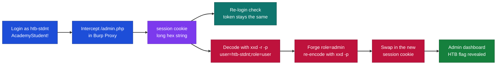
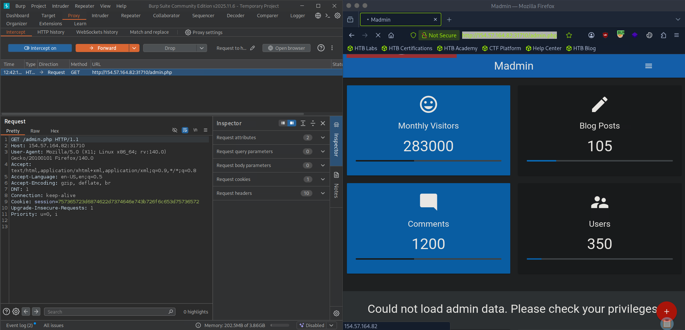
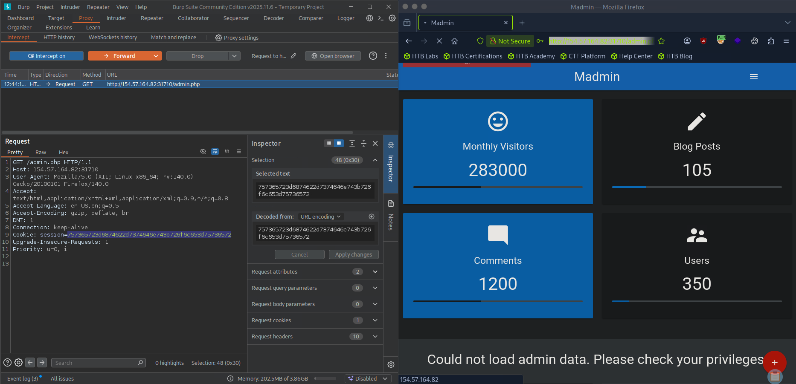
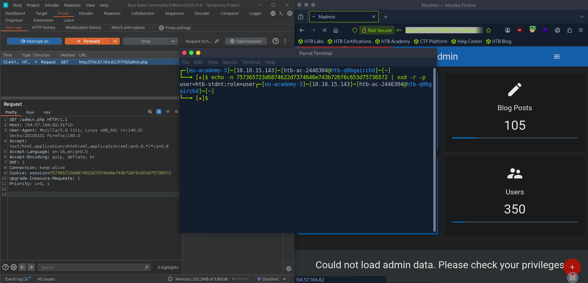
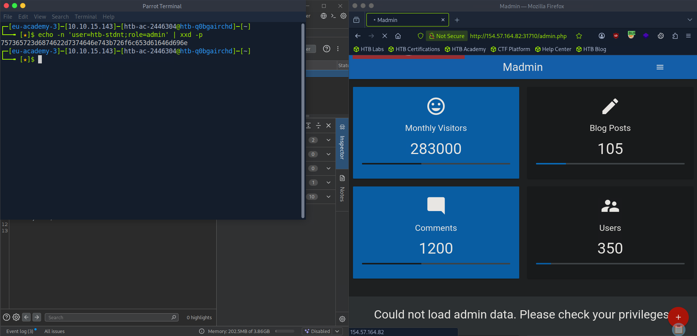
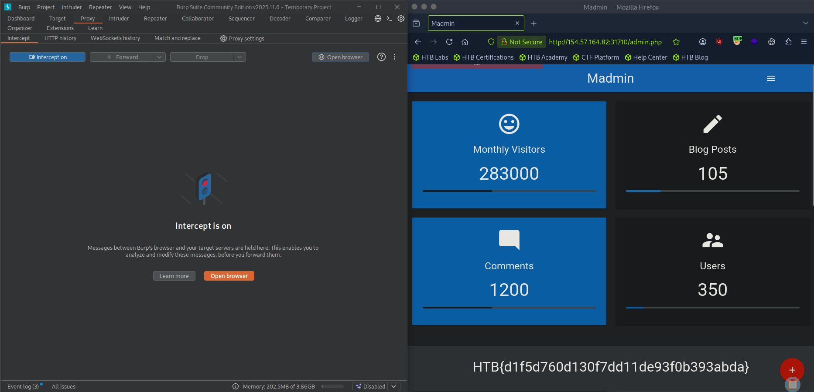

# Hack The Box - Attacking Session Tokens | Write-up

> **Platform:** Hack The Box &nbsp;•&nbsp; **Category:** Web Exploitation / Session Management &nbsp;•&nbsp; **Difficulty:** Easy
>
> **Target:** `154.57.164.82:31710` &nbsp;•&nbsp; **Time taken:** 15 minutes
>
> **Author:** Jithin Jelson

---

## Introduction

We have been told in this instance that our web application has a flaw in its token handler. We have been told that it is predictable. Based on what we find out we must either brute force or guess the next session token.

**Credentials provided:** `htb-stdnt` / `AcademyStudent!`

---

## Assessment Overview



---

## What I Learned

- How a session token that is just hex-encoded plaintext offers no real protection.
- Decoding a cookie with `xxd -r -p` to reveal the fields hidden inside it.
- Spotting that a token never changes between logins, which hints it is not random.
- Forging a new token by editing `role=user` to `role=admin` and re-encoding with `xxd -p`.
- Swapping the crafted cookie back into the request to escalate from user to admin.
- That encoding is not encryption, so anything reversible is a data tampering risk.

---

## Logging In

We can start by visiting our web application, loading up Burp Suite and entering our given credentials.



*Figure 1 - Intercepting `GET /admin.php` in Burp Proxy. The request carries a `session=` cookie, and the page shows "Could not load admin data. Please check your privileges".*

---

## Capturing the Session Cookie

Once we intercepted the request we are able to see our cookie session. Let's take note of this.

```
757365723d6874622d7374646e743b726f6c653d75736572
```

We can log out and log in again to see if there is any changes, although it looks like hex encoded. It looks like it is the exact same.



*Figure 2 - The `session` cookie value. After logging out and back in, the token is identical, which suggests it is not random.*

---

## Decoding the Token

Let's use xxd to decode it.

```
echo -n 757365723d6874622d7374646e743b726f6c653d75736572 | xxd -r -p
```



*Figure 3 - The hex decodes to `user=htb-stdnt;role=user`, so the token is just readable key-value plaintext.*

---

## Forging an Admin Token

Now let's try and forge this to role as admin.

```
echo -n 'user=htb-stdnt;role=admin' | xxd -p
```



*Figure 4 - Changing `role=user` to `role=admin` and re-encoding it back to hex with `xxd -p`.*

---

## Session Takeover

Now we can change our session id to this, and it worked.



*Figure 5 - Swapping in the forged cookie loads the full admin dashboard and reveals the flag.*

> Forge an admin session token and retrieve the flag.

**Answer:** `HTB{d1f5d760d130f7dd11de93f0b393abda}`
