# Hack The Box - Authentication Bypass via Parameter Modification (IDOR) | Write-up

> **Platform:** Hack The Box &nbsp;•&nbsp; **Category:** Web Exploitation / IDOR (Broken Access Control) &nbsp;•&nbsp; **Difficulty:** Easy
>
> **Target:** `154.57.164.68:30101` &nbsp;•&nbsp; **Time taken:** 5 minutes
>
> **Author:** Jithin Jelson

---

## Introduction

We have been told for this instance our web application has an IDOR vulnerability. We can access other people's accounts by changing the parameter slightly. This is a very easy lab. We will be using brute force to find the admin panel and escalate our privileges.

**Credentials provided:** `htb-stdnt` / `AcademyStudent!`

---

## Assessment Overview

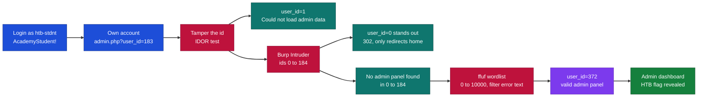

---

## What I Learned

- How an IDOR lets you reach another user's data just by editing an id in the URL.
- Using Burp Intruder with a Sniper attack and a numeric payload list to enumerate an id parameter.
- Generating a quick wordlist with `seq` for brute forcing sequential ids.
- Filtering ffuf results with `-fr` on a known error string so only the interesting response stands out.
- Reading response length and status codes to tell a valid admin page apart from the privilege error.
- That widening the wordlist matters, because the real admin id (372) sat outside my first guessed range.

---

## Logging In

We can start by visiting our web application and opening up Burp Suite. We can log in to the main page using the credentials provided for us.

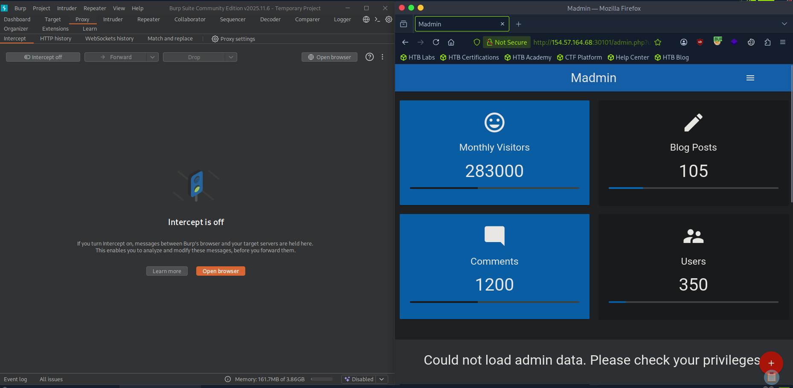

*Figure 1 - After logging in and browsing to `admin.php`, the dashboard renders but shows "Could not load admin data. Please check your privileges".*

---

## Finding the id Parameter

If we place close attention to our parameter we can see our id specified in the parameter, id 183.

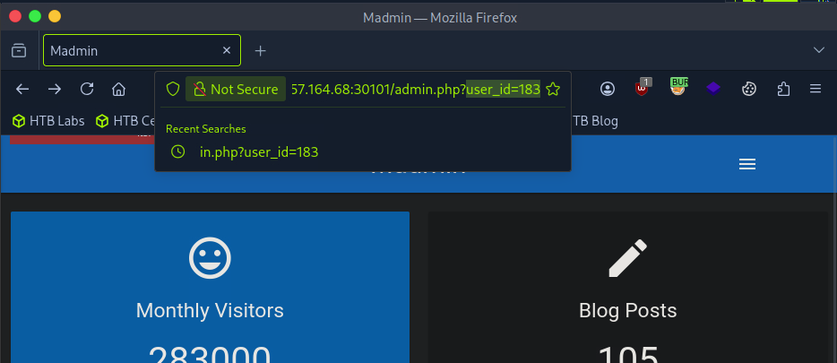

*Figure 2 - Our own account is tied to `admin.php?user_id=183`.*

---

## Trying a Different id

We can attempt to try a different number to see if we get access. Although the page is loading, it seems we don't have admin privileges.

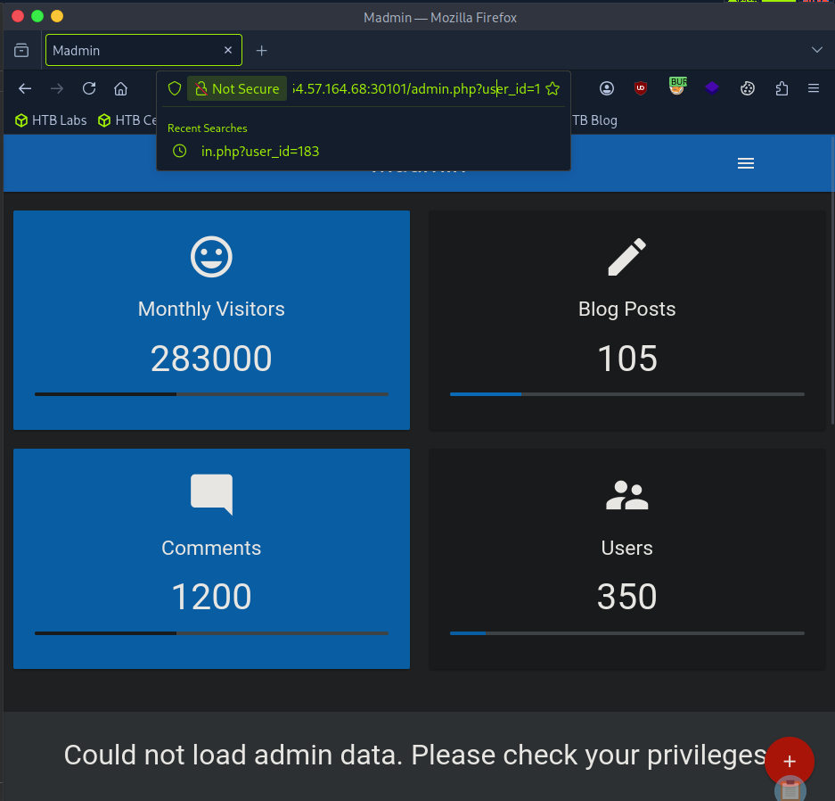

*Figure 3 - Requesting `user_id=1` still loads the page but returns "Could not load admin data. Please check your privileges".*

---

## Building a Numbers List

We can assume that the admin panel will be between 1 and 184, so we will create a text file containing these numbers.

```
seq 0 184 > numbers.txt
```

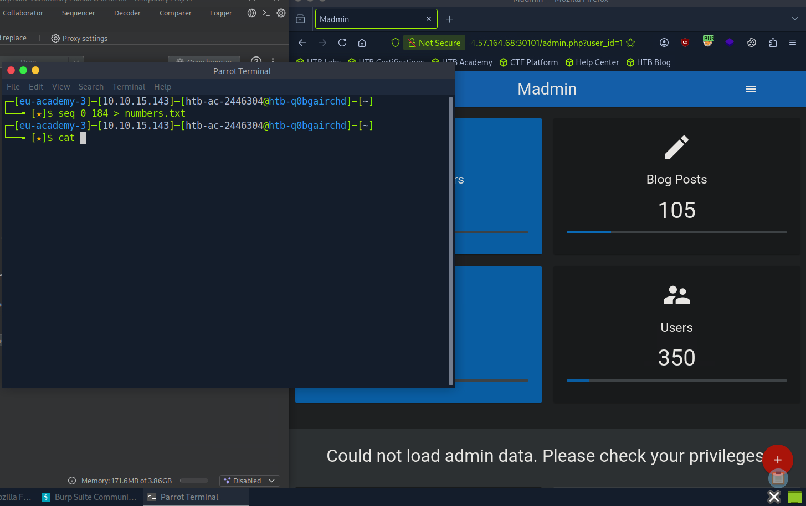

*Figure 4 - Generating `numbers.txt` with `seq 0 184`.*

---

## Enumerating with Burp Intruder

Since previously we have used ffuf, in this instance we will use Burp Intruder to enumerate and find a valid admin panel. We can choose our target and load our numbers file.

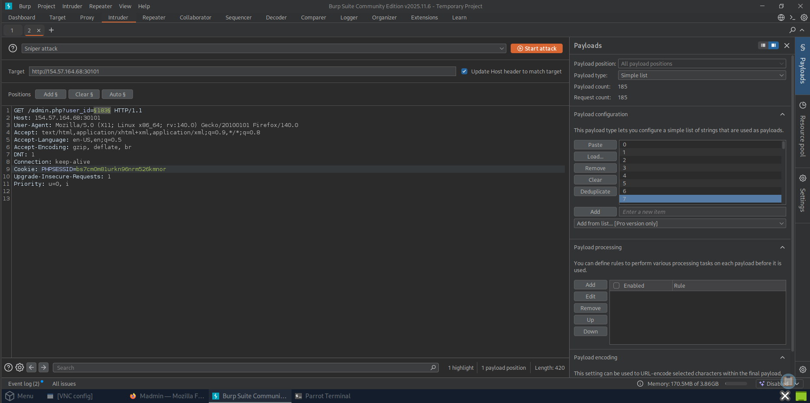

*Figure 5 - Burp Intruder set to Sniper attack, the `user_id` value marked as the payload position, with the numbers loaded as a simple list (185 payloads).*

---

## Spotting a Different Response

It seems we have one response that is different.

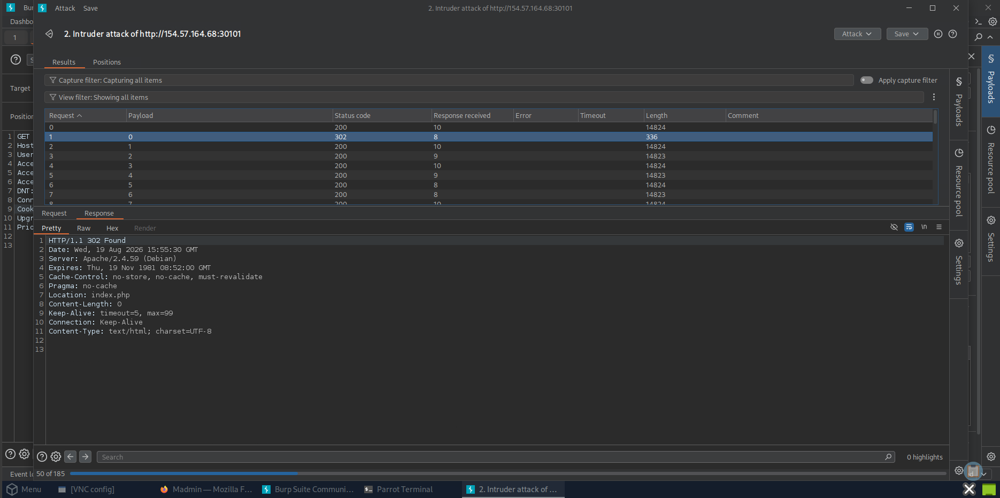

*Figure 6 - Payload `0` returns `302` with length `336`, standing out from the `200` responses (length ~14824).*

---

## Checking id 0

So we can change our parameter to 0 in our proxy to see if we have access. However this brought us back to the homepage.

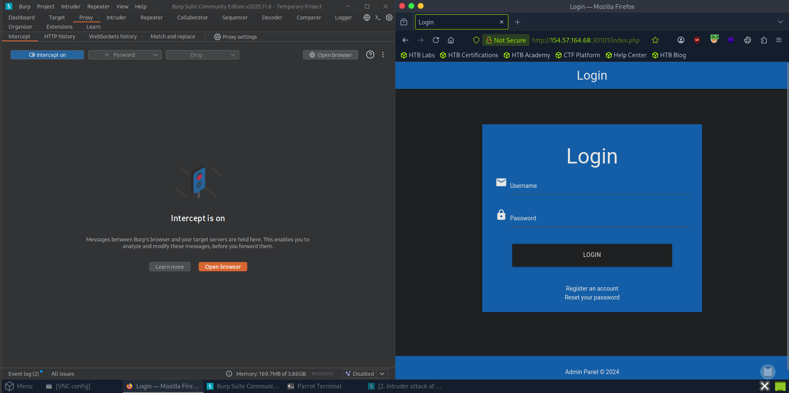

*Figure 7 - `user_id=0` simply redirects us back to the login homepage, so it is not the admin panel.*

---

## Reviewing the Scan

After our Intruder scan was finished we had a look to see if anything came up.

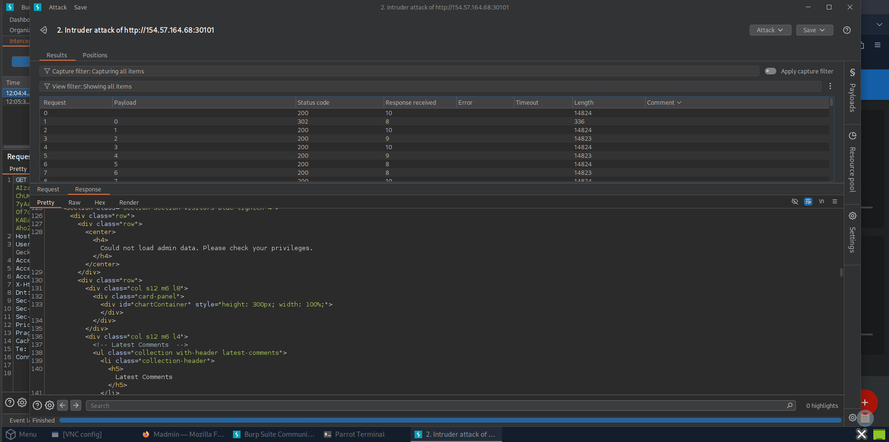

*Figure 8 - With the attack finished, the `200` responses still contain "Could not load admin data. Please check your privileges", so nothing in 0 to 184 was the admin panel.*

---

## Fuzzing with a Bigger Wordlist

But we came out empty, so we decided to use fuzz with a bigger wordlist. We used 1 to 10,000.

```
ffuf -w numbers.txt -u http://154.57.164.68:30101/admin.php?user_id=FUZZ -fr "Could not load admin data. Please check your privileges"
```

This time we seemed to get a success.

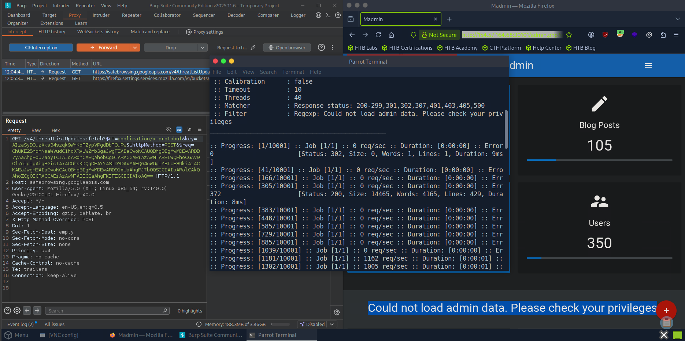

*Figure 9 - ffuf filters out the privilege error with `-fr`, and `user_id=372` comes back with status `200` and size `14465`, marking a valid admin panel.*

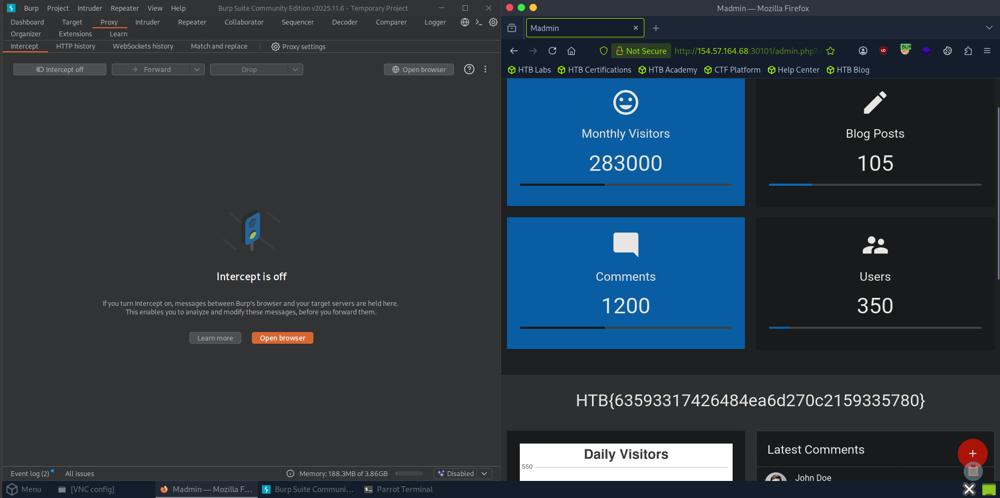

*Figure 10 - Browsing to `admin.php?user_id=372` loads the full admin dashboard and reveals the flag.*

> Access the admin panel and retrieve the flag.

**Answer:** `HTB{63593317426484ea6d270c2159335780}`
