# Hack The Box Academy - Broken Authentication Skills Assessment | Write-up

> **Platform:** Hack The Box Academy &nbsp;•&nbsp; **Category:** Broken Authentication &nbsp;•&nbsp; **Difficulty:** Medium
>
> **Target:** `154.57.164.73:31313` &nbsp;•&nbsp; **Time taken:** 45 mins
>
> **Author:** Jithin Jelson

---

## Introduction

This is the skills assessment for the Hack The Box Academy Broken Authentication module. After learning about various techniques to bypass authentication we have been given a vulnerable web application which we must exploit and get the flag.

---

## Assessment Overview

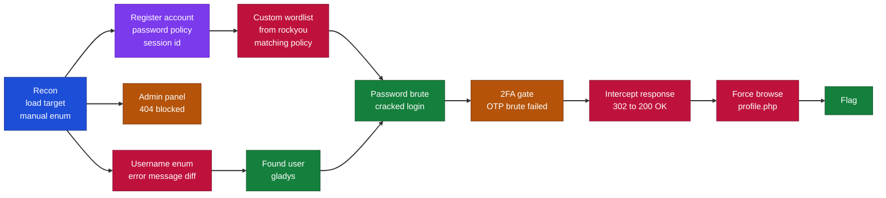

---

## What I Learned

- How to spot username enumeration by comparing the different error messages the login page returned.
- Building a custom wordlist from rockyou.txt that matched the target's password policy using grep.
- Using ffuf to brute force usernames, passwords, and OTP codes against different POST parameters.
- Why intercepting and rewriting the server response, changing 302 to 200 OK, can bypass a redirect and reveal a page.
- That forced browsing straight to profile.php bypassed the 2FA gate entirely, which turned out to be the real flaw.
- Chaining these broken authentication weaknesses together to go from an anonymous visitor to the admin flag.

---

## Manual Enumeration

We can start by loading up our target IP address on the web browser, we can also open up Burp Suite, we are greeted with the following web application, lets do some manual enumeration to find out more about this target.

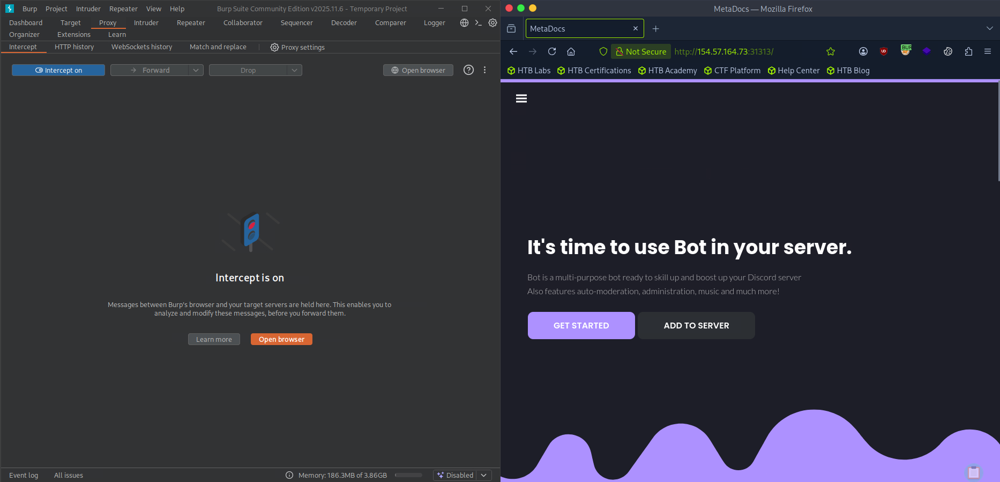

*Figure 1 - The MetaDocs application loaded through Burp Suite's browser.*

Everything seems to not work other than our login page and sign up page, so this is most likely where the exploit will be.

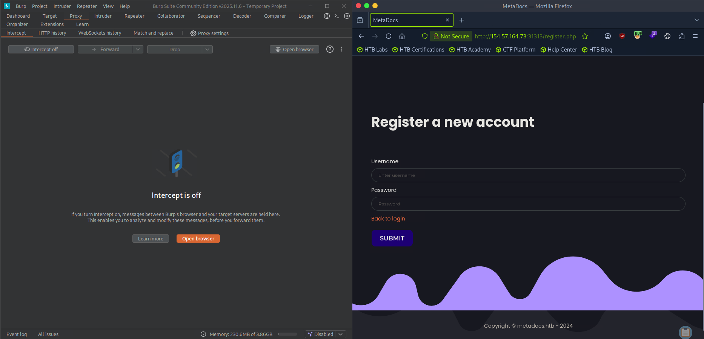

*Figure 2 - The register page, one of the few working endpoints.*

We will register an account to see what information we can get.

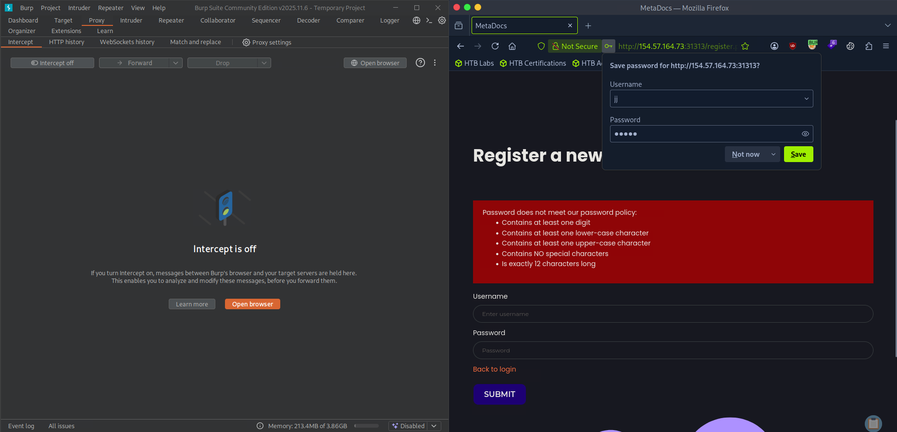

*Figure 3 - The registration enforces a strict password policy.*

Seems like they have a password policy, this might come in handy if we wanted to brute force a list of passwords. Once logged in we can see the following.

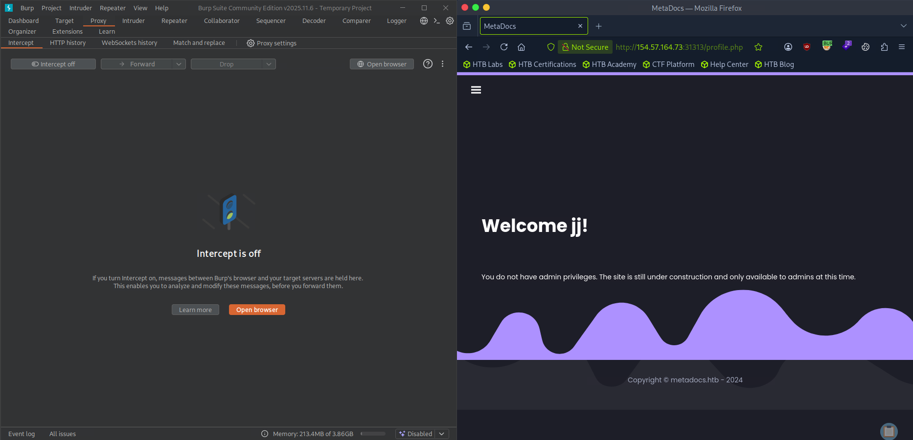

*Figure 4 - Logged in as our new user, but with no admin privileges.*

We can see our session ID, we can note this down it might be useful later on `mo3ulhloqcav2t9b4kg0s3c729`. We will attempt to sign in and out to see if we get a different session ID, however it seems to be the exact same. We can now attempt to access the admin panel to see if there is a broken authentication.

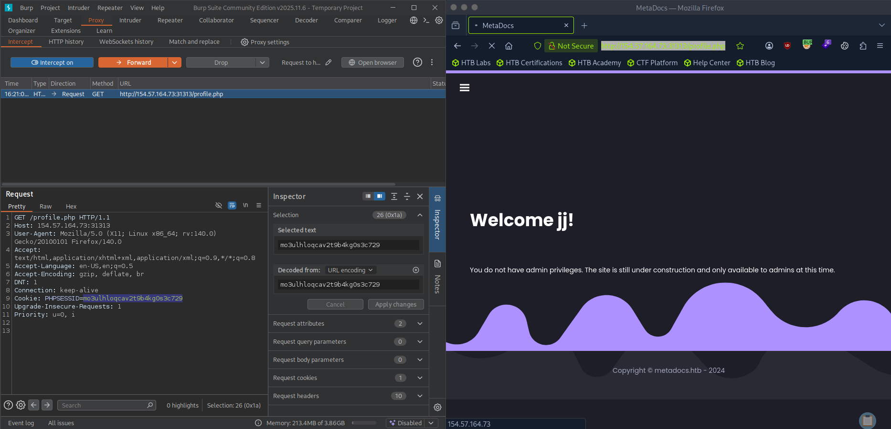

*Figure 5 - The session ID stays the same across logins, noted for later.*

However it seems we cant and we get a 404 error.

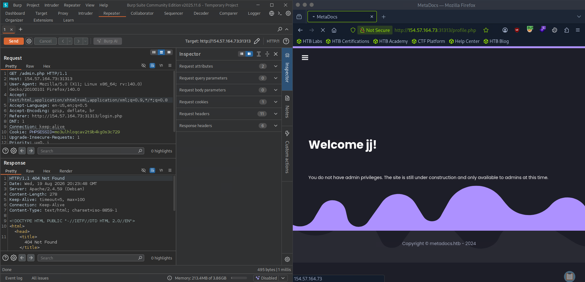

*Figure 6 - Requesting /admin.php returns a 404 Not Found.*

---

## Building the Custom Wordlist

We can attempt username enumeration on our login page now that we cant get much from this. Lets try and brute force admin with the rockyou.txt using ffuf.

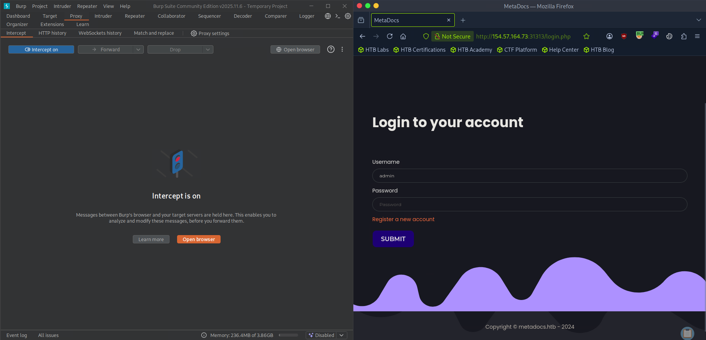

*Figure 7 - The login page, our next target for enumeration.*

Now that weve extracted it, we can extract all the passwords we need according to the password requirement.

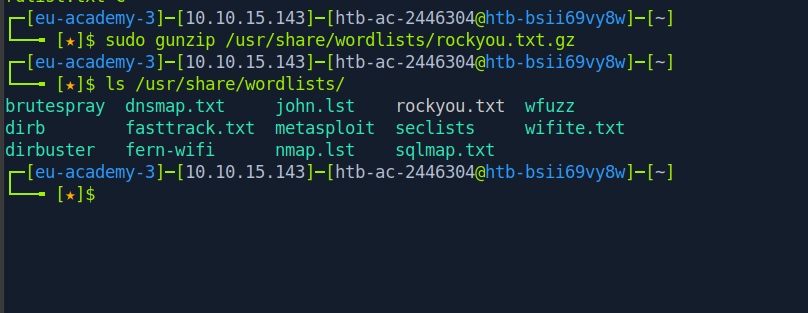

*Figure 8 - Extracting rockyou.txt from the wordlists folder.*

```
sudo gunzip /usr/share/wordlists/rockyou.txt.gz
```

Now that we have checked the new word count, we can catch what we need to put it to ffuf through our Burp intercept.

```
grep '[[:upper:]]' /usr/share/wordlists/rockyou.txt | grep '[[:lower:]]' | grep '[[:digit:]]' | grep -E '.{12}' > custom_wordlist.txt
```

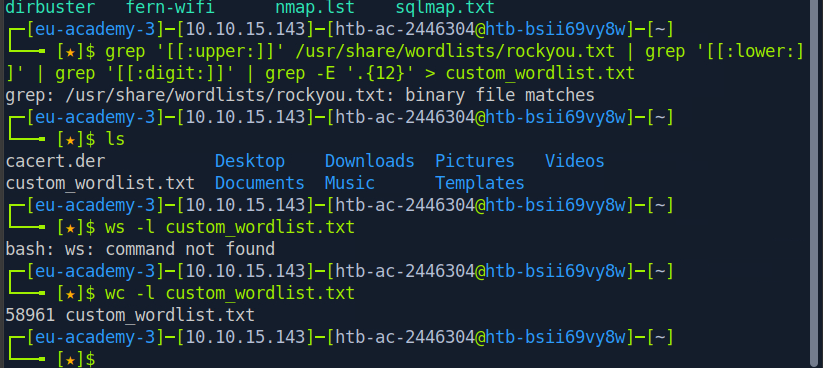

*Figure 9 - Filtering rockyou.txt to match the password policy leaves 58961 candidates.*

---

## Username Enumeration

We can catch the login request through our Burp intercept to see exactly what needs to go into ffuf.

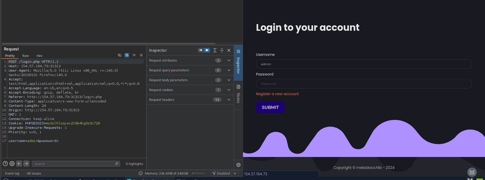

*Figure 10 - The login POST request showing the username and password parameters.*

We also found out that the error says "Unknown username or password." so we can use that to put it all into ffuf.

```
ffuf -w ~/custom_wordlist.txt -u http://154.57.164.73:31313/login.php -X POST -H "Content-Type: application/x-www-form-urlencoded" -d "username=admin&password=FUZZ" -fr "Unknown username or password."
```

This however did not work, but then I attempted to enter a wrong password with the wrong credentials and the site tells us invalid credentials, BINGO seems like we found the vulnerability !!!

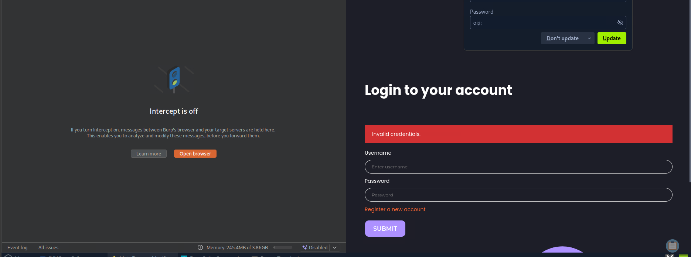

*Figure 11 - A valid username returns "Invalid credentials." instead, which leaks that the username exists.*

So lets enumerate the usernames using this new information, so this is our new command.

```
ffuf -w /usr/share/seclists/Usernames/xato-net-10-million-usernames.txt -u http://154.57.164.73:31313/login.php -X POST -H "Content-Type: application/x-www-form-urlencoded" -d "username=FUZZ&password=invalid" -fr "Unknown username or password."
```

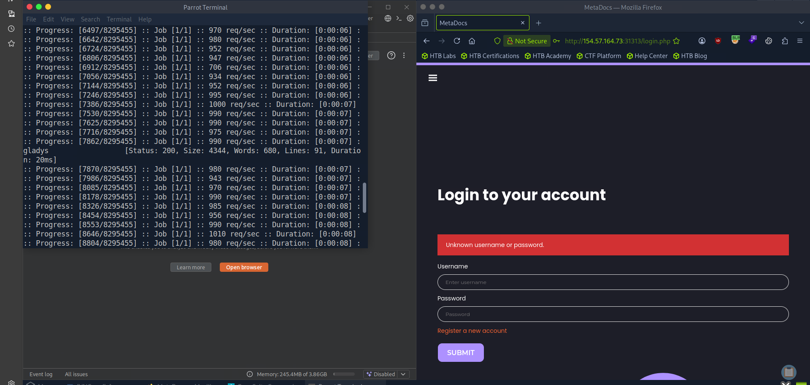

*Figure 12 - ffuf returns a hit for the username gladys.*

---

## Cracking the Password

And we successfully found a username, we can use this to find our password using the wordlist we generated earlier.

```
ffuf -w ~/custom_wordlist.txt -u http://154.57.164.73:31313/login.php -X POST -H "Content-Type: application/x-www-form-urlencoded" -d "username=gladys&password=FUZZ" -fr "Invalid credentials."
```

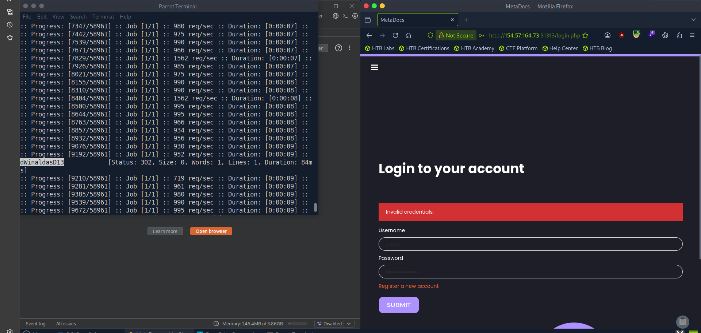

*Figure 13 - ffuf returns a 302 hit, giving us the password for gladys.*

---

## Bypassing the 2FA

Now we can log in, however upon logging in it seems we have a 2FA code to enter.

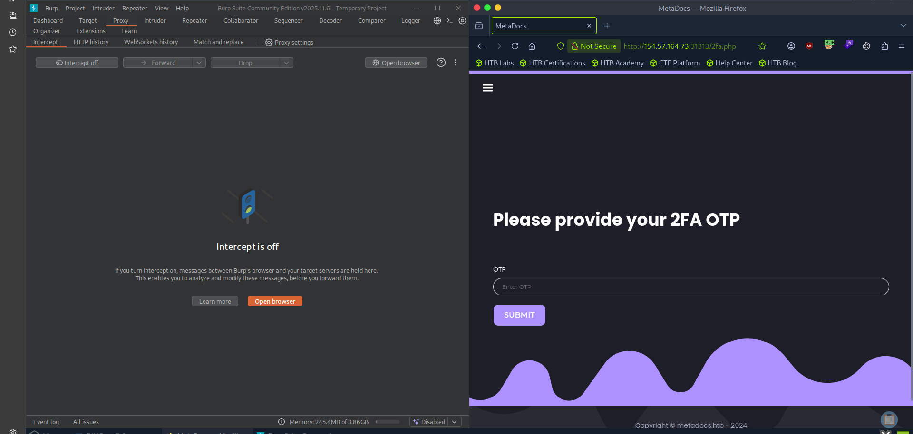

*Figure 14 - The login is gated behind a 2FA OTP prompt.*

When we intercepted the request we got our error message.

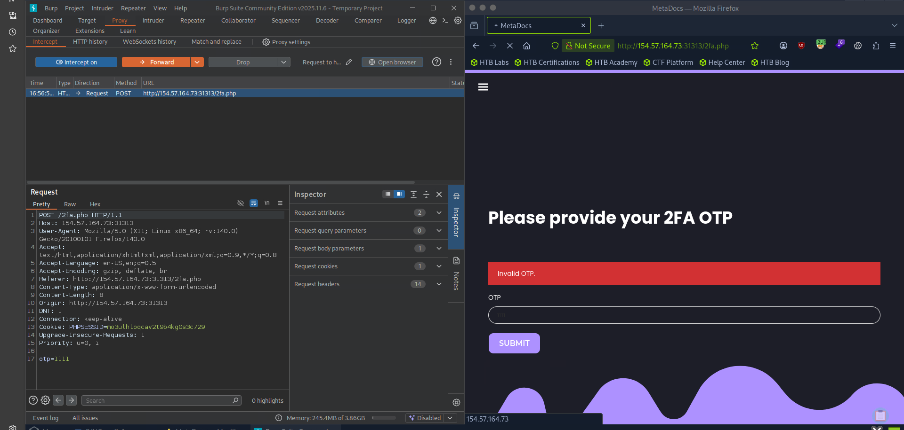

*Figure 15 - Submitting a wrong OTP returns "Invalid OTP.".*

We can use this to create a list from 1 to 10,000 and then brute force our way in once again, but this time we need our session ID in the parameter.

```
seq 1 10000 > tokens.txt
```

```
ffuf -w ./tokens.txt -u http://154.57.164.73:31313/2fa.php -X POST -H "Content-Type: application/x-www-form-urlencoded" -b "PHPSESSID=mo3ulhloqcav2t9b4kg0s3c729" -d "otp=FUZZ" -fr "Invalid OTP."
```

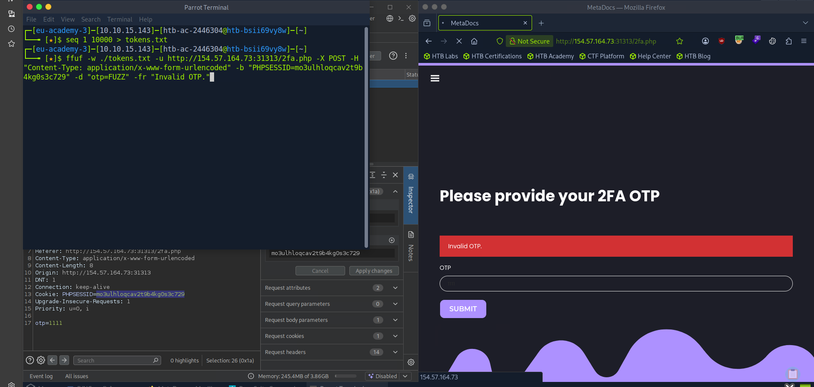

*Figure 16 - Generating the OTP list and running ffuf against the 2FA endpoint.*

However this did not work and we later found out that the webpage supported alphanumeric and as many characters as possible. However when we send it onto Repeater we see that the web page has a 302 and we could possibly intercept the response back so we did the following.

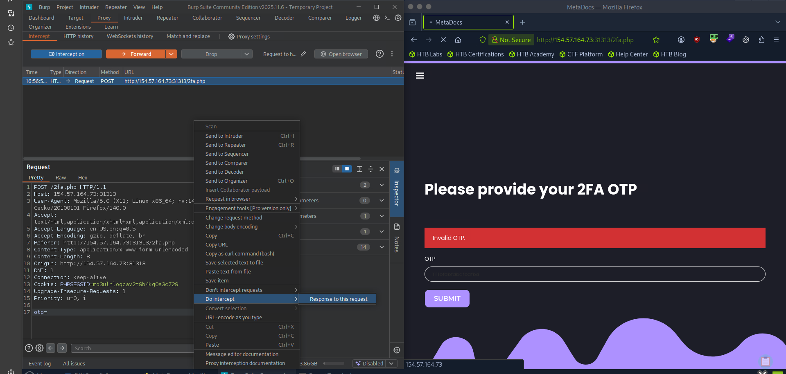

*Figure 17 - Setting Burp to intercept the response to the 2FA request.*

And we changed 302 to 200 OK.


*Figure 18 - The response comes back as a 302 redirect to login.php.*

However it was the same page.

(Note at this point I restarted the instance so there is a change in session ID, IP address and port.)

Upon closer inspection it seems we are logged in already ?? Maybe this is the flaw.

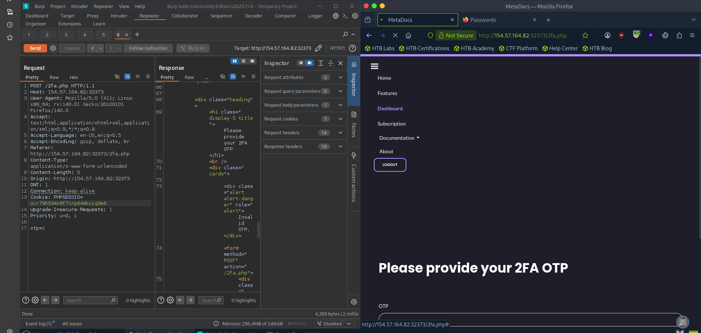

*Figure 19 - After the restart the dashboard menu is visible, so we are effectively logged in.*

---

## Getting the Flag

We then decided to go to our original account and we saw that the directory is under profile.php. What if we tried to access the directory directly ?

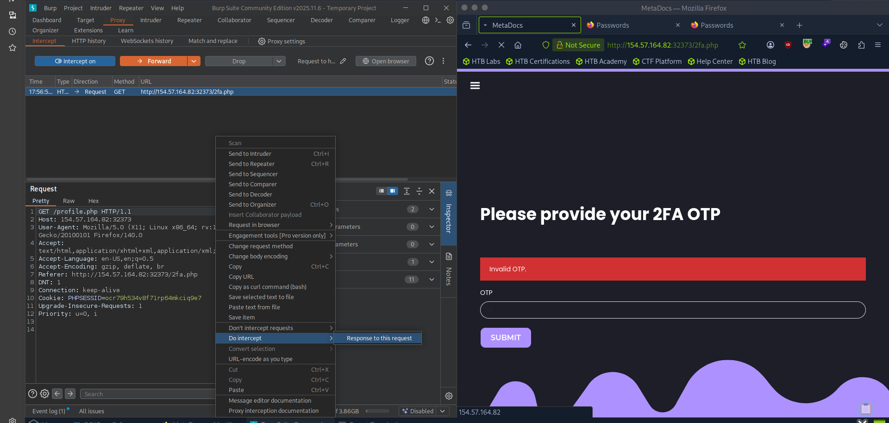

*Figure 20 - Intercepting the response for a direct request to profile.php.*

And we can see that this will work!!! We have the flag now, but if we wanted to load up the page we just have to change our 302 redirect to 200 OK.


*Figure 21 - The intercepted profile.php response contains "Welcome gladys!" and the flag.*

```
HTB{d86115e037388d0fa29280b737fd9171}
```

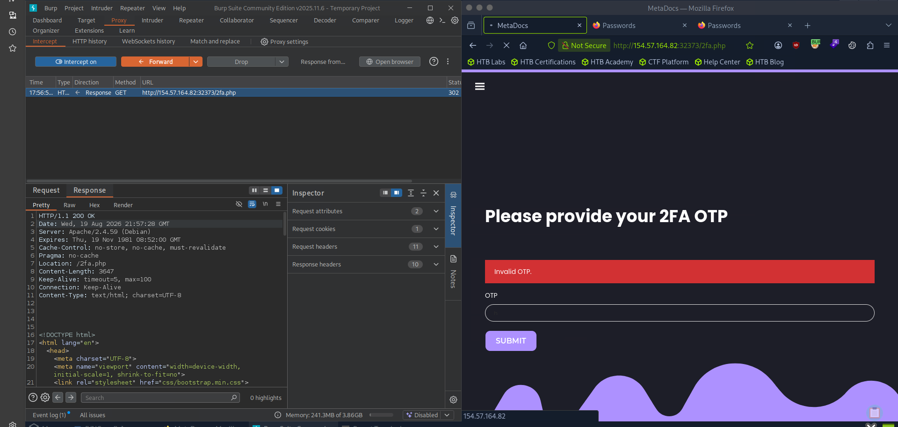

*Figure 22 - Changing the 302 redirect to 200 OK so the page renders.*

Now when we forward the response, we are in.

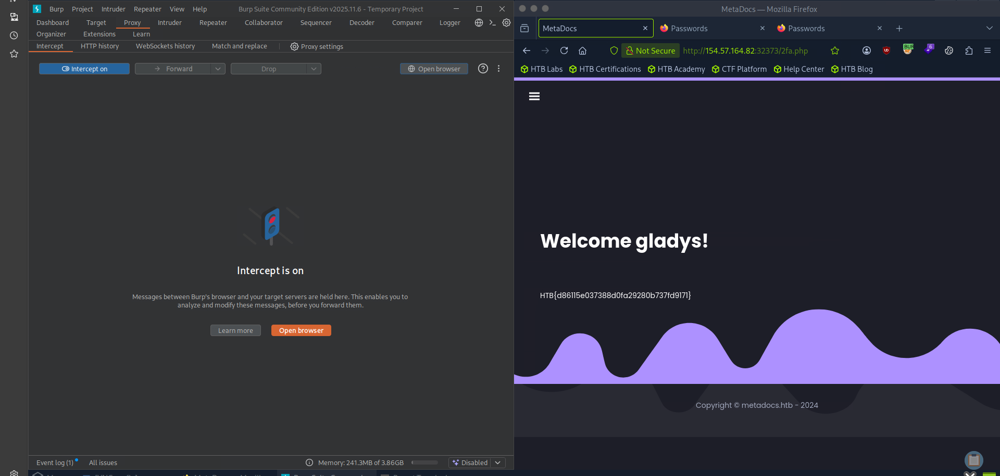

*Figure 23 - The profile page renders in the browser with the flag.*

> **Question:** Submit the flag found on the profile page.

**Answer:** `HTB{d86115e037388d0fa29280b737fd9171}`
