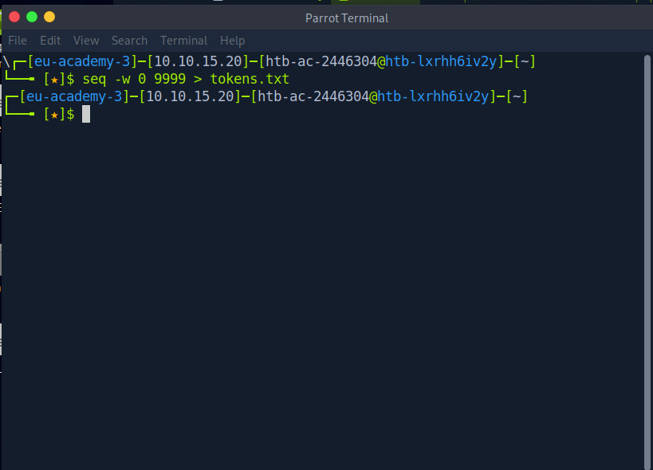
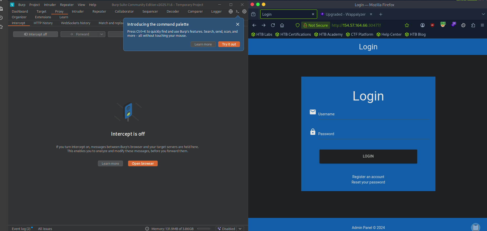
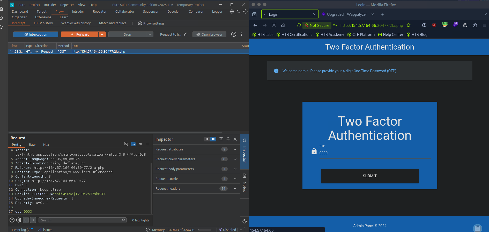
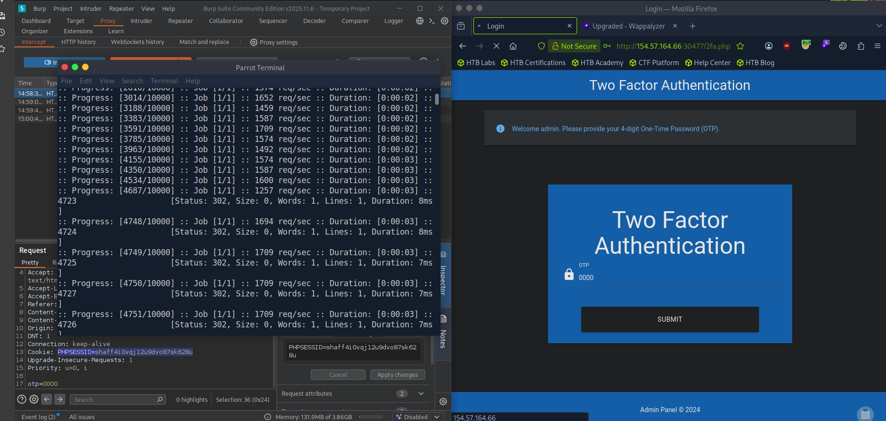
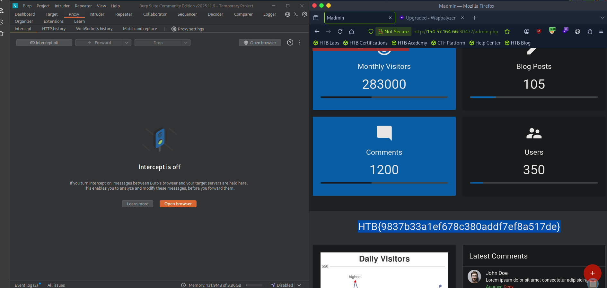

# Hack The Box - Brute Forcing 2FA Codes | Write-up

> **Platform:** Hack The Box &nbsp;•&nbsp; **Category:** Web / Broken Authentication &nbsp;•&nbsp; **Difficulty:** Easy
>
> **Target:** `154.57.164.66:30477` &nbsp;•&nbsp; **Time taken:** 5 mins
>
> **Author:** Jithin Jelson

---
## Assessment Overview

```mermaid
flowchart LR
    A[Generate tokens<br/>seq 0000-9999]:::intel
    A --> B[Visit target<br/>login page]:::entry
    B --> C[Log in admin:admin<br/>capture OTP request]:::intel
    C --> D[POST /2fa.php<br/>otp=FUZZ + PHPSESSID]:::ioc
    D --> E[ffuf brute-force<br/>-fr Invalid 2FA Code]:::payload
    E --> F[First hit 4723<br/>Status 302]:::mitre
    F --> G[Admin panel<br/>flag captured]:::user

    classDef entry fill:#1d4ed8,stroke:#1e3a8a,color:#ffffff;
    classDef ioc fill:#0f766e,stroke:#134e4a,color:#ffffff;
    classDef intel fill:#7c3aed,stroke:#5b21b6,color:#ffffff;
    classDef mitre fill:#b45309,stroke:#78350f,color:#ffffff;
    classDef payload fill:#be123c,stroke:#881337,color:#ffffff;
    classDef user fill:#15803d,stroke:#14532d,color:#ffffff;
    linkStyle default stroke-width:2px
```



---

## What I Learned

- A 4-digit OTP with no rate limiting is only 10,000 values, so it falls to a quick ffuf brute-force.
- The session's `PHPSESSID` cookie has to ride along in the request or every guess is checked against the wrong session.

---

## Introduction

We are told that our vulnerable web app asks for an OTP and we are given the password admin and username admin. We have to get in with the 2FA, and we have been told there is no limit to this, so we can start by creating a script between 1-9999 since it is a 4-digit code.

```
seq -w 0 9999 > tokens.txt
```



*Figure 1 - Using seq to generate every 4-digit code from 0000 to 9999 into tokens.txt.*

---


## Visiting the Web Application

Now we can visit our target webpage.



*Figure 2 - The target login page at 154.57.164.66:30477.*

---

## Capturing the OTP Request

We can now enter the credentials given and capture the OTP request.



*Figure 3 - After logging in as admin, the 2FA page asks for a 4-digit OTP. The intercepted POST to /2fa.php shows the otp parameter and the PHPSESSID cookie.*

---

## Brute-Forcing with ffuf

Once we get our OTP request we can translate these into ffuf with the new information.

```
ffuf -w ./tokens.txt -u http://154.57.164.66:30477/2fa.php -X POST -H "Content-Type: application/x-www-form-urlencoded" -b "PHPSESSID=shaff4i0vqj12u9dvo87sk628u" -d "otp=FUZZ" -fr "Invalid 2FA Code"
```



*Figure 4 - ffuf returns 4723 as the first Status 302 hit.*

Since 4723 is our first hit there is a good chance this is the code.

Note we got our error message from entering a wrong 2FA code even though it was not shown.



*Figure 5 - Submitting the code lands us on the admin panel, where the flag is displayed.*

And we get our answer.

> **Question:** Takeover another user's account on the target system to obtain the flag.

**Answer:** `HTB{9837b33a1ef678c380addf7ef8a517de}`
