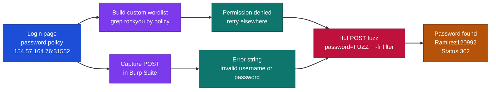
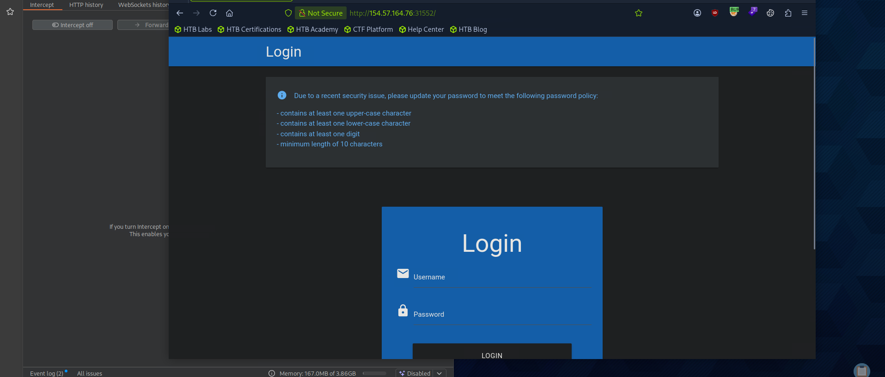
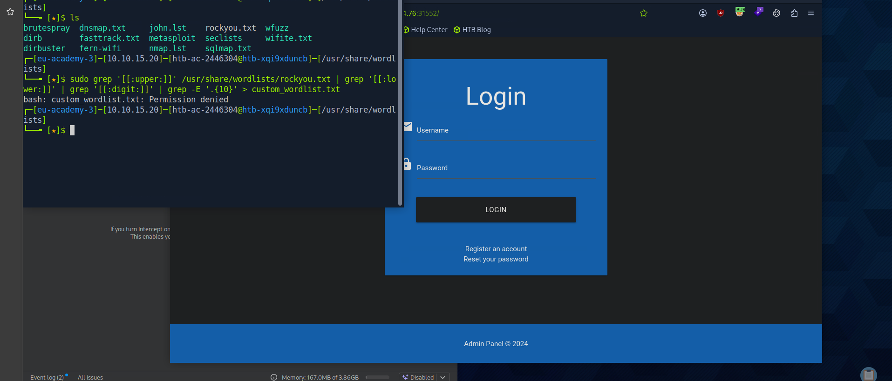
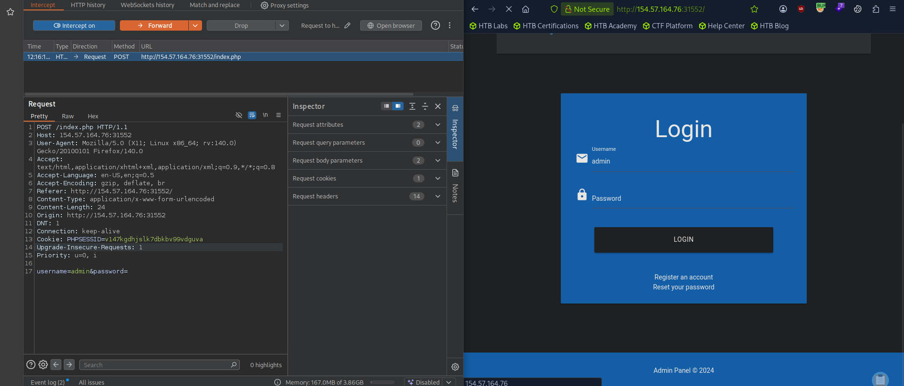
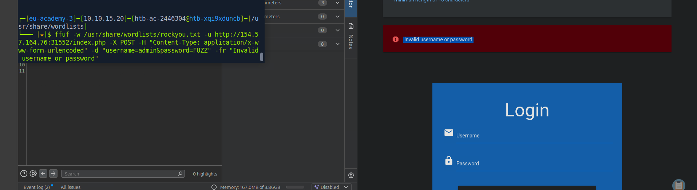
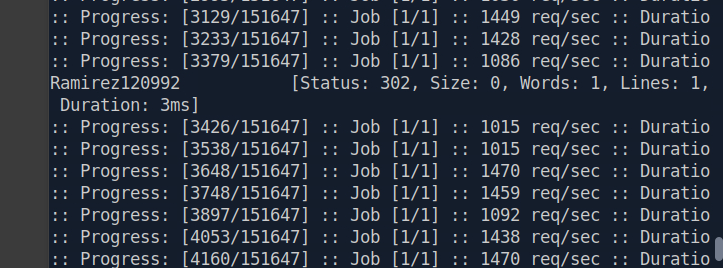

# Hack The Box - Brute Forcing Passwords | Write-up

> **Platform:** Hack The Box &nbsp;•&nbsp; **Category:** Web / Broken Authentication &nbsp;•&nbsp; **Difficulty:** Easy
>
> **Target:** `154.57.164.76:31552` &nbsp;•&nbsp; **Time taken:** 10 mins
>
> **Author:** Jithin Jelson

---

## Introduction

We have been told that we have a vulnerable application that allows for passwords to be bruteforced with a valid credential (admin). We have to visit the target IP address and find the valid password using rockyou.txt.

---

## Assessment Overview



---

## What I Learned

- Trimming rockyou.txt down to a policy-matching wordlist with chained `grep`.
- Reading a login's password policy to avoid wasting attempts on invalid passwords.
- Capturing the login POST in Burp to grab the exact error string.
- Brute-forcing the password field with ffuf and filtering failures with `-fr`.

---

## Visiting the Web Application

First we can visit the web page, when we visit the web page we can see that we are greeted with a password message.



*Figure 1 - The login page shows a password policy: one upper-case, one lower-case, one digit, minimum 10 characters.*

---

## Building a Custom Wordlist

We have been told our password has to require a few things, so instead of using the rockyou.txt fully we can grab the passwords that will bypass the requirements.

For this we can write a custom script to extract these types of passwords from rockyou.txt since the original file has over 15 million passwords.

```
grep '[[:upper:]]' /opt/useful/seclists/Passwords/Leaked-Databases/rockyou.txt | grep '[[:lower:]]' | grep '[[:digit:]]' | grep -E '.{10}' > custom_wordlist.txt
```

It seems we don't have permission on this device.



*Figure 2 - The custom wordlist command returns "Permission denied".*

---

## Capturing the Request in Burp

So we might have to run the whole password list, we can intercept our request on Burp to see what we need.



*Figure 3 - The intercepted POST request to /index.php, showing the username=admin&password= body parameters.*

---

## Brute-Forcing with ffuf

Now we can use ffuf to bruteforce the password in with the correct error message.



*Figure 4 - The wrong-password response returns "Invalid username or password", which becomes our filter string.*

```
ffuf -w /usr/share/wordlists/rockyou.txt -u http://154.57.164.76:31552/index.php -X POST -H "Content-Type: application/x-www-form-urlencoded" -d "username=admin&password=FUZZ" -fr "Invalid username or password"
```



*Figure 5 - ffuf filters out the failed attempts and returns the valid password with a Status 302 redirect.*

Note we attempted to do it again in another folder and this time we got our custom wordlist.

> **Question:** What is the password of the user 'admin'?

**Answer:** `Ramirez120992`
