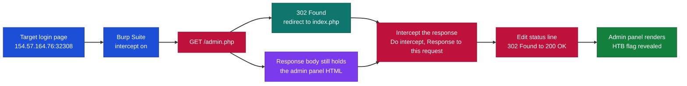
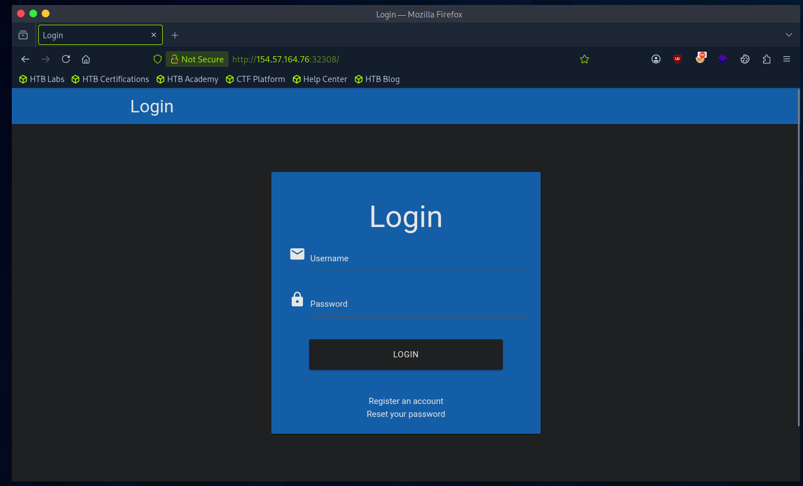
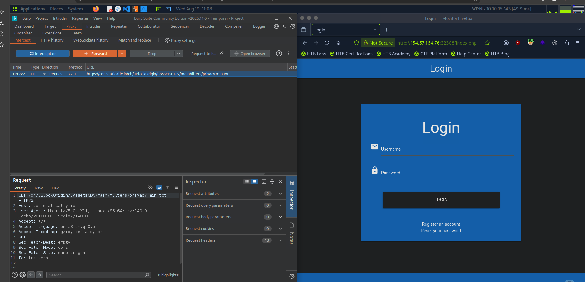
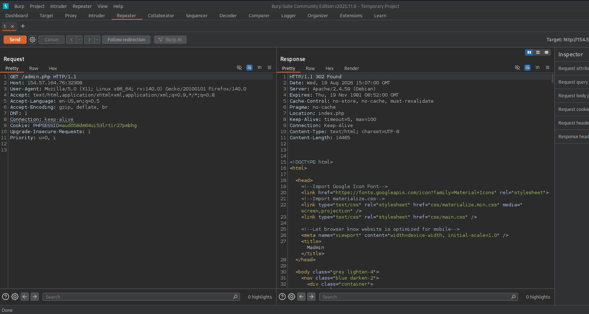
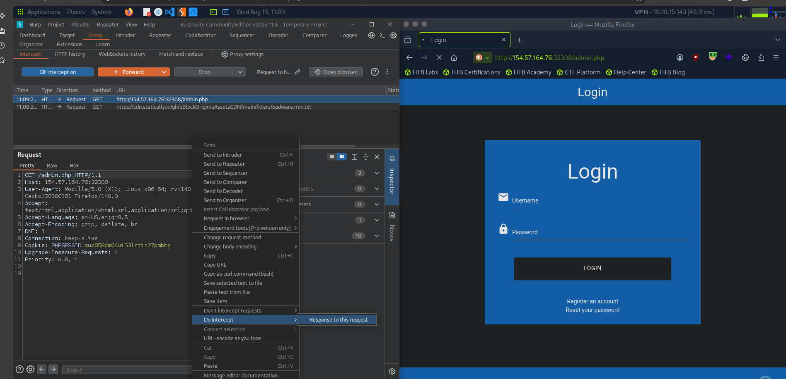
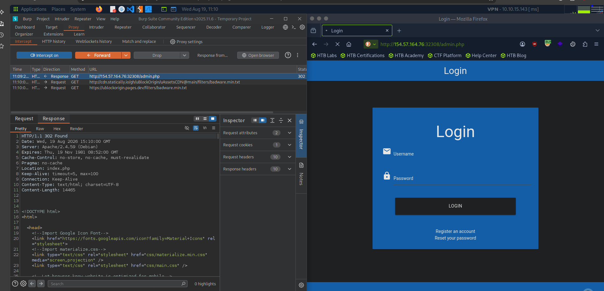
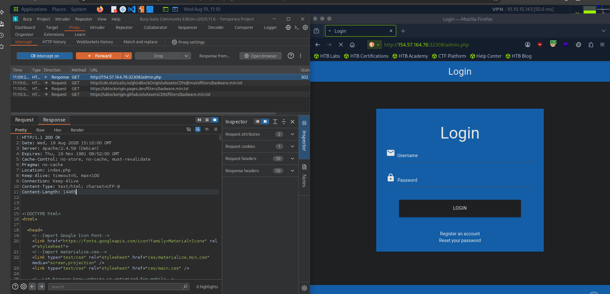
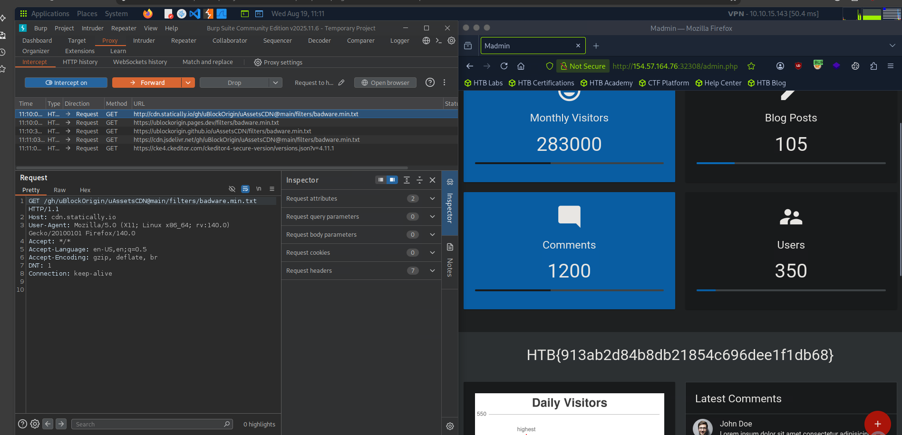

# Hack The Box - Direct Access via Broken Authentication | Write-up

> **Platform:** Hack The Box &nbsp;•&nbsp; **Category:** Web Exploitation / Broken Authentication &nbsp;•&nbsp; **Difficulty:** Easy
>
> **Target:** `154.57.164.76:32308` &nbsp;•&nbsp; **Time taken:** 5 minutes
>
> **Author:** Jithin Jelson

---

## Introduction

We have been told that our web application's login in this instance is not flawed, but there is a flaw in the authentication that allows us to access the admin panel. We must change the redirect 302 to a 200 to obtain our flag.

---

## Assessment Overview

---

## What I Learned

- How a 302 redirect can still ship the full response body, so a sensitive page is only one status code away from rendering.
- Using Burp Suite to intercept and edit a server response, not just the request.
- Why broken authentication and access control can let us reach the admin panel without valid credentials.
- Changing an HTTP status line from 302 Found to 200 OK to force the browser to render a page it was meant to redirect away from.
- Reading a raw HTTP response to spot that the admin panel HTML was present despite the redirect.
- That a client-side redirect is not a security boundary, because the real content has already been sent to us.

---

## Reconnaissance

We can start by booting up our virtual machine and visiting our target IP address. Once we find our page, we can open up Burp Suite.

*Figure 1 - The target login page at `154.57.164.76:32308`.*

---

## Turning on Intercept

We can now turn on intercept and try to access the admin panel.

*Figure 2 - Burp Suite Proxy with intercept turned on, ready to capture the request to the admin panel.*

---

## Spotting the 302 With the Body Intact

We can see when we request the web page we get a redirect at 302, however the application still seems to contain the body of our required admin panel.

*Figure 3 - The request to `/admin.php` returns `302 Found` with `Location: index.php`, but the response body still contains the full admin panel HTML (`Content-Length: 14465`).*

---

## Intercepting the Response

The file however redirects us back to our original index page. To bypass this we can intercept our response by going to Do intercept, then Response to this request.

*Figure 4 - Right-clicking the intercepted request and choosing Do intercept, then Response to this request.*

---

## Changing 302 to 200

Now we can change our 302 Found to a 200 OK for our response.

*Figure 5 - The intercepted response, still showing `HTTP/1.1 302 Found` before the edit.*

*Figure 6 - The status line edited to `HTTP/1.1 200 OK` so the browser renders the body instead of following the redirect.*

---

## Accessing the Admin Panel

And we can see we have access to our admin panel.

*Figure 7 - The admin dashboard loads and reveals the flag.*

> Retrieve the flag from the admin panel.

**Answer:** `HTB{913ab2d84b8db21854c696dee1f1db68}`
