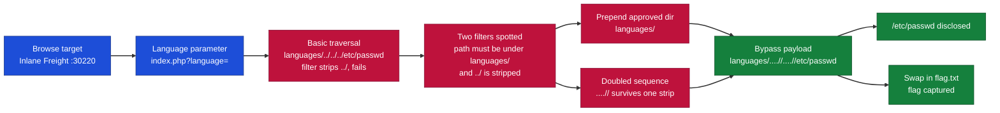
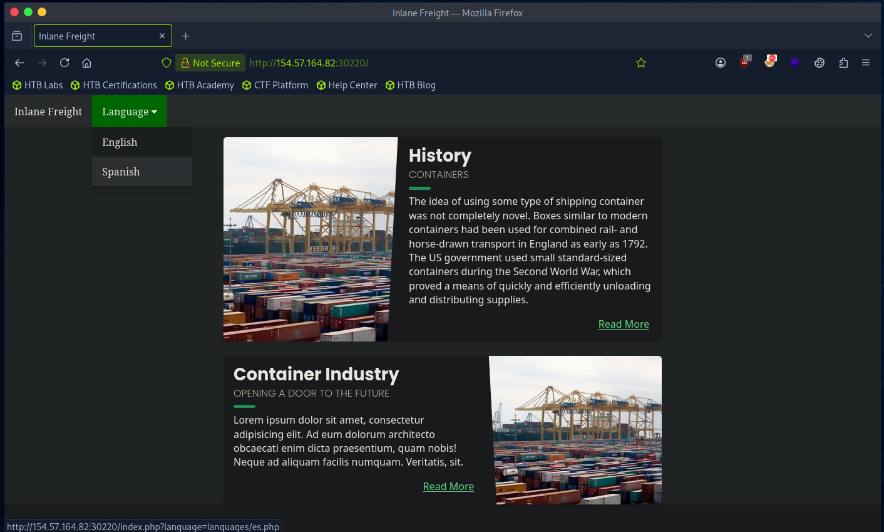
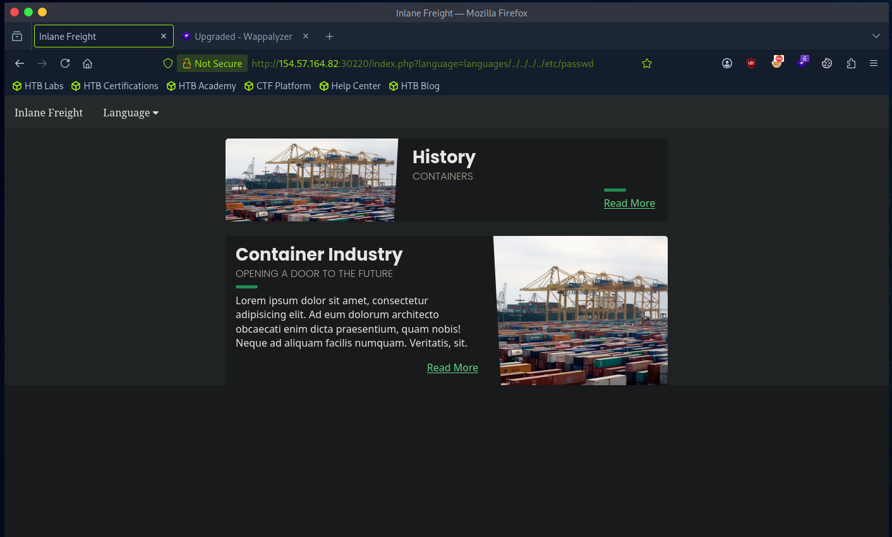
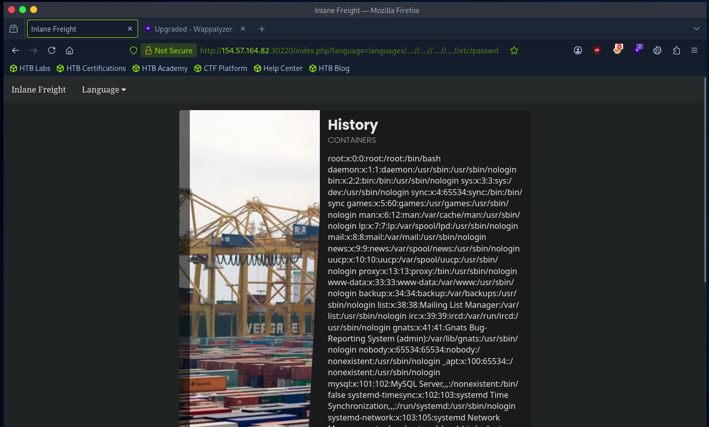
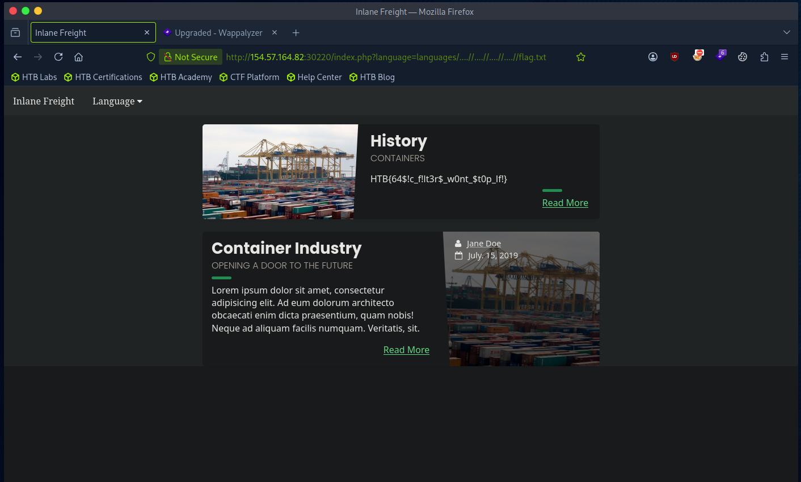

# Hack The Box - Bypassing Multiple Filters | Write-up

> **Platform:** Hack The Box &nbsp;•&nbsp; **Category:** Web / File Inclusion &nbsp;•&nbsp; **Difficulty:** Easy
>
> **Target:** `154.57.164.82:30220` &nbsp;•&nbsp; **Time taken:** 10 mins
>
> **Author:** Jithin Jelson

---

## Introduction

We have been told our web application employs more than one filter to avoid LFI exploitation, so we have to try and bypass these filters to get to our flag.

---

## Assessment Overview



---

## What I Learned

- How to recognise when more than one filter is stacked on the language parameter.
- Prepending `languages/` to satisfy the filter that requires the path to sit under the languages directory.
- Why a plain `../../../etc/passwd` failed here when it worked on the basic box.
- Using `....//` so that when the filter strips one `../` a working `../` is still left behind.
- Chaining that bypass to read `/etc/passwd` and then swapping in `flag.txt` to capture the flag.

---

## Enumerating the Target

We can start by navigating to our target web application.



*Figure 1 - The target homepage. The Language menu sets `index.php?language=languages/es.php`, so the include path sits under a `languages/` directory.*

It seems like it is the same web page as our previous website, so most likely the vulnerability is in the language parameter after we choose our language. We can start off by doing a basic `../../../etc/passwd` to see if we get any results.

```
index.php?language=languages/../../../etc/passwd
```



*Figure 2 - The plain `../` traversal is stripped by the filter, so no file is included and the content is missing.*

---

## Bypassing the Filters

However, nothing loads. It seems the web app is deploying some filters, so let's look for ways to bypass this. We can see one of the filters is that it requires something from the `languages` directory, so we can satisfy that by starting with `languages/`. It also seems to be removing `../` characters, so we can try entering `....//` so that only the inner `../` is removed and we are still left with a working `../`.

So our new payload will be:

```
http://154.57.164.82:30220/index.php?language=languages/....//....//....//....//etc/passwd
```



*Figure 3 - The `....//` payload survives the filter and discloses the full contents of `/etc/passwd`.*

---

## Capturing the Flag

This time it seems to work. To get our flag I presume we can just replace `etc/passwd` with `flag.txt`.

```
index.php?language=languages/....//....//....//....//flag.txt
```



*Figure 4 - Swapping the target file for `flag.txt` prints the flag on the page.*

And this seemed to work.

> **Objective: bypass the filters and read the flag.**

**Answer:** `HTB{64$!c_f!lt3r$_w0nt_$t0p_lf!}`
