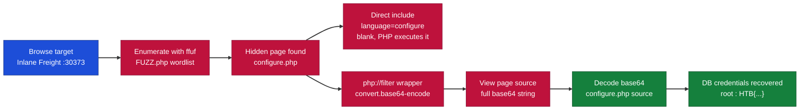
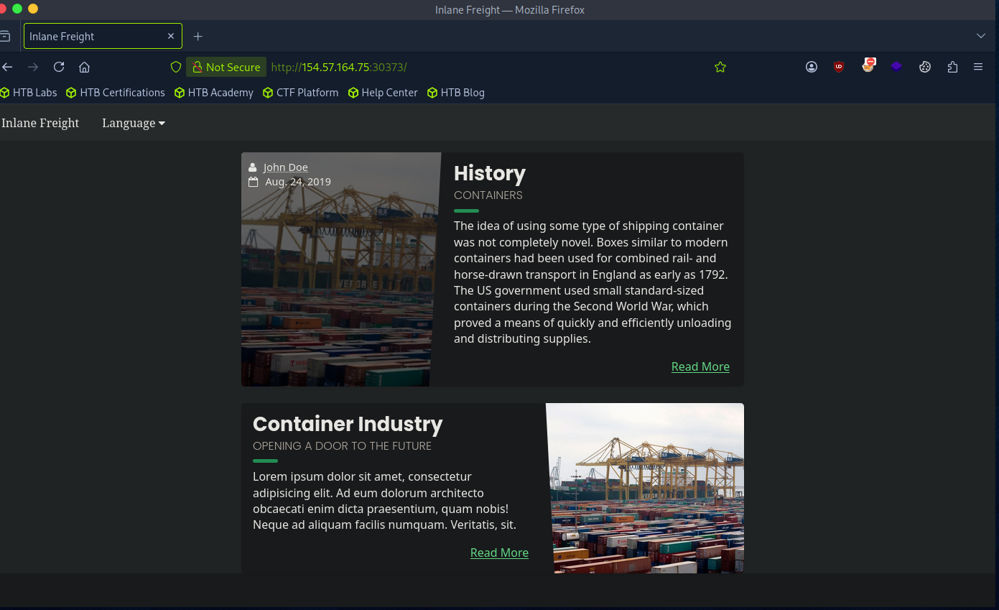
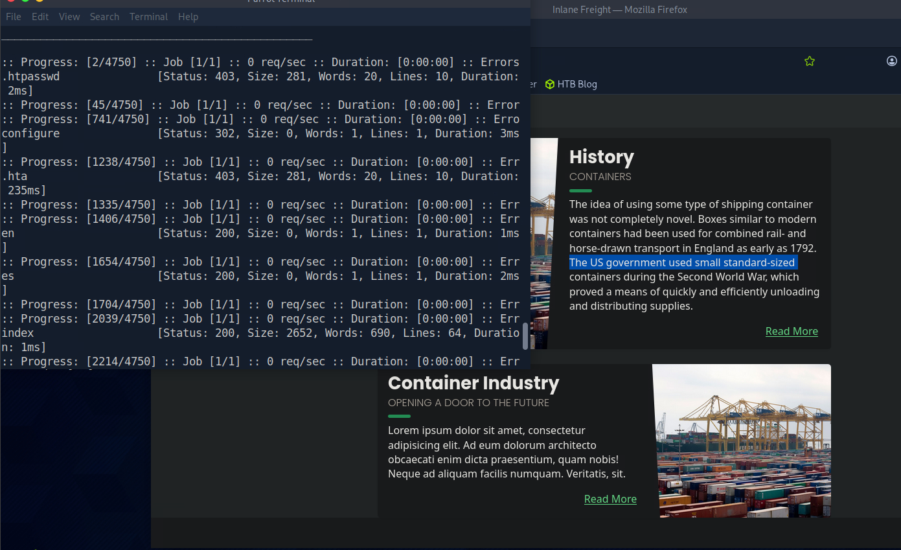
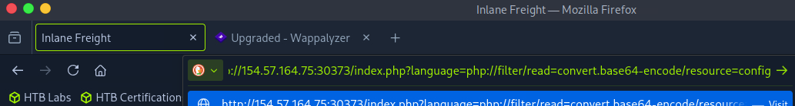
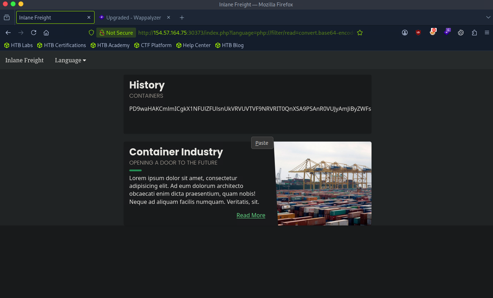
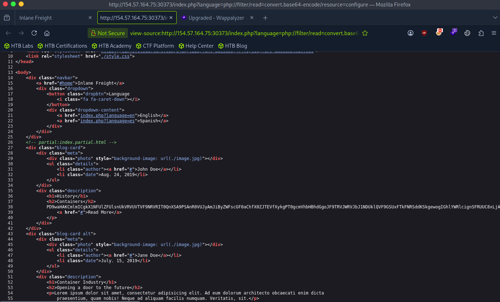
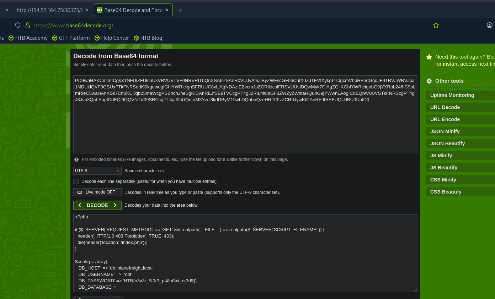

# Hack The Box - PHP Filters: Source Code Disclosure | Write-up

> **Platform:** Hack The Box &nbsp;•&nbsp; **Category:** Web / File Inclusion &nbsp;•&nbsp; **Difficulty:** Easy
>
> **Target:** `154.57.164.75:30373` &nbsp;•&nbsp; **Time taken:** 15 mins
>
> **Author:** Jithin Jelson

---

## Introduction

In this lab we have been instructed to enumerate our web application to find a PHP file, which we must use our PHP filters to convert into base64 and then reveal the database username and password. While PHP filters come in handy for developers, attackers can exploit this feature to gain access and read sensitive information. We must convert to base64 in order to read the application so the PHP does not execute on the page.

---

## Assessment Overview



---

## What I Learned

- How to use ffuf to enumerate hidden `.php` pages on the target and spot `configure.php`.
- Why including `configure.php` directly returns nothing, since PHP executes it instead of printing its source.
- Applying the `php://filter` wrapper with `convert.base64-encode` to read a file as data rather than run it.
- Checking the page source to grab the complete base64 string when the rendered page only shows part of it.
- Decoding the base64 to recover the `configure.php` source and the database credentials inside it.

---

## Enumerating the Target

We can start by navigating to our target web application.



*Figure 1 - The target homepage, the same Inlane Freight application seen in earlier labs.*

We can start by using `ffuf` to enumerate our webpage and see the hidden PHP pages. We can use the following payload:

```
ffuf -w /opt/useful/seclists/Discovery/Web-Content/common.txt -u http://154.57.164.75:30373/FUZZ.php
```



*Figure 2 - ffuf identifies a `configure` page (HTTP 302), i.e. `configure.php`.*

---

## Reading the Source with a PHP Filter

We have identified there is a `configure.php`. We can now use our base64 PHP filter to reveal the information inside it. For that we will add this to the parameter in our URL:

```
index.php?language=php://filter/read=convert.base64-encode/resource=configure
```



*Figure 3 - The `php://filter` wrapper with `convert.base64-encode` set on the `language` parameter.*

We can see our output down below.



*Figure 4 - The file is returned as a base64 string instead of being executed.*

But this isn't the full base64, so we can view the source code to see everything.



*Figure 5 - Viewing the page source (`view-source:`) exposes the complete base64 blob, which the rendered page had cut off.*

---

## Decoding the Credentials

Now we can use a base64 decode tool online to get the password, as this exercise instructs us to.



*Figure 6 - Decoding the base64 reveals the `configure.php` source, including the database username and password.*

The decoded configuration shows the database username `root` and the password below.

> **Objective: reveal the database username and password.**

**Username:** `root`

**Password:** `HTB{n3v3r_$t0r3_pl4!nt3xt_cr3d$}`
