# Hack The Box - Bypassing Blacklisted File Upload Filters | Write-up

> **Platform:** Hack The Box &nbsp;•&nbsp; **Category:** File Upload Attacks &nbsp;•&nbsp; **Difficulty:** Easy
>
> **Target:** `154.57.164.65:30349` &nbsp;•&nbsp; **Time taken:** 35 mins
>
> **Author:** Jithin Jelson

---

## Introduction

In this lab we will be going through how to bypass blacklisted extensions for file upload attacks. We have been told a file upload vulnerability exists on our target IP address and we have to exploit it and get the flag via RCE.

---

## Assessment Overview

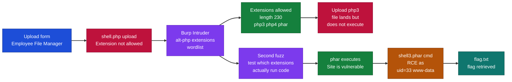

---

## What I Learned

- Blacklist filters only block the extensions someone remembered to list, so fuzzing the alternatives with Burp Intruder is enough to slip a PHP payload past them.
- The alt-php extensions wordlist is the fast way to enumerate every variant the filter forgot, from php3 and php5 to phar and pht.
- Response length is a reliable oracle here, since the uploads that returned 230 bytes were the ones the server accepted while the rest were rejected.
- Getting a file accepted is only half the job, because an extension can upload cleanly and still be served as plain text instead of executing.
- Confirming execution takes a second pass, requesting each uploaded file and watching for the one that actually runs the code rather than echoing the source back.
- Once .phar proved it executes, it becomes the pivot for a full webshell and command execution, which is what turned a blocked upload into RCE as www-data.

---

## Finding the Upload and Catching the Filter

We can start by visiting our website and booting up Burp Suite.

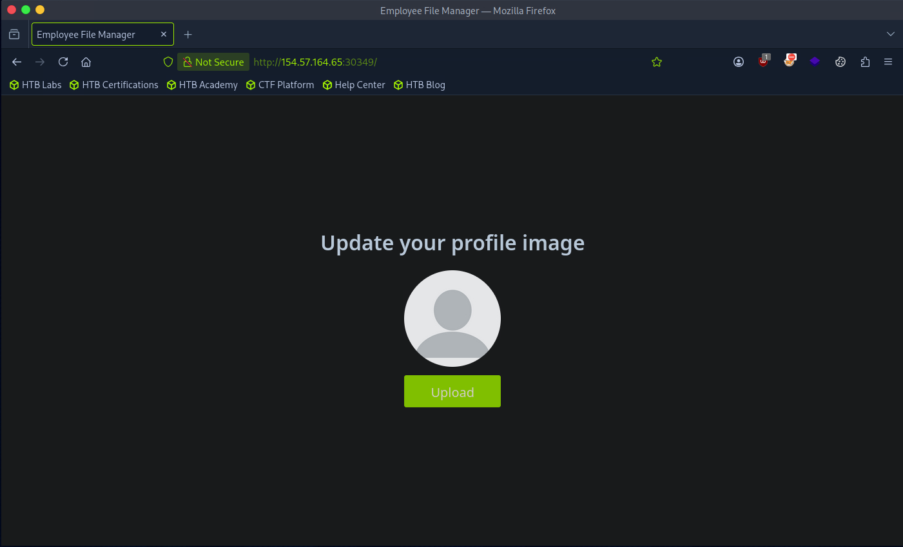

*Figure 1 - The target is an Employee File Manager with a profile image upload.*

We can see that if we try to modify our request and change it to a reverse shell we get an error message that says extension is not allowed.

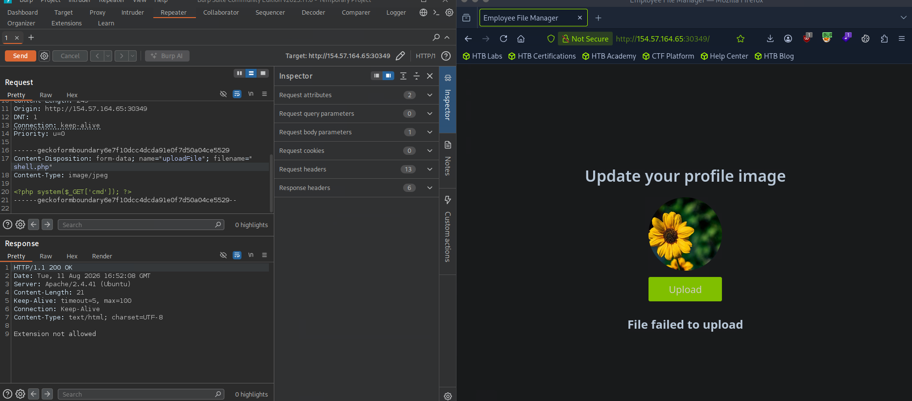

*Figure 2 - Uploading shell.php is rejected with "Extension not allowed" and "File failed to upload".*

---

## Fuzzing the Blacklist with Intruder

So to bypass this we can send it into Intruder and change the extension name so we can upload our script.

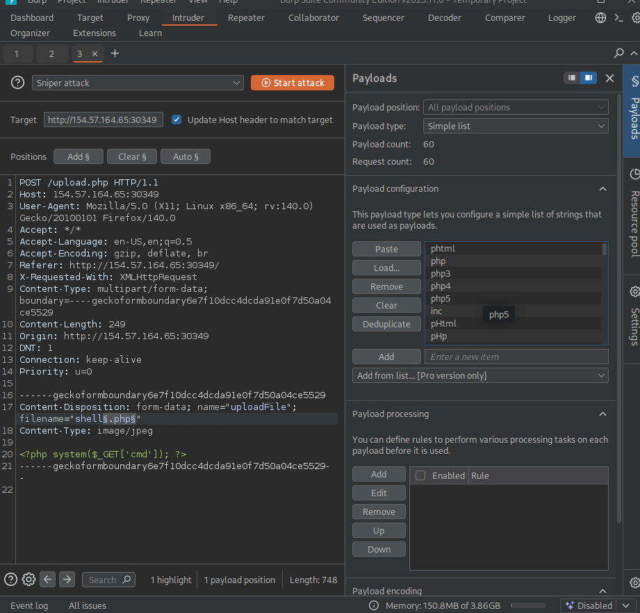

*Figure 3 - The filename extension is set as the Intruder payload position, loaded with the alt-php extensions list.*

We are using the alt-php extensions wordlist that can be found in our wordlist directory, we will now run this to see what results we can get back.

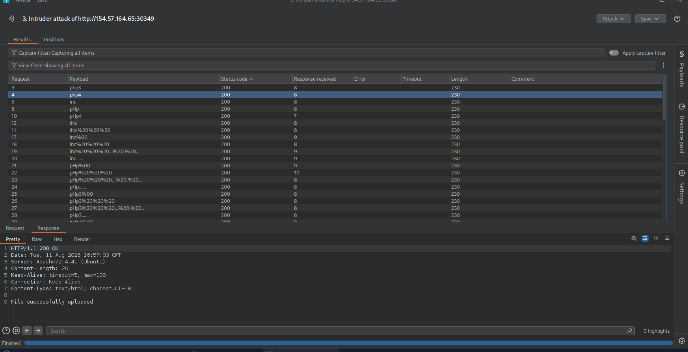

*Figure 4 - Requests returning length 230 with "File successfully uploaded", showing which extensions the blacklist allows.*

Although our attack isnt fully finished we can see that everything with a length of 230 we are allowed to upload and we get a message saying file uploaded successfully.

We will use php3 for this example. Now we can modify our request to php3 and we get our successful message.

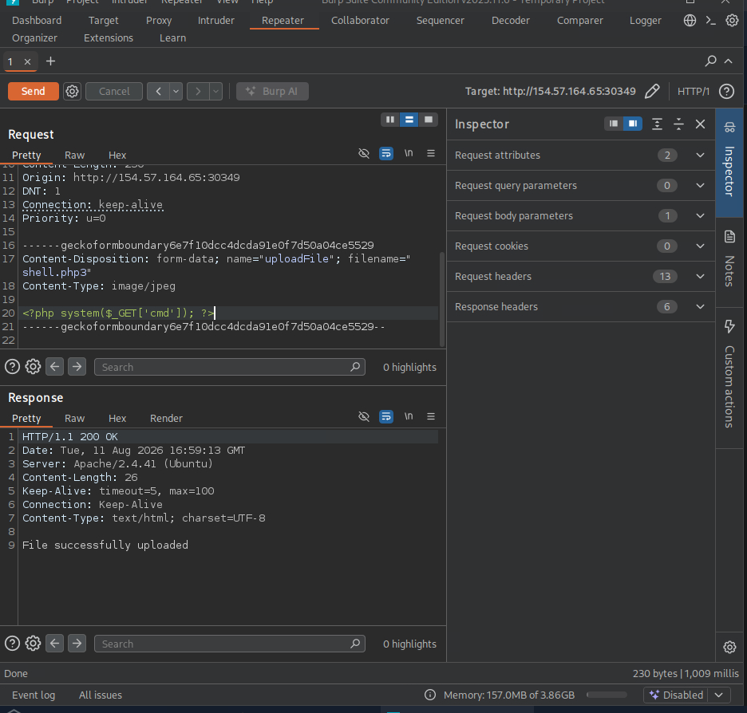

*Figure 5 - Uploading the file as shell.php3 returns "File successfully uploaded".*

It seemed to work but no script was executing.

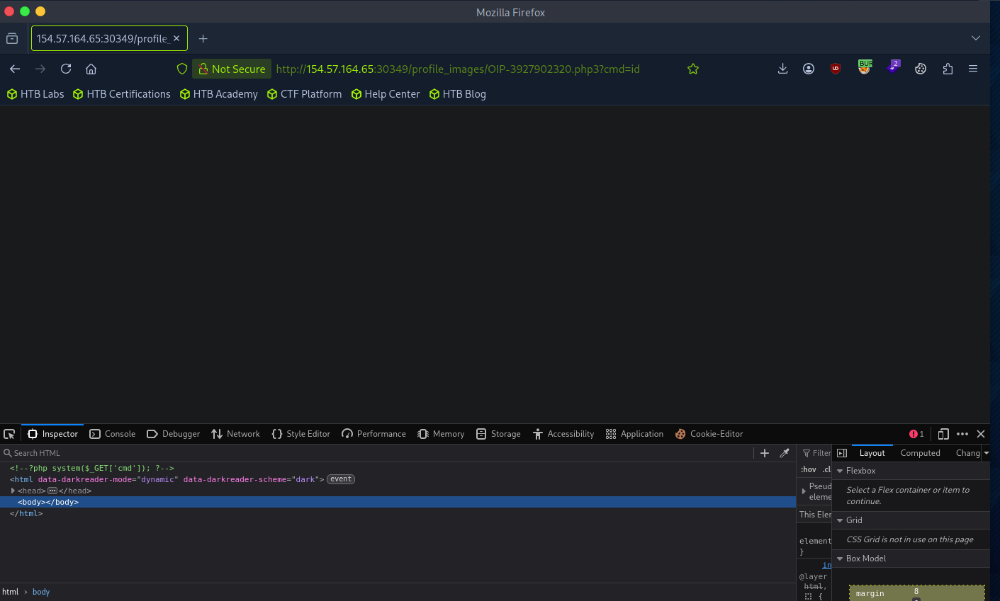

*Figure 6 - Browsing to the php3 file shows the PHP source as a comment, so the code is not running.*

---

## Finding an Extension That Actually Executes

At this point I was stuck because I didnt get a reverse shell, but then I realised not all the extensions work, so I need to find out from my Intruder of all the uploaded files which actually execute the code, so for that I need to echo something to see if it executes and then use the working extension as my pivot, so I created shell2.php and started the Intruder attack again.

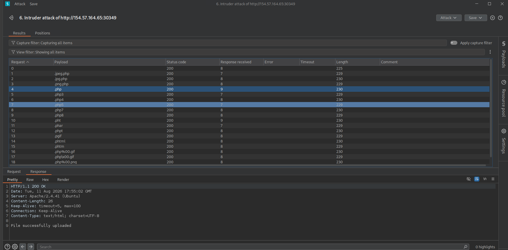

*Figure 7 - Re-running Intruder with shell2 across the full list of double and alternative extensions.*

Now out of these results we need to get a GET request that shows which shell actually executed the script, we will get this by visiting the URL it was uploaded to and intruding this request again.

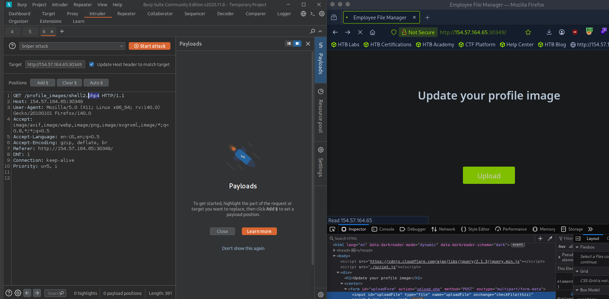

*Figure 8 - Setting up a GET request against the uploaded file in profile_images to test execution.*

This time we got to see our working php extension.

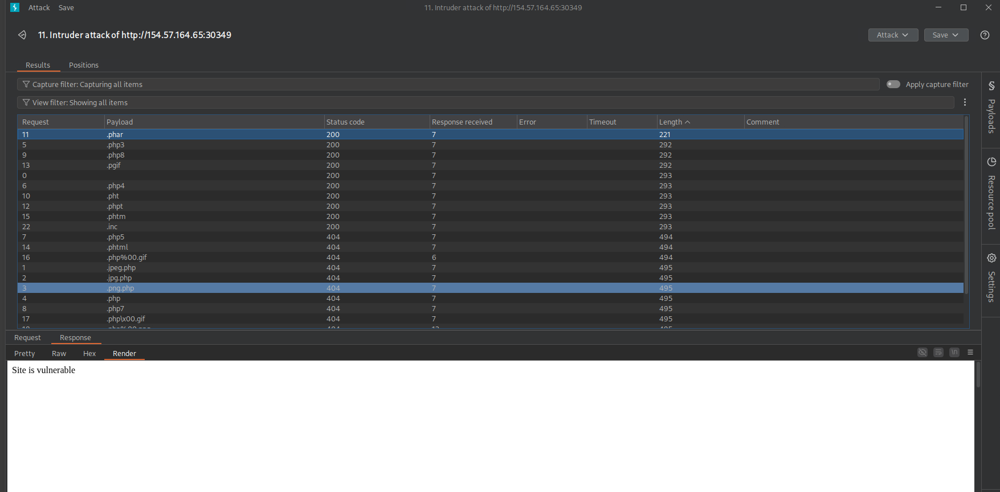

*Figure 9 - The .phar request returns "Site is vulnerable", confirming that extension executes code.*

---

## Getting RCE and the Flag

We can use this to exploit it and get RCE.

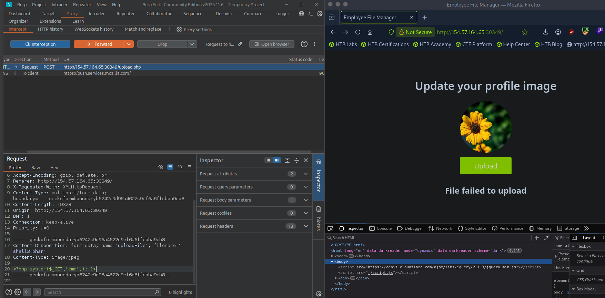

*Figure 10 - Modifying the upload request to shell3.phar in the proxy intercept.*

We have modified the request, now we can visit the link to get us RCE. This time we successfully got RCE.

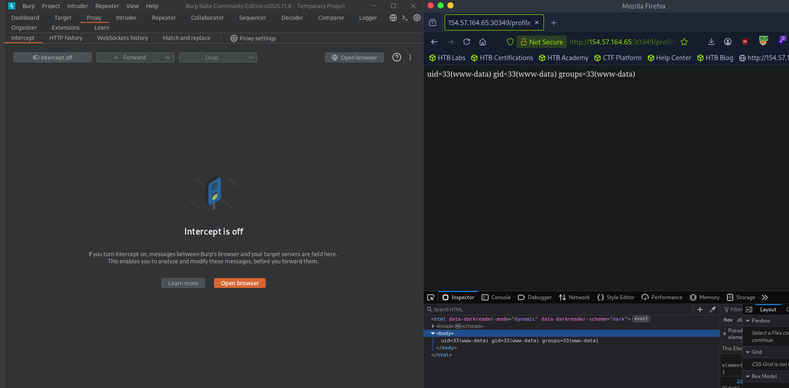

*Figure 11 - The webshell returns `uid=33(www-data) gid=33(www-data) groups=33(www-data)`, confirming remote code execution.*

The final flag is located at [http://154.57.164.65:30349/profile_images/shell3.phar?cmd=cat+../../../../flag.txt](http://154.57.164.65:30349/profile_images/shell3.phar?cmd=cat+../../../../flag.txt)

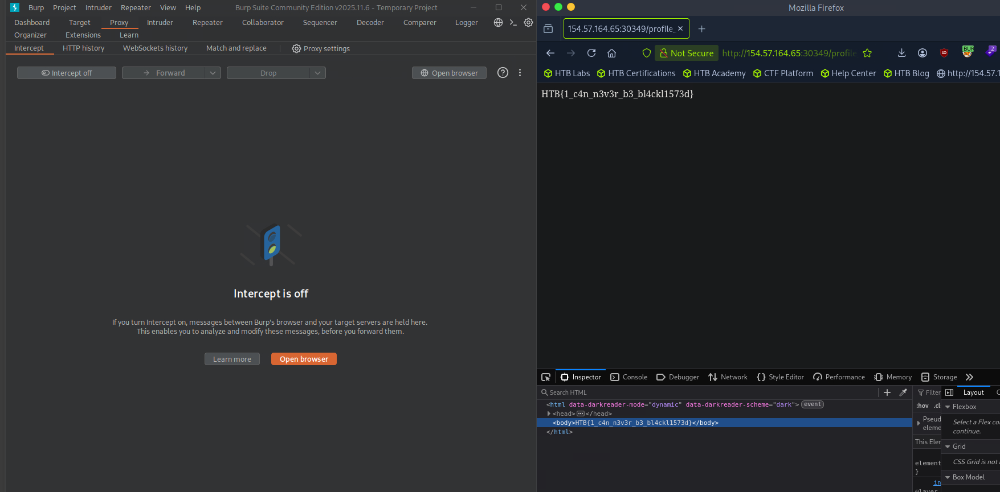

*Figure 12 - Reading flag.txt through the webshell.*

> **CTF question:** Retrieve the flag from the target.

**Answer:** `HTB{1_c4n_n3v3r_b3_bl4ckl1573d}`
