# Hack The Box - Bypassing Type Filters for File Upload Attacks | Write-up

> **Platform:** Hack The Box &nbsp;•&nbsp; **Category:** Web / File Upload Attacks &nbsp;•&nbsp; **Difficulty:** Medium
>
> **Target:** `154.57.164.78:31567` &nbsp;•&nbsp; **Time taken:** 30 mins
>
> **Author:** Jithin Jelson

---

## Introduction

We have been told in this exercise that there is a file upload vulnerability on our target web application. Like the previous exercises, the above server employs a client side, blacklist, and whitelist filter to ensure that the uploaded file is an image. Along with this we have been told that the website deploys additional MIME type filters and content types for an extra level of safety.

---

## Assessment Overview

```mermaid
flowchart LR
    A[Target web app<br/>profile image upload]:::entry --> B[Intercept upload<br/>in Burp Suite]:::entry
 
    B --> C[Send to Intruder<br/>enumerate extensions]:::payload
    C --> D[.phar passes blacklist<br/>Only images allowed]:::ioc
    C --> E[.phar.jpg accepted<br/>double extension]:::ioc
 
    E --> F[Send to Repeater]:::payload
    F --> G[Add GIF8 magic bytes<br/>fake image content]:::payload
    G --> H[File uploaded<br/>but shell fails]:::mitre
 
    H --> I[Content-Type: image/gif<br/>still fails]:::mitre
    H --> J[Reverse double extension<br/>shell.jpg.phar]:::payload
 
    J --> K[Server checks contains jpg<br/>not ends in jpg]:::ioc
    K --> L[RCE as www-data]:::user
    L --> M[Read flag.txt]:::user
 
    classDef entry fill:#1d4ed8,stroke:#1e3a8a,color:#ffffff;
    classDef ioc fill:#0f766e,stroke:#134e4a,color:#ffffff;
    classDef intel fill:#7c3aed,stroke:#5b21b6,color:#ffffff;
    classDef mitre fill:#b45309,stroke:#78350f,color:#ffffff;
    classDef payload fill:#be123c,stroke:#881337,color:#ffffff;
    classDef user fill:#15803d,stroke:#14532d,color:#ffffff;
    linkStyle default stroke-width:2px
```

---

## What I Learned

- How to enumerate file extensions with Burp Intruder to find one that slips past both blacklist and whitelist filters.
- Why prepending `GIF8` magic bytes makes a PHP payload look like a real image to a content sniffing filter.
- Changing the `Content-Type` header to spoof the MIME type the server expects during an upload.
- That a double extension like `.phar.jpg` behaves very differently from a reverse double extension like `.jpg.phar`.
- Reading how a weak whitelist checks whether a filename *contains* an allowed extension rather than whether it *ends* with one.
- Chaining a filter bypass into remote code execution and using it to read a file off the target.

---

## Recon and Intercepting the Upload

We can start by heading towards our target IP address and loading up Burp Suite.

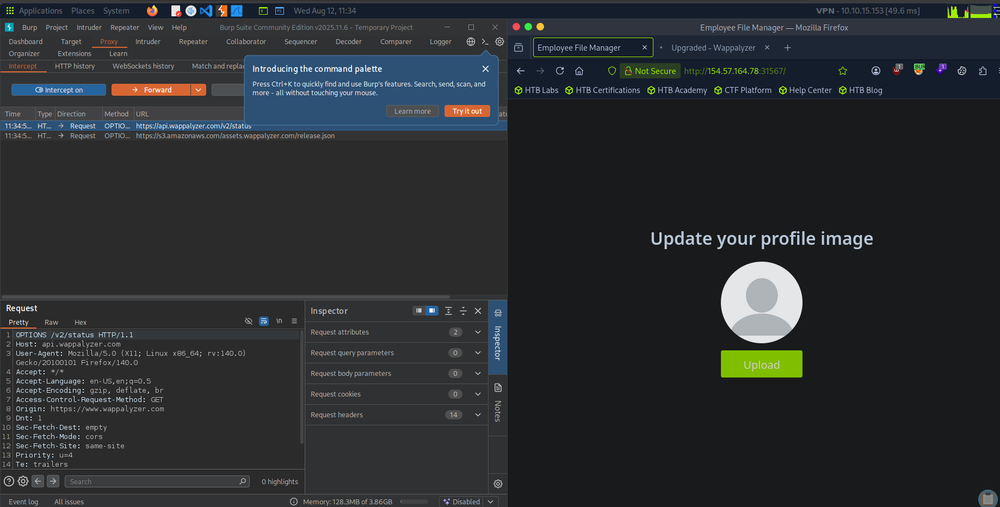

*Figure 1 - The target profile image upload page next to Burp Suite intercepting traffic.*

---

## Sending the Upload to Intruder

We can start by capturing our upload request and sending it onto Intruder for further analysis.

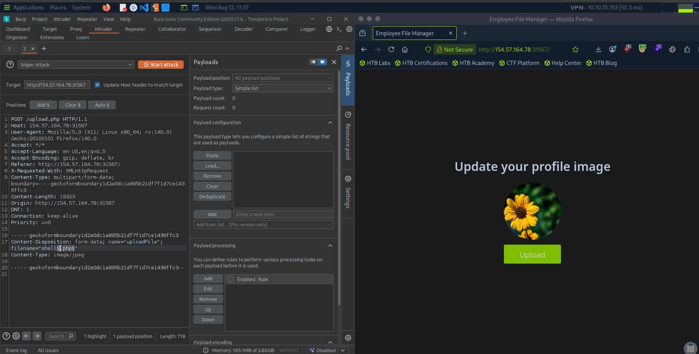

*Figure 2 - The `POST /upload.php` request in Intruder with the `filename` value marked as the payload position.*

We will try and enumerate and find an extension that will bypass the blacklist and whitelist filters. We will be using the same wordlist we used in the previous exercise for bypassing the whitelist and blacklist features.

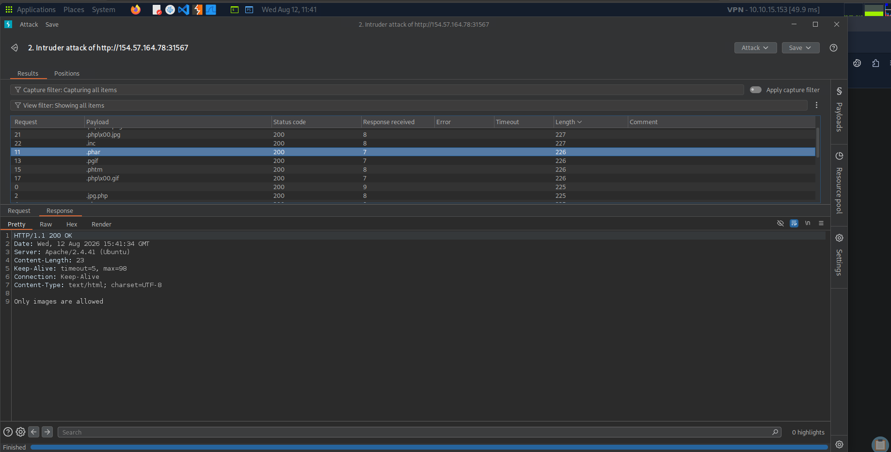

*Figure 3 - Like the previous exercise, `.phar` returns "Only images are allowed" while other extensions are rejected.*

It seems like the previous exercise, we get the same error for the `.phar` extension while all other extensions say extension not allowed. `.phar` telling us that only images are allowed means this has passed the blacklist. We can also see that extensions that end with `php\x00.png` and `php\x00.jpg` seem to give us the same message of only images are allowed, so like our previous exercise we will attempt to sneak in a `.phar.jpg` file.

---

## Faking an Image with a Double Extension

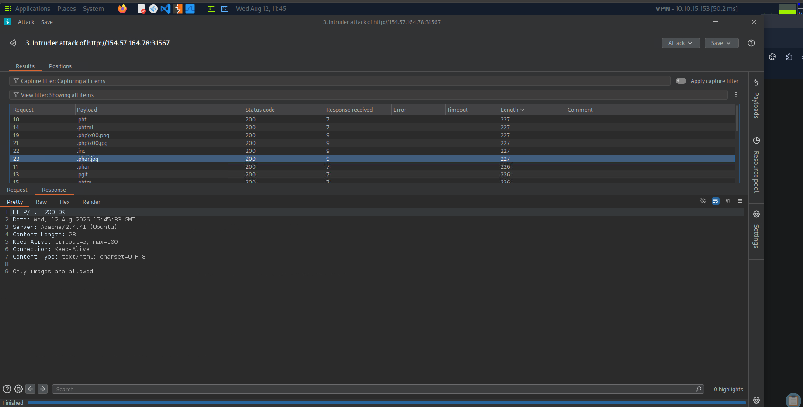

*Figure 4 - The `.phar.jpg` payload returns the same "Only images are allowed" response, a good sign.*

Seems like we got a similar response, this could be a good sign. We will now attempt to change the MIME type filters and content type filters to see if we can bypass the type filters, so we will send our request to Repeater.

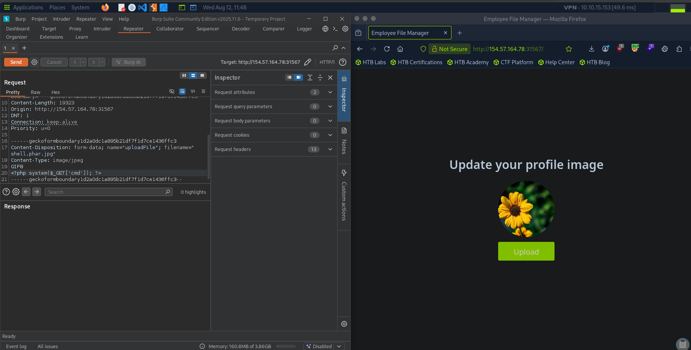

*Figure 5 - In Repeater the body starts with `GIF8` followed by the PHP payload `<?php system($_GET['cmd']); ?>`, with `Content-Type: image/jpeg`.*

We have added a MIME type to be `GIF8` here, so when the web server checks it can think it is a GIF file.

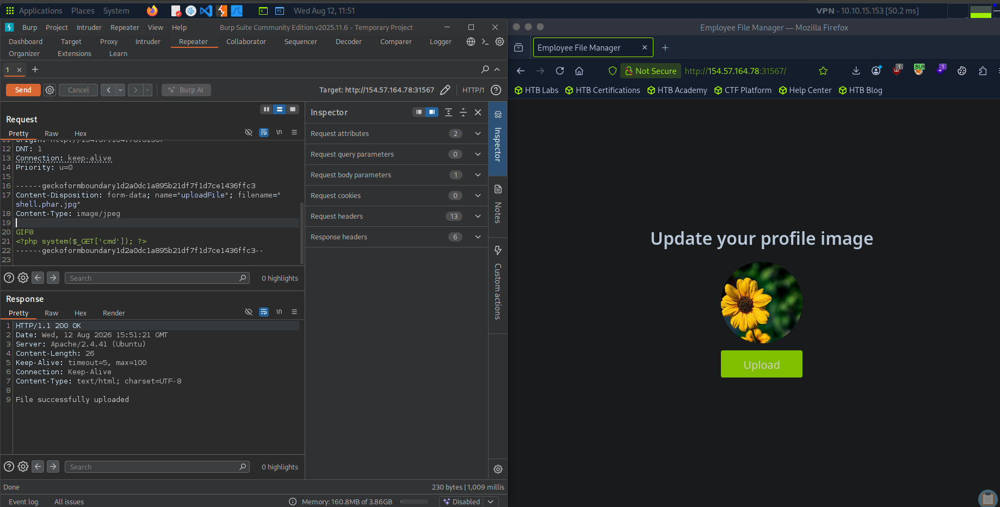

*Figure 6 - The server responds with "File successfully uploaded".*

---

## Finding the Shell and the First Error

We have successfully uploaded the file, we can refresh our page and check for the link to our reverse shell in the pfp.

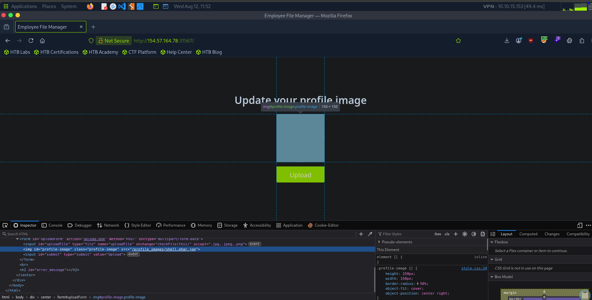

*Figure 7 - The dev tools show the profile image `src` set to `/profile_images/shell.phar.jpg`.*

Once we got our specified URL, it seems we got an error, seems like we got excited for no reason.

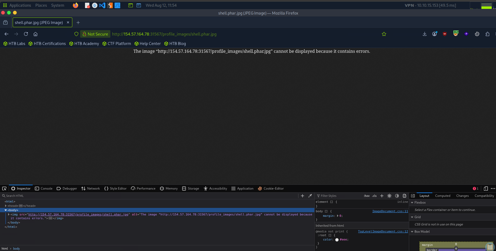

*Figure 8 - Browsing to `shell.phar.jpg` only returns "The image cannot be displayed because it contains errors".*

---

## Spoofing the Content-Type Header

Perhaps we need to change it to a GIF file in our content header?

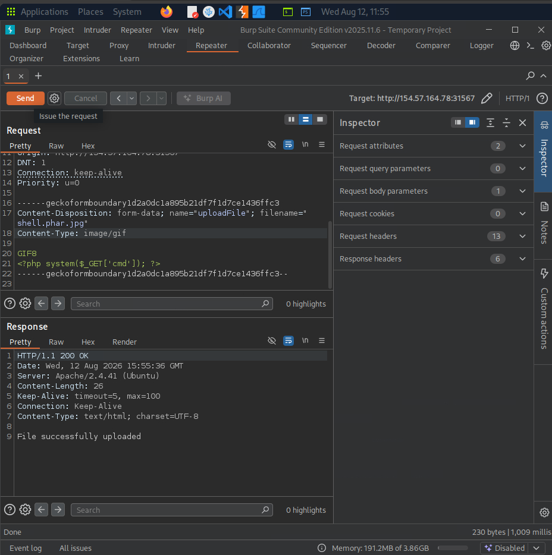

*Figure 9 - The same payload resent with `Content-Type: image/gif`, which uploads but still does not execute.*

However this was also not a success, perhaps the whitelisting has changed, so we attempted a reverse double extension. We changed it from `shell.phar.jpg` to `shell.jpg.phar`.

---

## Reverse Double Extension and RCE

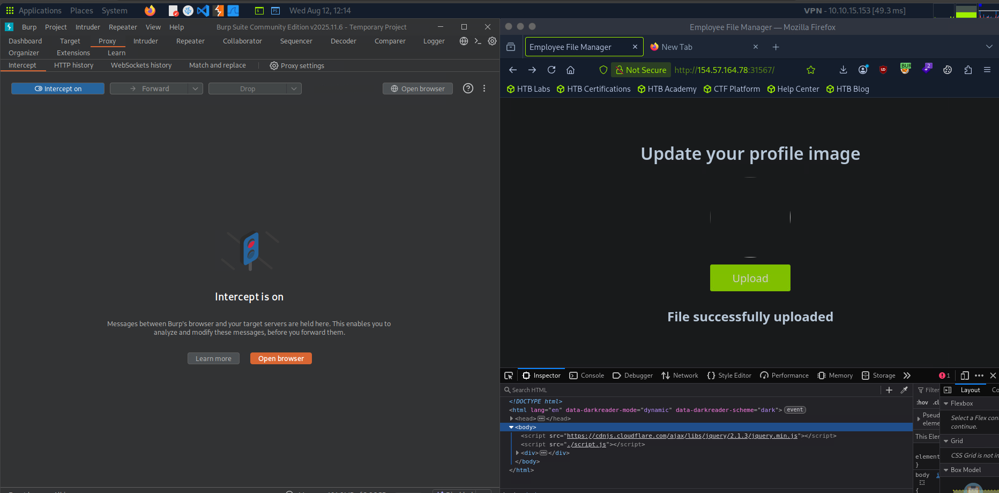

*Figure 10 - Uploading `shell.jpg.phar` returns "File successfully uploaded".*

This time it seemed to work. This is because the web server is not checking whether it ends in `.jpg` but whether it contains `jpg` at all.

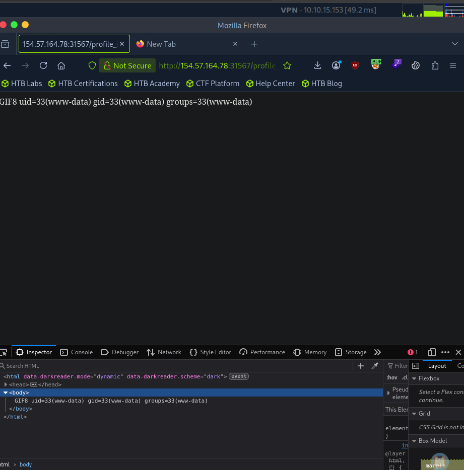

*Figure 11 - Requesting the shell with `?cmd=id` returns `uid=33(www-data) gid=33(www-data) groups=33(www-data)`, confirming RCE.*

Our final flag is situated at `@/profile_images/shell4.jpg.phar?cmd=cat+../../../../flag.txt`.

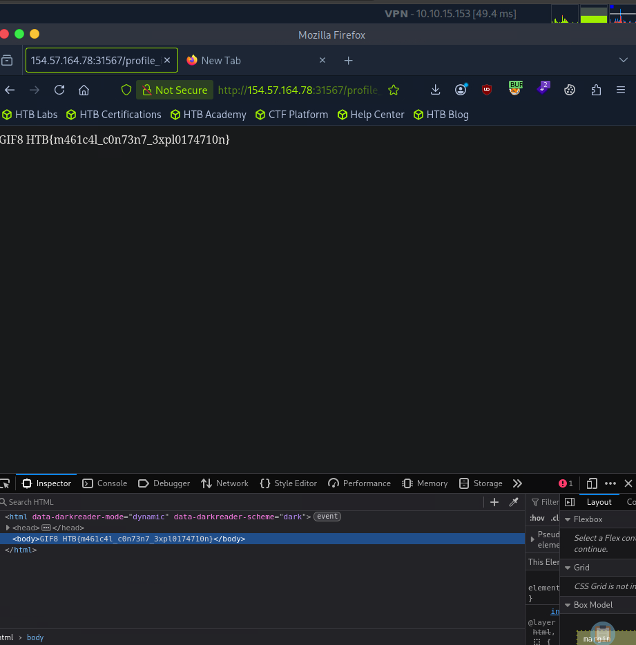

*Figure 12 - Reading the flag via command injection.*

> Read the flag from the target.

**Answer:** `HTB{m461c4l_c0n73n7_3xpl0174710n}`
