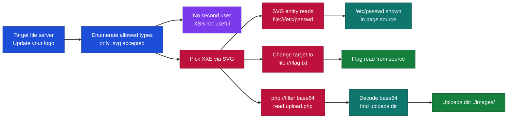
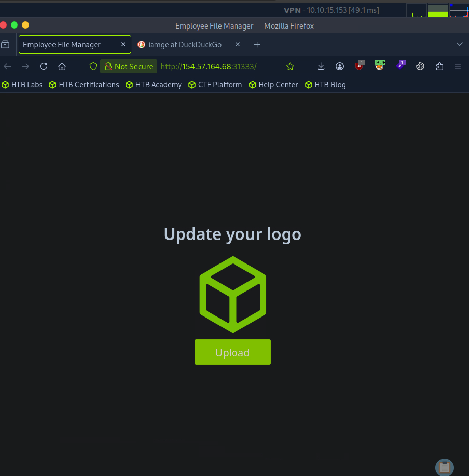
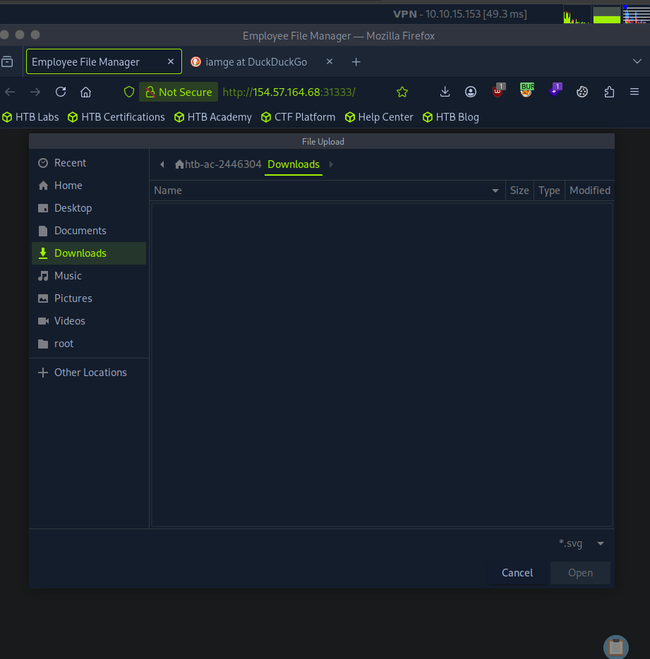
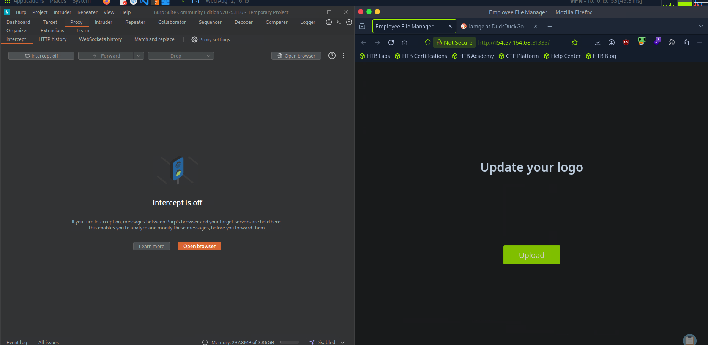
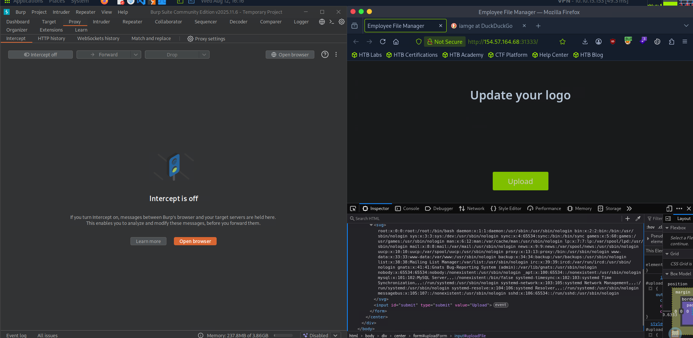
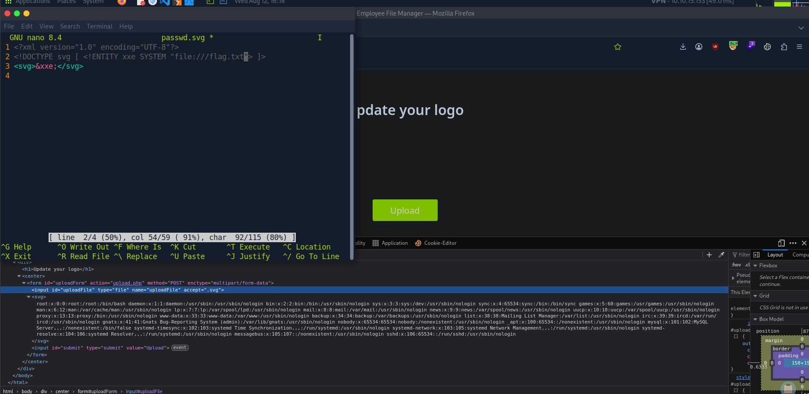
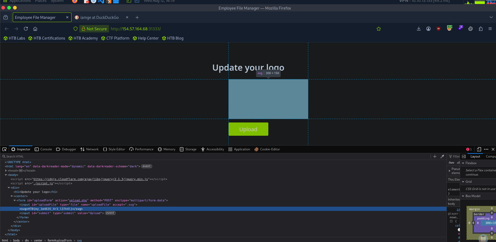
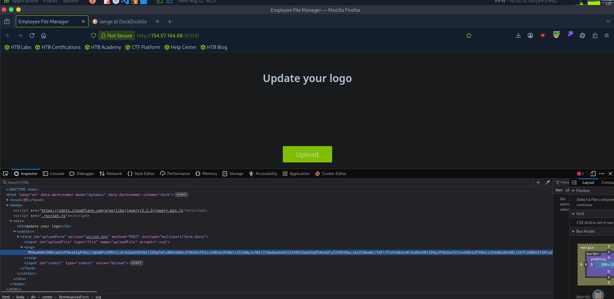
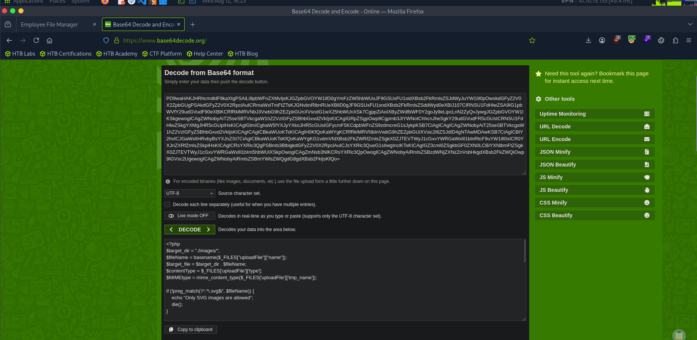
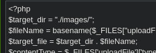

# Hack The Box - XXE via SVG Upload Against a Secure File Server | Write-up

> **Platform:** Hack The Box &nbsp;•&nbsp; **Category:** Web / File Upload Attacks (XXE) &nbsp;•&nbsp; **Difficulty:** Easy
>
> **Target:** `154.57.164.68:31333` &nbsp;•&nbsp; **Time taken:** 20 mins
>
> **Author:** Jithin Jelson

---

## Introduction

We have been told in this exercise that the upload form is secure against arbitrary file uploads, so we cannot sneak in a shell like before. Before choosing an attack we do not yet know which file types are allowed, so we will start by fuzzing and enumerating the accepted extensions. Once we know what gets through, we can pick our attack. Depending on what is allowed we could try XSS through an HTML file, poisoned image metadata like the Comment or Artist field, or an SVG containing a script, or XXE through an SVG or an XML based document like PDF, Word, or PowerPoint.

---

## Assessment Overview



---

## What I Learned

- How to enumerate the allowed file types on a locked down upload form before committing to an attack.
- Why XXE is the right choice here, since there is no second user to receive a stored XSS payload.
- Building an SVG with an external entity to make the server read a local file and print it back.
- Reading a system file like `/etc/passwd` first as a quick proof that the XXE works.
- Switching the same payload to a `php://filter` base64 wrapper so the server hands over PHP source instead of executing it.
- That decoding the source of `upload.php` reveals the uploads directory, which is useful for further exploitation.

---

## Enumerating the Upload Form

First we can boot up our target IP address and Burp Suite.



*Figure 1 - The target's "Update your logo" upload page.*

Straight off the bat when we tried to upload a logo we can see that `.svg` is the format that is supported. Since we do not have another user to attempt a XSS attack, most likely we will be conducting an XXE attack.



*Figure 2 - The file picker only accepts `*.svg`, confirming SVG is the allowed format.*

---

## Reading /etc/passwd with an XXE SVG

Let's create an XXE script so we can read `/etc/passwd` of the system.

```xml
<?xml version="1.0" encoding="UTF-8"?>
<!DOCTYPE svg [ <!ENTITY xxe SYSTEM "file:///etc/passwd"> ]>
<svg>&xxe;</svg>
```



*Figure 3 - Uploading the SVG through the form with Burp Suite running.*

We can see that our script has successfully uploaded.



*Figure 4 - The contents of `/etc/passwd` appear inside the SVG in the page source.*

We can also see that within the source code we are able to view `/etc/passwd`.

---

## Reading the Flag

Now we can attempt to read the flag. I'm going to presume it's in the same directory for simplicity's sake, if not we will have to do some other work. We will modify our script slightly.

```xml
<?xml version="1.0" encoding="UTF-8"?>
<!DOCTYPE svg [ <!ENTITY xxe SYSTEM "file:///flag.txt"> ]>
<svg>&xxe;</svg>
```



*Figure 5 - Changing the external entity to read `file:///flag.txt`.*

And it looks like this was a success.



*Figure 6 - The blue highlighted line shows us our flag.*

> Exploit the upload functionality to read `/flag.txt`.

**Answer:** `HTB{my_1m4635_4r3_l37h4l}`

---

## Reading upload.php with a Base64 Filter

The next question asks us to try to read the source code of `upload.php` to identify the uploads directory, and use its name as the answer (write it exactly as found in the source, without quotes). So we can upload another XXE script that will get us `upload.php` in Base64.

```xml
<?xml version="1.0" encoding="UTF-8"?>
<!DOCTYPE svg [ <!ENTITY xxe SYSTEM "php://filter/convert.base64-encode/resource=upload.php"> ]>
<svg>&xxe;</svg>
```



*Figure 7 - After uploading this it seems we were able to get `upload.php` in Base64.*

Now that we are able to get this in Base64 we can use a simple website to decode this for us.



*Figure 8 - Decoding the Base64 gives us the `upload.php` source, and we have our upload script.*

Why did we have to use Base64? Why could we not just read it like we did before? `/etc/passwd` is data, so the server reads it and gives it to you. `upload.php` is code, so the server tries to run it instead of showing it. Base64 disguises the code as gibberish so the server can't run it, which forces it to just hand the file over, and then you unscramble it to read the real thing.



*Figure 9 - The decoded source sets `$target_dir = "./images/";`.*

> Read the source of `upload.php` to identify the uploads directory.

**Answer:** `./images/`
