# Hack The Box - Automated LFI Scanning | Write-up

> **Platform:** Hack The Box &nbsp;•&nbsp; **Category:** Web / File Inclusion &nbsp;•&nbsp; **Difficulty:** Easy
>
> **Target:** `154.57.164.82:30427` &nbsp;•&nbsp; **Time taken:** 20 mins (10 mins for the exercise, 10 mins for extra exploration)
>
> **Author:** Jithin Jelson

---

## Introduction

In this box we have been told that our flag is hidden underneath an LFI vulnerability, but we haven't been given much information, so we must use our skills to enumerate as much as possible and find our relevant flag.

---

## Assessment Overview

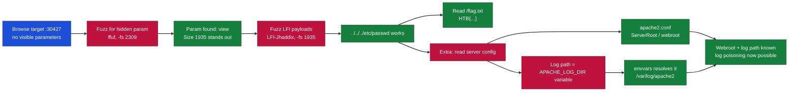

---

## What I Learned

- How to fuzz for exposed GET parameters with ffuf when the page gives you nothing to work with.
- Using `-fs` to filter out the common response size so the one anomalous parameter stands out.
- Feeding an LFI payload wordlist at the discovered parameter to quickly find a traversal that works.
- Confirming a fuzzed hit manually rather than trusting the scanner, since size changes can be false positives.
- Reading `apache2.conf` to recover the webroot and the log path, and following `APACHE_LOG_DIR` into `envvars` to resolve it.

---

## Enumerating a Hidden Parameter

We can start by navigating to our webpage on the target IP address.

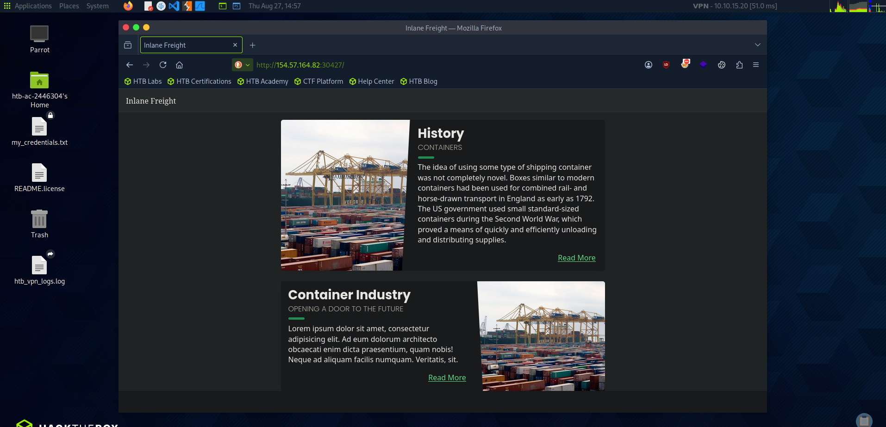

*Figure 1 - This time there is no dropdown or obvious parameter to modify, so we must find one ourselves.*

Since we have no parameter to work with, we enumerate one using ffuf.

```
ffuf -w wordlist.txt -u 'http://154.57.164.82:30427/index.php?FUZZ=value'
```

The wordlist we are using is the [top 25 LFI parameters from HackTricks](https://hacktricks.wiki/en/pentesting-web/file-inclusion/index.html#top-25-parameters).

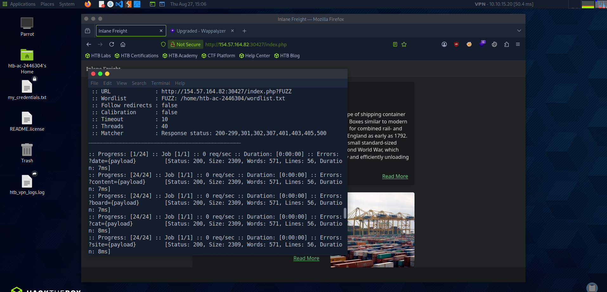

*Figure 2 - Most payloads return a size of 2309, which is the default homepage.*

We can see most of the payloads give a size of 2309, so we filter that out with `-fs 2309`.

```
ffuf -w wordlist.txt -u 'http://154.57.164.82:30427/index.php?FUZZ=value' -fs 2309
```

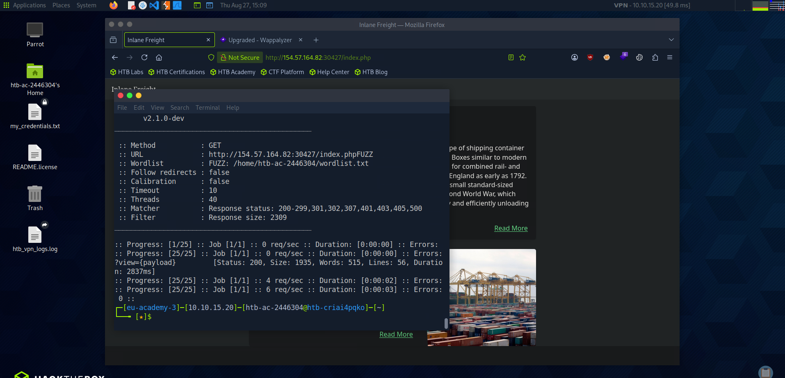

*Figure 3 - With 2309 filtered out, only `view` remains (Size 1935), so that is our parameter.*

We put this parameter into the URL to check it.

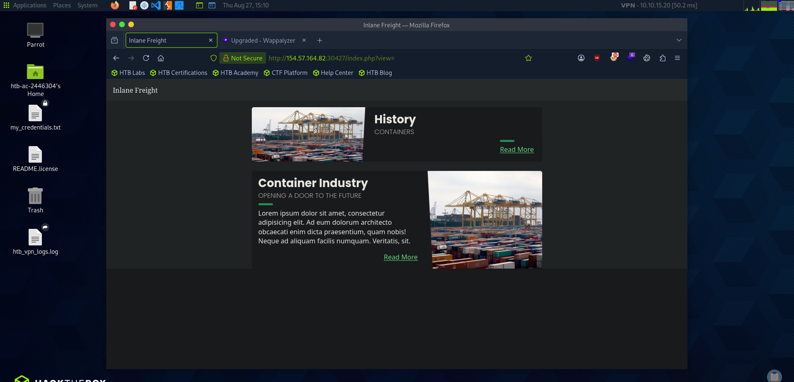

*Figure 4 - `?view=` gives us a different page from the rest, which all returned the same homepage.*

---

## Finding a Working LFI Payload

Now we have the parameter, we can find a payload that works and gives us important information. The payload wordlist we will use is [LFI-Jhaddix.txt](https://raw.githubusercontent.com/danielmiessler/SecLists/refs/heads/master/Fuzzing/LFI/LFI-Jhaddix.txt).

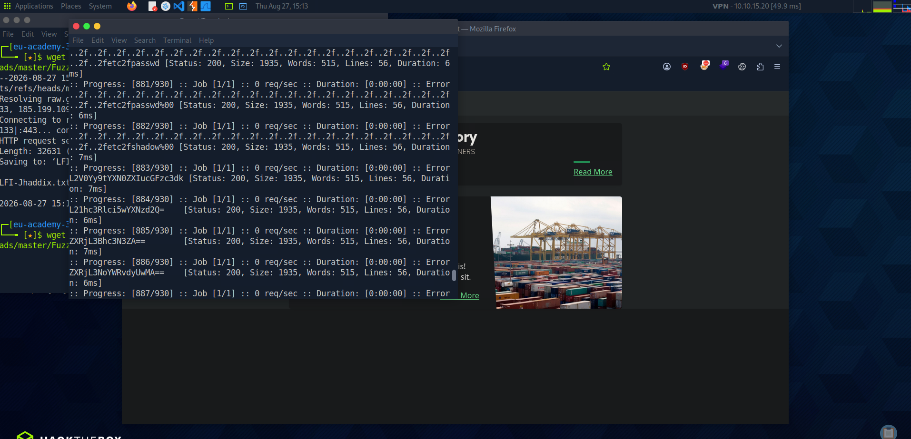

*Figure 5 - Fuzzing the payload list. We can see 1935 is the common error size, so we filter that out too.*

```
ffuf -w LFI-Jhaddix.txt -u 'http://154.57.164.82:30427/index.php?view=FUZZ' -fs 1935
```

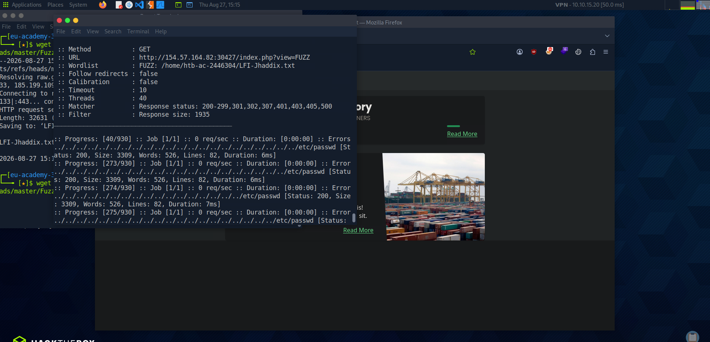

*Figure 6 - With 1935 filtered, the working traversal payloads surface (Size 3309).*

Now we can manually test each to see which is the working payload.

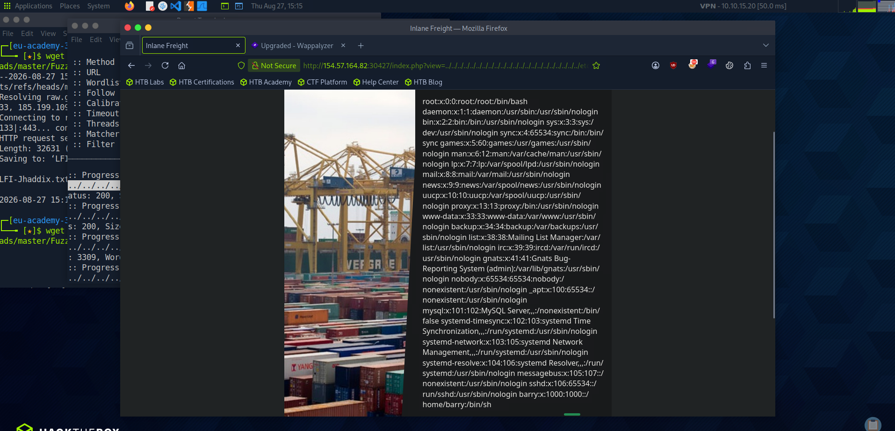

*Figure 7 - The first one is a success, reading `/etc/passwd`.*

---

## Capturing the Flag

Now if we replace it with `flag.txt`, we get the following.

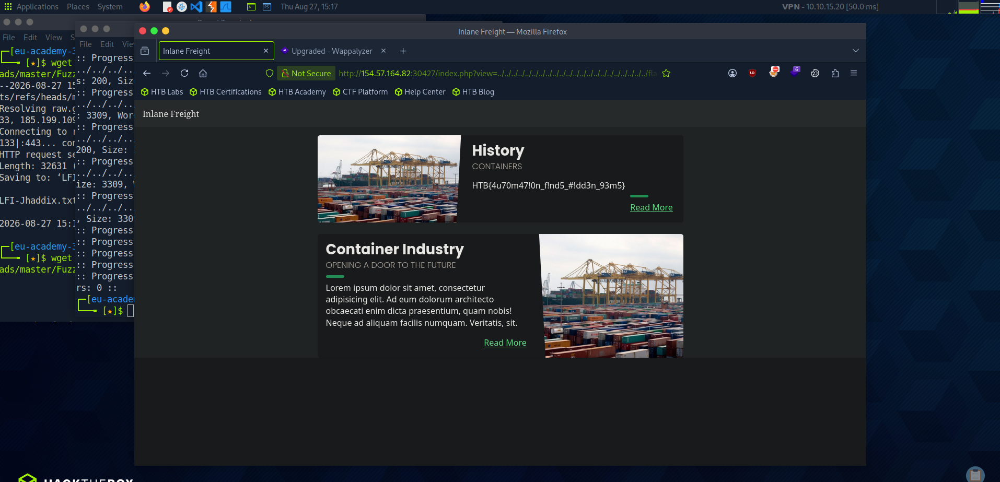

*Figure 8 - Reading `/flag.txt` returns the flag.*

> **Objective: fuzz for the exposed parameter, then exploit it with an LFI wordlist to read /flag.txt.**

**Answer:** `HTB{4u70m47!0n_f!nd5_#!dd3n_93m5}`

---

## Extra Exploration - Reading Server Config and Log Paths

Although we are finished with the exercise, we will now also attempt to see if we can read the server config files and the log files. We replace `flag.txt` with `/etc/apache2/apache2.conf`.

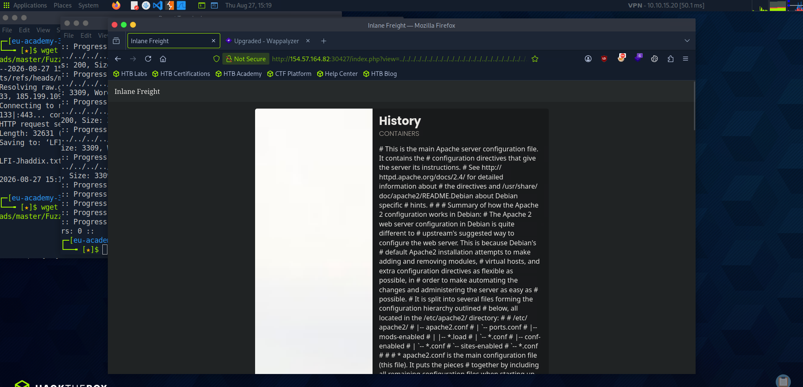

*Figure 9 - We can actually read the Apache configuration file.*

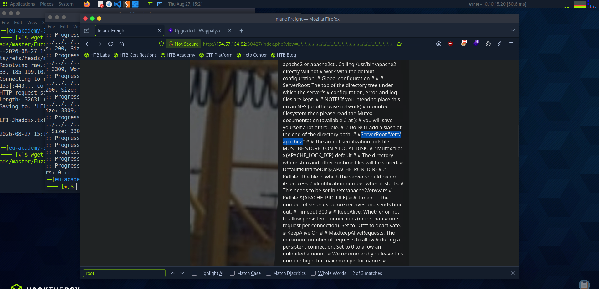

*Figure 10 - We can see the server root.*

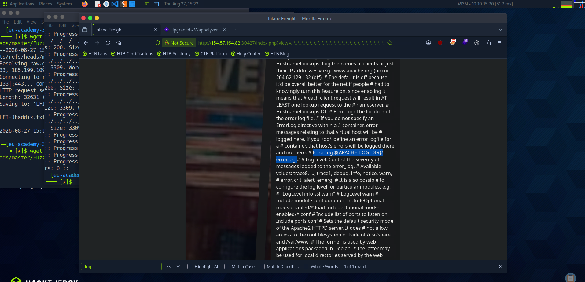

*Figure 11 - We can also see where the log files are kept, but the directory is not disclosed directly here. It is defined by the `APACHE_LOG_DIR` variable, which is most likely set in `/etc/apache2/envvars`, so we check that.*

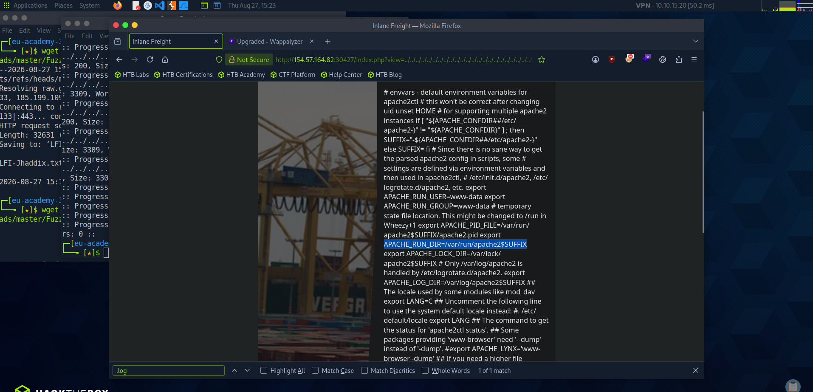

*Figure 12 - We find them: `APACHE_LOG_DIR=/var/log/apache2`.*

These two files are very important if we want to achieve remote code execution through log poisoning.
