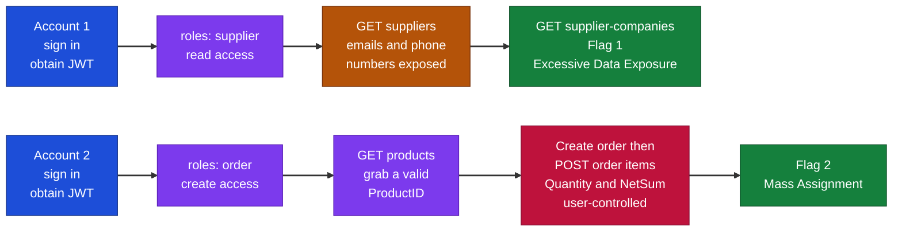
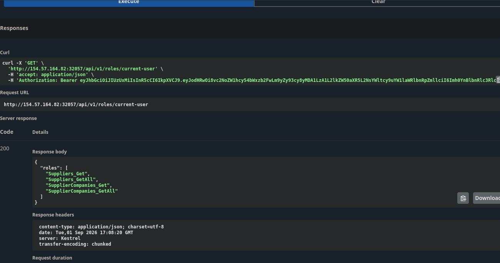
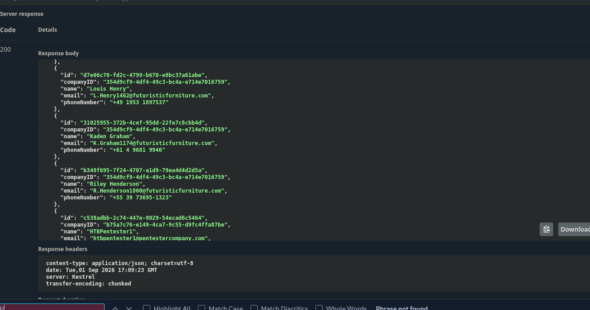
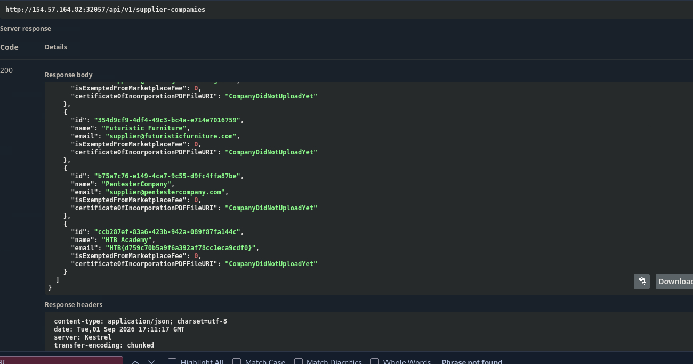
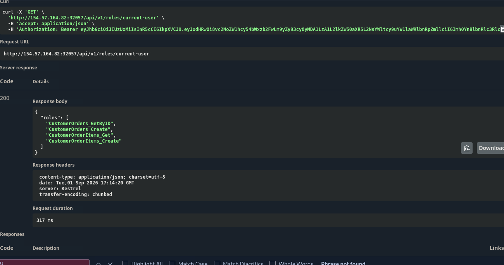
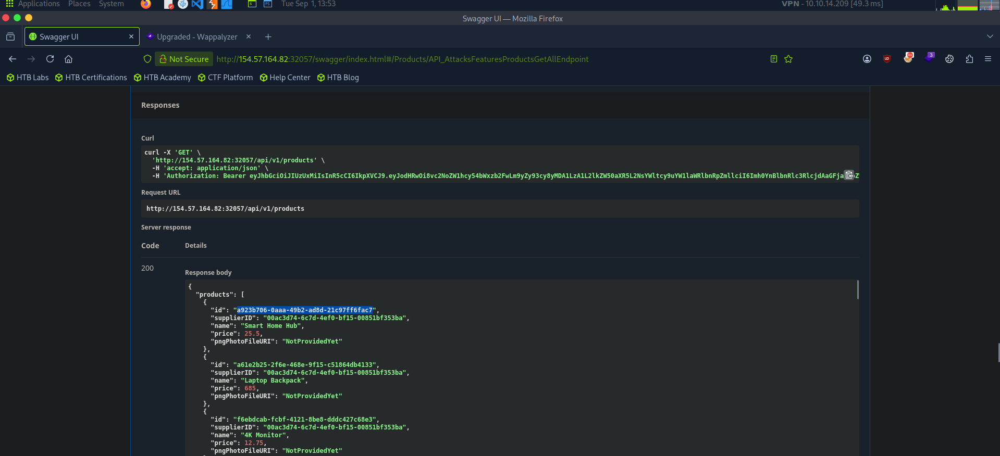
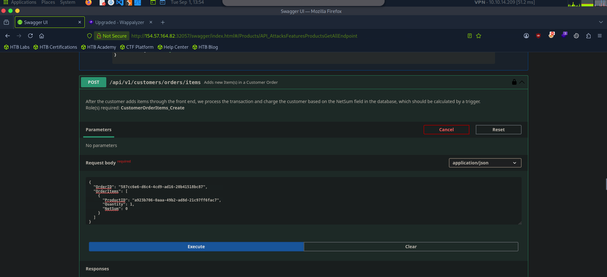
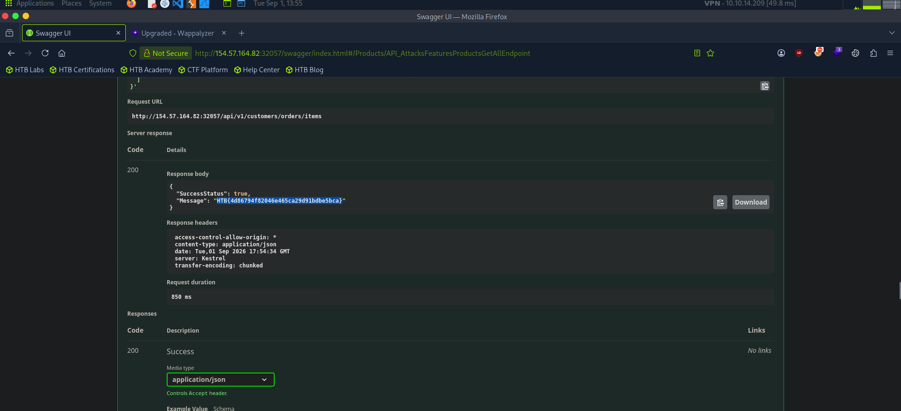

# Hack The Box Academy - Broken Object Property Level Authorization | Write-up

> **Platform:** Hack The Box Academy &nbsp;•&nbsp; **Category:** API / Web &nbsp;•&nbsp; **Difficulty:** Easy
>
> **Target:** `154.57.164.82:32057` &nbsp;•&nbsp; **Time taken:** 20 mins
>
> **Author:** Jithin Jelson

---

## Introduction

In this exercise we are told that there is Broken Object Property Level Authorization. Since this is a category of vulnerabilities, it encompasses two subclasses, Excessive Data Exposure and Mass Assignment. Therefore in this exercise we have to find a flag for each of the vulnerabilities.

Credentials given: `htbpentester5@hackthebox.com:HTBPentester5` (and a second account for the Mass Assignment stage `htbpentester7@hackthebox.com:HTBPentester7`).

---

## Assessment Overview

---

## What I Learned

- How Broken Object Property Level Authorization splits into two distinct flaws, Excessive Data Exposure and Mass Assignment.
- Reading a user's roles first to decide which endpoints are worth visiting one by one.
- Spotting Excessive Data Exposure when a bulk endpoint returns fields like email and phone number that the caller should never see.
- Recognising that sensitive data, and even a flag, can be hidden inside an ordinary-looking field of a bulk response.
- Abusing Mass Assignment by supplying user-controlled fields such as Quantity and NetSum that the server binds without validation.
- Chaining a valid ProductID from an unrestricted products endpoint into an order-item creation request to trigger the flaw.

---

# Part 1 — Excessive Data Exposure

## Enumerating Our Access

We can start by trying to find our Excessive Data Exposure vulnerability. We head to our target IP with `/swagger/index.html` and authorise ourselves with our JWT token.

Now when we head down to roles we can see what is available to us.

*Figure 1 - Our roles: Suppliers_Get, Suppliers_GetAll, SupplierCompanies_Get, and SupplierCompanies_GetAll*

## Finding the Exposed Data

So we can visit these one by one to find our flag. We can see our vulnerability here, as we are able to view the email and phone number of all the suppliers.

*Figure 2 - The suppliers endpoint leaks every supplier's email and phone number*

And we found our flag in the supplier companies endpoint `/api/v1/supplier-companies`.

*Figure 3 - The "HTB Academy" supplier company's email field contains the flag*

> **What is the Excessive Data Exposure flag?**

**Answer:** `HTB{d759c70b5a9f6a392af78cc1eca9cdf0}`

---

# Part 2 — Mass Assignment

## Logging In With the Second Account

Now for our second vulnerability we have to log in with the second set of credentials provided to us. This time we have the following roles that we are allowed to access.

*Figure 4 - Our roles: CustomerOrders_GetByID, CustomerOrders_Create, CustomerOrderItems_Get, and CustomerOrderItems_Create*

## Building the Malicious Order

We will start by creating a new customer order, and also grab our own product in all products.

*Figure 5 - The unrestricted products endpoint gives us a valid ProductID*

Now we can put these two together to create a new order item, supplying the OrderID and ProductID along with a Quantity and NetSum of our choosing.

*Figure 6 - Posting an order item with a NetSum we control*

And when we execute we get our flag.

*Figure 7 - The response returns SuccessStatus true and the flag in the Message field*

> **What is the Mass Assignment flag?**

**Answer:** `HTB{4d86794f82046e465ca29d91bdbe5bca}`

## Why It Works

Here's the problem. The API lets us control:

- OrderID
- ProductID
- Quantity
- NetSum

No validation. No restrictions. That's Mass Assignment.
