# Hack The Box - Blocky | Write-up

> **Platform:** Hack The Box &nbsp;•&nbsp; **Category:** Linux / Web &nbsp;•&nbsp; **Difficulty:** Easy
>
> **Target:** `10.129.53.129` &nbsp;•&nbsp; **Time taken:** 45 mins
>
> **Author:** Jithin Jelson

---

## Introduction

The box we will be trying to exploit today is called Blocky and it is an easy difficulty Linux machine.

---

## Assessment Overview

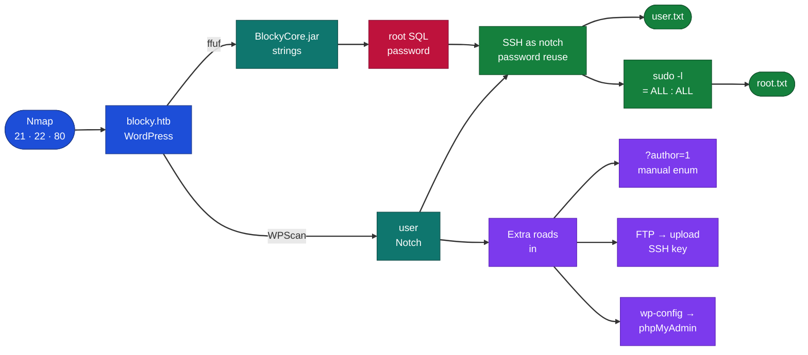
```mermaid
flowchart LR
    N(["Nmap<br/>21 · 22 · 80"]):::entry --> W["blocky.htb<br/>WordPress"]:::entry

    W -->|ffuf| J["BlockyCore.jar<br/>strings"]:::ioc
    J --> C["root SQL<br/>password"]:::payload

    W -->|WPScan| U["user<br/>Notch"]:::ioc

    C --> S["SSH as notch<br/>password reuse"]:::user
    U --> S

    S --> UF(["user.txt"]):::user
    S --> SU["sudo -l<br/>= ALL : ALL"]:::user
    SU --> RF(["root.txt"]):::user

    U --> X["Extra roads<br/>in"]:::intel
    X --> A1["?author=1<br/>manual enum"]:::intel
    X --> A2["FTP → upload<br/>SSH key"]:::intel
    X --> A3["wp-config →<br/>phpMyAdmin"]:::intel

    classDef entry fill:#1d4ed8,stroke:#1e3a8a,color:#ffffff;
    classDef ioc fill:#0f766e,stroke:#134e4a,color:#ffffff;
    classDef intel fill:#7c3aed,stroke:#5b21b6,color:#ffffff;
    classDef payload fill:#be123c,stroke:#881337,color:#ffffff;
    classDef user fill:#15803d,stroke:#14532d,color:#ffffff;

    linkStyle default stroke-width:2px
```

---

## What I Learned

- How to use WPScan to enumerate a WordPress site.
- Manual user enumeration of WordPress with the ?author parameter, doing by hand what WPScan does for us.
- Reusing credentials leaked from a decompiled plugin to land an SSH foothold.
- Escalating to root through an overly permissive sudo rule.
- Abusing FTP write access to drop an SSH key for a passwordless login.
- Reading wp-config.php for the database credentials and swapping a WordPress hash in phpMyAdmin.

---

## Nmap Scan

So we can start with an Nmap scan of our IP address.

```
nmap -sV -sC 10.129.53.129
```

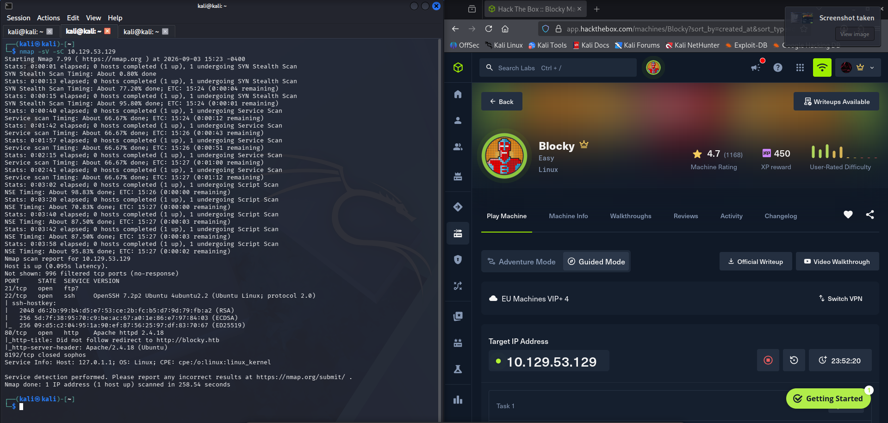

*Figure 1 - Nmap finds FTP (21), SSH (22) and HTTP (80) open, with the HTTP server redirecting to blocky.htb*

We can see that the HTTP port is open so we can visit the web address. Additionally we can see that it is being redirected to blocky.htb which is useful, so we can add this to our /etc/hosts.

And now we can see that our page is loaded.

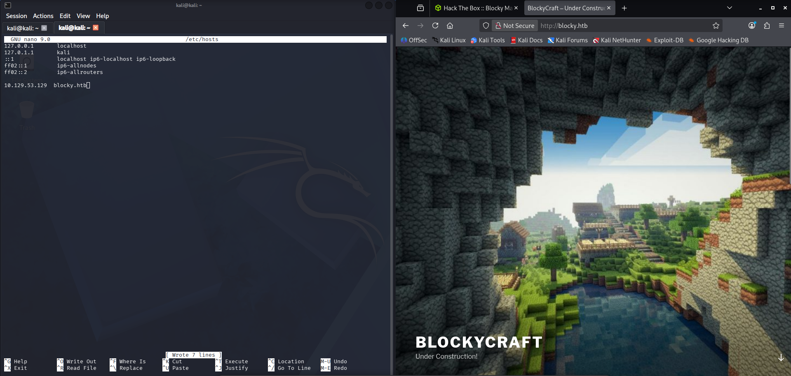

*Figure 2 - Adding blocky.htb to /etc/hosts and loading the BlockyCraft "Under Construction" page*

---

## Directory Enumeration

We can now enumerate our web host with the common.txt file using ffuf.

```
ffuf -w /usr/share/wordlists/dirb/common.txt -u http://blocky.htb/FUZZ
```

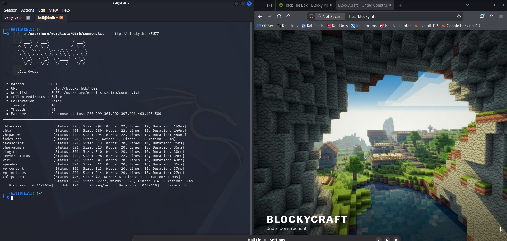

*Figure 3 - ffuf reveals phpmyadmin, plugins, wiki and the wp-* directories*

We can see that the web page is using WordPress, so we can find out useful information using WPScan, but first we will go into each directory to see if we can get anything useful.

When we went into the plugins directory we found two interesting files so we decided to download them both.

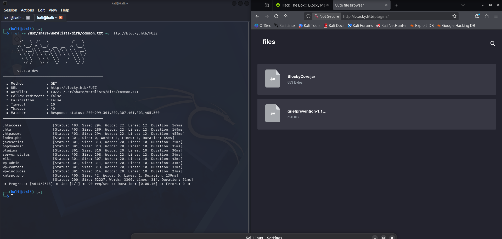

*Figure 4 - The plugins directory holds BlockyCore.jar and griefprevention-1.1.jar*

---

## Reading the Plugin Files

We will unzip the files using unzip, and the class file can be read using strings.

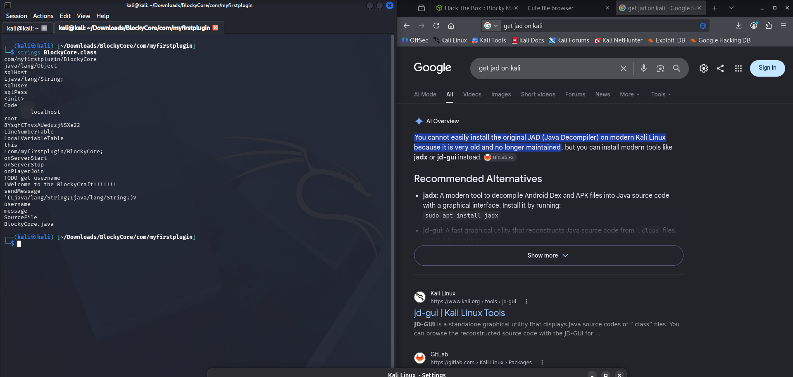

*Figure 5 - Running strings on BlockyCore.class exposes the sqlHost, sqlUser and sqlPass values, including a root password*

It seems we have a password for root, so we attempted to SSH using this but we didn't get a success. We can look at our other folder now too but before we do we can run our WPScan as that will take some time.

```
wpscan --url http://blocky.htb --enumerate u,ap,tt,t
```

While the scan is running we can decompile the other files and see if we find anything useful. After decompiling all the files and viewing them using strings, none of them seems to be interesting, so we went back to our WPScan and we found the version of Apache, maybe we can check this for an exploit?, but additionally we found a user called Notch.

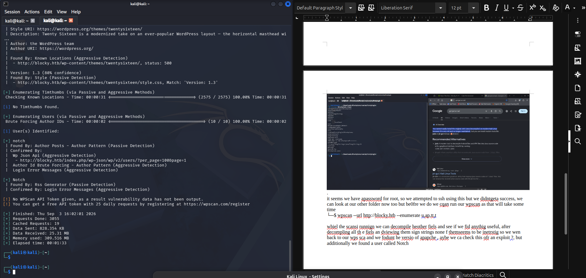

*Figure 6 - WPScan enumerates the twentysixteen theme and identifies the user Notch*

---

## Foothold via SSH

Perhaps we tried the wrong user for the password to SSH, so we tried with this user.

And it seems this time we were able to get access.

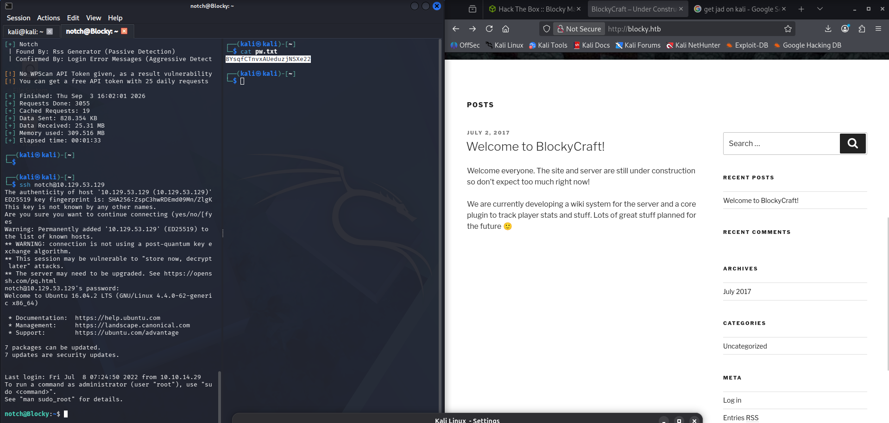

*Figure 7 - Reusing the password from BlockyCore.class to SSH in as notch*

Interesting, so we can now view our flag.

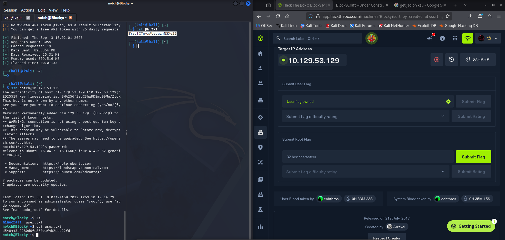

> Submit the user flag.

**Answer:** `d540443c2280d0fc860eaf4b2cbc22fd`

*Figure 8 - The user flag in notch's home directory*

---

## Privilege Escalation

Now for privilege escalation.

First we can get linpeas onto our system.

First we can start a Python server with our linpeas in our own home terminal, then we can use wget -r to get all the content of that on our remote shell.

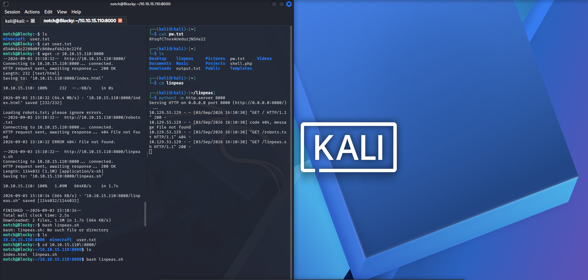

*Figure 9 - Serving linpeas.sh with python3 -m http.server on Kali and pulling it down with wget -r*

Upon investigation it seems notch can run as anything, so we confirmed using sudo -l and it seems we were right.

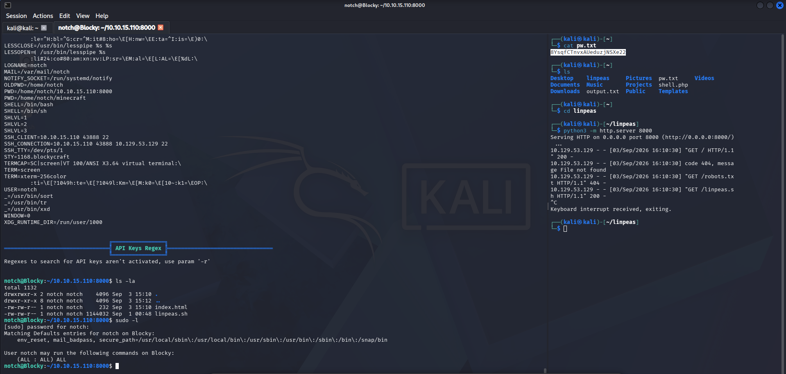

*Figure 10 - sudo -l confirms notch may run (ALL : ALL) ALL*

So we can do sudo su and become root.

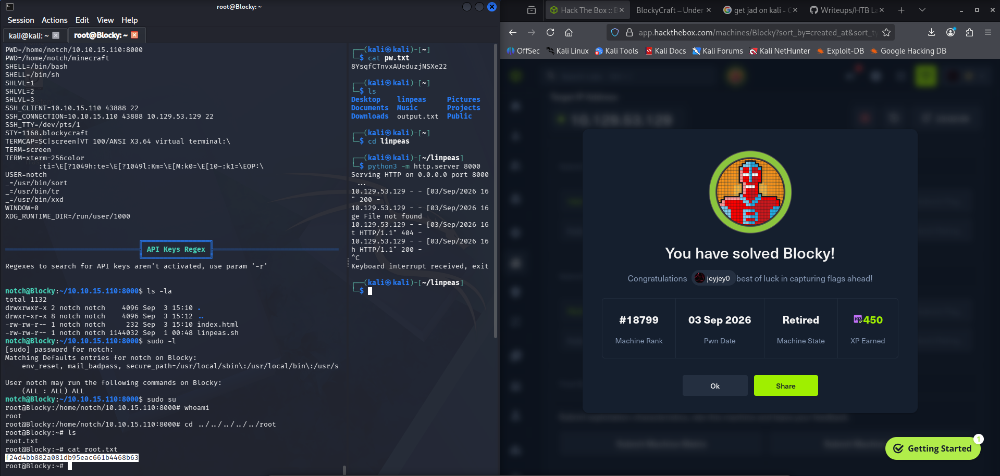

> Submit the root flag.

**Answer:** `f24d4bb882a081db95eac661b4468b63`

*Figure 11 - sudo su gives a root shell and the root flag*

Seems that was a very easy enough box to root, so we headed over to the IppSec YouTube channel to see if there was anything else that we can take from this.

---

## Extra: Manual WordPress User Enumeration

When I went to IppSec I found a way to enumerate the users manually, basically it was what WordPress was doing but we can do it quicker if we wanted the users.

If we change the address bar to make author a parameter and use ?author=1, we can see our authors.

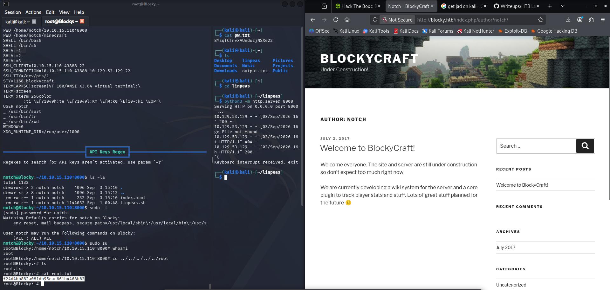

*Figure 12 - Author ID 1 resolves to notch*

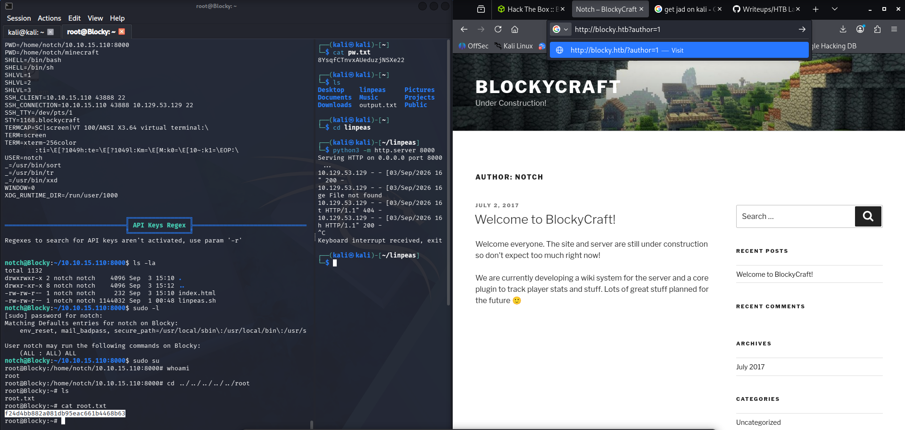

*Figure 13 - Hitting http://blocky.htb?author=1 directly returns the same author*

And when we tried author=2 we get no authors, which goes to show it was only notch.

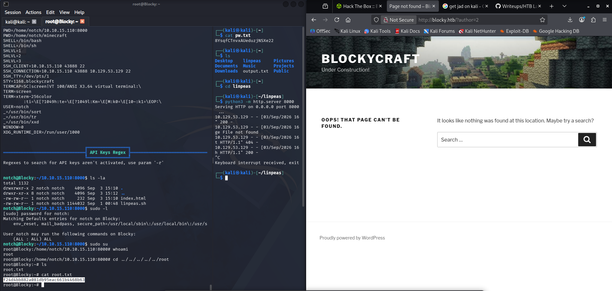

*Figure 14 - ?author=2 returns "page can't be found", confirming notch is the only author*

---

## Extra: FTP and SSH Key Access

We can also exploit the FTP server by using the password. We can create an RSA key by creating a directory called .ssh, going into it and putting our RSA key in there.

Then we will generate our RSA key in our root .ssh.

```
ssh-keygen -t ed25519 -C "jj"
```

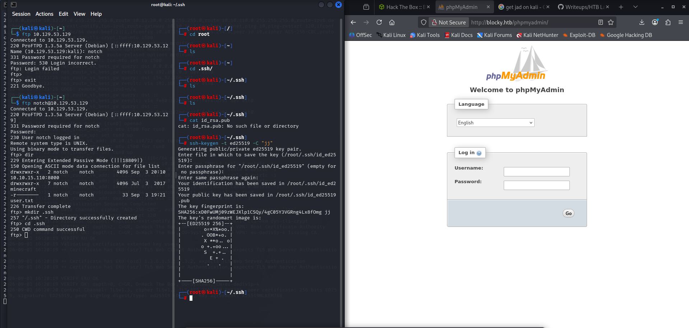

*Figure 15 - Logging in over FTP as notch, creating a .ssh directory, and generating an ed25519 key pair*

Then we can copy paste it into our FTP.

```
cp /root/.ssh/id_ed25519.pub /tmp/authorized_keys
```

It made a copy of our public key and put it in /tmp/, renamed to authorized_keys.

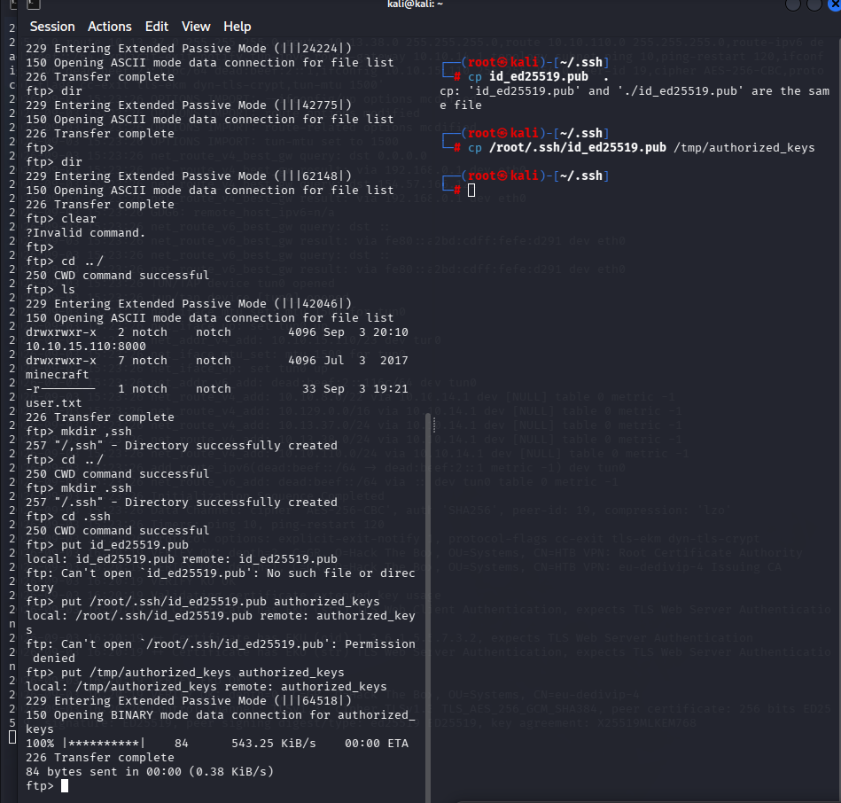

*Figure 16 - Copying the public key to /tmp/authorized_keys and uploading it into notch's .ssh folder over FTP*

Then we can log in with no problems, by SSH to notch with no password.

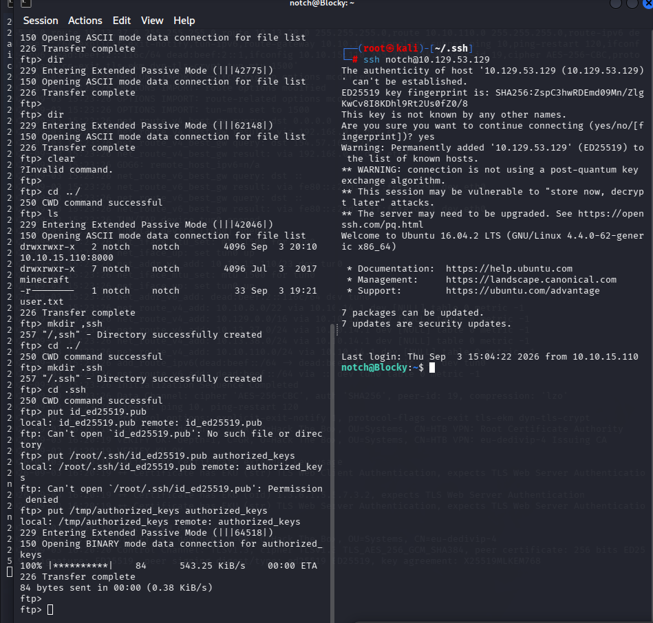

*Figure 17 - SSH as notch now works with the key and no password*

---

## Extra: Config Disclosure and phpMyAdmin

In it we can view a config file in /var/www/html, and inside of wp-config.php we get the following.

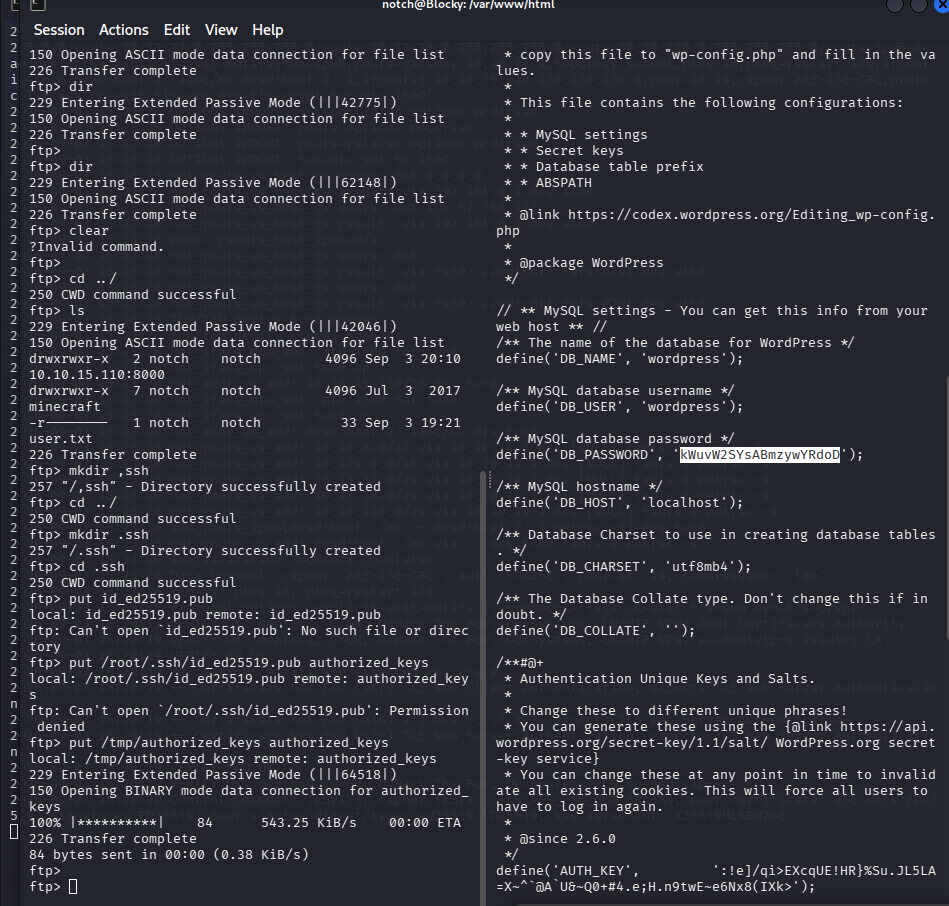

*Figure 18 - wp-config.php discloses the WordPress database name, user and password*

Which we can login to phpMyAdmin with the credentials. In users for WordPress we have a hashed password and a user, and we can edit the password it seems, so we can do that.

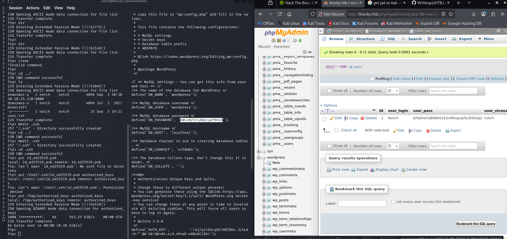

*Figure 19 - Browsing the wp_users table in phpMyAdmin, showing the Notch user and its password hash*

Then we can replace our hash and log in, and then we can craft a reverse shell in the header of a PHP file.

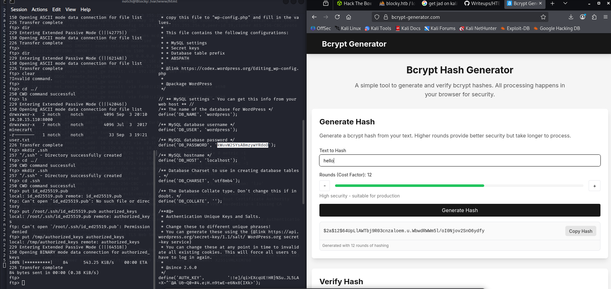

*Figure 20 - Generating a fresh bcrypt hash to drop into the wp_users table so we can log in to WordPress*
