# Hack The Box - Mirai | Write-up

> **Platform:** Hack The Box &nbsp;•&nbsp; **Category:** Linux Machine &nbsp;•&nbsp; **Difficulty:** Easy
>
> **Target:** `10.129.54.34` &nbsp;•&nbsp; **Time taken:** 40 mins
>
> **Author:** Jithin Jelson

---

## Introduction

The box we are trying to exploit today is called Mirai and it is an easy level Linux box on Hack The Box.

---

## Assessment Overview

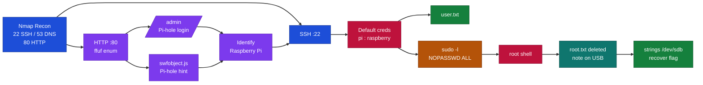

---

## What I Learned

- Recognising that a Pi-hole install pointed to a Raspberry Pi, which led me to try the well-known pi:raspberry default credentials over SSH.
- That a deleted file can still be recovered by running `strings` against the raw block device before its blocks get overwritten.
- Why default credentials remain such a common and dangerous foothold on real systems.

---

## Enumeration with Nmap

We can start by starting an Nmap scan of the target to see what we have available, we will scan with NSE with default scripts.

```
nmap -sV -sC 10.129.54.34
```

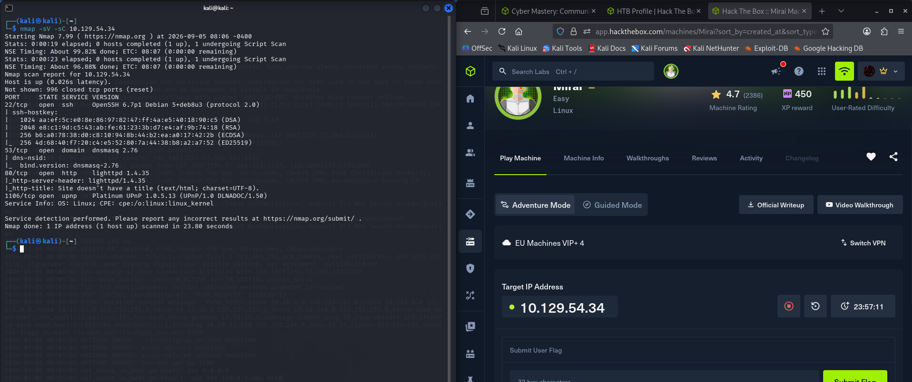

*Figure 1 - Nmap reveals SSH (22), DNS (53), HTTP (80) and a UPnP service running on the target.*

It seems we have a DNS TCP port open as well as an SSH port and a HTTP port, however it seems our website doesn't have a title or much information, so lets load it up to see what it is.

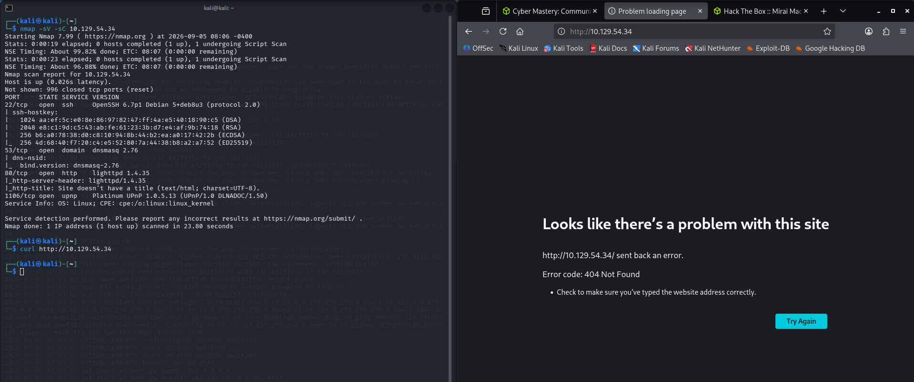

*Figure 2 - The web root returns a 404 Not Found error with no useful content.*

---

## Directory Enumeration

It seems like we are getting a 404 error, we can try and enumerate to see if we have anything useful that way, we will use ffuf and common.txt.

```
ffuf -w /usr/share/wordlists/dirb/common.txt -u http://10.129.54.34/FUZZ
```

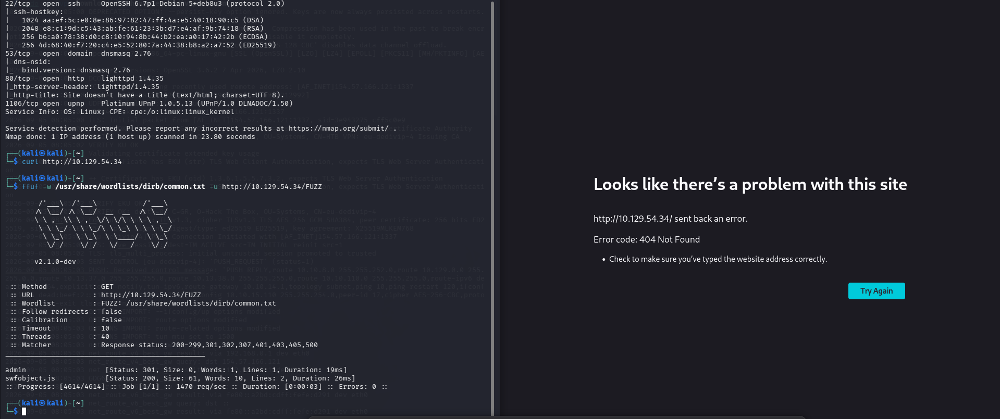

*Figure 3 - ffuf finds an `/admin` page and a `swfobject.js` file.*

We came up with an admin page and a JS function, so we can check them out.

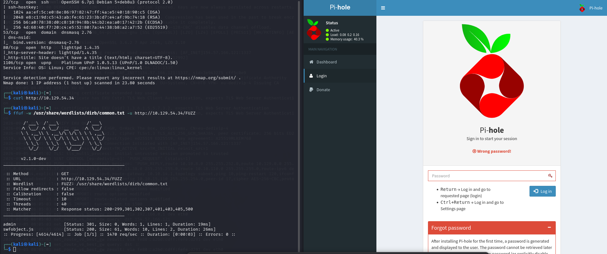

*Figure 4 - The `/admin` page is a Pi-hole login prompt that rejects our password attempts.*

Now when I search for the admin page it seems we have some result but it is asking for us a sign in, with a quick Google search we tried to use default credentials for Pi-hole but it seems the password isn't default and is allocated at random, so there is not much use of trying to get in this way, nonetheless we still tried passwords such as admin, password etc. It also seems our JS didn't give us much info as well, it just told us what Pi-hole is.

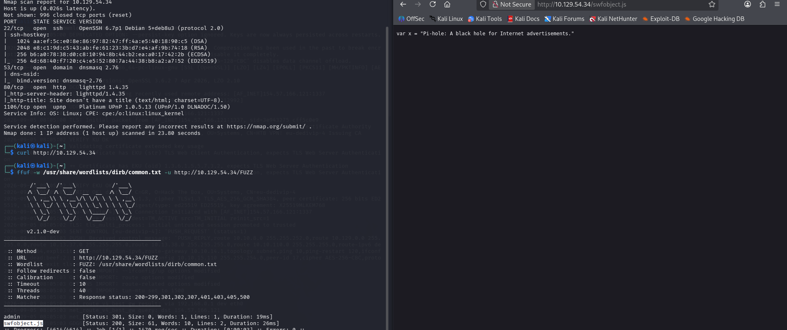

*Figure 5 - The `swfobject.js` file only tells us what Pi-hole is.*

---

## SSH Access with Default Credentials

But since we know that the device is using Pi-hole, perhaps the device is a Raspberry Pi? Can we try and SSH our way in this way? So we looked up some default credentials for it and it seems the pi@ip address and password is raspberry, so we tried SSH.

```
ssh pi@10.129.54.34
```

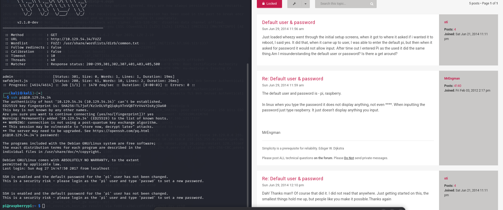

*Figure 6 - The pi:raspberry default credentials work and we land a shell as the pi user.*

And it seems we're able to get access, and we obtained our user.txt.

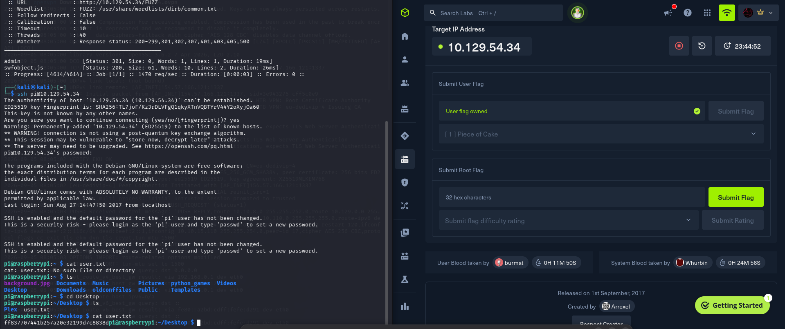

*Figure 7 - user.txt is found in the pi user's Desktop directory.*

> Submit the user flag.

**Answer:** `ff837707441b257a20e32199d7c8838d`

---

## Privilege Escalation to Root

Now we can see what privileges we have by running `sudo -l`.

```
sudo -l
```

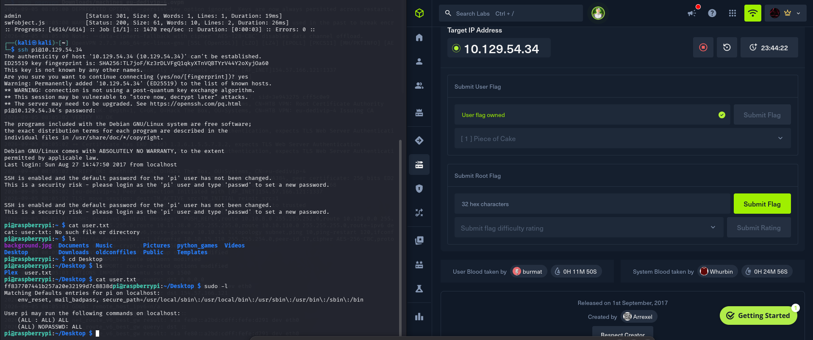

*Figure 8 - The pi user can run any command as root with NOPASSWD.*

Seems as if we also have root access too. However our root flag was not easy to get, as we got a message when we tried to obtain the flag, since the user says it is on the USB stick we can check it out.

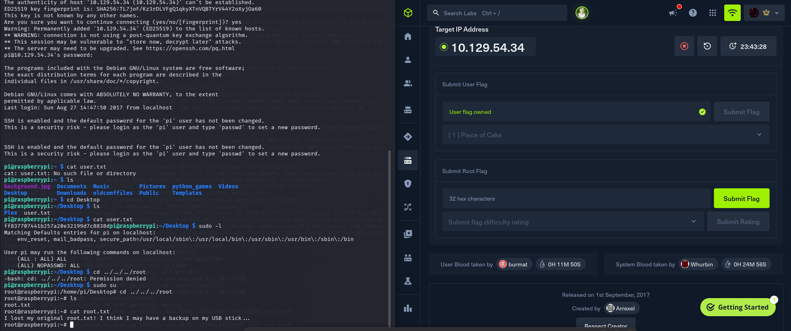

*Figure 9 - root.txt has been replaced with a note saying the original is backed up on a USB stick.*

---

## Recovering the Deleted Root Flag

It seems when we ran `lsblk` we were able to see a USB stick at sdb, so lets check it out. It seems our file is already mounted inside /media/usbstick so we can have a look. On it we found a note that said the file has been deleted, and we have to find a way to get it back.

```
lsblk
```

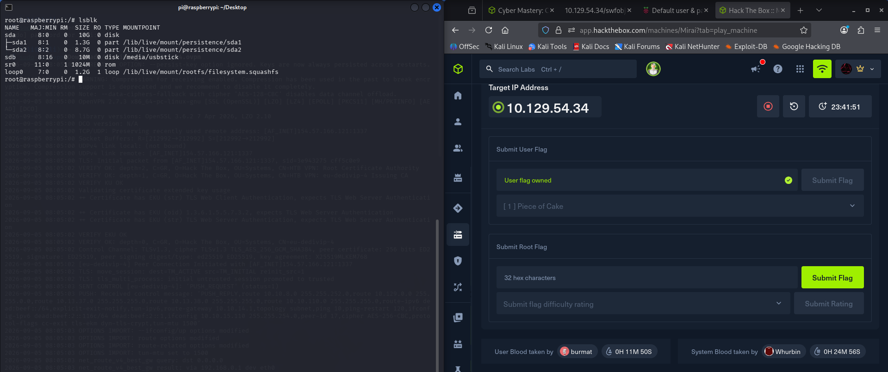

*Figure 10 - lsblk shows the USB stick as sdb, mounted at /media/usbstick.*

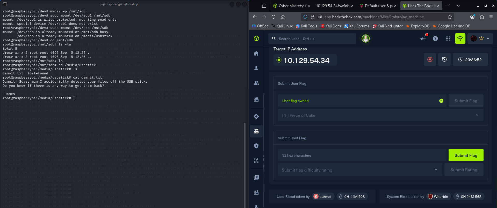

*Figure 11 - A note on the USB stick admits the flag file was accidentally deleted.*

There was nothing inside the lost and found directory either.

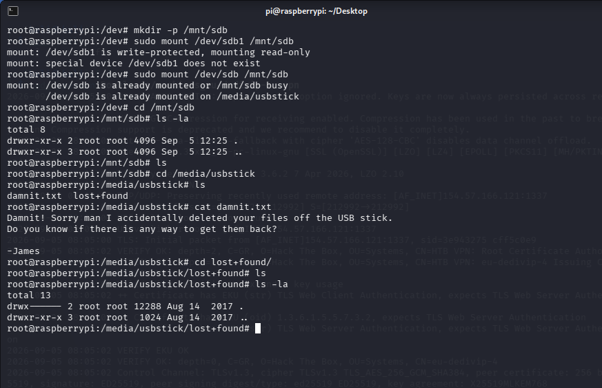

*Figure 12 - The lost+found directory is empty, so nothing was recovered there.*

So it seems we're gonna have to see if there is anything by using strings and then viewing /dev/sdb, since there is a good chance our file hasn't been replaced yet we should hopefully be able to see its content before something else replaces the deleted values.

```
strings /dev/sdb
```

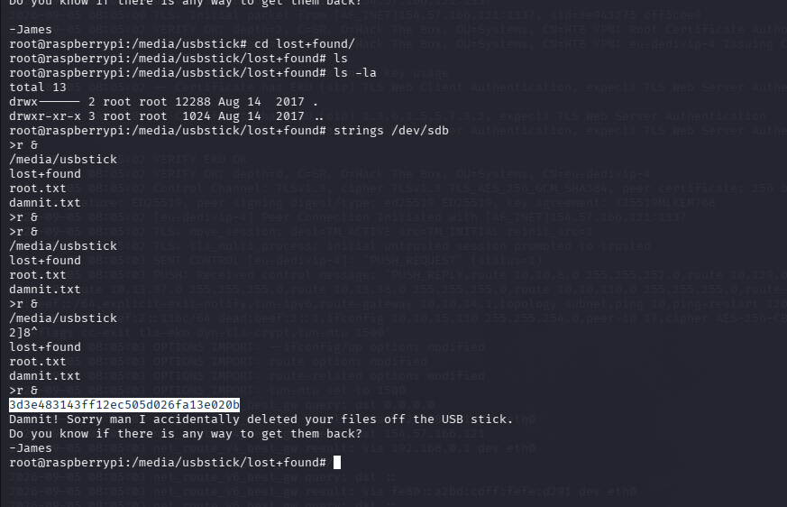

*Figure 13 - Running strings against the raw USB device leaks the deleted root flag.*

And just like that we got all the content.

> Submit the root flag.

**Answer:** `3d3e483143ff12ec505d026fa13e020b`
