# Hack The Box - Teacher | Write-up

> **Platform:** Hack The Box &nbsp;•&nbsp; **Category:** Web, Linux &nbsp;•&nbsp; **Difficulty:** Easy
>
> **Target:** `10.129.59.30` &nbsp;•&nbsp; **Time taken:** 1hr
>
> **Author:** Jithin Jelson

---

## Introduction

The box we will be exploiting today is called Teacher and it is an easy difficulty Linux box, although it is easy most of the reviews lean forward towards a medium difficulty box.

---

## Assessment Overview

```mermaid
flowchart LR
    A[Nmap Scan<br/>Port 80 HTTP]:::entry --> B[Feroxbuster<br/>Directory Enum]:::entry
    B --> C[Moodle CMS<br/>teacher.htb]:::ioc
    C --> D{Guest Access}:::ioc
    D --> E[Calendar Export<br/>Version 3.4.1]:::intel
    D --> F[Username Found<br/>Giovanni Chhatta]:::intel
    D --> G[Broken Image<br/>5.png = Text File]:::intel
    G --> H[curl 5.png<br/>Partial Password<br/>Th4C00lTheacha]:::payload
    H --> I[ffuf Bruteforce<br/>Last Character]:::payload
    E --> J{Foothold}:::mitre
    I --> J
    J --> K[CVE-2018-1133<br/>Moodle 3.4.1 RCE]:::payload
    K --> L[Calculated Question<br/>eval Injection]:::payload
    L --> M[Reverse Shell<br/>www-data]:::user
    M --> N[Pivot to Giovanni<br/>user.txt]:::user
    M --> O[Crontab Symlink<br/>ln -s /root courses]:::mitre
    O --> P[root.txt]:::user

    classDef entry fill:#1d4ed8,stroke:#1e3a8a,color:#ffffff;
    classDef ioc fill:#0f766e,stroke:#134e4a,color:#ffffff;
    classDef intel fill:#7c3aed,stroke:#5b21b6,color:#ffffff;
    classDef mitre fill:#b45309,stroke:#78350f,color:#ffffff;
    classDef payload fill:#be123c,stroke:#881337,color:#ffffff;
    classDef user fill:#15803d,stroke:#14532d,color:#ffffff;
    linkStyle default stroke-width:2px
```

---

## What I Learned

- Spotting that a "broken" image file on a web server was actually a text file containing a password hint, not a corrupt image. The browser showed an error because the file had a `.png` extension but was plain text inside, so downloading it with `curl` instead of just viewing it in the browser was the key to finding the credential.
- Abusing Moodle's calculated question feature where the `{a}` formula field is passed to PHP's `eval()`, turning a quiz answer formula into a full remote code execution vector (CVE-2018-1133).
- Exploiting a crontab-driven backup script by replacing the `courses` directory with a symlink to `/root`. The cron job blindly followed the symlink and changed permissions on `/root`'s contents, letting me read `root.txt` without ever getting a root shell.

---

## Enumeration

We can start off with an Nmap scan to enumerate all ports, service versions, and default NSE scripts.

```
nmap -sVC 10.129.59.30
```

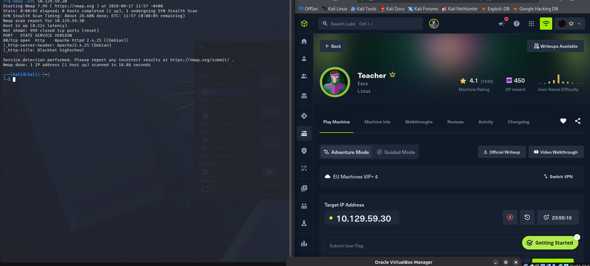

*Figure 1 - Nmap scan showing port 80 open running Apache 2.4.25 with the title "Blackhat highschool"*

We can see there is a web port open and it has the title Blackhat highschool, so we can check it out. We look at the website and it seems there is only the gallery page that is working, so we used Feroxbuster to see all the directories and we found out that the website is using a CMS called Moodle and it is redirecting us to teacher.htb, so we can add this to our `/etc/hosts`.

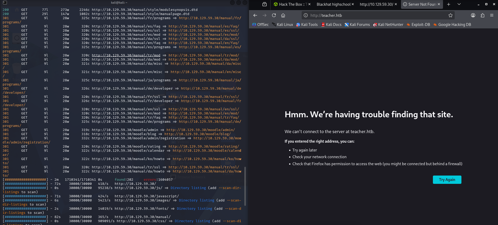

*Figure 2 - Feroxbuster discovering Moodle directories and teacher.htb redirect*

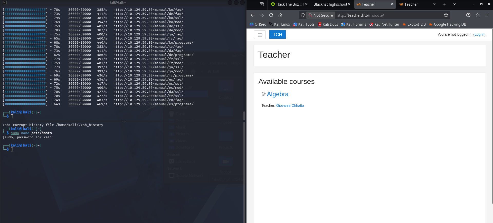

*Figure 3 - Moodle homepage showing the Algebra course with teacher Giovanni Chhatta*

---

## Guest Access and Enumeration

Straight away we can see a username with a login page so we can save our username we found in a username file. We can see that we can log in as guest so we did, and before we find the version of Moodle we can use our session ID to enumerate the Moodle endpoint further. Seems we have more access now but it redirects back to login, everything except index.php, so we can enumerate this.

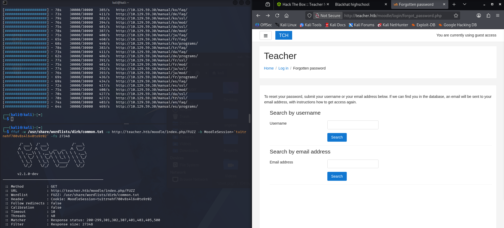

*Figure 4 - ffuf endpoint enumeration with guest session cookie and the forgotten password page*

There seems to be a forgotten password by username, perhaps we can see if there is a vulnerability in this function and we can use the username we obtained earlier. We can pop this over to Burp to see if anything interesting is there. We didn't find anything interesting, but when we went to the calendar function we saw the following. It gave us the Moodle version.

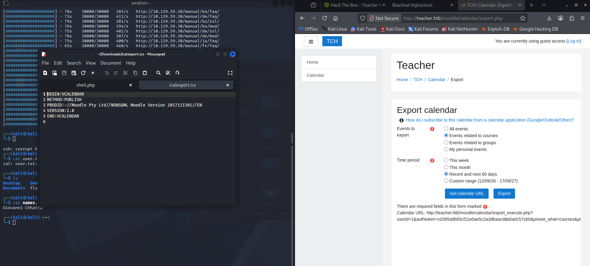

*Figure 5 - Calendar export iCalendar file showing PRODID with Moodle Version 2017111301*

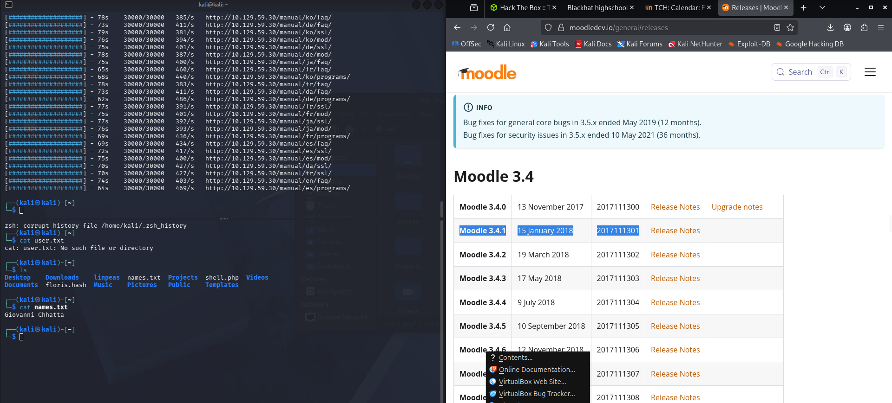

*Figure 6 - Moodle releases page confirming version 2017111301 maps to Moodle 3.4.1*

---

## Credential Discovery

Let's look up online if there is an exploit. This seems to be version 3.4.1. We can now look for exploits. We found an RCE exploit but it required the teacher username and password, so we logged back in as guest to try and find the password. We found a note that says "Easy as 1,2,3", maybe it is saying it's a simple password that can be bruteforced?

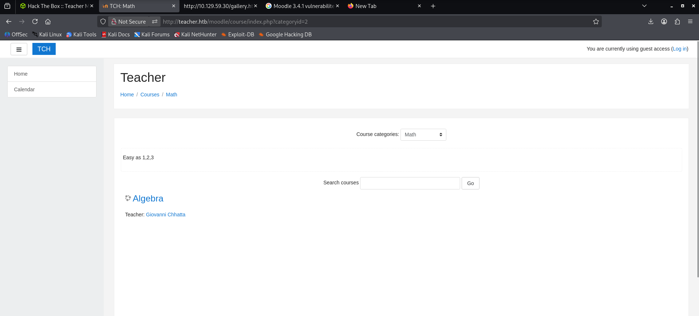

*Figure 7 - Moodle course page showing the note "Easy as 1,2,3"*

We can try using ffuf to see if we can bruteforce. This did not work too, however when we went to images we found one file does not display while the others do, so we decided to download this file.

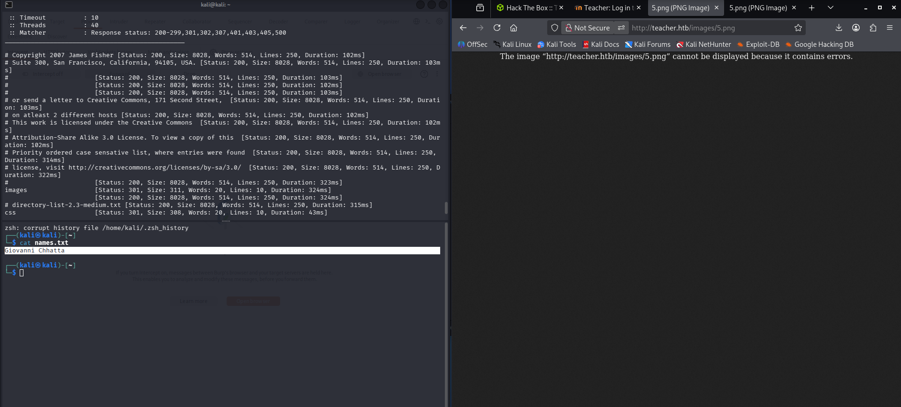

*Figure 8 - The image 5.png cannot be displayed because it contains errors, and names.txt showing Giovanni Chhatta*

And we got the following:

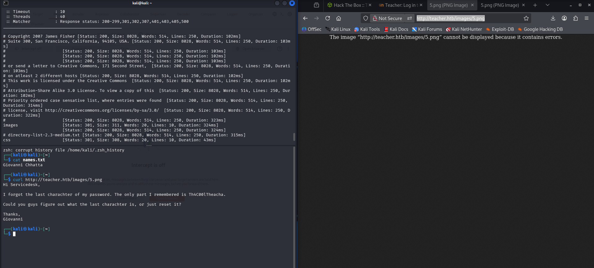

*Figure 9 - Using curl on the broken 5.png reveals it is a text file containing a partial password: Th4C00lTheacha*

So we created a wordlist with all the possible endings of the password and used ffuf to bruteforce it.

```
ffuf -w passwords.txt -u http://teacher.htb/moodle/login/index.php -X POST \
-H "Content-Type: application/x-www-form-urlencoded" \
-d "anchor=&username=Giovanni&password=FUZZ" \
-b "MoodleSession=g390gnsiuvt9sdr7deeea1qb16" \
-mc all -v
```

We can see one response is different.

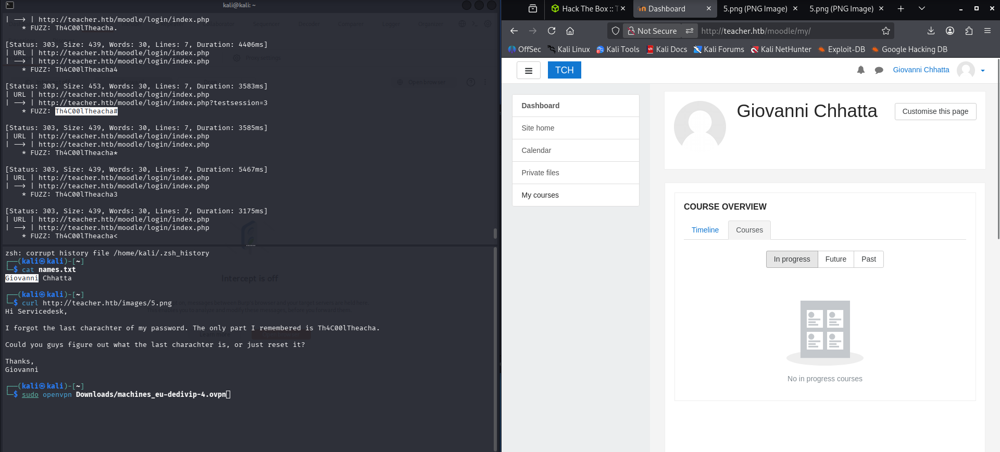

*Figure 10 - ffuf bruteforce showing Th4C00lTheacha# returns a different response size, and successful login as Giovanni Chhatta*

---

## Foothold - Moodle RCE (CVE-2018-1133)

Now we can use the exploit we found earlier.

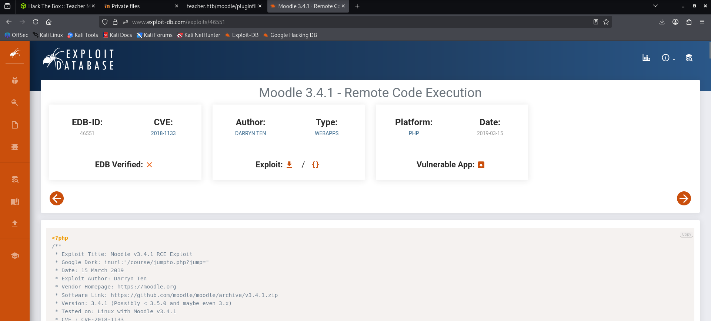

*Figure 11 - Exploit-DB entry for Moodle 3.4.1 Remote Code Execution (CVE-2018-1133, EDB-ID 46551)*

This exploit works by logging in as a teacher, loading a course, enabling editing, adding a quiz, and then adding a calculated question with the payload. Moodle evaluates the `{a}` formula field with `eval()`, which the exploit injects into.

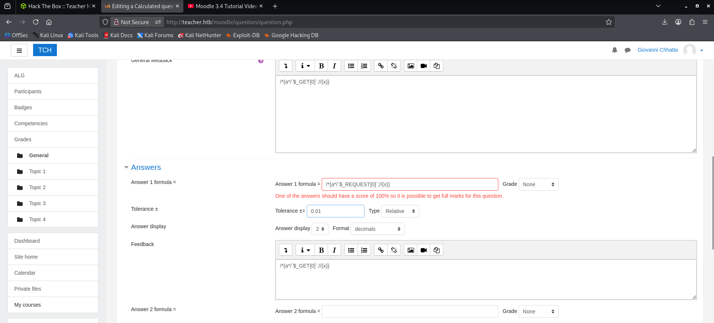

*Figure 12 - Editing a calculated question in Moodle with the RCE payload in the formula field*

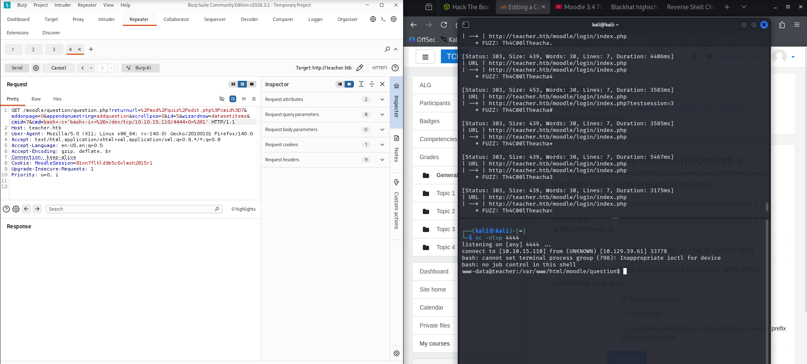

*Figure 13 - Burp Suite showing the crafted request and netcat listener catching a reverse shell as www-data*

---

## User Flag

We navigated to Giovanni's home directory and read the user flag.

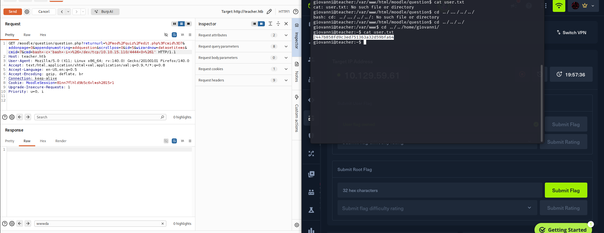

*Figure 14 - Reading user.txt from Giovanni's home directory: `2447b858fd9c3ed751363a32d59bfa64`*

---

## Privilege Escalation - Crontab Symlink Attack

In Giovanni's home directory there was a `work` folder containing a `courses` directory and a `tmp` folder. A cron job was running that would back up and change permissions on the `courses` directory contents. We exploited this by renaming the real `courses` directory to `courses.bak`, then creating a symlink from `courses` pointing to `/root`. When the cron job ran, it followed the symlink and changed the permissions on `/root`'s contents, allowing us to read the root flag.

```
mv courses courses.bak
ln -s /root courses
cat /home/giovanni/work/tmp/courses/root.txt
```

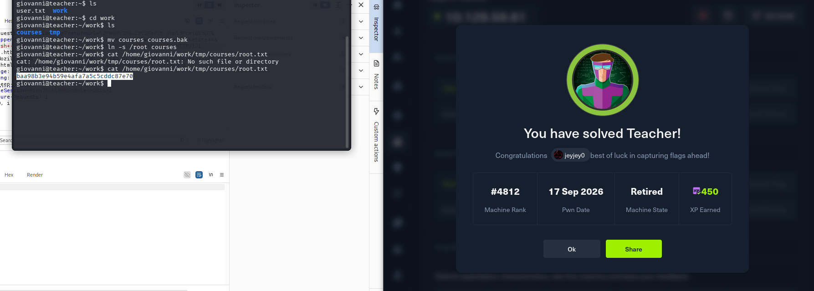

*Figure 15 - Symlink created from courses to /root, and reading root.txt: `baa98b3e94b59e4afa7a5c5cddc87e70`*
