# Hack The Box - Valentine | Write-up

> **Platform:** Hack The Box &nbsp;•&nbsp; **Category:** Linux Machine &nbsp;•&nbsp; **Difficulty:** Easy
>
> **Target:** `10.129.232.136` &nbsp;•&nbsp; **Time taken:** 40 mins
>
> **Author:** Jithin Jelson

---

## Introduction

The machine we will be exploiting is called Valentine and it is an easy difficulty machine. Since it is called Valentine we can assume that the vulnerability that will be used here is a Heartbleed vulnerability.

---

## Assessment Overview

```mermaid
flowchart LR
    A[Nmap scan<br/>ports 22, 80, 443]:::entry --> B[Web interface<br/>on port 80]:::intel
    A --> C[Old OpenSSH<br/>+ TLS on 443]:::intel

    B --> D[ffuf enumeration<br/>/dev directory]:::intel
    D --> E[hype_key<br/>hex-encoded]:::intel
    E --> F[Decode hex<br/>encrypted RSA key]:::payload

    C --> G[searchsploit<br/>Heartbleed 32745.py]:::payload
    G --> H[Memory disclosure<br/>base64 leak]:::payload
    H --> I[Decode base64<br/>key passphrase]:::payload

    F --> J{SSH as hype}
    I --> J
    J --> K[chmod 600 +<br/>legacy ssh-rsa]:::payload
    K --> L[User flag]:::user

    L --> M{Privesc}
    M --> N[Root via prior<br/>session in history]:::user
    N --> O[Root flag]:::user

    classDef entry fill:#1d4ed8,stroke:#1e3a8a,color:#ffffff;
    classDef ioc fill:#0f766e,stroke:#134e4a,color:#ffffff;
    classDef intel fill:#7c3aed,stroke:#5b21b6,color:#ffffff;
    classDef mitre fill:#b45309,stroke:#78350f,color:#ffffff;
    classDef payload fill:#be123c,stroke:#881337,color:#ffffff;
    classDef user fill:#15803d,stroke:#14532d,color:#ffffff;
    linkStyle default stroke-width:2px
```

---

## What I Learned

- How the Heartbleed vulnerability (CVE-2014-0160) works, an out-of-bounds read in the OpenSSL TLS heartbeat extension where a malformed heartbeat request with a falsified payload length tricks the server into returning up to 64KB of adjacent process memory, and how to weaponise it to leak secrets like session data, credentials, and private key material straight out of the server's RAM.

- Using searchsploit to locate a working Heartbleed proof of concept and then running the script to exploit it, because the attack needs a hand-crafted TLS heartbeat payload that is too complex to send manually, so leaning on an existing exploit is the practical route rather than building the malformed record byte by byte.

- Reading a target's recent command history to find a privilege escalation path, checking what the previous user or root had run before, which surfaced a route to root without needing a kernel exploit or misconfigured binary.

- Adding the correct permissions to SSH private keys with chmod 600 so the client stops ignoring the key, since OpenSSH refuses to load a private key that is readable by group or others, and layering on the legacy ssh-rsa algorithm options needed to authenticate against an old SSH server.

---

## Enumeration

We can start by running an Nmap script scan and service enumeration of our target IP.

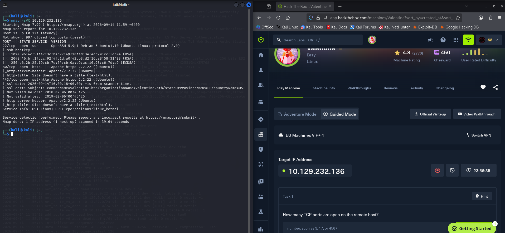

*Figure 1 - Nmap service scan showing SSH on 22, HTTP on 80, and SSL/HTTP on 443*

We can see there is a port open at 80 so there is a web interface and it seems we have an old version of SSH running too. First we can start by visiting the website. It seems our website only has a picture and nothing interesting in the source code either so we decided to enumerate it further using ffuf.

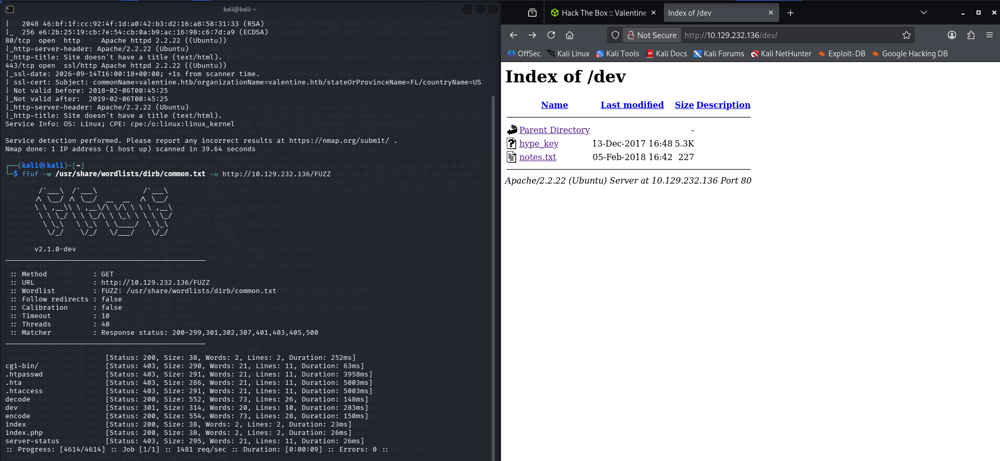

*Figure 2 - ffuf directory brute force revealing /dev, which contains hype_key and notes.txt*

When we opened up /dev we found an interesting folder and in it is hype_key and it seems it is hex encoded so we decided to decode it to see what it is.

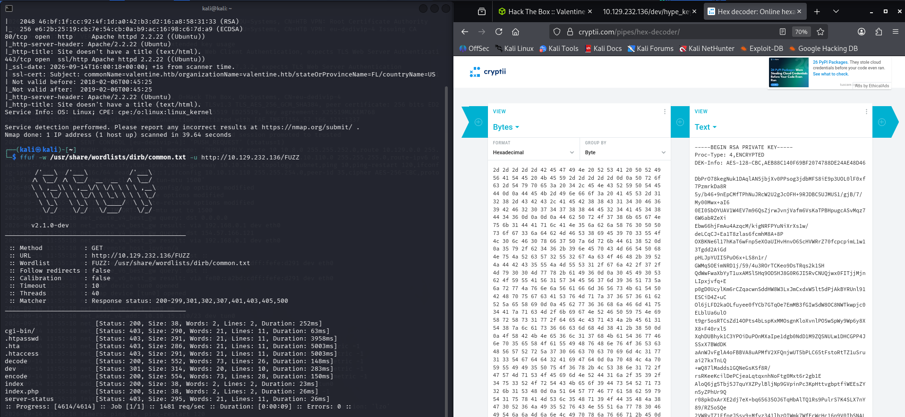

*Figure 3 - Decoding the hex-encoded hype_key reveals an encrypted RSA private key*

Seems it is an RSA private key.

We can save this information and try to SSH into the box.

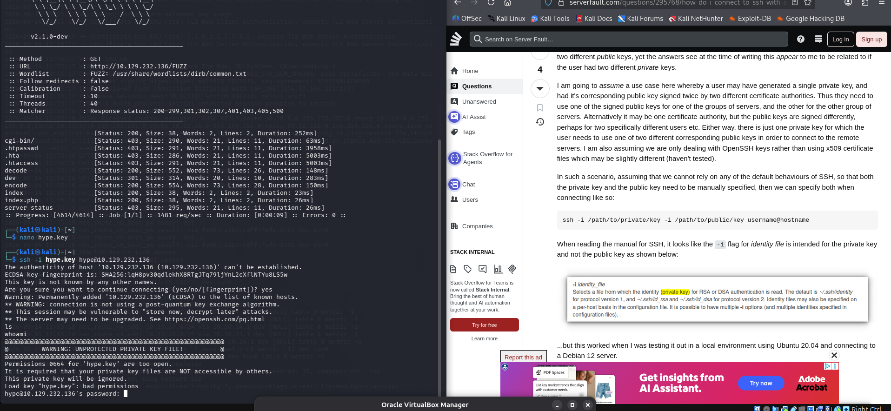

*Figure 4 - The key alone is not enough, SSH still prompts for a password*

However it seems we need a password to actually get in. We presumed the name was hype since it said hype_key. Perhaps this is when our Heartbleed attack comes in so we can searchsploit for Heartbleed and see what comes up.

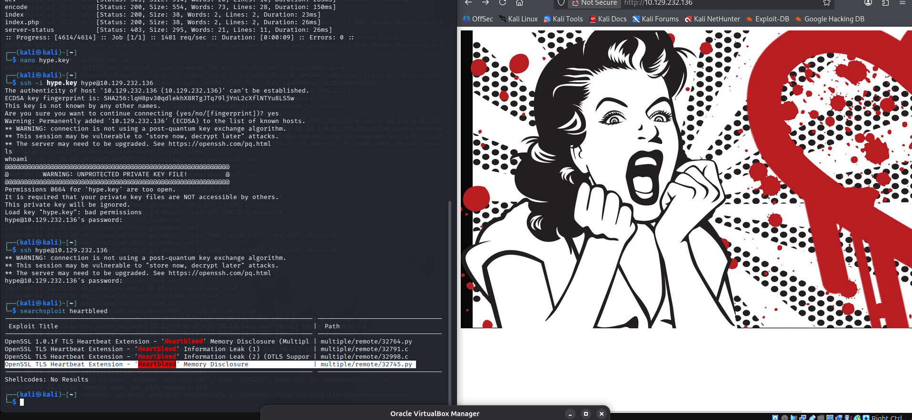

*Figure 5 - The website homepage and searchsploit listing the Heartbleed exploit 32745.py*

---

## Exploiting Heartbleed

We can now get this following file and try to execute it. Normally we would try to manually exploit this but it seems we need a payload for a Heartbleed vulnerability and it is too complex to manually exploit so we will use a script for this one.

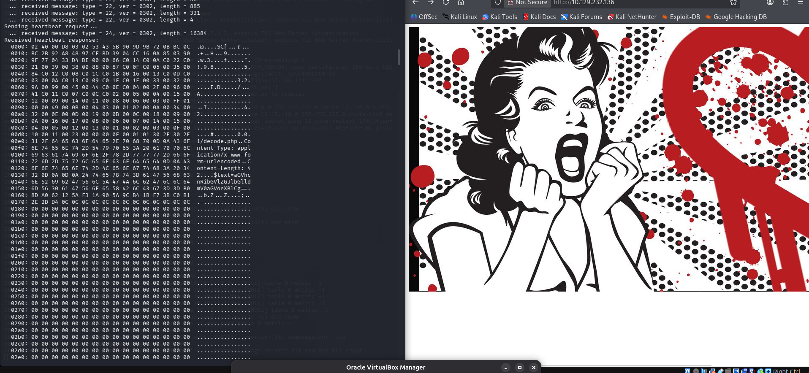

*Figure 6 - The exploit script dumps server memory, leaking a base64 string*

It seems we were successful when we ran the script and we got text back we can now check this. It looked like Base64 so we attempted to decode it and we got the following. This looks like a password, which was what Heartbleed was leaking back in the day when the vulnerability was live.

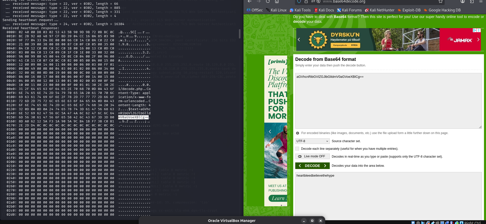

*Figure 7 - Decoding the leaked Base64 string reveals the key passphrase*

---

## Getting a Shell and the User Flag

So we can try to SSH in using this now. However this did not work and when I researched into why it seems that we do not have the permission so we have to chmod 600 the key first before we use it.

```
chmod 600 hype.key
```

chmod 600 sets the file's permissions so that only the owner can read and write it, and nobody else can touch it at all.

Breaking down the 600:

Each digit is a permission set for a category of user, owner, group, others, in that order. The number is a sum of: read = 4, write = 2, execute = 1.

- 6 (owner) = 4 + 2 = read + write
- 0 (group) = no access
- 0 (others) = no access

So 600 means: the owner can read and write the file; group members and everyone else get nothing.

The earlier permissions were 0664, which is read+write for owner, read+write for group, and read for others. That "read for others" part is what SSH objected to, a private key readable by anyone but you is a security hole, so SSH flat-out refuses to use it. Tightening it to 600 removes group and other access, satisfying SSH's requirement.

It also seems that since this is legacy SSH we need to turn on some legacy options.

```
ssh -i hype.key -o PubkeyAcceptedAlgorithms=+ssh-rsa -o HostKeyAlgorithms=+ssh-rsa hype@10.129.232.136
```

- PubkeyAcceptedAlgorithms=+ssh-rsa lets your client actually use the RSA-SHA1 signature this old key needs.
- HostKeyAlgorithms=+ssh-rsa sometimes needed too if the server's host key is also legacy, harmless to include.

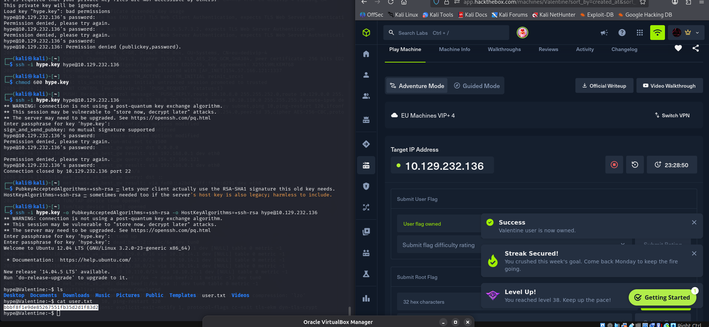

*Figure 8 - Logging in as hype with the legacy algorithm options and reading user.txt*

And we got our user flag.

> **User flag**

**Answer:** `bbbf8f1e9de85267551fb35d2d1f83d2`

---

## Privilege Escalation

We tried to check our permissions using sudo -l but it seems we cannot view them with the password we just used.

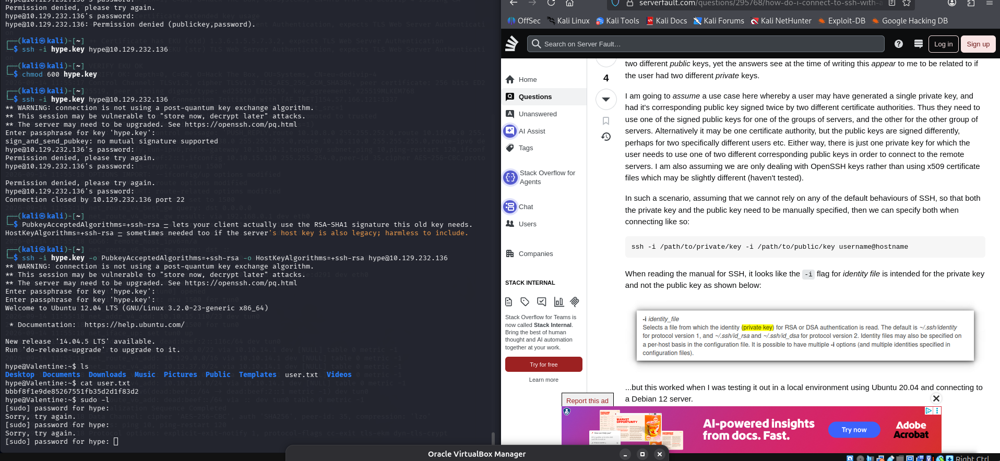

*Figure 9 - sudo -l fails, the leaked passphrase is not the sudo password*

Then I was going to install linpeas but I went to the previous commands the user ran and I came across something, and when I ran it I was brought to root!!!!

Perhaps this was not the intended way but we got privilege escalation pretty quickly.

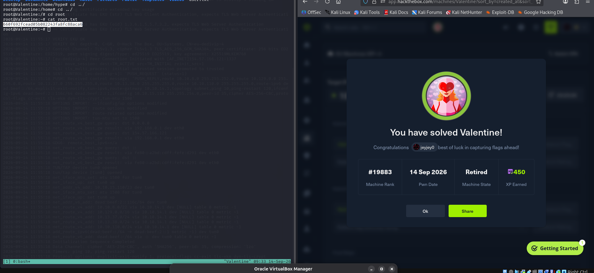

*Figure 10 - Root shell obtained and reading root.txt*

> **Root flag**

**Answer:** `660f692fcead05b082243fa8fc88aca6`
