# Hack The Box - Writeup | Write-up

> **Platform:** Hack The Box &nbsp;•&nbsp; **Category:** Linux Machine &nbsp;•&nbsp; **Difficulty:** Easy
>
> **Target:** `10.129.61.17` &nbsp;•&nbsp; **Time taken:** 40 mins
>
> **Author:** Jithin Jelson

---

## Introduction

The box we will be exploiting today is called Writeup and it is an easy difficulty Linux machine.

---

## Assessment Overview

```mermaid
flowchart LR
    A[Nmap<br/>-sVC scan]:::entry --> B[SSH 22<br/>OpenSSH 9.2p1]:::entry
    A --> C[HTTP 80<br/>Apache 2.4.25]:::entry
    C --> D[robots.txt<br/>/writeup/]:::ioc
    D --> E[CMS Made Simple<br/>Copyright 2004-2019]:::ioc
    E --> F[exiftool favicon<br/>mod date 2019-04-19]:::intel
    E --> G[CHANGELOG.txt<br/>v2.2.9.1]:::intel
    F --> H{Version<br/>fingerprint}:::intel
    G --> H
    H --> I[CVE-2019-9053<br/>SQLi 46635.py]:::payload
    I --> J[Leaked creds<br/>jkr : raykayjay9]:::payload
    J --> K{Foothold}:::payload
    K --> L[SSH as jkr<br/>user.txt]:::user
    K --> M[staff group<br/>writable /usr/local/bin]:::payload
    M --> N[run-parts<br/>PATH hijack]:::payload
    N --> O[SUID /bin/bash<br/>root.txt]:::user
    classDef entry fill:#1d4ed8,stroke:#1e3a8a,color:#ffffff;
    classDef ioc fill:#0f766e,stroke:#134e4a,color:#ffffff;
    classDef intel fill:#7c3aed,stroke:#5b21b6,color:#ffffff;
    classDef mitre fill:#b45309,stroke:#78350f,color:#ffffff;
    classDef payload fill:#be123c,stroke:#881337,color:#ffffff;
    classDef user fill:#15803d,stroke:#14532d,color:#ffffff;
    linkStyle default stroke-width:2px
```

---

## What I Learned

- Using GitHub to understand the CMS Made Simple directory structure, I could locate the version-relevant files in the source tree, like the changelog and the favicon, which pointed me toward the exact release the target was running.
- Cracking the extracted MD5 digest with hashcat in mode 20 (`md5($salt.$pass)`) recovered the plaintext password from the salted hash, turning the SQL injection leak into working SSH credentials.
- Reading a favicon's metadata with exiftool let me pull the file's modification timestamp, and by correlating that date against the CMS Made Simple core-releases table I could narrow the deployed version down to a small window.
- Learning the hashcat workflow itself came from watching an IppSec walkthrough during my post-exploitation research, which is where I picked up the `hash:salt` formatting and the correct mode for CMS Made Simple hashes.

---

## Enumeration

We can start by running an Nmap scan that finds all 1000 common ports and enumerates service versions as well as running default NSE scripts.

```
nmap -sVC 10.129.61.17
```

We found a web interface and an SSH port so we decided to check it out. We got the following:

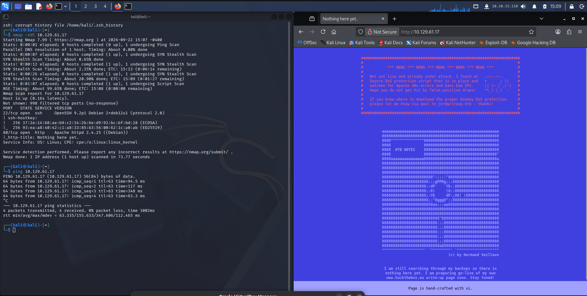

*Figure 1 - Nmap reveals SSH (22) and Apache (80), and the homepage warns of DoS protection that bans IPs on too many 40x errors.*

We can do some manual enumeration now before we decide to use ffuf and feroxbuster to enumerate all our directories. However we do get an email id which can be useful, jkr@writeup.htb.

However we ran into an error straight away because we didn't read the index page properly. It says if we run too many 40x errors our IP gets banned, so us running feroxbuster just caused it to ban us and we didn't get anything useful. However we found a robots.txt that revealed a /writeup/ page for us, and in the copyright we see that it is CMS Made Simple with a copyright of 2004-2019.

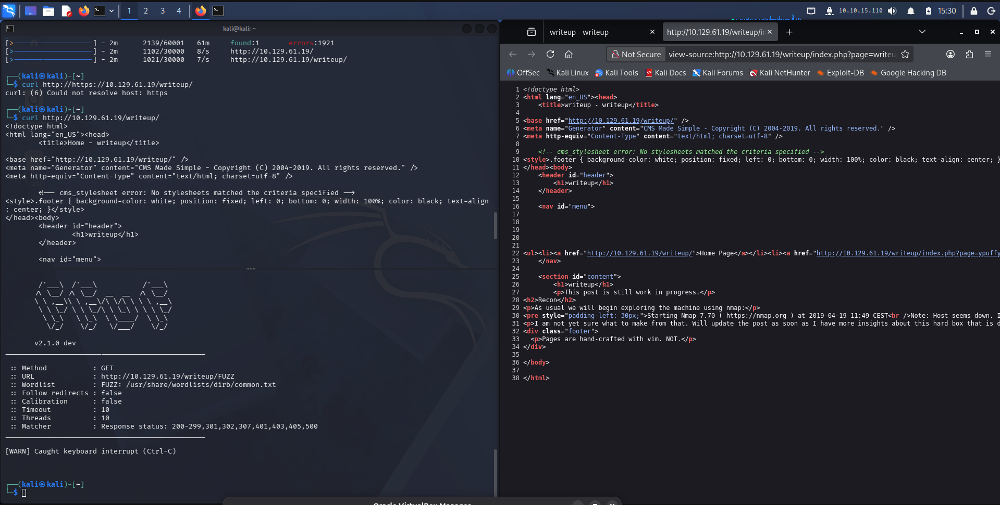

*Figure 2 - The page source of /writeup shows the CMS Made Simple generator tag with a 2004-2019 copyright.*

---

## Fingerprinting the CMS Version

A quick searchsploit and version history show us what version it is potentially running.

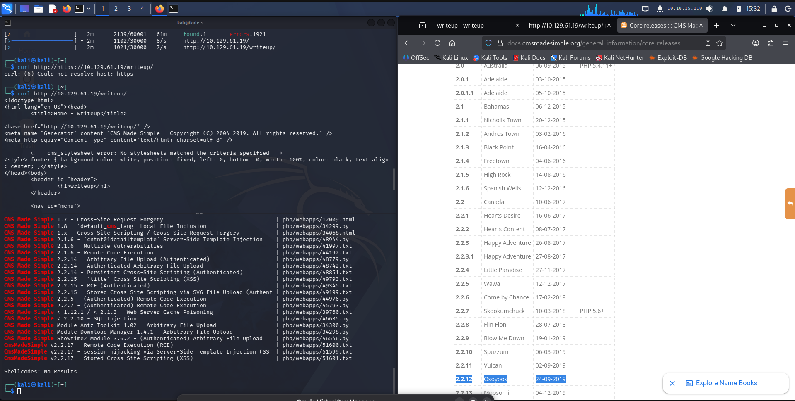

*Figure 3 - searchsploit lists CMS Made Simple exploits alongside the official core-releases table used to map dates to versions.*

We then went to the GitHub page and saw how the directory for it looked, and we realised we can download the icon file and see the date of it to get an idea of the version by running exiftool.

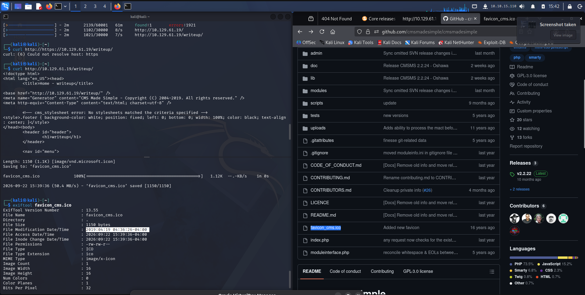

*Figure 4 - exiftool on favicon_cms.ico shows a File Modification Date of 2019-04-19, cross-referenced against the GitHub repository.*

And we can narrow it down to the version it most likely is.

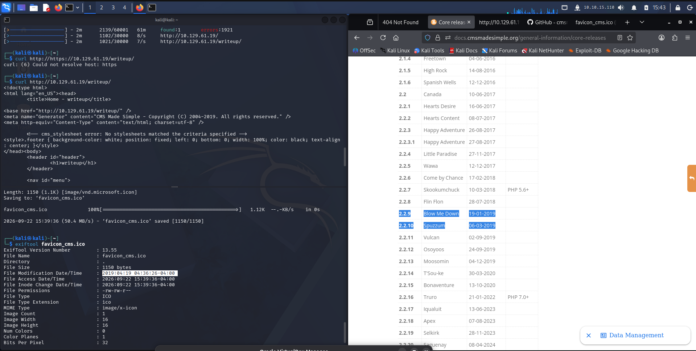

*Figure 5 - Matching the favicon date against the release table narrows the candidates to versions around 2.2.9 and 2.2.10.*

---

## Foothold

Out of those versions it seems there is an SQL injection vulnerability, so we can check out the Python script.

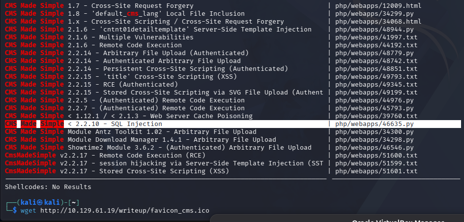

*Figure 6 - searchsploit points to CMS Made Simple < 2.2.10 SQL Injection (46635.py).*

We then came across a changelog.txt which we found in the GitHub page, and it revealed the following to us. The version was 2.2.9.1.

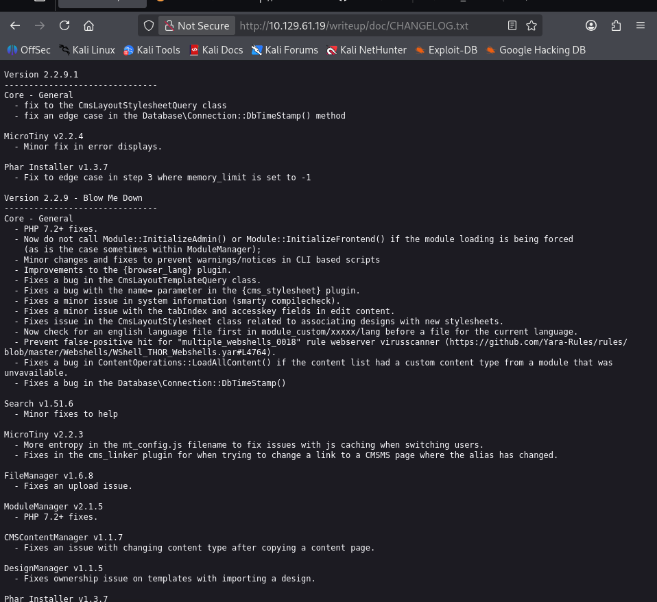

*Figure 7 - /writeup/doc/CHANGELOG.txt confirms the running version is 2.2.9.1.*

After the script was finished we got the username jkr, as we predicted from the start, and the password raykayjay9. However this did not work on the admin panel but it did work on the SSH.

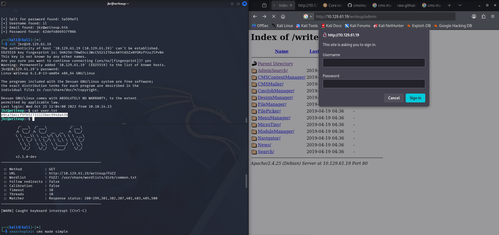

*Figure 8 - The exploit leaks jkr's credentials, which fail on the admin panel but succeed over SSH, giving us the user flag.*

> Submit the user flag.

**Answer:** `e9ca76eccf9fb52733325bec994da43b`

---

## Privilege Escalation

We tried to sudo here but the command wasn't found, so we can get linpeas.sh. We started our Python server where linpeas was and then used wget to get it.

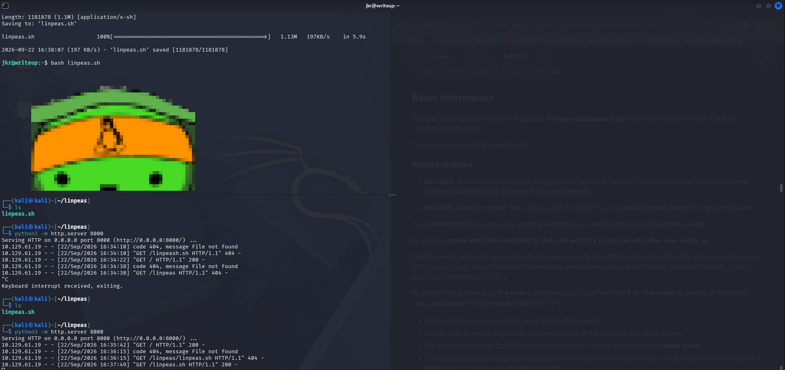

*Figure 9 - linpeas.sh is served over a Python HTTP server and pulled onto the target with wget.*

We see that we are in the staff group which can write to /usr/local/bin, so we can plant a malicious run-parts there so that root runs ours instead of the real one.

```
echo -e '#!/bin/bash\n\nchmod u+s /bin/bash' > /usr/local/bin/run-parts
chmod +x /usr/local/bin/run-parts
```

And now if we run `/bin/bash -p` we are root.

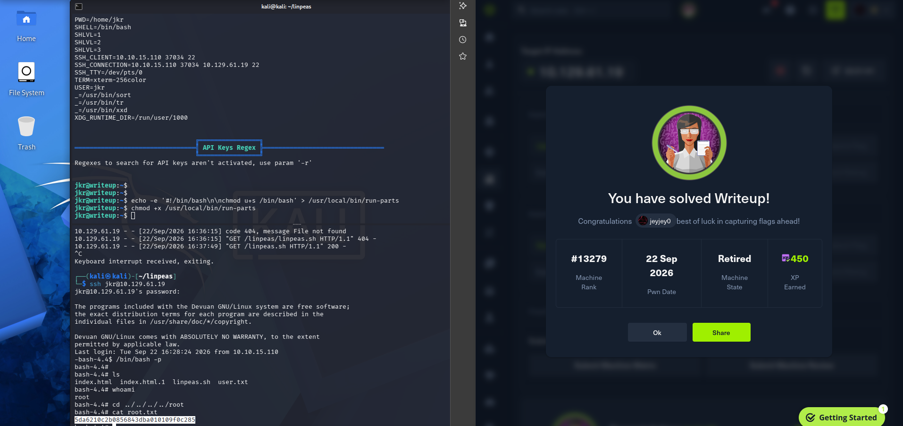

*Figure 10 - The hijacked run-parts sets the SUID bit on /bin/bash, and `/bin/bash -p` drops us into a root shell and the root flag.*

> Submit the root flag.

**Answer:** `5da6210c2b0856843dba010109f0c285`

---

## Post-Exploitation - Cracking the Hash with Hashcat

After researching for other stuff we found that although the script cracks the password for us, in the case it didn't we can use hashcat in the following format.

```
hashcat -m 20 hashes/cms-made-simple /opt/wordlist/rockyou.txt
```

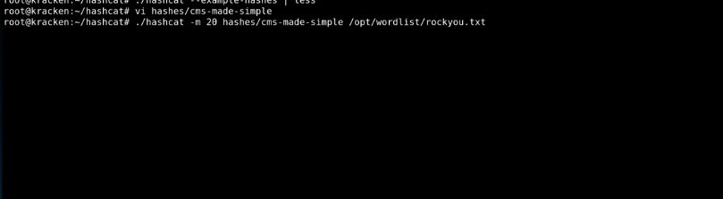

*Figure 11 - Running hashcat in mode 20 against the CMS Made Simple hash with the rockyou wordlist.*

And we have to save the hashes in the format hash:salt.

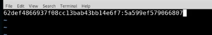

*Figure 12 - The hash file is saved in the `hash:salt` format that mode 20 expects.*

I learned this hashcat workflow during my post-exploitation research by watching an IppSec tutorial, which is where the `hash:salt` layout and the mode 20 (`md5($salt.$pass)`) selection came from.
