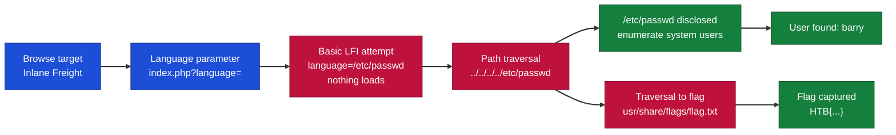
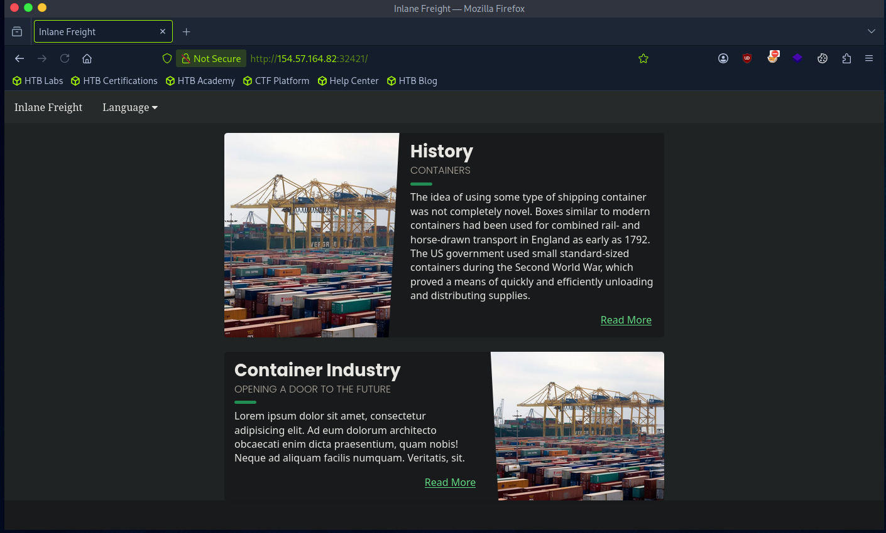
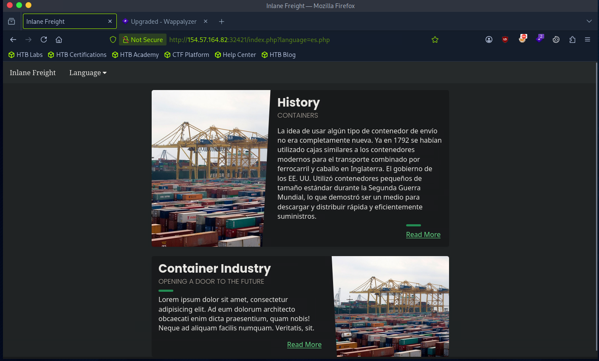
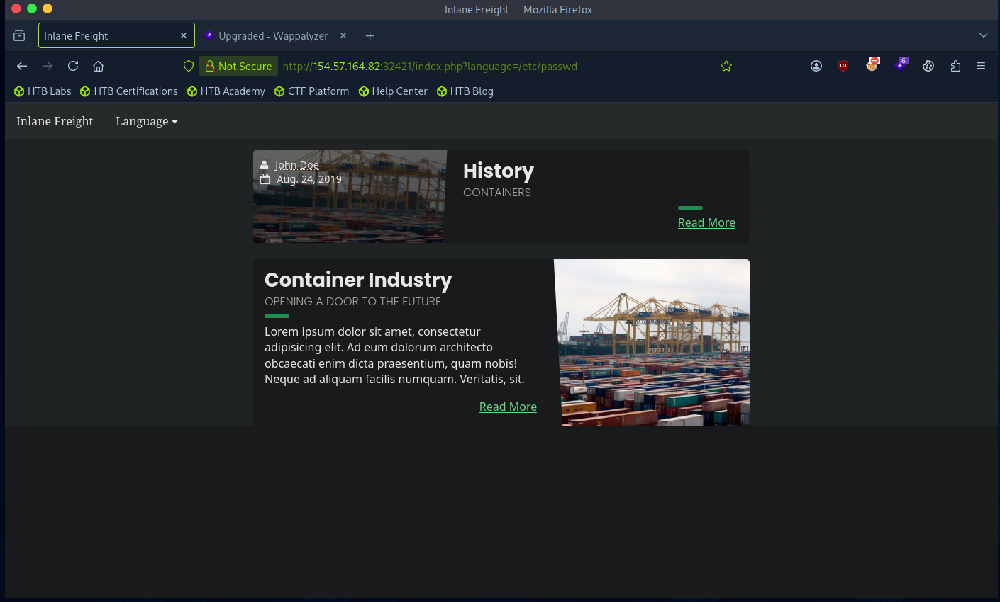
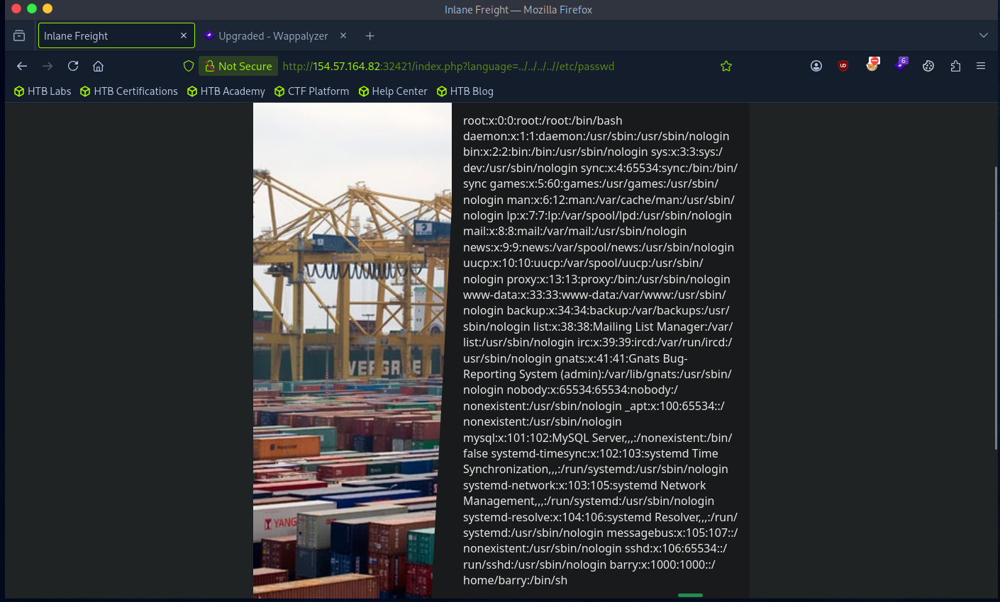
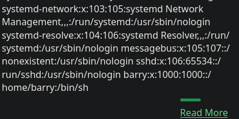
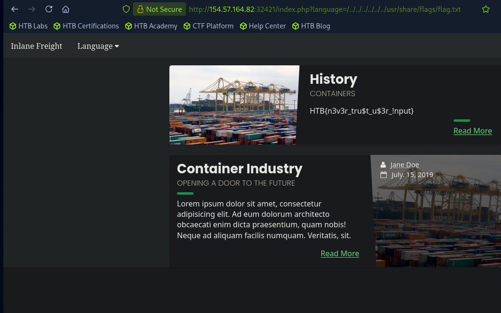

# Hack The Box - Local File Inclusion | Write-up

> **Platform:** Hack The Box &nbsp;•&nbsp; **Category:** Web / File Inclusion &nbsp;•&nbsp; **Difficulty:** Easy
>
> **Target:** `154.57.164.82:32421` &nbsp;•&nbsp; **Time taken:** 5 mins
>
> **Author:** Jithin Jelson

---

## Introduction

In this exercise we are told that our web application is vulnerable to local file inclusion. We are not told if there are any defensive measures put in place, but the web application has errors in place for us to learn from and change our payload. In a real life scenario the errors should never be verbose.

---

## Assessment Overview



---

## What I Learned

- How the `language` parameter controls which file the page loads, which is exactly what makes the LFI possible.
- Why a plain `/etc/passwd` payload failed while a path traversal payload succeeded.
- Using `../../../../` to climb to the filesystem root before naming the file I actually wanted.
- Reading `/etc/passwd` to enumerate the users on the system, which gave up the account `barry`.
- Reaching outside the web root to pull `/usr/share/flags/flag.txt` and capture the flag.
- That the verbose errors, left on here for learning, would be turned off in a real deployment so an attacker gets no such hints.

---

## Enumerating the Language Parameter

We can start by loading up our browser and navigating to our target IP address.



*Figure 1 - The target homepage (Inlane Freight) loaded over HTTP.*

When we select the language option we get two options, English or Spanish, and when we click Spanish we can see our URL parameter has changed.



*Figure 2 - Selecting Spanish changes the page content and sets `index.php?language=es.php` in the URL.*

---

## Basic LFI and Path Traversal

We will attempt a basic LFI here by just typing `/etc/passwd` after the language parameter.

```
index.php?language=/etc/passwd
```



*Figure 3 - The `/etc/passwd` payload on its own, the page content does not load.*

It seems like nothing has loaded, perhaps we need to do some path traversal so we can go to the root by doing `../../../../etc/passwd`.

```
index.php?language=../../../../etc/passwd
```



*Figure 4 - The path traversal payload works and loads our specified file, the full `/etc/passwd`.*

Now it seems to load our specified file. With this information we can answer our first question.

> **Using the file inclusion, find the name of a user on the system that starts with "b".**

We can see the answer to this is `barry`.



*Figure 5 - The `barry:x:1000:1000::/home/barry:/bin/sh` line confirms the user.*

**Answer:** `barry`

---

## Capturing the Flag

Now the second part of the question asks us:

> **Submit the contents of the flag.txt file located in the /usr/share/flags directory.**

So let's replace `etc/passwd` with `/../../../../../../usr/share/flags/flag.txt`.

```
index.php?language=/../../../../../../usr/share/flags/flag.txt
```



*Figure 6 - The traversal payload reads `flag.txt` and prints the flag on the page.*

**Answer:** `HTB{n3v3r_tru$t_u$3r_!nput}`
