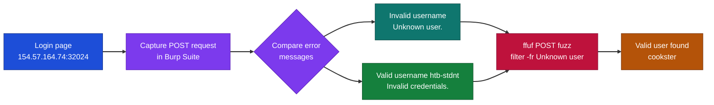
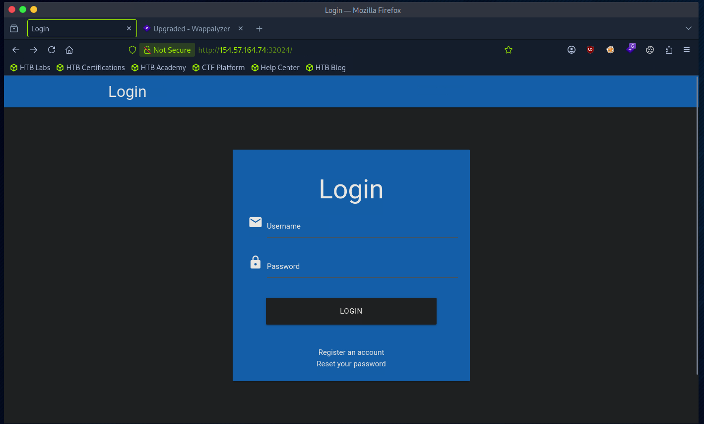
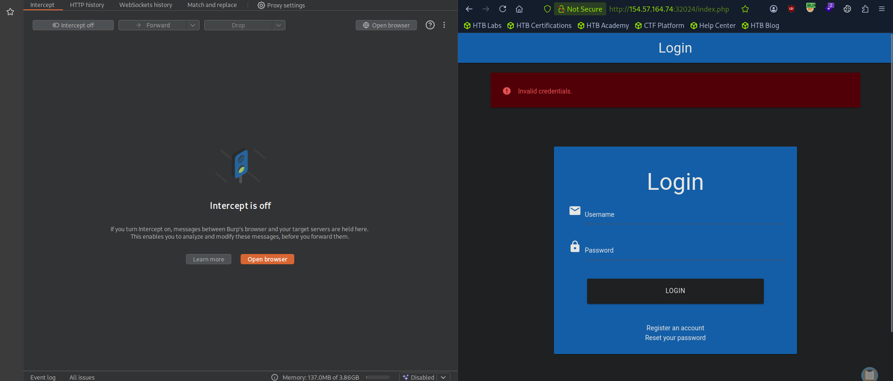
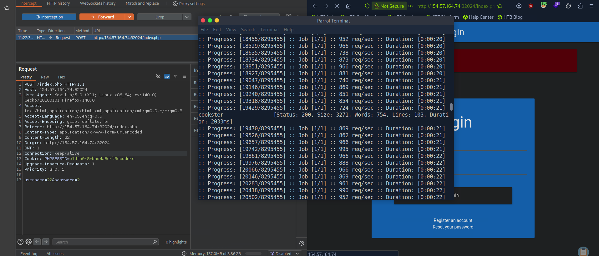

# Hack The Box - Username Enumeration | Write-up

> **Platform:** Hack The Box &nbsp;•&nbsp; **Category:** Web / Enumeration &nbsp;•&nbsp; **Difficulty:** Easy
>
> **Target:** `154.57.164.74:32024` &nbsp;•&nbsp; **Time taken:** 10 mins
>
> **Author:** Jithin Jelson

---

## Introduction

We have been told for this exercise to use a wordlist to enumerate the users in the web application provided. We can use ffuf to filter out the invalid usernames from the valid usernames.

---

## Assessment Overview



---

## What I Learned

- How username enumeration works by comparing how an application responds to valid and invalid usernames.
- Reading the difference between an "Unknown user." message and an "Invalid credentials." message to tell valid accounts apart.
- Capturing a login POST request in Burp Suite so the exact request format can be reused for fuzzing.
- Using ffuf to fuzz a POST body and automate the enumeration against a wordlist.
- Why the `-fr` filter is useful, it lets me drop every response that returns the invalid-user message so only real accounts remain.
- That a small wording change in an error message is enough to leak whether an account exists.

---

## Visiting the Web Application

First we can visit our web application.



*Figure 1 - The target login page at 154.57.164.74:32024.*

---

## Checking the Error Messages

Now that we have our login page to bruteforce we can capture this request in Burp Suite to then use in ffuf for enumeration.

We can start off by seeing what our error message is for a wrong username.


*Figure 2 - Submitting an invalid username returns "Unknown user."*

Now we can test to see what our username is for a correct one, they have provided us with one in the question, htb-stdnt.



*Figure 3 - Submitting the valid username htb-stdnt returns "Invalid credentials." instead.*

We can see the difference in the error messages, we can now intercept our request to get data for our ffuf enumeration.

Note we can use Burp Intruder but we will use ffuf in this instance.

```
ffuf -w /opt/useful/seclists/Usernames/xato-net-10-million-usernames.txt -u http://154.57.164.74:32024/index.php -X POST -H "Content-Type: application/x-www-form-urlencoded" -d "username=FUZZ&password=invalid" -fr "Unknown user"
```

The `-w` is our wordlist, the `-u` is our url, the `-X` is the type of request we will be making, `-H` is the content type and `-d` is the information we want to fuzz. `-fr` will be our filter.

Optionally we can save the output to a file of our choice, but we have been told there is only one username we need to find so we can leave that bit out.



*Figure 4 - ffuf filters out the "Unknown user" responses and returns the valid account cookster.*

And it seems we have identified the user we are looking for.

> **Question:** Enumerate the users and find the valid username.

**Answer:** `cookster`
