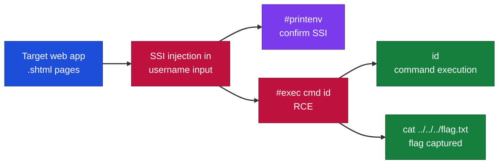
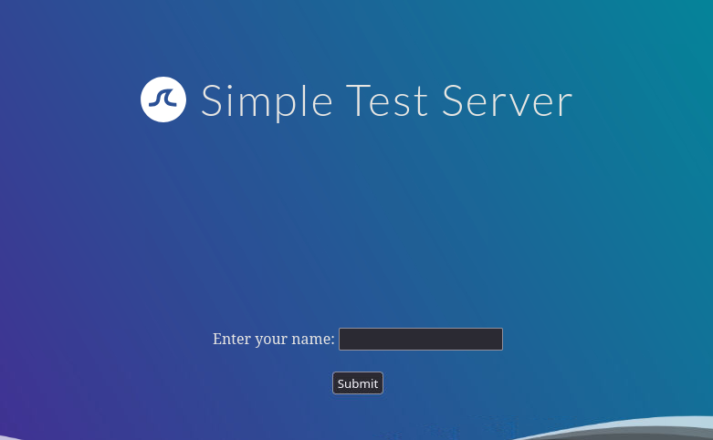
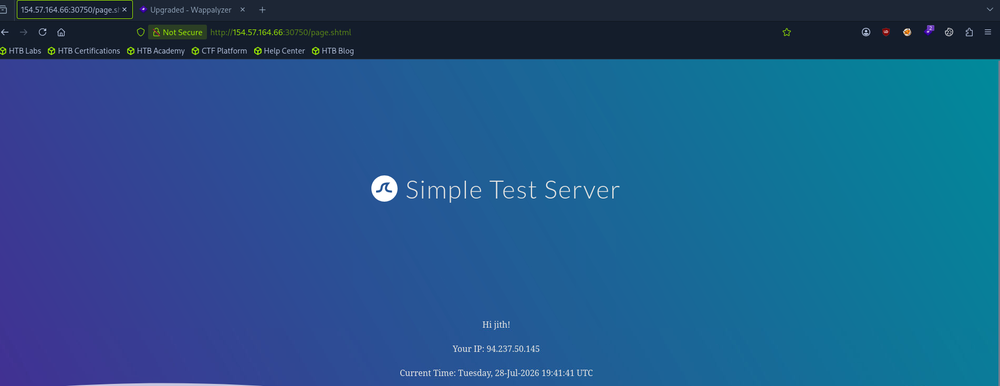
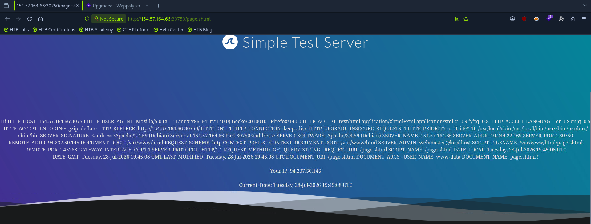
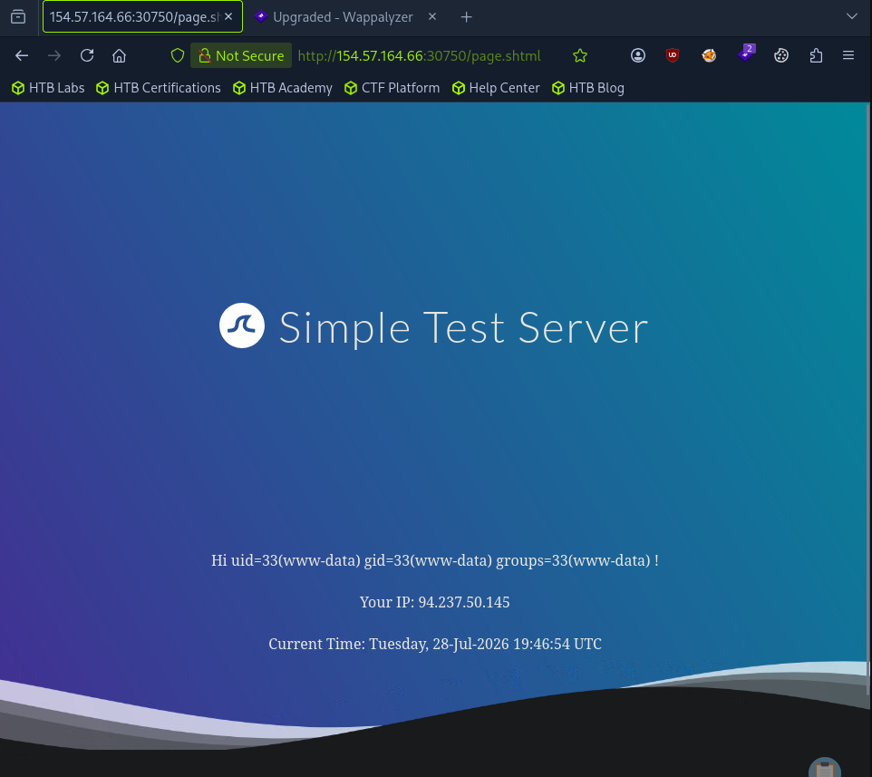
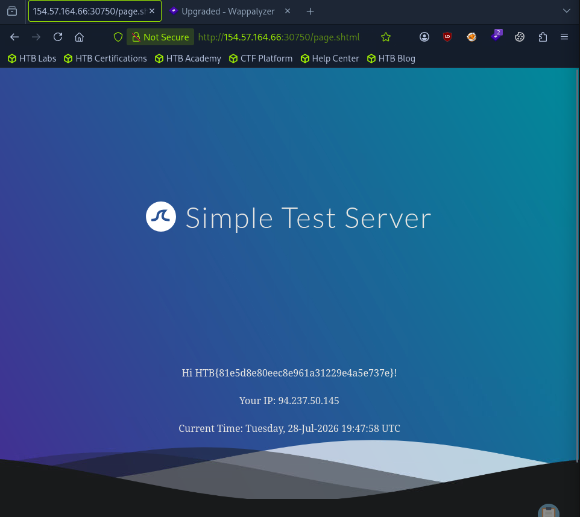

# Hack The Box - Identifying and Exploiting Server-Side Includes Injection | Write-up

> **Platform:** Hack The Box &nbsp;•&nbsp; **Category:** Web - Server-Side Includes Injection &nbsp;•&nbsp; **Difficulty:** Easy
>
> **Target:** `154.57.164.66:30750` &nbsp;•&nbsp; **Time taken:** 15 mins
>
> **Author:** Jithin Jelson

---

## Introduction

In this exercise we are given a web application that is vulnerable to server side includes injection. This type of injection is very similar to a server side template injection which we exploited earlier. This type of injection however is much more straightforward.

---

## Assessment Overview



---

## What I Learned

- How to recognise a possibly SSI-enabled app from `.shtml`, `.shtm`, and `.stm` extensions, while knowing the extension alone is not solid proof.
- Using the `#printenv` directive to confirm an SSI injection by dumping the environment variables.
- Why SSI injection is similar to SSTI, since both are untrusted input reaching something the server executes, but SSI is more straightforward.
- Executing arbitrary commands with the `#exec cmd` directive to gain remote code execution.

---

## Reconnaissance: Visiting the Target

First we can go to our target ip address.



*Figure 1 - The target web application homepage.*

---

## Submitting a Username and Spotting .shtml

It seems to be the same homepage we had for our SSTI injection, we can start off by inputting our username.



*Figure 2 - The response after submitting a username, with the page served as .shtml.*

Everything seems normal at first, but when we take a closer look we can see that the page is running `.shtml`. Although this is not solid proof as to whether the page runs SSI, it is very much a likely possibility, as pages don't need `.shtml`, `.shtm` and `.stm` to run SSI. However, due to the likelihood it is possible, we can test our SSI injection payload. We can try and print the environment variables using the following command:

```
<!--#printenv -->
```



*Figure 3 - Environment variables printed, confirming the SSI injection.*

---

## Confirming SSI with printenv

Since the directive had executed and the environment variables are printed, we can confirm an SSI injection vulnerability. Now we can execute arbitrary commands using the exec directive by providing the following command:

```
<!--#exec cmd="id" -->
```

And just like that we are able to get remote code access.

---

## Remote Code Execution with exec



*Figure 4 - Remote code execution confirmed with the id command.*

---

## Capturing the Flag

> Achieve remote code execution and read the flag from the target.

**Answer:** `see Figure 5`

Now we can find the flag using ls and print it out using cat. The final command was:

```
<!--#exec cmd="cat ../../../flag.txt" -->
```



*Figure 5 - The flag read via path traversal with cat ../../../flag.txt.*
