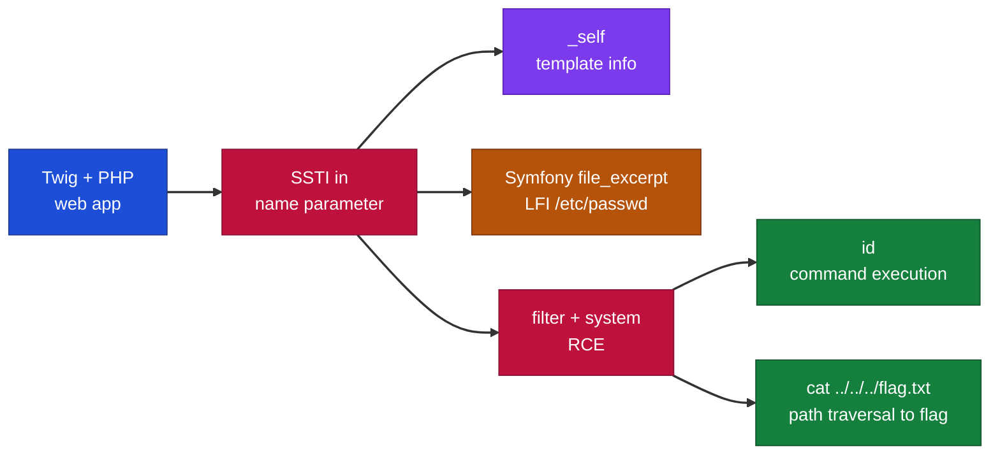
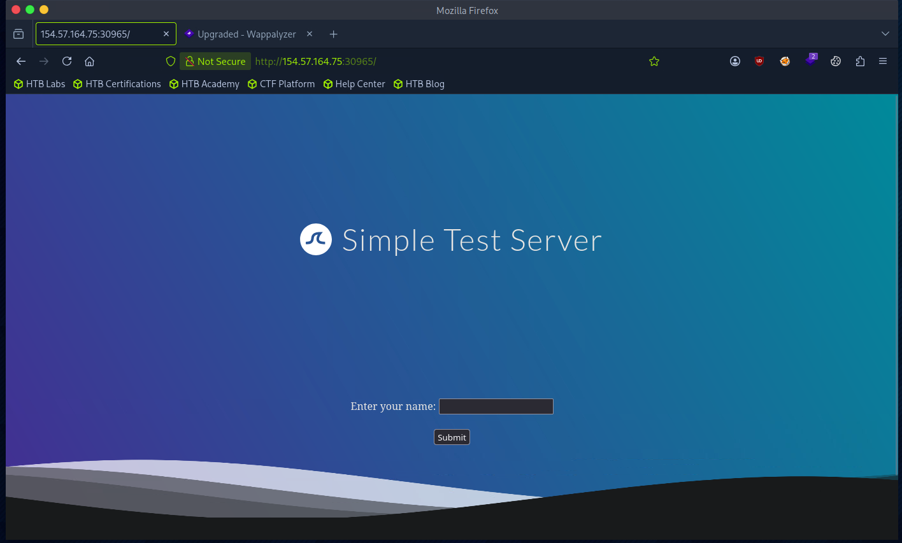
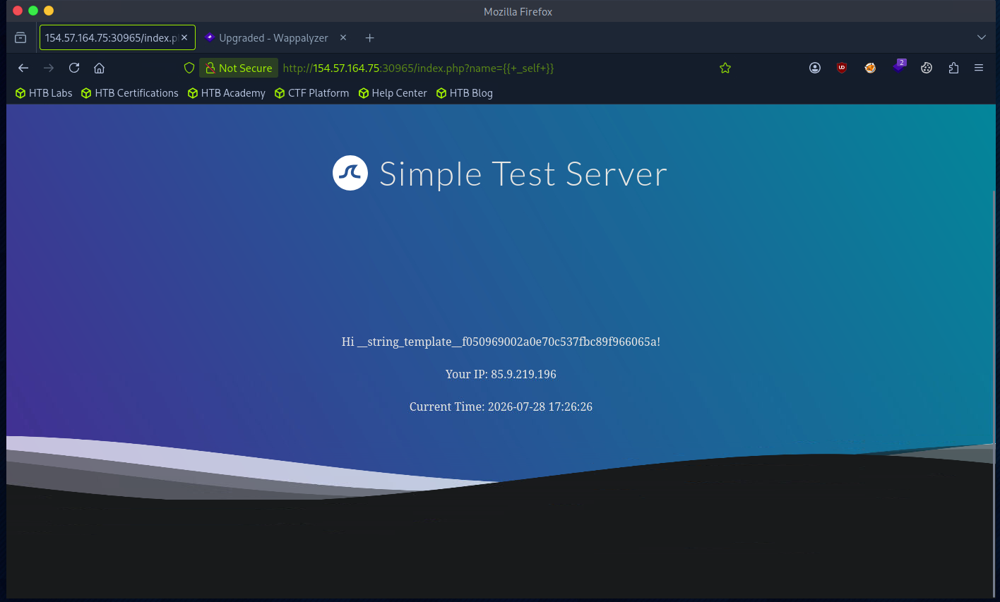
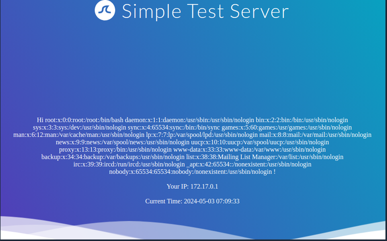
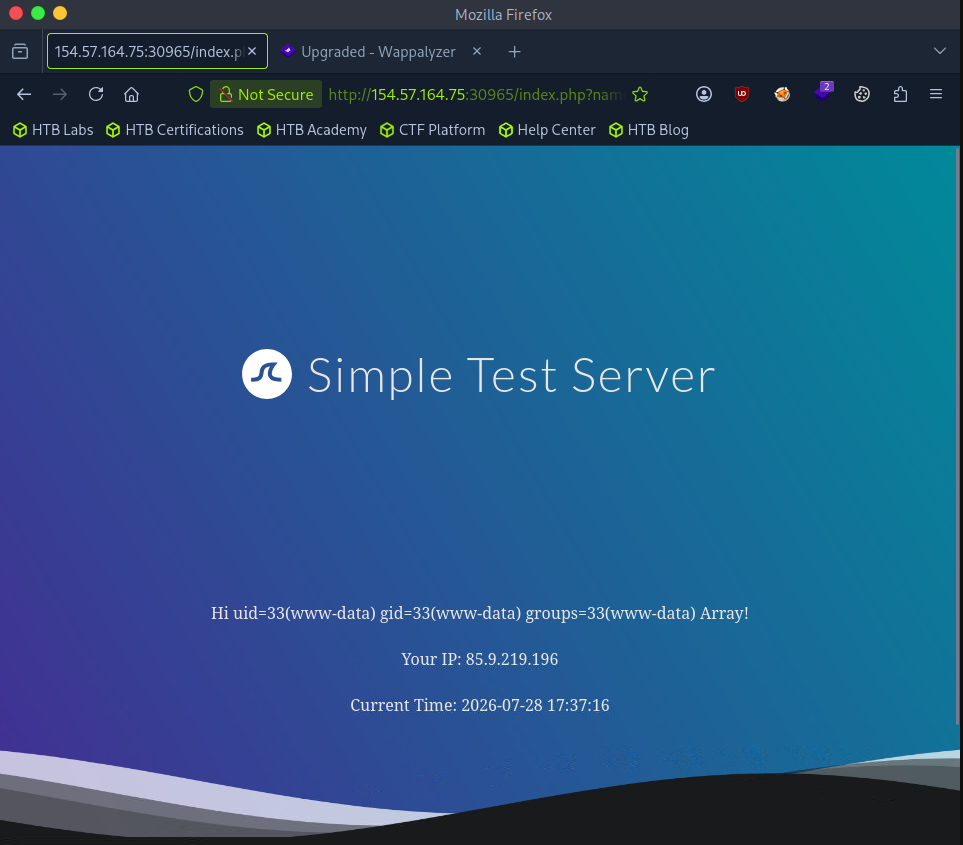
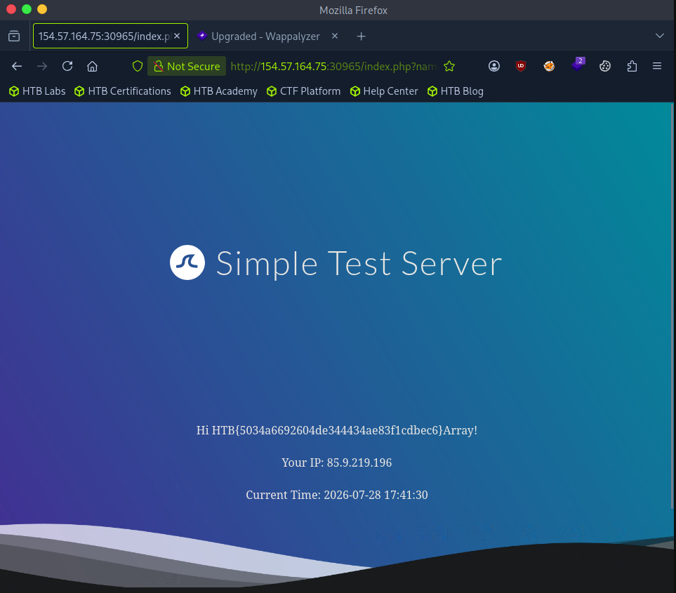

# Hack The Box - SSTI Exploitation Twig | Write-up

> **Platform:** Hack The Box &nbsp;•&nbsp; **Category:** Web - Server-Side Template Injection &nbsp;•&nbsp; **Difficulty:** Easy
>
> **Target:** `154.57.164.75:30965` &nbsp;•&nbsp; **Time taken:** 15 mins
>
> **Author:** Jithin Jelson

---

## Introduction

Previously we had looked at how to exploit an SSTI vulnerability when the template engine used was Jinja2, now we will look at exploiting a template engine when it is Twig. We will be assuming we already have an SSTI vulnerability and template engine identification has already been previously done. Twig is a template engine for the PHP programming language.

---

## Assessment Overview



---

## What I Learned

- How to exploit an SSTI vulnerability in a Twig (PHP) template engine.
- Using `{{ _self }}` to inspect the current template, and noticing Twig gives away far less than Jinja2.
- Why the surrounding framework matters, since Symfony adds the `file_excerpt` filter that makes local file inclusion possible.
- Reading `/etc/passwd` through `file_excerpt(1,-1)` to dump a whole file.
- Abusing Twig's `filter` function with `system` to turn template injection into remote code execution.
- That the flag is not always in the working directory, so path traversal with `../../../` may be needed to reach it.

---

## Reconnaissance: Visiting the Target

We can load up our home page using our target ip address.


*Figure 1 - The target web application running on Twig.*

---

## Inspecting the Template with _self

Since we are already aware that the application is running Twig, we can use `{{ _self }}` to find out more about the current template.

```
{{ _self }}
```

Unlike Jinja2 we are given very little information.


*Figure 2 - Output of {{ _self }}, revealing little about the template.*

---

## Local File Inclusion

Reading local files isn't possible using internal functions provided by Twig, however the PHP framework Symfony defines additional Twig filters. One useful filter is the file_excerpt filter which can be used to read files, so we can use this to try and read /etc/passwd.

```
{{ "/etc/passwd"|file_excerpt(1,-1) }}
```

The 1, -1 means start at line 1 and don't stop, which dumps us the entire file. The first 1 is the line to start with and the -1 tells it to not limit the output, so instead of a few lines we can get the whole file.


*Figure 3 - Contents of /etc/passwd read through the file_excerpt filter.*

---

## Remote Code Execution with filter and system

Now we can try and achieve remote code execution. To achieve this we can use a PHP built-in system function such as system. We can pass this using Twig's filter function and using the following payload:

```
{{ ['id'] | filter('system') }}
```

The filter command allows us to run functions on the item we've given it, in here we give system to help carry out os commands.
 
*Figure 4 - Remote code execution confirmed with the id command.*

---

## Capturing the Flag

> Achieve remote code execution and read the flag from the target.

**Answer:** `see Figure 5`

Now that we have RCE we can use this to read the flag. Since in the previous exercise it was in the same directory, we will try to just cat flag.txt in the same directory.

```
{{ ['cat flag.txt'] | filter('system') }}
```

Turns out it wasn't in that directory!!! It was 3 directories away, so our final flag is located at:

```
{{ ['cat ../../../flag.txt'] | filter('system') }}
```


*Figure 5 - The flag read via path traversal with cat ../../../flag.txt.*
