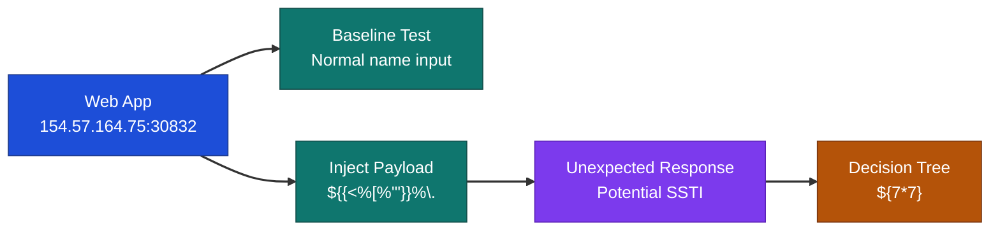
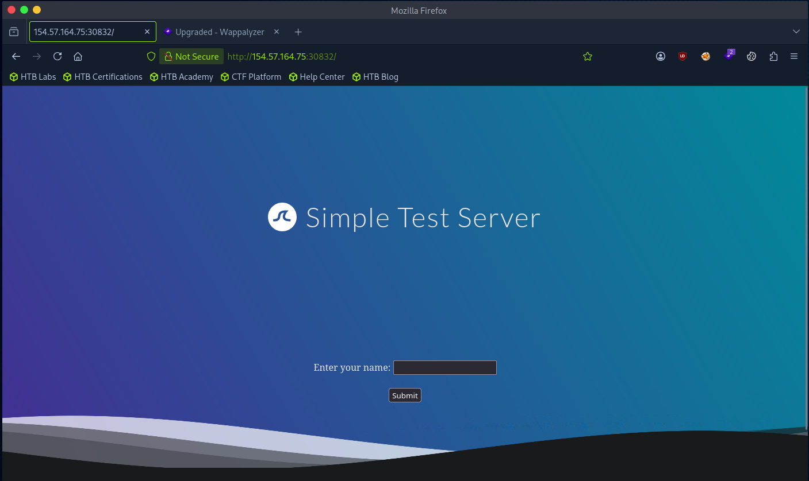
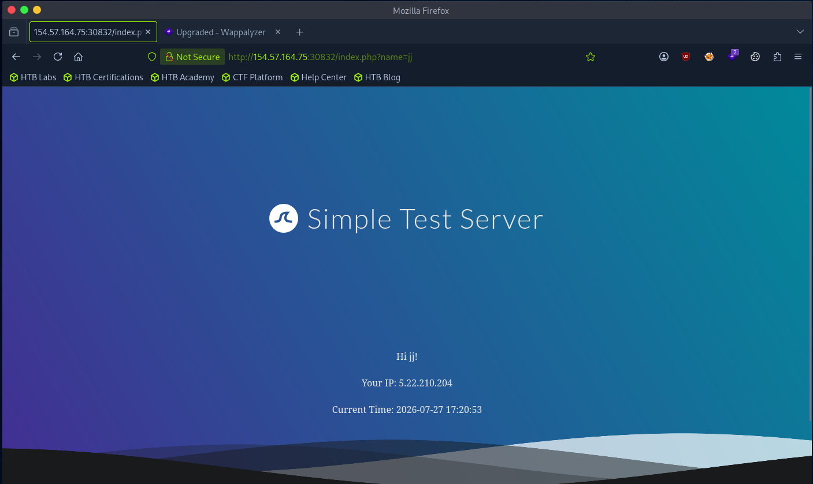
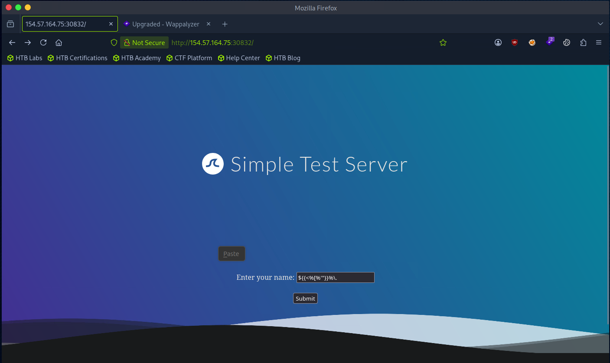
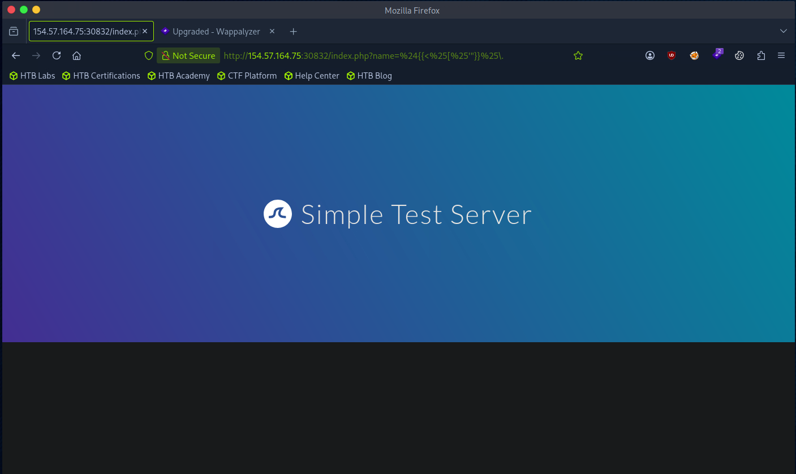
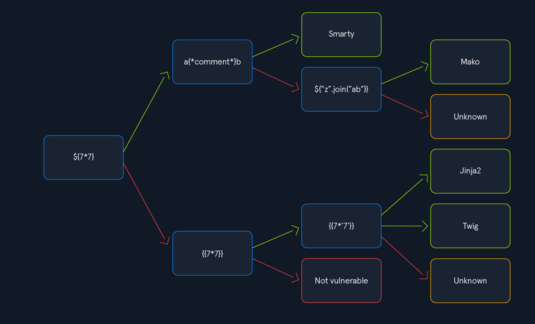
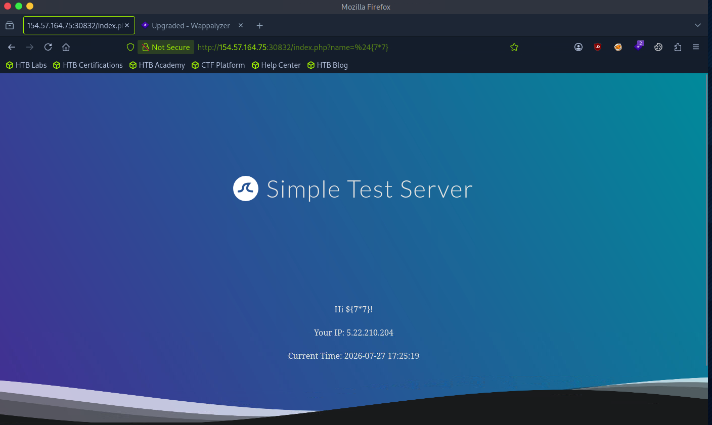
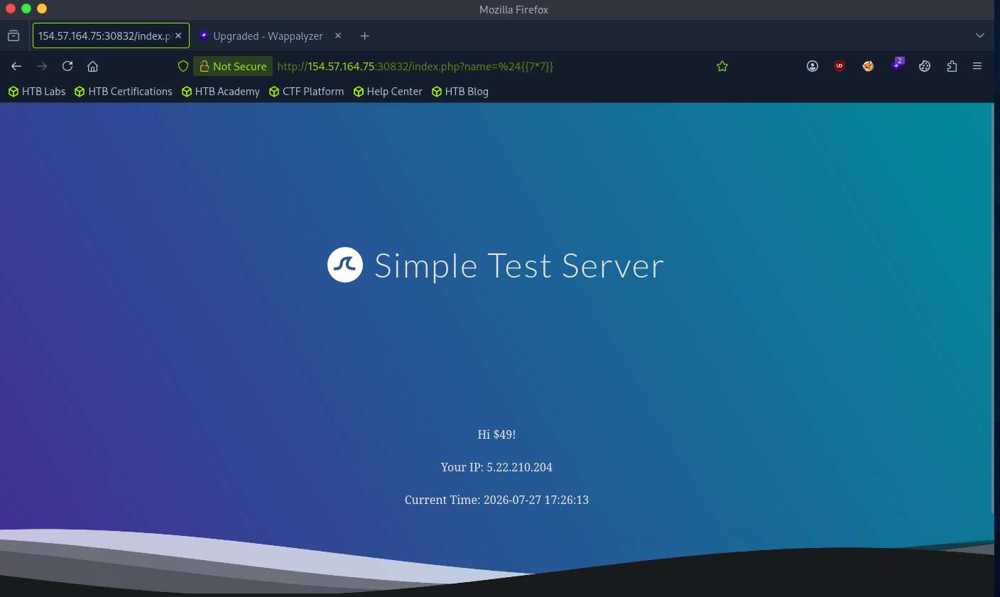
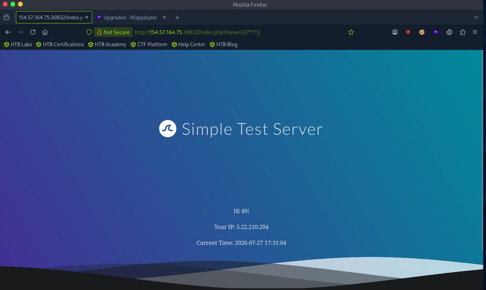

# Hack The Box Academy - Identifying Template Engine for SSTI | Write-up

> **Platform:** Hack The Box Academy &nbsp;•&nbsp; **Category:** Server-Side Template Injection (SSTI) &nbsp;•&nbsp; **Difficulty:** Easy &nbsp;•&nbsp; **Time taken:** 15 minutes
>
> **Author:** Jithin Jelson

---

## Introduction

In this assessment we have been told to identify the template engine used by the web application. We have been made aware that the web application poses an SSTI vulnerability, so we can first confirm this and then use techniques to identify the template engine to exploit.

- **Target IP:** 154.57.164.75:30832

---

## Assessment Overview



---

## What I Learned

- How to confirm an SSTI vulnerability by injecting a special character payload and observing an unexpected response from the application.
- Using a standard test string that combines characters with semantic meaning across popular template engines to provoke errors.
- Differentiating template engines with a decision tree, following green arrows when input gets processed and red arrows when it doesn't.
- Testing arithmetic payloads like `${{7*7}}` to confirm code execution within the template.
- Spotting the difference between Twig and Jinja2 by testing `${{7*'7'}}`, since Twig returns `49` (treats the string as a number) while Jinja2 returns `7777777` (repeats the string), because of how each engine handles type coercion differently.

---

## Baseline Testing

When we open up the IP we are greeted with the following page.


*Figure 1 - The web application homepage*

We can input our name first to see how the web application responds.


*Figure 2 - Entering a normal name returns a normal output with our IP address and current time*

It seems like we get a normal output with our IP address and current time.

---

## Injecting the SSTI Test Payload

Now we can try and inject the special characters to see if anything unexpected will happen. The character we will be using is:

```
${{<%[%'"}}%\.
```


*Figure 3 - Submitting the special character test payload*

When entered, it seems like we got the web application to respond in an unexpected way.


*Figure 4 - The application responds unexpectedly, indicating a potential SSTI vulnerability*

Although this is a sign of a potential SSTI vulnerability, it does not confirm it. To confirm it, we can use the following diagram, following it from left to right. A green arrow means our input gets processed, a red arrow means it doesn't. This will help us identify the template engine we could be working with.


*Figure 5 - Decision tree starting from `${7*7}`, branching to Smarty/Mako on one path and Jinja2/Twig on the other depending on which payloads get processed*

---

## Identifying the Template Engine

We started with the first command and we can see that our input did not get executed, so we follow the red arrow.


*Figure 6 - The initial test payload is not executed, so we follow the red arrow on the decision tree*

This time when we tested `${{7*7}}` we got our command to execute.


*Figure 7 - The `${{7*7}}` payload gets executed, confirming code execution within the template*

Since this worked, we can follow the green arrow and do the next step: `${{7*'7'}}`.

The idea is that if we get `49` as the answer it will be Twig, however if we get `7777777` it means it will be Jinja2. This is because of the different ways the template engines handle the operation.


*Figure 8 - Testing `${{7*'7'}}` confirms the result, identifying the template engine*

**Answer:** `Twig`

We can confirm that it is Twig.
