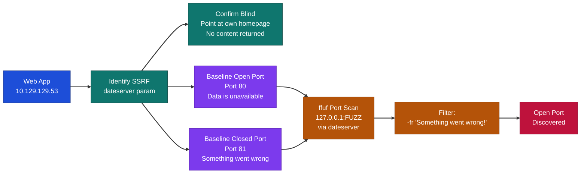
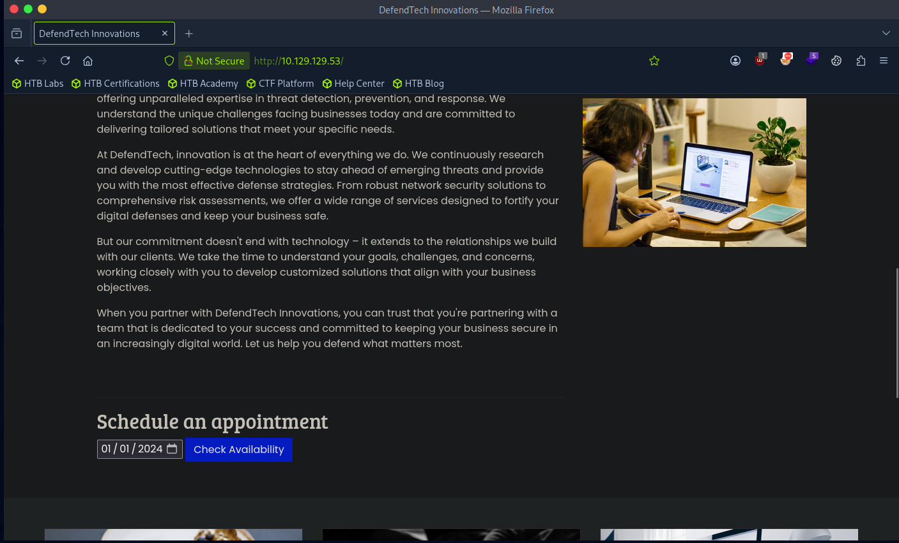
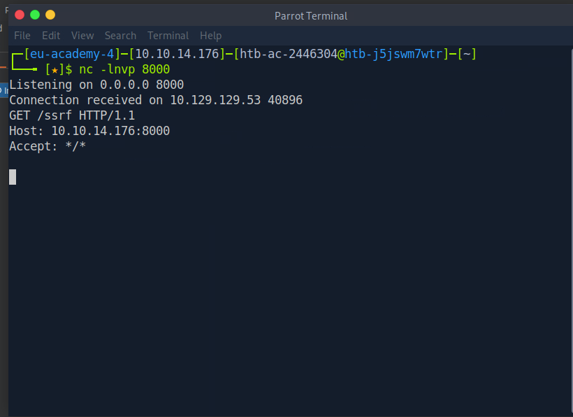
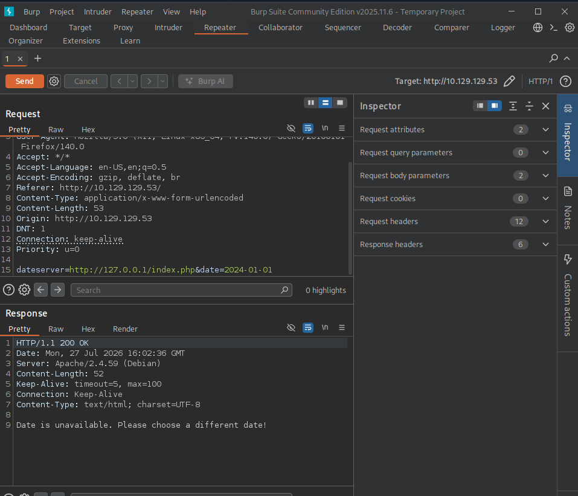
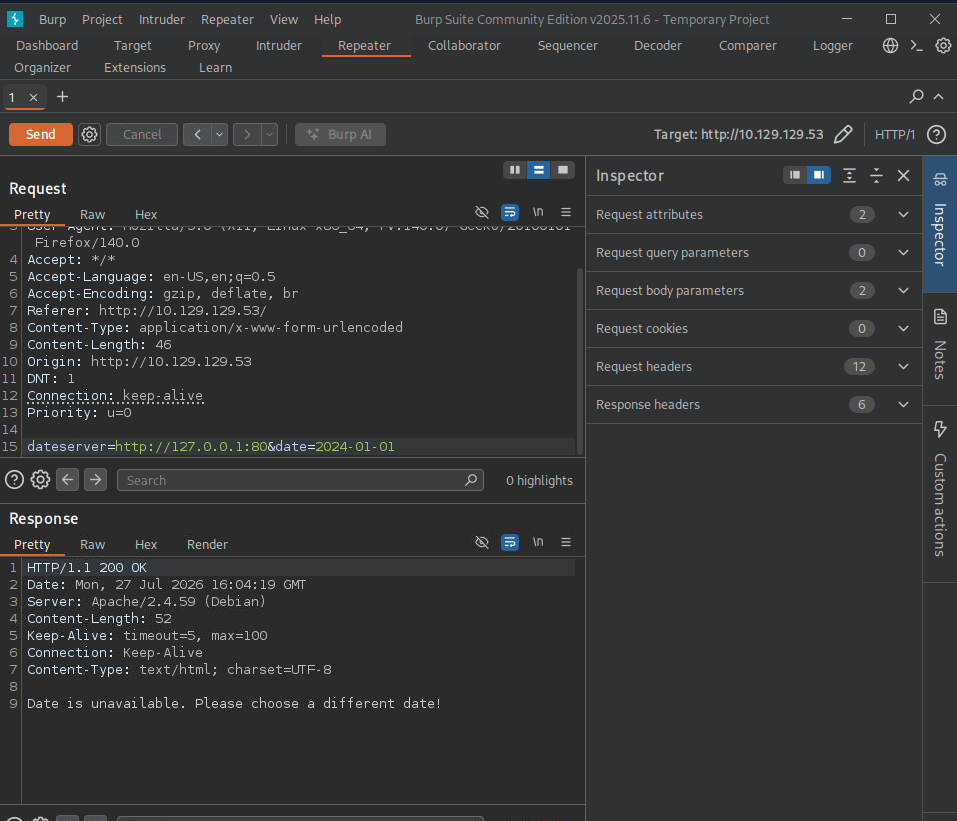
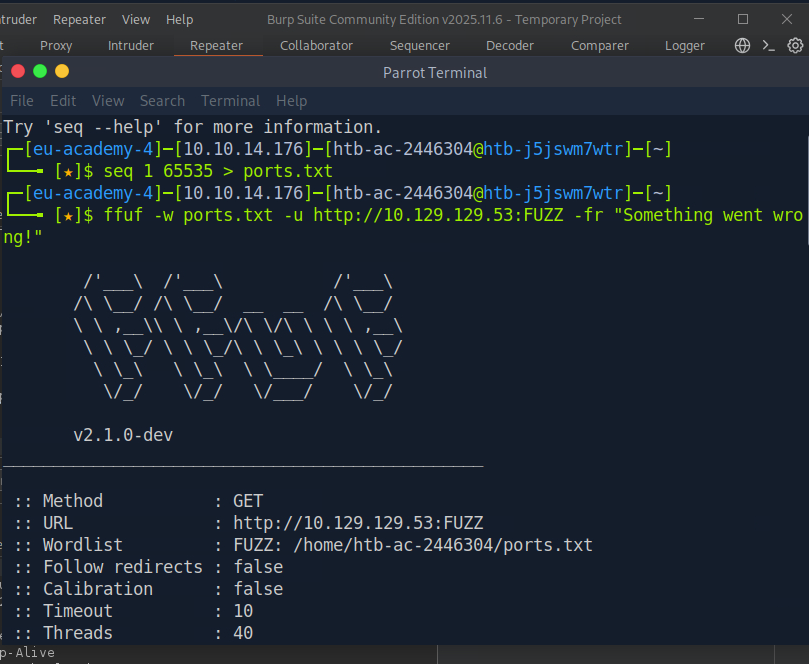
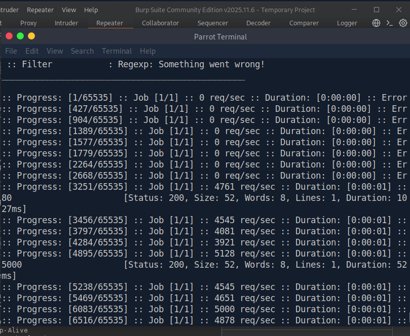

# Hack The Box Academy - Blind SSRF Enumeration | Write-up

> **Platform:** Hack The Box Academy &nbsp;•&nbsp; **Category:** Server-Side Request Forgery (SSRF) &nbsp;•&nbsp; **Difficulty:** Easy &nbsp;•&nbsp; **Time taken:** 15 minutes &nbsp;•&nbsp; **Target IP:** 10.129.129.53
>
> **Author:** Jithin Jelson

---

## Introduction

In this task we are told to identify what other ports are open other than port 80. We have been told that the vulnerability here is an SSRF vulnerability and it is a blind SSRF, so we do not get much information back from our attack.

---

## Assessment Overview



---

## What I Learned

- How to confirm a blind SSRF by pointing the vulnerable parameter at the application's own homepage and observing that no content is returned.
- Distinguishing open from closed ports in a blind SSRF context by comparing the two different error responses the application gives.
- Using ffuf with a port wordlist and the `-fr` flag to filter out closed-port responses and surface only the open ones.
- That the SSRF payload must target the vulnerable parameter directly (`dateserver=http://127.0.0.1:FUZZ`) rather than fuzzing the server's external IP, because only the server itself can reach its own loopback interface.
- Why blind SSRF is still a useful enumeration primitive even without direct data exfiltration, since internal port scanning can reveal hidden services for follow-on exploitation.

---

## Identifying the Vulnerability

First I visited the web application to understand its functionality.


*Figure 1 - The web application homepage with the date availability checker*

The web page is the same as in previous exercises where I identified the vulnerability in the availability section, so most likely it is here again. I confirmed this using Burp Suite and sending a request to Netcat.


*Figure 2 - Burp Suite confirming the SSRF vulnerability via the dateserver parameter*

---

## Confirming Blind SSRF

I confirmed the vulnerability is in the same area. I then checked whether it was blind by pointing it at the application's own homepage.


*Figure 3 - Pointing the SSRF at its own homepage returns "Data is unavailable" with no page content, confirming blind SSRF*

When pointing it at its own homepage, instead of displaying the index page it says "Data is unavailable". Since it is not displaying anything to us, we can confirm it is blind SSRF.

---

## Establishing Port Response Baselines

I then tried to probe the server to see what ports are available. Since the web server is running HTTP, I knew port 80 would be available, so I tried that first.


*Figure 4 - Probing port 80 returns "Data is unavailable", establishing the open-port response signature*

It gives the same message as before, which means this message most likely indicates something is available. I then checked for a different response by probing a commonly closed port, in this case port 81.


*Figure 5 - Probing port 81 returns "Something went wrong!", establishing the closed-port response signature*

Now I can see the error messages differ. If a port is open it gives "Data is unavailable" and if it is closed it gives "Something went wrong!". Using this information I can answer the question by putting a few filters into ffuf.

---

## Port Scanning with ffuf

> Exploit the SSRF to identify open ports on the system. Which port is open in addition to port 80?

First I created a wordlist of all ports and input it into ffuf. Note: the first command used here was wrong as I had not specified where the vulnerability was, and was just pointing ffuf directly at the website's external IP rather than routing through the vulnerable parameter.


*Figure 6 - Initial ffuf command incorrectly scanning the external IP rather than exploiting the SSRF parameter*

The corrected command routes the probe through the vulnerable `dateserver` parameter so the server scans its own loopback interface, reaching ports that are not externally accessible:

```bash
ffuf -w ports.txt \
     -u http://10.129.129.53/index.php \
     -X POST \
     -H "Content-Type: application/x-www-form-urlencoded" \
     -d "dateserver=http://127.0.0.1:FUZZ&date=2024-01-01" \
     -fr "Something went wrong!"
```


*Figure 7 - Corrected ffuf command exploiting the dateserver parameter to scan internal ports, revealing the open port*

**Answer:** `(see Figure 7)`
