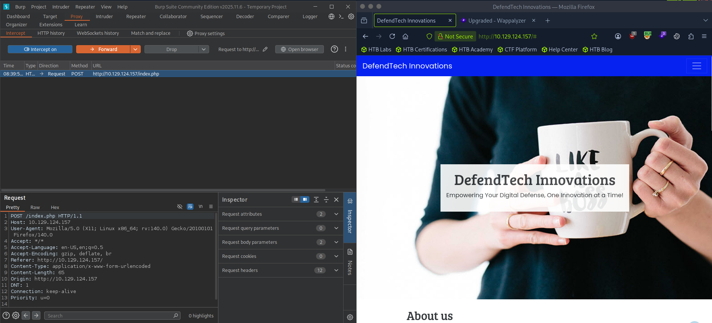
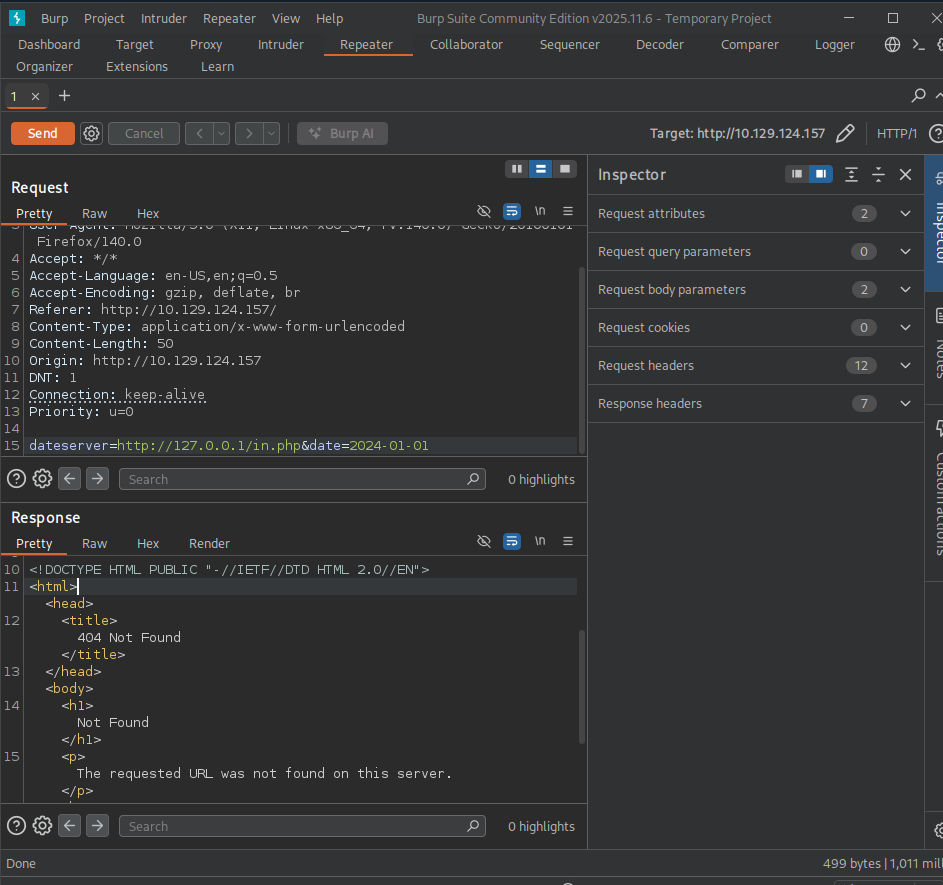
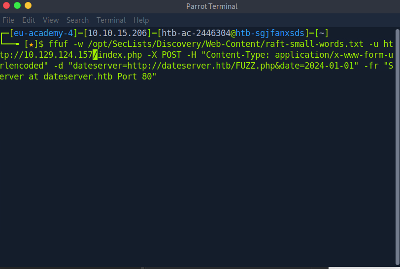
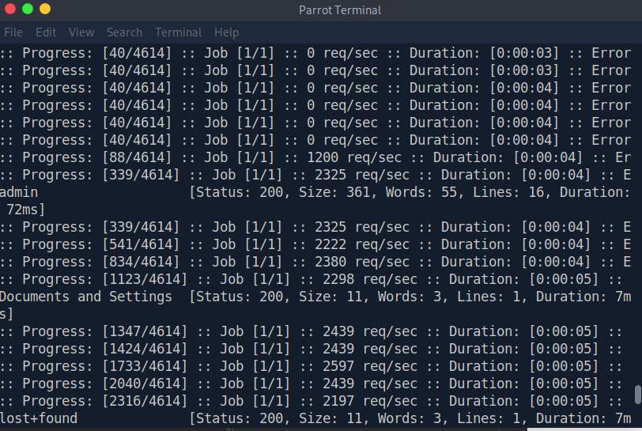
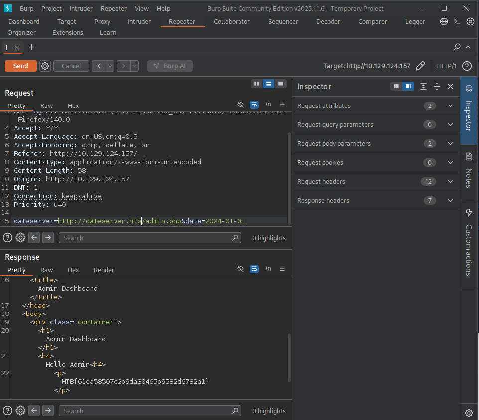

# Hack The Box Academy - Exploiting SSRF using Gopher | Write-up

> **Platform:** Hack The Box Academy &nbsp;•&nbsp; **Category:** Server-side Attacks &nbsp;•&nbsp; **Difficulty:** Easy &nbsp;•&nbsp; **Time taken:** 15 mins
>
> **Author:** Jithin Jelson

---

## Introduction

In this task we have been given a site with an SSRF vulnerability. We have identified that there is an SSRF vulnerability in the availability field of our target IP address. We are now asked to use our skills to enumerate our endpoints and then try common passwords in a hidden login page to gain access to our flag.

Target IP: `10.129.124.157`

---

## Assessment Overview

```mermaid
flowchart LR
    A[Target web app]
 
    A --> B[Availability field<br/>known SSRF]
    B --> C[Intercept in Burp]
 
    C --> D[Point at a file<br/>that does not exist<br/>on localhost]
    D --> E[Learn the error<br/>Server at dateserver.htb<br/>Port 80]
 
    E --> F[ffuf directory enum<br/>filter -fr on error string]
    F --> G[404 + 403<br/>filtered out]
    F --> H["admin.php<br/>endpoint found"]
 
    H --> I[Access admin via SSRF]
    I --> J[Flag already present<br/>no gopher needed]
 
    classDef entry fill:#1d4ed8,stroke:#1e3a8a,color:#ffffff;
    classDef intel fill:#7c3aed,stroke:#5b21b6,color:#ffffff;
    classDef ioc fill:#0f766e,stroke:#134e4a,color:#ffffff;
    classDef payload fill:#b45309,stroke:#78350f,color:#ffffff;
    classDef loot fill:#be123c,stroke:#881337,color:#ffffff;
    classDef user fill:#15803d,stroke:#14532d,color:#ffffff;
 
    class A entry;
    class B,C intel;
    class D,E ioc;
    class F,G payload;
    class H payload;
    class I ioc;
    class J user;
    linkStyle default stroke-width:2px
```

---

## What I Learned

- How to intercept the vulnerable availability field in Burp and reuse it for SSRF enumeration.
- Finding the app's error message by pointing it at a localhost file that does not exist.
- Why the string `Server at dateserver.htb Port 80` makes a good filter, because it appears on both the 404 and 403 default Apache error pages.
- Using ffuf with `-fr` to enumerate every directory on the internal server while filtering those errors out.
- That an internal admin endpoint can be reached through the SSRF once it is discovered.
- Knowing when gopher is needed, because here the flag was already present so a POST request was not required.

---

## Intercepting the Request

We can fire up Burp right away to our vulnerable field and intercept our required request.

*Figure 1 - Intercepting the availability request in Burp.*

---

## Finding the Error Message

First we can test to see what our error message is by pointing the app towards a file on its localhost that does not exist.

*Figure 2 - The default Apache error returned for a file that does not exist.*

---

## Enumerating Directories with ffuf

Now with this information we can use ffuf to enumerate every directory available from the server. Our filter (`-fr`) here is `Server at dateserver.htb Port 80`. I learned that this will help prevent all errors that are 404 and 403.

*Figure 3 - Using ffuf to enumerate directories, filtering out the Apache error string.*

We have located an admin endpoint that can be accessed from our internal server.

*Figure 4 - The discovered admin endpoint.*

---

## Accessing the Admin Dashboard

Now when we try to access our admin dashboard using the internal server we get the flag.

*Figure 5 - Accessing the admin dashboard through the SSRF reveals the flag.*

**Answer:** `HTB{5cr4p1n6_7h3_w3b_f0r_ssrf}`

It turns out that we did not need to exploit this login page using gopher and our flag was already there.

But in the case we did have to, my methodology would be to use gopher and URL-encode it twice with the `dateserver=`, and send a POST request which would send raw bytes to our file, which then in turn can be used to input the login username and password.
